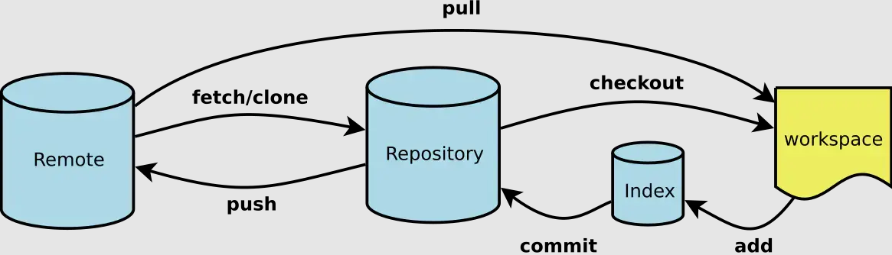

# 初识 Git

## 什么是 Git

基本概念：`Git`是分布式版本控制系统

### 版本库`.git`

1. 当我们使用`git`管理文件时，比如`git init`时，这个时候，会多一个`.git`文件，我们把这个文件称之为版本库。
2. `.git`文件另外一个作用就是它在创建的时候，会自动创建`master`分支，并且将`HEAD`指针指向`master`分支。

### 工作区

本地项目存放文件的位置

### 暂存区 `(Index/Stage)`

顾名思义就是暂时存放文件的地方，通过是通过`add`命令将工作区的文件添加到缓冲区

### 本地仓库`(Repository)`

通常情况下，我们使用`commit`命令可以将暂存区的文件添加到本地仓库

### 远程仓库`(Remote)`

1. 举个例子，当我们使用`GitHub`托管我们项目时，它就是一个远程仓库。
2. 通常我们使用`clone`命令将远程仓库代码拷贝下来，本地代码更新后，通过`push`托送给远程仓库。

## Git 基础工作流程



### 配置 USER 信息

配置`user.name`和`user.email`

```js
$ git config --global user.name "your name"
$ git config --global user.email "your email"
```

`config`的三个作用域，缺省等同于`local`，`local`仅限于在当前仓库下设置，如果同时设置了`global`和`local`，那么`local`高于`global`

```js
$ git config --global // 对当前用户所有仓库有效
$ git config --local // 只对某个仓库有效
$ git config --system // 对系统所有登录的用户所有仓库有效
```

显示`config`的配置，加`--list`

```js
$ git config --list --global
$ git config --list --local
$ git config --list --system
```

### 建立 Git 仓库

两种方案：

1. 把已有的项目代码纳入 Git 管理

```js
$ cd项目代码所在的文件夹
$ git init
```

2. 新建的项目直接用 Git 管理

```js
$ cd某个文件夹
$ git init your_project // 会在当前路径下创建和项目名称相同的文件夹
$ cd your_project
```

### 链接本地仓库与远端仓库

```js
$ git remote add origin
// origin默认是远端仓库别名 url 可以是可以使用https或者ssh的方式新建
```

### 生成 SSH 密钥

```js
$ ssh-keygen -t rsa -C "这里换上你的邮箱"
$ cd ~/.ssh // 里面有一个文件名为id_rsa.pub，把里面的内容复制到git库的我的SSHKEYS中
```

### 常看远端仓库信息

```js
$ git remote -v
```

### 远端仓库重新命名

```js
$ git remote rename old new
```

### 提交到暂存区

```js
$ git add . // 全部上传到缓存区
$ git add 文件名 // 指定文件
```

### 提交到本地仓库

```js
$ git commit -m 'message'
```

### 提交远程仓库

```js
$ git push <远程主机名> <本地分支名>:<远程分支名>
```

### 文件重命名

```js
$ git mv <old> <new>
```

### 查看文件状态

```js
$ git status
```

- `Changes not staged for commit`
  表示得大概就是工作区有该内容，但是缓存区没有，需要我们`git add`
- `Changes to be committed`
  一般而言，这个时候，文件放在缓存区了，我们需要`git commit`
- `nothing to commit, working tree clean`
  这个时候，我们将本地的代码推送到远端即可

### 查看版本演变历史

```js
$ git log
$ git log --oneline // 展示列表形式
$ git log -n2 // 查看最近n次的提交版本 n后面接次数
$ git log -n2 --oneline // 也可以组合查询
$ git log -all // 查看所有分支版本 不加all 默认查看当前分支版本
$ git log --all master // 即指定all又指定分支名，那么分支名是不起作用的
$ git log --all --graph // 查看演变历史
```
