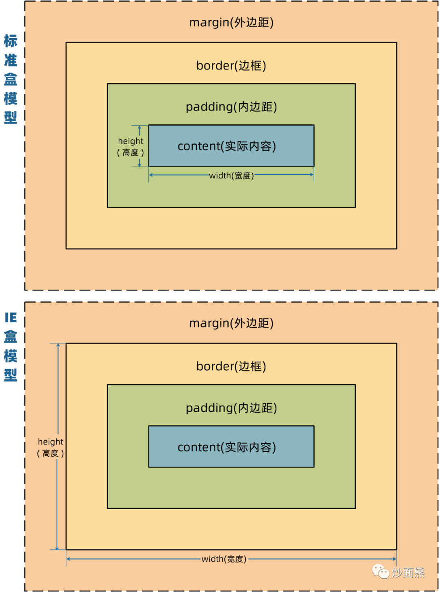

# CSS 面试题

## 怎么理解 CSS 盒模型？

### 概念

`CSS `盒子模型本质上是一个盒子。封装了周围的 `HTML` 元素。它包括：`外边距(margin)`、`边框(border)`、`内边距(padding)`、`实际内容(element)`四个属性。

`CSS`盒模型有两种：`标准模型` + `IE模型`

### 区别

标准盒模型：盒子总宽度/高度 = 实际内容的宽高 `border-sizing:content-box`

IE 盒子模型：盒子总宽度/高度 = 实际内容的宽高 + padding + border `border-sizing:border-box`



## 什么是 BFC？

### BFC(Block formatting context)

> 直译为 `块级格式化上下文`，把 BFC 理解成一块独立的渲染区域，BFC 看成是元素的一种属性，当元素拥有了 BFC 属性后，这个元素就可以看做成隔离了的独立容器。容器内的元素不会影响容器外的元素.

我理解为：将 BFC 看成是一种属性，当拥有该属性的元素就相当于一块独立的区域。

### 实现 BFC 属性的方法

1. 浮动元素，`float` 除 `none` 以外的值
2. 定位元素，`position` 的值是`absolute`或者`fixed`。
3. `display` 为 `inline-block 、table-cell、table-caption、table、table-row、table-row-group、table-header-group、table-footer-group、inline-table、flow-root、flex 或 inline-flex、grid 或 inline-grid`
4. `overflow` 除了 `visible` 以外的值`（hidden，auto，scroll）`
5. 根元素`<html>` 就是一个`BFC`

### BFC 的作用

1. 避免外边距重叠（防止 margin 塌陷）
2. 用于清除浮动
3. 阻止元素被浮动元素覆盖

## 块级元素和行内元素的区别？

1. 行内元素不会占据整行，在一条直线上排列，都是同一行，水平方向排列；
2. 块级元素会占据一行，垂直方向排列。
3. 块级元素可以包含行内元素和块级元素；行内元素不能包含块级元素。
4. 行内元素与块级元素属性的不同，主要是盒模型属性上，行内元素设置`width`无效，`height`无效(可以设置`line-height`)，`margin`上下无效，`padding`上下无效。

### 块级元素

`display:block/table` 有`div h1 h2 table p table ul ol`

### 行内元素

`display:inline/inline-block` 有`span img input button`

## CSS 中的尺寸单位都有哪些以及区别？

1. 绝对单位 px
2. 相对单位
   - EM : 相对于父元素 1em = 16px
   - REM : 相对于根元素（HTML 标签）1rem = 16px
   - % : 相对于父元素
   - VW：相对于视口的宽度
   - VH : 相对于视口的高度

## CSS 选择器优先级？

!important>内联样式 > id 选择器 > 类选择器 > 标签选择器 > 通配符选择器

## CSS 中的重绘和回流？

> 回流必将引起重绘，而重绘不一定会引起回流

- 回流

> 当 render tree 中的因为元素的规模尺寸，布局，隐藏等改变而需要重新构建。这就称为回流(Reflow)。而每个页面至少会进行一次回流，在页面第一次加载的时候，这时候是一定会发生回流的，因为要构建 Render Tree。在回流的时候，浏览器会使渲染树中受到影响的部分失效，并重新构造这部分渲染树。具体引起回流的点如下：

1. 添加或者删除可见的 DOM 元素；
2. 元素位置改变；
3. 元素尺寸改变——边距、填充、边框、宽度和高度
4. 内容改变——比如文本改变或者图片大小改变而引起的计算值宽度和高度改变；
5. 页面渲染初始化；
6. 浏览器窗口尺寸改变——resize 事件发生时，因为回流是根据视口的大小来计算元素的位置和大小的；

- 重绘

> 完成回流后，浏览器会重新绘制受影响的部分到屏幕中，当 render tree 中的一些元素需要更新属性，而这些属性只是影响元素的外观，风格，而不会影响布局的，比如 background-color。则就叫称为重绘。

## 实现圣杯布局?
```html
<!DOCTYPE html>
<html>
<head>
    <meta charset="UTF-8">
    <meta name="viewport" content="width=device-width, initial-scale=1.0">
    <meta http-equiv="X-UA-Compatible" content="ie=edge">
    <title>圣杯布局</title>
    <style type="text/css">
        body {
            min-width: 550px;
        }
        #header {
            text-align: center;
            background-color: #f1f1f1;
        }

        #container {
            padding-left: 200px;
            padding-right: 150px;
        }
        #container .column {
            float: left;
        }

        #center {
            background-color: #ccc;
            width: 100%;
        }
        #left {
            position: relative;
            background-color: yellow;
            width: 200px;
            margin-left: -100%;
            right: 200px;
        }
        #right {
            background-color: red;
            width: 150px;
            margin-right: -150px;
        }

        #footer {
            text-align: center;
            background-color: #f1f1f1;
        }

        /* 手写 clearfix */
        .clearfix:after {
            content: '';
            display: table;
            clear: both;
        }
    </style>
</head>
<body>
    <div id="header">this is header</div>
    <div id="container" class="clearfix">
        <div id="center" class="column">this is center</div>
        <div id="left" class="column">this is left</div>
        <div id="right" class="column">this is right</div>
    </div>
    <div id="footer">this is footer</div>
</body>
</html>
```

## 实现双飞翼布局?
```html
<!DOCTYPE html>
<html>
<head>
    <meta charset="UTF-8">
    <meta name="viewport" content="width=device-width, initial-scale=1.0">
    <meta http-equiv="X-UA-Compatible" content="ie=edge">
    <title>双飞翼布局</title>
    <style type="text/css">
        body {
            min-width: 550px;
        }
        .col {
            float: left;
        }

        #main {
            width: 100%;
            height: 200px;
            background-color: #ccc;
        }
        #main-wrap {
            margin: 0 190px 0 190px;
        }

        #left {
            width: 190px;
            height: 200px;
            background-color: #0000FF;
            margin-left: -100%;
        }
        #right {
            width: 190px;
            height: 200px;
            background-color: #FF0000;
            margin-left: -190px;
        }
    </style>
</head>
<body>
    <div id="main" class="col">
        <div id="main-wrap">
            this is main
        </div>
    </div>
    <div id="left" class="col">
        this is left
    </div>
    <div id="right" class="col">
        this is right
    </div>
</body>
</html>
```

## css 定位?

1. 静态定位：static
   > 静态定位是元素的默认定位方式，无定位的意思。它相当于 border 里面的 none，不要定位的时候用。
2. 相对定位：relative
   > 特点：相对于自己原来在标准流中位置来移动的，原来在标准流的区域继续占有，后面的盒子仍然以标准流的方式对待它。
3. 绝对定位：absolute
   > 特点：绝对定位是元素依据最近的已经定位的父级元素来进行移动，不占用原来在标准流的位置
4. 固定定位：fixed
   > 固定定位是绝对定位的一种特殊形式： 如果说绝对定位是一个矩形那么固定定位就类似于正方

## 实现水平和垂直居中?

```html
<div class="parent">
  <div class="child"></div>
</div>
```

1. 使用绝对定位 + transform，给子元素添加如下样式
   - 这种方式比较常用，父子元素都不确定宽高的情况也适用。
   - 如果子元素的宽高确定的话，translate 中的值也可以设置为子元素宽高的一半，即 transform: translate(-100px, -100px);

```css
.parent {
  position: relative;
}

.child {
  position: absolute;
  left: 50%;
  top: 50%;
  transform: translate(-50%, -50%);
}
```

2. position + margin: auto
   > 注意：该方法适用于盒子有宽高的情况

```css
.parent {
  position: relative;
}

.child {
  position: absolute;
  top: 0;
  bottom: 0;
  left: 0;
  right: 0;
  margin: auto;
}
```

3. position + margin

> 注意：该方法适用于盒子宽高已知的情况

```css
.parent {
  position: relative;
}

.child {
  position: absolute;
  top: 50%;
  left: 50%;
  margin-top: -50px; /* 自身 height 的一半 */
  margin-left: -50px; /* 自身 width 的一半 */
}
```

4. display:flex

```css
.parent {
  display: flex;
  justify-content: center;
  align-items: center;
}
```

## 什么是响应式?

```html
<!DOCTYPE html>
<html>
  <head>
    <meta charset="UTF-8" />
    <meta name="viewport" content="width=device-width, initial-scale=1.0" />
    <meta http-equiv="X-UA-Compatible" content="ie=edge" />
    <title>响应式布局</title>
    <style type="text/css">
      @media only screen and (max-width: 374px) {
        /* iphone5 或者更小的尺寸，以 iphone5 的宽度（320px）比例设置 font-size */
        html {
          font-size: 86px;
        }
      }
      @media only screen and (min-width: 375px) and (max-width: 413px) {
        /* iphone6/7/8 和 iphone x */
        html {
          font-size: 100px;
        }
      }
      @media only screen and (min-width: 414px) {
        /* iphone6p 或者更大的尺寸，以 iphone6p 的宽度（414px）比例设置 font-size */
        html {
          font-size: 110px;
        }
      }

      body {
        font-size: 0.16rem;
      }
      #div1 {
        width: 1rem;
        background-color: #ccc;
      }
    </style>
  </head>
  <body>
    <div id="div1">this is div</div>
  </body>
</html>
```

## offsetHeight scrollHeight clientHeight 区别

### offsetHeight offsetWidth

包括：border + padding + content

### clientHeight clientWidth

包括：padding + content

### scrollHeight scrollWidth

包括：padding + 实际内容的尺寸

### scrollTop scrollLeft

DOM 内部元素滚动的距离

### 答案

- offsetHeight - border + padding + content
- clientHeight - padding + content
- scrollHeight - padding + 实际内容的高度

## 实现 1px 宽度

Retina 屏 1px 像素问题，如何实现

### 介绍

该问题通常用于考察你是否做过移动端 h5 项目。<br>
如果你能知道这个问题，并且答出来，知道前因后果，证明你有过 h5 开发经验。<br>
否则就说明你没有 h5 的任何开发经验，尤其是你如果都不知道这个事情，那就更加说明这一点。

### 普通的 `1px`

如果仅仅使用 css 的 `1px` 来设置 border ，那可能会出现比较粗的情况。<br>
因为，有些手机屏幕的 DPR = 2 ，即 `1px` 它会用两个物理像素来显示，就粗了。

```css
#box {
    padding: 10px 0;
    border-bottom: 1px solid #eee;
}
```

如下图，上面是微信 app 的 border ，下面是 `1px` 的 border ，有明显的区别。显得很粗糙，很不精致，设计师不会允许这样的页面发布上线的。


PS：你不能直接写 `0.5px` ，浏览器兼容性不好，渲染出来可能还是 `1px` 的效果。

### 使用 `transform` 缩小

我们可以使用 css 伪类 + `transform` 来优化这一问题。即把默认的 `1px` 宽度给压缩 0.5 倍。

```css
#box {
    padding: 10px 0;
    position: relative;
}
#box::before {
    content: '';
    position: absolute;
    left: 0;
    bottom: 0;
    width: 100%;
    height: 1px;
    background: #d9d9d9;
    transform: scaleY(0.5);
    transform-origin: 0 0;
}
```

如下图，上面是微信 app 的 border ，下面是优化之后的 border ，两者粗细就一致了。


### 连环问：如果有 `border-radius` 怎么办

可以使用 `box-shadow` 设置
- X 偏移量 `0`
- Y 偏移量 `0`
- 阴影模糊半径 `0`
- 阴影扩散半径 `0.5px`
- 阴影颜色

```css
#box2 {
    margin-top: 20px;
    padding: 10px;
    border-radius: 5px;
    /* border: 1px solid #d9d9d9; */
    box-shadow: 0 0 0 0.5px #d9d9d9;
}
```


## 文字超出省略，用哪个 CSS 样式？

### 分析

如果你有实际工作经验，实际项目有各种角色参与。页面需要 UI 设计，开发完还需要 UI 评审。<br>
UI 设计师可能是这个世界上最“抠门”的人，他们都长有像素眼，哪怕差 1px 他们都不会放过你。所以，开发时要严格按照视觉稿，100% 还原视觉稿。

但如果你没有实际工作经验（或实习经验），仅仅是自学的项目，或者跟着课程的项目。没有 UI 设计师，程序员的审美是不可靠的，肯定想不到很多细节。

所以，考察一些 UI 关注的细节样式，将能从侧面判断你有没有实际工作经验。

### 答案

单行文字

```css
#box1 {
    border: 1px solid #ccc;
    width: 100px;
    white-space: nowrap; /* 不换行 */
    overflow: hidden;
    text-overflow: ellipsis; /* 超出省略 */
}
```

多行文字

```css
#box2 {
    border: 1px solid #ccc;
    width: 100px;
    overflow: hidden;
    display: -webkit-box; /* 将对象作为弹性伸缩盒子模型显示 */
    -webkit-box-orient: vertical; /* 设置子元素排列方式 */
    -webkit-line-clamp: 3; /* 显示几行，超出的省略 */
}
```
