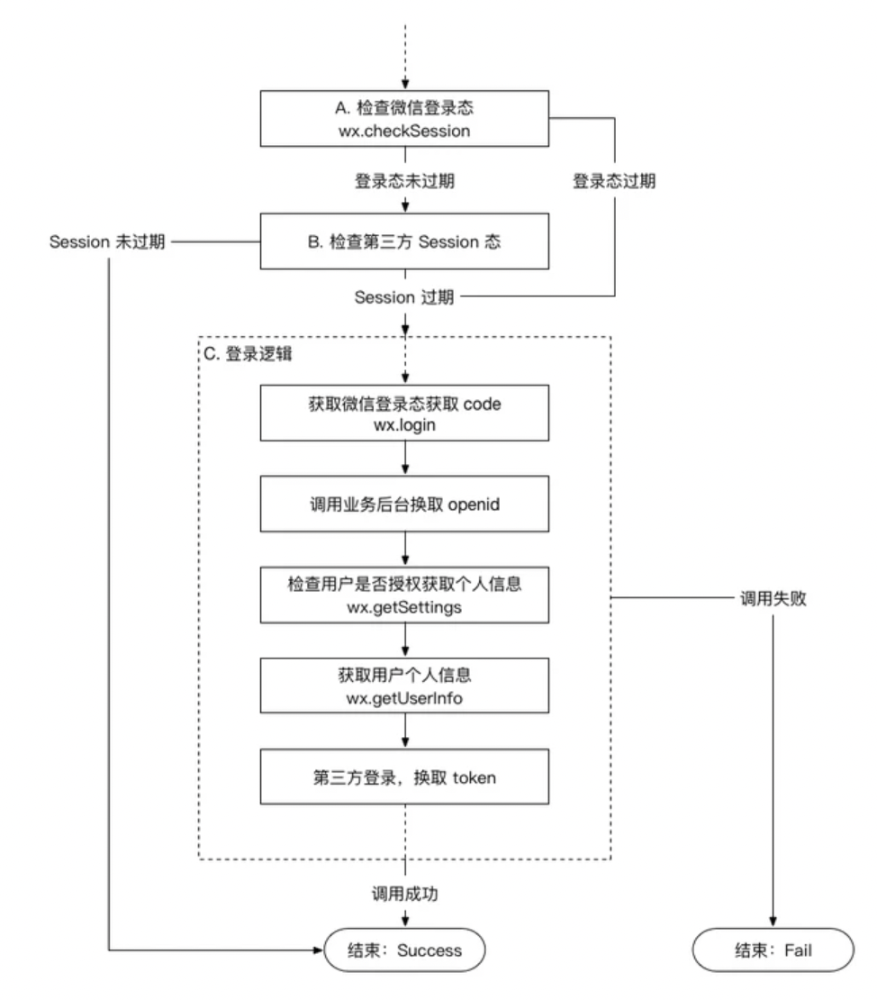
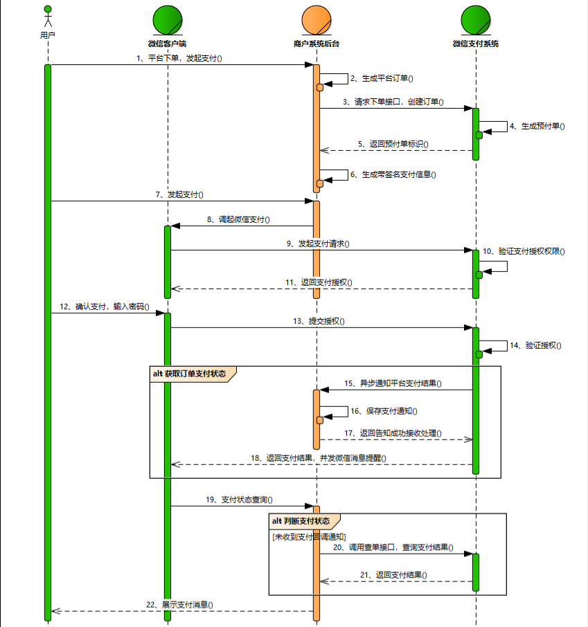
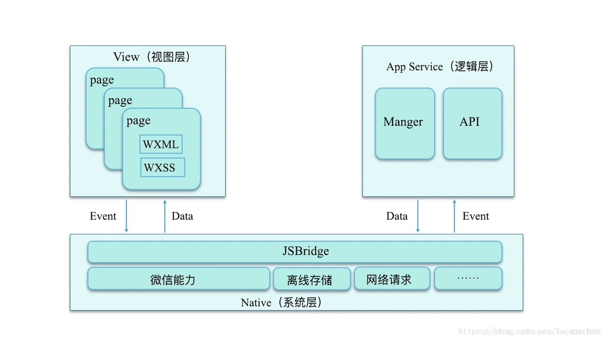
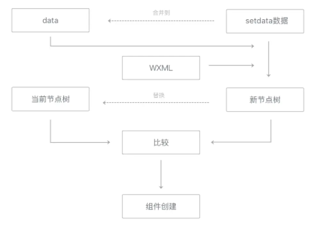
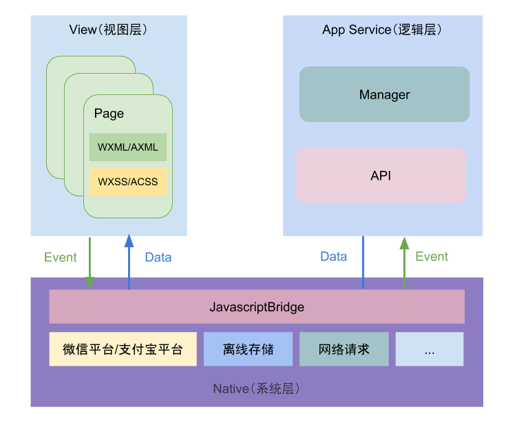
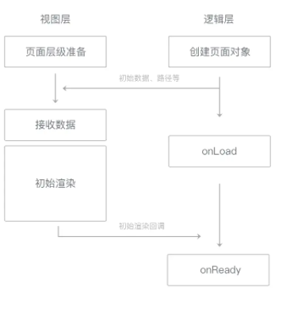
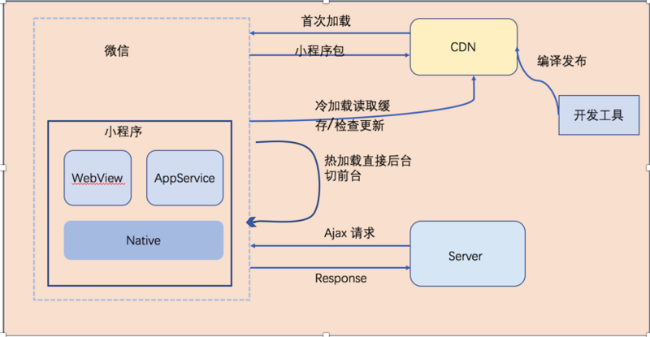

# 微信小程序面试题

## 说说你对微信小程序的理解？优缺点？

### 什么是微信小程序

> 微信小程序是一种不需要下载安装即可使用的应用,它实现了应用“触手可及”的梦想,用户扫一扫或者搜一下即可打开应用。

> 小程序也体现了“用完即走”的理念,用户不用关心是否安装太多应用的问题。应用将无处不在,随时可用,但又无需安装卸载。

### 小程序的由来

当微信中的 WebView 逐渐成为移动 Web 的一个重要入口时,微信就有相关的 JS-SDK。JS-SDK 解决了移动网页能力不足的问题,但没有解决体验不良的问题。

为此,小程序应运而生,具有:

- 快速加载
- 更强大的能力
- 原生体验
- 易用的微信数据开放
- 高效简单的开发

小程序页面本质上是网页,技术模型与 H5 类似,只是自定义了 WXML 标签。

### 小程序的优缺点

优点:

- 随用随走,代替许多 APP
- 借助平台流量,易被接受
- 相对安全
- 开发门槛低
- 降低兼容性限制

缺点:

- 用户留存率不高
- 体积限制,无法开发大型小程序
- 受限于微信管控,自由度较低

> 微信小程序结合了 APP 和网页的优点,为用户和开发者带来便利,但也存在自身的限制。以其便捷性为先,逐步优化体验,或可成为移动端一个重要的形式。

## 微信小程序的生命周期函数有哪些？

### 一、应用生命周期

应用生命周期函数定义在 app.js 中。

- onLaunch 小程序初始化完成时触发(全局只触发一次)
- onShow 小程序启动,或从后台进入前台显示时触发
- onHide 小程序从前台进入后台时触发
- onError 小程序发生脚本错误或 API 调用报错时触发
- onPageNotFound 小程序要打开的页面不存在时触发
- onUnhandledRejection 小程序有未处理的 Promise 拒绝时触发
- onThemeChange 系统切换主题时触发

### 二、页面生命周期

页面生命周期函数在 page.js 中定义。

- onLoad 页面加载时触发 用于加载页面数据
- onShow 页面显示时触发 页面重新显示时刷新数据
- onReady 页面初次渲染完成时触发 获取页面 DOM 节点
- onHide 页面隐藏时触发 停止页面动画或计时器等
- onUnload 页面卸载时触发 停止网络请求或清理订阅等

### 三、组件生命周期

组件生命周期函数在 component.js 中定义。

- created 组件实例刚创建时触发
- attached 组件进入页面节点树时触发
- ready 组件首次渲染完成时触发
- moved 组件位置改变时触发
- detached 组件离开页面节点树时触发
- error 组件方法错误时触发

### 四、执行顺序

一个典型的完整生命周期顺序为:

1. 小程序打开:onLaunch -> onShow -> onLoad -> onShow -> onReady

2. 进入新页面:onHide -> onLoad -> onShow -> onReady

3. 返回上一页:onUnload -> onShow

4. 小程序切后台:onHide

5. 小程序重启:onLaunch -> onShow

## 微信小程序的登录流程？

微信小程序的登录流程主要可以概括为以下步骤:

### 一、获取 code

1. 用户在小程序内点击登录按钮

2. 调用 wx.login()获取 code

### 二、获取 openid

1. 将 code 发送到开发者服务器

2. 开发者服务器使用 code 向微信服务器获取 openid 和 session_key

### 三、校验 openid

1. 开发者服务器拿到 openid,去数据库查询是否已存在

2. 若不存在,表示新用户,创建新记录

3. 若存在,校验用户信息,生成自定义登录态

### 四、返回登录态

1. 开发者服务器将登录态返回给小程序

2. 小程序存储登录态到本地

### 五、校验登录态

1. 小程序重新启动时可校验登录态

2. 调用 wx.checkSessionAPI 验证登录态是否过期

3. 过期则重新执行登录流程,未过期则继续使用



## 微信小程序中路由跳转的方式有哪些？区别？

### 一、wx.navigateTo

保留当前页面,跳转到应用内的某个页面。可以使用 wx.navigateBack 回到原页面。

特点:页面栈增多,占用内存。
参数:

```js
{
  url: 'test?id=1' // 需要跳转的应用内非 tabBar 的页面的路径
}
```

### 二、wx.redirectTo

关闭当前页面,跳转到应用内的某个页面。

特点:不能回到原页面,页面栈不增加。

参数:

```js
{
  url: 'test?id=1' // 需要跳转的应用内非 tabBar 的页面的路径
}
```

### 三、wx.switchTab

跳转到 tabBar 页面,关闭其他所有非 tabBar 页面。

特点:页面栈清空只留下新的 tabBar 页面。

参数:

```js
{
  url: 'test' // 需要跳转的 tabBar 页面的路径
}
```

### 四、wx.navigateBack

关闭当前页面,返回上一页面或多级页面。

特点:页面栈逐级退出,减少内存占用。

参数:

```js
{
  delta: 1 // 返回的页面数
}
```

### 五、wx.reLaunch

关闭所有页面,打开到应用内的某个页面。

特点:页面栈清空只留下新的页面。

参数:

```js
{
  url: 'test' // 需要跳转的页面路径
}
```

## 提高微信小程序的应用速度的手段有哪些？

### 一、加载优化

1. 控制代码包体积,及时清理无用代码
2. 使用子包按需加载,减少主包体积
3. 预加载子包,避免首次点击卡顿

### 渲染优化

1. onLoad 阶段发请求,不等待 onReady
2. 缓存本地数据,减少不必要的网络请求
3. 合并 setData 调用,避免频繁刷新界面
4. 抽离自定义组件,减少主界面渲染压力

### 三、首屏优化

1. 预请求数据,利用缓存数据构建首屏
2. 采用骨架屏 placeholders 占位
3. 提前预加载资源包

### 四、启动优化

1. 显示加载图标避免白屏
2. 合理制定启动图片大小

### 五、长列表优化

1. 虚拟列表,减少 DOM 节点
2. 预加载可视区域外图片
3. 图片懒加载,滚动到可视区再加载

### 六、打包策略

1. 压缩代码,上传时启用代码压缩
2. 按功能拆分子包
3. 删除无用文件,精简资源体积

## 说说微信小程序的支付流程？

1. 用户通过分享或扫描二维码进入商户小程序，用户选择购买，完成选购流程。
2. 调起微信支付控件，用户开始输入支付密码。
3. 密码验证通过，支付成功。商户后台得到支付成功的通知。
4. 返回商户小程序，显示购买成功。
5. 微信支付公众号下发支付凭证。

### 详细流程



1. 打开小程序，点击直接下单。此时，小程序会调用 wx.login 获取用户临时登录凭证 code，然后发送到后端服务器换取 openId。
2. 用户下单，小程序需要将购买的商品 Id，商品数量，以及用户的 openId 传送到服务器。
3. 服务器在接收到商品 Id、商品数量、openId 后，生成订单数据。同时，通过签名算法，向微信支付发送请求，获取预付单信息（prepay_id）。然后，服务器会将获取的数据再次进行签名，向小程序端响应必要的信息。
4. 小程序端在获取对应的参数后，调用 wx.requestPayment()发起微信支付，唤醒支付工作台，进行支付。
   接下来，用户会进行微信支付密码、指纹等验证。确认支付之后，微信后台进行鉴权，直接返回给前端支付的结果。前端收到返回数据后对支付结果进行展示。
5. 最后，微信后台在给前端返回支付的结果后，也会向后台返回一个支付结果。后台通过这个支付结果来更新订单的状态。
   以下是后端响应数据和 wx.requestPayment 方法所需要的参数示例：

```js
wx.requestPayment({
  // 时间戳
  timeStamp: '',
  // 随机字符串
  nonceStr: '',
  // 统一下单接口返回的 prepay_id 参数值
  package: '',
  // 签名类型
  signType: '',
  // 签名
  paySign: '',
  // 调用成功回调
  success() {},
  // 失败回调
  fail() {},
  // 接口调用结束回调
  complete() {},
})
```

## 谈谈微信小程序的实现原理？

### 一、背景

在传统的网页开发中，渲染线程和脚本是互斥的，这也是为什么长时间的脚本运行可能会导致页面失去响应的原因，因为我们常说的 JS 是单线程的。而微信小程序则选用了 Hybrid 的渲染方式，将视图层和逻辑层分开，实现双线程同时运行。在此模式下，视图层的界面使用 WebView 进行渲染，而逻辑层则在 JSCore 中运行。



在小程序中，渲染层主要负责界面渲染相关的任务，并在 WebView 线程里执行。一个小程序可能存在多个界面，所以渲染层存在多个 WebView 线程。而逻辑层则采用 JsCore 线程运行 JS 脚本，执行的都是与小程序业务逻辑有关的代码。

### 二、通信

在小程序的渲染层，宿主环境会将 wxml 转化成对应的 JS 对象。当逻辑层的数据发生变更时，通过宿主环境提供的 setData 方法，数据就可以从逻辑层传递到渲染层。然后通过对比数据变化前后的差异，将差异应用在原来的 Dom 树上，从而渲染出正确的视图。



例如，用户点击界面上某个按钮，这类反馈需要通知给开发者的逻辑层，以便将对应的处理状态呈现给用户。对于事件的分发处理，微信进行了特殊的处理，将所有的事件拦截后，丢到逻辑层，交给 JavaScript 进行处理。



由于小程序是基于双线程的，因此在视图层和逻辑层之间的任何数据传递都是线程间的通信，会有一定的延时。所以在小程序中，页面更新成了异步操作。异步会使得各部分的运行时序变得复杂一些，逻辑层与渲染层需要有一定的机制保证时序正确，在每个小程序页面的生命周期中，存在着若干次页面数据通信。



### 三、运行机制

小程序启动运行主要有两种情况：

- 冷启动（重新开始）：用户首次打开或者小程序被微信主动销毁后再次打开的情况，此时小程序需要重新加载启动，即为冷启动
- 热启动：用户已经打开过小程序，然后在一定时间内再次打开该小程序，此时无需重新启动，只需要将后台态的小程序切换到前台，这个过程就是热启动
  需要注意的是：

1. 小程序没有重启的概念
2. 当小程序进入后台，客户端会维持一段时间的运行状态，超过一定时间后会被微信主动销毁
3. 短时间内收到系统两次以上内存警告，也会对小程序进行销毁，这也就为什么一旦页面内存溢出，页面会奔溃的本质原因了


当开发者在后台发布新版本之后，无法立刻影响到所有现网用户，但最差情况下，也在发布之后 24 小时之内下发新版本信息到用户。每次冷启动时，都会检查是否有更新版本，如果发现有新版本，将会异步下载新版本的代码包，并同时用客户端本地的包进行启动，即新版本的小程序需要等下一次冷启动才会应用上。

### 四、举例说明

```js
Page({
  data: {
    text: 'Hello, World!',
  },

  changeText: function () {
    this.setData({
      text: 'Hello, OpenAI!',
    })
  },

  onLoad: function () {
    // 页面加载时，打印初始数据
    console.log(this.data.text)
  },

  onReady: function () {
    // 页面初次渲染完成后，改变数据
    this.changeText()
  },

  onShow: function () {
    // 页面显示后，打印改变后的数据
    console.log(this.data.text)
  },
})
```

在这个示例中，我们首先在 Page 对象的 data 属性中定义了初始数据 text。当页面加载完成后，我们在 onLoad 生命周期函数中打印出初始数据。然后在页面初次渲染完成后，我们通过 this.setData 方法改变数据。最后在页面显示后，我们打印出改变后的数据。

