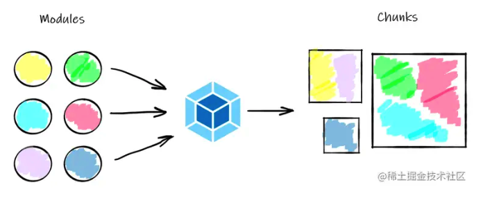
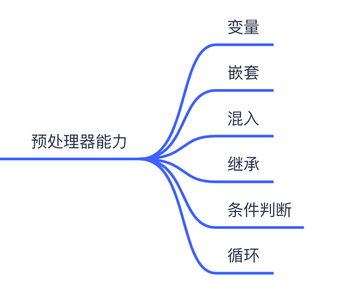
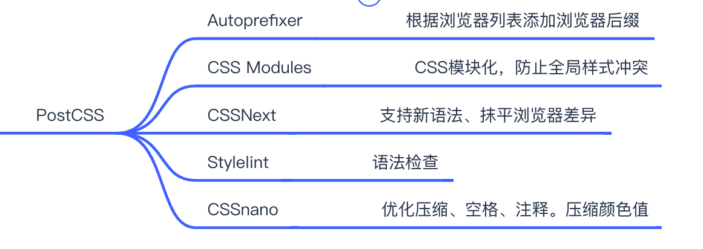
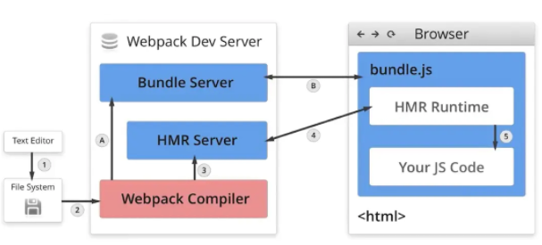
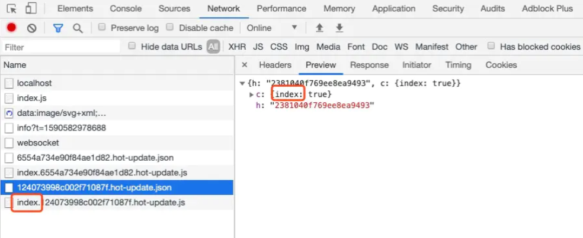
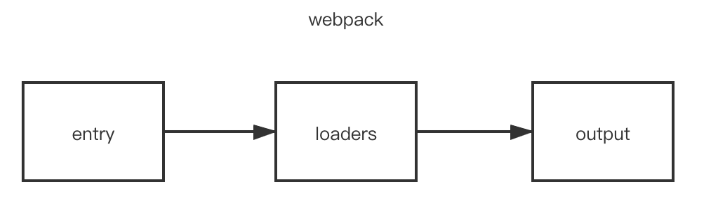

# webpack 和 babel 面试题

## 什么是构建工具？

前端构建工具是一种针对前端开发的构建工具，用于自动化前端项目的构建过程。

1. 源代码转换为可在浏览器中运行的 HTML、CSS 和 JavaScript 代码
2. 支持插件扩展
3. 丰富的配置功能
4. 压缩、丑化、合并等优化功能

## 构架工具历史？

1. 手工构建时代 - 代码压缩、图片压缩、代码合并
2. 自动化构建时代 - 任务流工具：
   - Grunt：一种基于任务流的前端构建工具，可以帮助自动化执行编译、压缩、合并等操作。
   - Gulp：一种基于任务流的前端构建工具，可以帮助自动化执行编译、压缩、合并等操作。
3. 模块化构建时代 - 模块打包器：
   - Webpack：目前最流行的构建工具之一，它是一个模块打包器，可以将多个 JavaScript 文件打包成一个文件，并且支持处理 CSS、图片等资源文件。Webpack 具有丰富的插件生态系统和配置选项，可以满足各种复杂的构建需求。
   - Rollup：专门用于打包 JavaScript 库的构建工具，它支持 ES modules，并且在构建过程中能够去除未使用的代码，因此生成的代码体积更小。
4. Bundless 构建时代 - 前端调试器(Bundless):
   - Snowpack:采用 ESM（ECMAScript 模块）作为默认格式，可以实现快速且轻量级的构建。
   - Vite: 利用 ES 模块和浏览器原生的动态 import 功能，实现了快速的冷启动和热更新。

## 常见的前端构建工具有哪些？请讲一下他们的应用场景？

1. 概括
   - 常见的构建工具主要是 Webpack、和 Rollup 这种打包器
   - 在老项目中还会看到 Grunt 和 Gulp 这种基于工作流的构建工具
   - 当然新还有一种 Vite 这种 Bundlerless 这种高效的高效的构建工具
2. 阐述
   - Webpack 的特点是应用广泛、生态鉴权特别适合在项目型项目使用，在新的 4.0 和 5.0 版本中比如现在流行的 Treesharking 这种新特性也有支持
   - Rollup 是特别适合类型库型项目的开发，比如组件库。比如常见的 ElementUI 和 Vue 都是使用它作为构建工具
   - Vite：是一种新型的构建工具，开发的时候使用 Bundless 方式启动快速，开发体验好。而且作为 Vue 的亲儿子。未来对 Vue3.0 的支持也肯定能够得到很好的保证
3. 总结
   - 项目型： 尤其是核心项目选择 Webpack，强调可靠性
   - 类库型： Rollup
   - 非核心项目： 可以尝试 Vite

## webpack 中 module、chunk、bundle 的区别

- module：就是 js 的模块化 webpack 支持 commonJS、ES6 等模块化规范，简单来说就是你通过 import 语句引入的代码。
- chunk: chunk 是 webpack 根据功能拆分出来的，包含三种情况：
  - 你的项目入口（entry）
  - 通过 import()动态引入的代码
  - 通过 splitChunks 拆分出来的代码
  - （chunk 包含着 module，可能是一对多也可能是一对一）
- bundle：bundle 是 webpack 打包之后的各个文件，一般就是和 chunk 是一对一的关系，bundle 就是对 chunk 进行编译压缩打包等处理之后的产出。

## Webpack：有哪些常见的 Loader？他们是解决什么问题的？

### 什么是 Loader?

> Loader 直译为"加载器"。Webpack 将一切文件视为模块，但是 webpack 原生是只能解析 js 文件，如果想将其他文件也打包的话，就会用到 loader。 所以 Loader 的作用是让 webpack 拥有了加载和解析非 JavaScript 文件的能力。

### 回答范例

1. Loader 概念

   - 英文翻译（加载器）
   - Webpack 默认只能加载 JS、JSON 资源，其他资源就需要使用进行转换

2. 列举常见的加载器
   - JS
     - ES6 - babel-loader
     - TS - ts-loader
     - 代码规范 - eslint-loader
   - CSS
     - sass 、less- 预处理器啊
     - style-loader、css-loader
     - post-css-loader
   - 图片资源
     - file-loader
     - url-loader
     - image-loader

## Webpack：有哪些常见的 Plugin？他们是解决什么问题的？

> Webpack 插件的作用是扩展和定制 Webpack 在打包过程中的某些步骤。插件可以在一些关键点上被触发，比如在编译过程开始前、结束后或者在某个特定的时刻。通过注册一个或多个插件，我们可以将自己的逻辑融入到 Webpack 的构建流程中，实现一些额外的功能。

1. 打包优化：
   - 全局
     - CleanWebpackPlugin：用于在每次构建前清理输出目录中的文件。
     - CompressionWebpackPlugin：用于对打包后的资源文件进行 gzip 压缩。
   - HTML
     - HtmlWebpackPlugin：用于生成 HTML 文件，并将打包后的资源文件自动引入。
   - CSS
     - MiniCssExtractPlugin：用于将 CSS 提取为单独的文件。
   - Javascript
     - DefinePlugin：用于定义环境变量。
     - UglifyJsPlugin：用于压缩 JavaScript 代码。
   - 图片静态资源
     - CopyWebpackPlugin：用于将静态文件直接复制到输出目录中。
2. 调试分析：
   - webpack-bundle-analyzer：用于分析并可视化打包后的模块大小和依赖关系。
   - FriendlyErrorsWebpackPlugin：用于友好地展示 Webpack 构建错误信息。
   - HotModuleReplacementPlugin：用于实现热模块替换功能。

## Webpack：分包的好处，分包策略是什么？

### 分包解决的问题?

1. 降低页面初始代码包体积，提高首屏渲染性能
   > 当应用程序被拆分成多个代码块时，只有必要的代码块会在应用程序启动时立即加载。这减少了首次加载时间，并让用户更快地看到页面内容。
2. 提高应用缓存效率
   > 当应用程序被拆分成多个代码块时，每个代码块都具有独立的版本号和缓存机制。这意味着，如果只修改了某个代码块，那么只有该代码块需要重新下载和解析，而其他代码块可以从缓存中读取，从而提高了缓存的利用率。

### 什么是 Chunk

> 而 Chunk 是输出产物的基本组织单位，在生成阶段 webpack 按规则将 entry 及其它 Module 插入 Chunk 中，之后再由 SplitChunksPlugin 插件根据优化规则与 ChunkGraph 对 Chunk 做一系列的变化、拆解、合并操作，重新组织成一批性能(可能)更高的 Chunks 。运行完毕之后 webpack 继续将 chunk 一一写入物理文件中，完成编译工作。

此 webpack 特定术语在内部用于管理捆绑过程。输出束（bundle）由 chunk 组成，其中有几种类型（例如 entry 和 child ）。通常，chunk 直接与 bundle 相对应，但是有些配置不会产生一对一的关系。



### 分包策略

1. Entry 分包

```js
module.exports = {
  entry: {
    a: './src/a',
    b: './src/b',
    c: './src/c',
  },
}
```

2. 异步模块:根据动态引用 import('../xxx.js')
3. Runtime 分包:异步加载等支撑性代码独立
4. Async Chunk: 通过 import('./xx') 等语句导入的异步模块及相应子模块组成的 Async Chunk
5. Runtime Chunk: 运行时代码抽离成 Runtime Chunk，可通过 entry.runtime 配置项实现。(异步加载)

### 回答示例

分包主要能解决两个问题

- 降低页面初始代码包体积，提高首屏渲染性能
- 提高应用缓存效率

常见的分包策略有三个

- 对于多入口的项目可以根据 Entry 分包
- SPA 应用可以在根据 import() 动态引用分包，比如路由中可以使用 import() 方法，就可以将每一个视图所依赖的模块进项分包
- 最后一种是将运行时代码单独分包，但是由于运行时代码相对体积较小，所以他的优化效果并不十分明显。

## Webpack：如何实现 Tree Shaking？

在 Webpack 中实现 Tree Shaking 功能的前提是使用 ES6 模块化语法，并且需要在 webpack.config.js 文件中进行相应的配置，以下是具体的步骤：

1. 确认使用的代码遵循 ES6 的模块化语法。ES6 模块化语法是静态的，可以被静态分析。
2. 确认 webpack 的 mode 属性设置为 production，这个属性会启用 UglifyJsPlugin 插件。
3. 在 package.json 文件中，将 "sideEffects" 属性设置为 false 或者数组。
4. 在 webpack.config.js 配置文件中，设置 optimization.usedExports 为 true。

通过以上步骤，Webpack 就可以在构建时自动删除未使用的代码，实现 Tree Shaking 的功能。

例如，一个简单的 webpack.config.js 配置如下：

```js
const path = require('path')

module.exports = {
  mode: 'production',
  entry: './src/index.js',
  output: {
    filename: 'bundle.js',
    path: path.resolve(__dirname, 'dist'),
  },
  optimization: {
    usedExports: true,
  },
}
```

在上面的例子中，我们将 optimization.usedExports 属性设置为 true，以启用 Tree Shaking 功能。同时，我们需要确保代码使用了 ES6 的模块化语法，并且在 package.json 文件中设置了正确的 sideEffects 属性。

### 回答范例

Treeshaking 的作用就是去除无用代码。

在 webpack 中，TreeShaking 又叫做 usedExports 意思就是导出有用的部分。

存在于 optimization 属性中，只需要在确保使用静态模块的前提下，

开启这个功能就可以实现 Treeshaking 了。

## Webpack：文件指纹有哪些种类？这些种类分别适用于什么场景？

Webpack 的文件指纹策略大概分成三种，其实他的原理相似只是粒度不同而已。

- hash： 粒度最大，和整个项目有关
- chunkhash：粒度其次，顾名思义就是以 chunk 单位
- contenthash： 精确到每一个页面内的 JS 或 CSS 文件

其次 CSS 文件可以通过 MiiniCSSExtractPlugin 设置哈希。

```js
// webpack.config.js
const MiniCssExtractPlugin = require('mini-css-extract-plugin')

module.exports = {
  // ...
  module: {
    rules: [
      {
        test: /\.css$/i,
        use: [MiniCssExtractPlugin.loader, 'css-loader'],
      },
    ],
  },
  plugins: [
    new MiniCssExtractPlugin({
      filename: '[name][contenthash:hash].css',
    }),
  ],
}
```

其次 CSS 文件可以通过 MiiniCSSExtract

```js
module.exports = {
  // ...
  module: {
    rules: [
      {
        test: /\.png/,
        use: [
          {
            loader: 'file-loader',
            options: {
              name: 'images/[name][hash:8].[ext]',
            },
          },
        ],
      },
    ],
  },
}
```

### 回答范例

文件指纹就是将文件内容进行哈希运算。

然后将结果反映到文件上。

确保文件内容不同文件名也不同。

webpack 中的文件指纹策略一般分三种。

全局、Chunk、文件粒度从大至小。

通常情况下选择文件粒度。

## Webpack：如何提高打包效率

提高构建效率可以从缓存、并行处理、减少编译范围、改用高性能编译器四个方面着手。

首先可以设置缓存，提高二次构建性能。

其次应该尽量采用并行处理方式，

比如使用 Tread-loader，

或者在 terser-webpack-plugin 中开启并行处理功能。

在减少编译范围方面可以

- 使用 noparse 跳过第三方库编译、

- 使用 exclude 约束执行范围、

- 非必要不生成 SourceMap

- 在开发阶段禁止不必要的产物优化

最后还可以利用 SWC、ESBuild 这种基于 Go 或 Rust 实现的高效编译器提升效率

## 如何配置 Babel 将 ES6 代码转换为 ES5？

所谓 ES6 转 ES5 是指将工程代码中新语法转换为浏览器运行时环境支持的语法。

通常情况需要 Babel 和@babel/preset-env 预设一起完成。

例如在 webpack 构建的项目中 babel 通过 loader 的形式引入

配置的时候需要在@babel/preset-env 预设的配置中指定运行时环境，比如浏览器的版本。和 polyfill 等内容。

## 什么是 代码分割 Code Splitting？在 Webpack 中如何实现 Code Splitting？

在 Webpack 中，可以使用以下两种方式实现 Code Splitting：

- 多入口方法
  > 所谓多入口就是将一个大的单页面应用拆解为多个小的单页面应用。可以通过配置 entry 属性设置多个入口实现。
- 动态导入方法
  > 改为使用 import() 函数动态导入。最常见的做法是在路由部分将视图进行动态导入。这个时候 webpack 会自动将 import() 动态导入的内容分成一个单独的 chunk。这些分出来 chunk 文件并不会在首屏加载。而是在使用到的时候才会被按需加载。

## 讲讲 CSS 预处理器(Sass/Less)的功能

### 什么是预处理器？



大家想想如何用 CSS 优雅的实现下列需求：

- 按钮 Border 颜色都比背景暗 10% - 写一个计算函数是不是就可以
- 将所有按钮改为边框设置圆角 - 这个是不是向 minin 只需要让所有按钮混入圆角特性
- 主按钮和成功按钮继承普通按钮的全部样式，并且单独背景色 - 这就是明显的继承

CSS 预处理器是一种将 CSS 语言进行扩展的工具，它可以让开发者更加高效地编写 CSS 代码。以下是 CSS 预处理器的主要功能：

1. 变量：预处理器支持使用变量来存储和重用值，从而使 CSS 代码更加模块化和可维护。

```scss
$primary-color: #007bff;

.btn {
  background-color: $primary-color;
  border-color: darken($primary-color, 10%);
}
```

2. 混合（Mixin）：预处理器支持创建混合（Mixin），它们允许在多个选择器之间共享相同的声明，从而减少代码的复制和粘贴。

```scss
@mixin bordered-box {
  border: 1px solid #ccc;
  border-radius: 5px;
}

.box {
  @include bordered-box;
  background-color: #f3f3f3;
}
```

3. 继承：预处理器支持样式规则之间的继承关系，可以通过这种方式来减少样式代码的冗余。

```scss
.button {
  display: inline-block;
  padding: 10px 20px;
  border-radius: 5px;
  border: none;
  background-color: #007bff;
  color: #fff;
}

.primary-button {
  @extend .button;
  background-color: #dc3545;
}
```

## 如何使用 CSS 后处理器(PostCSS)来增强 CSS 编写的能力

CSS 预处理器可扩展了 CSS 的功能，使 CSS 更加的强大。
除了预处理器实际上还有一种 CSS 工程化工具也可以完成相似的任务。
也就是 CSS 后处理器通常我们把他叫做 PostCSS。
他的工作原理和预处理器完全相反，
预处理器是将预处理语言转换为 CSS。
而后处理器是将 CSS 进行优化。
我们可以形象的理解为给通过给 CSS 擦屁股方式优化。
比如自动给 CSS 添加浏览器兼容性前缀工作。
除此之外它还可以完成比如 CSSModule，添加 CSS 新语法，语法检查，CSS 压缩等工作。
另外还要特别提一个最近大热的 Tailwind 原子 CSS。也是通过 PostCSS 实现的。
比如你写了一个属性 w-24 他就可以自动把对应的 CSS 样式补上。

当涉及到 PostCSS 插件时，有很多可用的选项。以下是一些常见的 PostCSS 插件示例：

1. Autoprefixer：这是一个自动添加浏览器前缀的插件。它会根据你指定的目标浏览器列表，自动为 CSS 规则添加所需的前缀，以确保在不同浏览器中正确地显示样式。
2. CSS Modules：这个插件提供了一种模块化的 CSS 解决方案。它允许你将 CSS 样式表与特定的组件或模块关联起来，使得样式的作用范围仅限于相应的组件，避免全局样式的冲突。
3. CSSNext：这个插件允许你使用未来版本的 CSS 语法和功能，即使当前浏览器不完全支持它们。它可以将使用 CSS4、CSS Grid、自定义属性等新特性的代码转换为符合当前浏览器规范的代码。
4. Stylelint：这是一个强大的工具，用于检查 CSS 代码中的错误和潜在问题。它可以帮助你保持一致的代码风格，并捕获常见的错误，如拼写错误、无效的选择器等。
5. CSSnano：这个插件可以对 CSS 代码进行优化和压缩。它可以删除不必要的空格、注释，压缩颜色值，以及执行其他一些优化操作，从而减小 CSS 文件的大小并提高加载速度。

这只是一小部分可用的 PostCSS 插件示例。根据你的具体需求，你可以浏览 PostCSS 插件的官方网站或通过搜索来找到更多的插件，并根据项目的要求选择适合的插件。

### 举一个 Autoprefixer 的例子

当你在使用 Autoprefixer 插件时，它会自动为你的 CSS 规则添加所需的浏览器前缀。以下是一个简单的示例：

假设你有以下 CSS 代码：

```css
.box {
  display: flex;
  transition: transform 0.3s;
}
```

然后你通过 PostCSS 和 Autoprefixer 插件进行处理，指定目标浏览器列表为最新两个版本的主流浏览器（如 Chrome、Firefox 等）。

处理后的 CSS 代码将变为：

```css
.box {
  display: -webkit-box;
  display: -ms-flexbox;
  display: flex;
  -webkit-transition: -webkit-transform 0.3s;
  transition: -webkit-transform 0.3s;
  transition: transform 0.3s;
}
```

可以看到，Autoprefixer 根据目标浏览器要求，自动为`.box`选择器的`display`属性和`transition`属性添加了浏览器前缀。这样，在不同的浏览器中都能正确地显示和处理这些样式规则。

Autoprefixer 的作用是减少编写浏览器前缀的繁琐工作，使开发者可以更专注于编写标准的 CSS 代码，而无需手动添加大量的浏览器前缀。它提供了自动化的解决方案，确保你的样式在各种浏览器中一致地呈现。



## webpack 性能优化？

### 优化 babel-loader

- babel-loader cache 未修改的不重新编译
- babel-loader include 明确范围

```js
{
    test: /\.js$/,
    use: ['babel-loader?cacheDirectory'], // 开启缓存
    include: path.resolve(__dirname, 'src'), // 明确范围
    // // 排除范围，include 和 exclude 两者选一个即可
    // exclude: path.resolve(__dirname, 'node_modules')
},
```

### IgnorePlugin 避免引入哪些模块

以常用的 moment 为例。安装 `npm i moment -d` 并且 `import moment from 'moment'` 之后，monent 默认将所有语言的 js 都加载进来，使得打包文件过大。可以通过 ignorePlugin 插件忽略 locale 下的语言文件，不打包进来。

```js
plugins: [
  // 忽略 moment 下的 /locale 目录
  new webpack.IgnorePlugin(/\.\/locale/, /moment/),
]
```

```js
import moment from 'moment'
import 'moment/locale/zh-cn' // 手动引入中文语言包
moment.locale('zh-cn')
```

### noParse 避免重复打包

`module.noParse` 配置项可以让 Webpack 忽略对部分没采用模块化的文件的递归解析处理，这样做的好处是能提高构建性能。 原因是一些库，例如 jQuery 、ChartJS， 它们庞大又没有采用模块化标准，让 Webpack 去解析这些文件耗时又没有意义。

```js
module.exports = {
  module: {
    // 独完整的 `react.min.js` 文件就没有采用模块化
    // 忽略对 `react.min.js` 文件的递归解析处理
    noParse: [/react\.min\.js$/],
  },
}
```

两者对比一下：

- `IgnorePlugin` 直接不引入，代码中不存在
- `noParse` 引入，但不再打包编译

### happyPack 多进程打包

【注意】大型项目，构建速度明显变慢时，作用才能明显。否则，反而会有副作用。

webpack 是基于 nodejs 运行，nodejs 是**单线程**的，happyPack 可以开启多个**进程**来进行构建，发挥多核 CPU 的优势。

```js
const path = require('path')
const HappyPack = require('happypack')

module.exports = {
  module: {
    rules: [
      {
        test: /\.js$/,
        // 把对 .js 文件的处理转交给 id 为 babel 的 HappyPack 实例
        use: ['happypack/loader?id=babel'],
        exclude: path.resolve(__dirname, 'node_modules'),
      },
    ],
  },
  plugins: [
    new HappyPack({
      // 用唯一的标识符 id 来代表当前的 HappyPack 是用来处理一类特定的文件
      id: 'babel',
      // 如何处理 .js 文件，用法和 Loader 配置中一样
      loaders: ['babel-loader?cacheDirectory'],
      // ... 其它配置项
    }),
  ],
}
```

### ParallelUglifyPlugin 多进程压缩 js

webpack 默认用内置的 uglifyJS 压缩 js 代码。
大型项目压缩 js 代码时，也可能会慢。可以开启多进程压缩，和 happyPack 同理。

```js
const path = require('path')
const ParallelUglifyPlugin = require('webpack-parallel-uglify-plugin')

module.exports = {
  plugins: [
    // 使用 ParallelUglifyPlugin 并行压缩输出的 JS 代码
    new ParallelUglifyPlugin({
      // 传递给 UglifyJS 的参数
      // （还是使用 UglifyJS 压缩，只不过帮助开启了多进程）
      uglifyJS: {
        output: {
          beautify: false, // 最紧凑的输出
          comments: false, // 删除所有的注释
        },
        compress: {
          // 在UglifyJs删除没有用到的代码时不输出警告
          warnings: false,
          // 删除所有的 `console` 语句，可以兼容ie浏览器
          drop_console: true,
          // 内嵌定义了但是只用到一次的变量
          collapse_vars: true,
          // 提取出出现多次但是没有定义成变量去引用的静态值
          reduce_vars: true,
        },
      },
    }),
  ],
}
```

### 自动刷新

watch 默认关闭。但 webpack-dev-server 和 webpack-dev-middleware 里 Watch 模式默认开启。

先验证下 webpack 是否能默认自动刷新页面 ？？？

```js
module.export = {
  watch: true, // 开启监听，默认为 false
  // 注意，开启监听之后，webpack-dev-server 会自动开启刷新浏览器！！！

  // 监听配置
  watchOptions: {
    ignored: /node_modules/, // 忽略哪些
    // 监听到变化发生后会等300ms再去执行动作，防止文件更新太快导致重新编译频率太高
    // 默认为 300ms
    aggregateTimeout: 300,
    // 判断文件是否发生变化是通过不停的去询问系统指定文件有没有变化实现的
    // 默认每隔1000毫秒询问一次
    poll: 1000,
  },
}
```

### 热更新

上文的自动刷新，会刷新整个网页。

- 速度更慢
- 网页当前的状态会丢失，如 input 输入的文字，图片要重新加载，vuex 和 redux 中的数据

操作步骤

- 把现有的 watch 注释掉
- 增加以下代码
- 修改 css less 实验 —— 热替换生效
- 修改 js 实验 —— 热替换**不生效**

```js
const HotModuleReplacementPlugin = require('webpack/lib/HotModuleReplacementPlugin')

module.exports = {
  entry: {
    // 为每个入口都注入代理客户端
    index: [
      'webpack-dev-server/client?http://localhost:8080/',
      'webpack/hot/dev-server',
      path.join(srcPath, 'index.js'),
    ],
    // other 先不改了
  },
  plugins: [
    // 该插件的作用就是实现模块热替换，实际上当启动时带上 `--hot` 参数，会注入该插件，生成 .hot-update.json 文件。
    new HotModuleReplacementPlugin(),
  ],
  devServer: {
    // 告诉 DevServer 要开启模块热替换模式
    hot: true,
  },
}
```

js 热替换不生效，是因为我们要自己增加代码逻辑。

```js
// 增加，开启热更新之后的代码逻辑
if (module.hot) {
  module.hot.accept(['./math'], () => {
    const sumRes = sum(10, 20)
    console.log('sumRes in hot', sumRes)
  })
}
```

最后，热替换切勿用于 prod 环境！！！

### DllPlugin

Dll 动态链接库，其中可以包含给其他模块调用的函数和数据。

要给 Web 项目构建接入动态链接库的思想，需要完成以下事情：

- 把网页依赖的基础模块抽离出来，打包到一个个单独的动态链接库中去。一个动态链接库中可以包含多个模块。
- 当需要导入的模块存在于某个动态链接库中时，这个模块不能被再次被打包，而是去动态链接库中获取。
- 页面依赖的所有动态链接库需要被加载。

为什么给 Web 项目构建接入动态链接库的思想后，会大大提升构建速度呢？

- 前端依赖于第三方库 `vue` `react` 等
- 其特点是：体积大，构建速度慢，版本升级慢
- 同一个版本，只需要编译一次，之后直接引用即可 —— 不用每次重复构建，提高构建速度

Webpack 已经内置了对动态链接库的支持，需要通过 2 个内置的插件接入，它们分别是：

- DllPlugin 插件：打包出 dll 文件
- DllReferencePlugin 插件：使用 dll 文件

打包出 dll 的过程

- 增加 webpack.dll.js
- 修改 package.json scripts `"dll": "webpack --config build/webpack.dll.js"`
- `npm run dll` 并查看输出结果

使用 dll

- 引入 `DllReferencePlugin`
- babel-loader 中排除 `node_modules`
- 配置 `new DllReferencePlugin({...})`
- index.html 中引入 `react.dll.js`
- 运行 dev

### 总结 - 提高构建效率的方法

哪些可用于线上，哪些用于线下

- 优化 babel-loader（可用于线上）
- IgnorePlugin 避免引入哪些模块（可用于线上）
- noParse 避免重复打包（可用于线上）
- happyPack 多进程打包（可用于线上）
- ParallelUglifyPlugin 多进程压缩 js（可用于线上）
- 自动刷新（仅开发环境）
- 热更新（仅开发环境）
- DllPlugin（仅开发环境）

## webpack 的热更新是如何做到的？原理是什么？

HMR 全称 Hot Module Replacement，可以理解为模块热替换，指在应用程序运行过程中，替换、添加、删除模块，而无需重新刷新整个应用

例如，我们在应用运行过程中修改了某个模块，通过自动刷新会导致整个应用的整体刷新，那页面中的状态信息都会丢失

如果使用的是 HMR，就可以实现只将修改的模块实时替换至应用中，不必完全刷新整个应用

在 webpack 中配置开启热模块也非常的简单，如下代码：

```js
const webpack = require('webpack')
module.exports = {
  // ...
  devServer: {
    // 开启 HMR 特性
    hot: true,
    // hotOnly: true
  },
}
```

通过上述这种配置，如果我们修改并保存 css 文件，确实能够以不刷新的形式更新到页面中

但是，当我们修改并保存 js 文件之后，页面依旧自动刷新了，这里并没有触发热模块

所以，HMR 并不像 Webpack 的其他特性一样可以开箱即用，需要有一些额外的操作

我们需要去指定哪些模块发生更新时进行 HRM，如下代码：

```js
if (module.hot) {
  module.hot.accept('./util.js', () => {
    console.log('util.js更新了')
  })
}
```

### 实现原理



- Webpack Compile：将 JS 源代码编译成 bundle.js
- HMR Server：用来将热更新的文件输出给 HMR Runtime
- Bundle Server：静态资源文件服务器，提供文件访问路径
- HMR Runtime：socket 服务器，会被注入到浏览器，更新文件的变化
- bundle.js：构建输出的文件
- 在 HMR Runtime 和 HMR Server 之间建立 websocket，即图上 4 号线，用于实时更新文件变化

上面图中，可以分成两个阶段：

- 启动阶段为上图 1 - 2 - A - B
  在编写未经过 webpack 打包的源代码后，Webpack Compile 将源代码和 HMR Runtime 一起编译成 bundle 文件，传输给 Bundle Server 静态资源服务器

- 更新阶段为上图 1 - 2 - 3 - 4
  当某一个文件或者模块发生变化时，webpack 监听到文件变化对文件重新编译打包，编译生成唯一的 hash 值，这个 hash 值用来作为下一次热更新的标识

根据变化的内容生成两个补丁文件：manifest（包含了 hash 和 chundId ，用来说明变化的内容）和 chunk.js 模块

由于 socket 服务器在 HMR Runtime 和 HMR Server 之间建立 websocket 链接，当文件发生改动的时候，服务端会向浏览器推送一条消息，消息包含文件改动后生成的 hash 值，如下图的 h 属性，作为下一次热更细的标识


在浏览器接受到这条消息之前，浏览器已经在上一次 socket 消息中已经记住了此时的 hash 标识，这时候我们会创建一个 ajax 去服务端请求获取到变化内容的 manifest 文件

mainfest 文件包含重新 build 生成的 hash 值，以及变化的模块，对应上图的 c 属性

浏览器根据 manifest 文件获取模块变化的内容，从而触发 render 流程，实现局部模块更新



### 总结

- 通过 webpack-dev-server 创建两个服务器：提供静态资源的服务（express）和 Socket 服务
- express server 负责直接提供静态资源的服务（打包后的资源直接被浏览器请求和解析）
- socket server 是一个 websocket 的长连接，双方可以通信
- 当 socket server 监听到对应的模块发生变化时，会生成两个文件.json（manifest 文件）和.js 文件（update chunk）
- 通过长连接，socket server 可以直接将这两个文件主动发送给客户端（浏览器）
- 浏览器拿到两个新的文件后，通过 HMR runtime 机制，加载这两个文件，并且针对修改的模块进行更新

## webpack 中常见的 Loader？解决了什么问题？

loader 用于对模块的"源代码"进行转换，在 import 或"加载"模块时预处理文件

在 webpack 内部中，任何文件都是模块，不仅仅只是 js 文件

默认情况下，在遇到 import 或者 require 加载模块的时候，webpack 只支持对 js 和 json 文件打包

像 css、sass、png 等这些类型的文件的时候，webpack 则无能为力，这时候就需要配置对应的 loader 进行文件内容的解析

在加载模块的时候，执行顺序如下：



当 webpack 碰到不识别的模块的时候，webpack 会在配置的中查找该文件解析规则

关于配置 loader 的方式有三种：

- 配置方式（推荐）：在 webpack.config.js 文件中指定 loader
- 内联方式：在每个 import 语句中显式指定 loader
- CLI 方式：在 shell 命令中指定它们
  配置方式
  关于 loader 的配置，我们是写在 module.rules 属性中，属性介绍如下：

- rules 是一个数组的形式，因此我们可以配置很多个 loader

- 每一个 loader 对应一个对象的形式，对象属性 test 为匹配的规则，一般情况为正则表达式

- 属性 use 针对匹配到文件类型，调用对应的 loader 进行处理

```js
module.exports = {
  module: {
    rules: [
      {
        test: /\.css$/,
        use: [
          { loader: 'style-loader' },
          {
            loader: 'css-loader',
            options: {
              modules: true,
            },
          },
          { loader: 'sass-loader' },
        ],
      },
    ],
  },
}
```

### 特性

这里继续拿上述代码，来讲讲 loader 的特性

从上述代码可以看到，在处理 css 模块的时候，use 属性中配置了三个 loader 分别处理 css 文件

因为 loader 支持链式调用，链中的每个 loader 会处理之前已处理过的资源，最终变为 js 代码。顺序为相反的顺序执行，即上述执行方式为 sass-loader、css-loader、style-loader

除此之外，loader 的特性还有如下：

- loader 可以是同步的，也可以是异步的
- loader 运行在 Node.js 中，并且能够执行任何操作
- 除了常见的通过 package.json 的 main 来将一个 npm 模块导出为 loader，还可以在 module.rules 中使用 loader 字段直接引用一个模块
- 插件(plugin)可以为 loader 带来更多特性
- loader 能够产生额外的任意文件
- 可以通过 loader 的预处理函数，为 JavaScript 生态系统提供更多能力。用户现在可以更加灵活地引入细粒度逻辑，例如：压缩、打包、语言翻译和更多其他特性

### 常见的 loader

在页面开发过程中，我们经常性加载除了 js 文件以外的内容，这时候我们就需要配置响应的 loader 进行加载

常见的 loader 如下：

- style-loader: 将 css 添加到 DOM 的内联样式标签 style 里
- css-loader :允许将 css 文件通过 require 的方式引入，并返回 css 代码
- less-loader: 处理 less
- sass-loader: 处理 sass
- postcss-loader: 用 postcss 来处理 CSS
- autoprefixer-loader: 处理 CSS3 属性前缀，已被弃用，建议直接使用 postcss
- file-loader: 分发文件到 output 目录并返回相对路径
- url-loader: 和 file-loader 类似，但是当文件小于设定的 limit 时可以返回一个 Data Url
- html-minify-loader: 压缩 HTML
- babel-loader :用 babel 来转换 ES6 文件到 ES

下面给出一些常见的 loader 的使用：

css-loader
分析 css 模块之间的关系，并合成⼀个 css

```js
npm install --save-dev css-loader
```

```js
rules: [
  ...,
 {
  test: /\.css$/,
    use: {
      loader: "css-loader",
      options: {
     // 启用/禁用 url() 处理
     url: true,
     // 启用/禁用 @import 处理
     import: true,
        // 启用/禁用 Sourcemap
        sourceMap: false
      }
    }
 }
]
```

如果只通过 css-loader 加载文件，这时候页面代码设置的样式并没有生效

原因在于，css-loader 只是负责将.css 文件进行一个解析，而并不会将解析后的 css 插入到页面中

如果我们希望再完成插入 style 的操作，那么我们还需要另外一个 loader，就是 style-loader

style-loader
把 css-loader 生成的内容，用 style 标签挂载到页面的 head 中

```sh
npm install --save-dev style-loader
```

```js
rules: [
  ...,
 {
  test: /\.css$/,
    use: ["style-loader", "css-loader"]
 }
]
```

同一个任务的 loader 可以同时挂载多个，处理顺序为：从右到左，从下往上

less-loader

开发中，我们也常常会使用 less、sass、stylus 预处理器编写 css 样式，使开发效率提高，这里需要使用 less-loader

```sh
npm install less-loader -D
```

```js
rules: [
  ...,
 {
  test: /\.css$/,
    use: ["style-loader", "css-loader","less-loader"]
 }
]
```

file-loader
把识别出的资源模块，移动到指定的输出⽬目录，并且返回这个资源在输出目录的地址(字符串)

```sh
npm install --save-dev file-loader
```

```js
rules: [
  ...,
 {
  test: /\.(png|jpe?g|gif)$/,
    use: {
      loader: "file-loader",
      options: {
        // placeholder 占位符 [name] 源资源模块的名称
        // [ext] 源资源模块的后缀
        name: "[name]_[hash].[ext]",
        //打包后的存放位置
        outputPath: "./images",
        // 打包后文件的 url
        publicPath: './images',
      }
    }
 }
]
```

url-loader
可以处理理 file-loader 所有的事情，但是遇到图片格式的模块，可以选择性的把图片转成 base64 格式的字符串，并打包到 js 中，对小体积的图片比较合适，大图片不合适。

```sh
npm install --save-dev url-loader
```

```js
rules: [
  ...,
 {
  test: /\.(png|jpe?g|gif)$/,
    use: {
      loader: "url-loader",
      options: {
        // placeholder 占位符 [name] 源资源模块的名称
        // [ext] 源资源模块的后缀
        name: "[name]_[hash].[ext]",
        //打包后的存放位置
        outputPath: "./images"
        // 打包后文件的 url
        publicPath: './images',
        // 小于 100 字节转成 base64 格式
        limit: 100
      }
    }
 }
]
```

## webpack proxy 工作原理？为什么能解决跨域?

### 一、什么是 webpack proxy

webpack proxy，即 webpack 提供的代理服务

基本行为就是接收客户端发送的请求后转发给其他服务器

其目的是为了便于开发者在开发模式下解决跨域问题（浏览器安全策略限制）

想要实现代理首先需要一个中间服务器，webpack 中提供服务器的工具为 webpack-dev-server

webpack-dev-server 是 webpack 官方推出的一款开发工具，将自动编译和自动刷新浏览器等一系列对开发友好的功能全部集成在了一起

目的是为了提高开发者日常的开发效率，只适用在开发阶段

关于配置方面，在 webpack 配置对象属性中通过 devServer 属性提供，如下：

```js
// ./webpack.config.js
const path = require('path')

module.exports = {
  // ...
  devServer: {
    contentBase: path.join(__dirname, 'dist'),
    compress: true,
    port: 9000,
    proxy: {
      '/api': {
        target: 'https://api.github.com',
      },
    },
    // ...
  },
}
```

devServetr 里面 proxy 则是关于代理的配置，该属性为对象的形式，对象中每一个属性就是一个代理的规则匹配

属性的名称是需要被代理的请求路径前缀，一般为了辨别都会设置前缀为 /api，值为对应的代理匹配规则，对应如下：

- target：表示的是代理到的目标地址
- pathRewrite：默认情况下，我们的 /api-hy 也会被写入到 URL 中，如果希望删除，可以使用 pathRewrite
- secure：默认情况下不接收转发到 https 的服务器上，如果希望支持，可以设置为 false
- changeOrigin：它表示是否更新代理后请求的 headers 中 host 地址

### 二、工作原理

proxy 工作原理实质上是利用 http-proxy-middleware 这个 http 代理中间件，实现请求转发给其他服务器

在开发阶段，本地地址为 http://localhost:3000，该浏览器发送一个前缀带有/api 标识的请求到服务端获取数据，但响应这个请求的服务器只是将请求转发到另一台服务器中

```js
const express = require('express')
const proxy = require('http-proxy-middleware')

const app = express()

app.use('/api', proxy({ target: 'http://www.example.org', changeOrigin: true }))
app.listen(3000)

// http://localhost:3000/api/foo/bar -> http://www.example.org/api/foo/bar
```

### 三、跨域

在开发阶段， webpack-dev-server 会启动一个本地开发服务器，所以我们的应用在开发阶段是独立运行在 localhost 的一个端口上，而后端服务又是运行在另外一个地址上

所以在开发阶段中，由于浏览器同源策略的原因，当本地访问后端就会出现跨域请求的问题

通过设置 webpack proxy 实现代理请求后，相当于浏览器与服务端中添加一个代理者

当本地发送请求的时候，代理服务器响应该请求，并将请求转发到目标服务器，目标服务器响应数据后再将数据返回给代理服务器，最终再由代理服务器将数据响应给本地
在代理服务器传递数据给本地浏览器的过程中，两者同源，并不存在跨域行为，这时候浏览器就能正常接收数据

> 注意：服务器与服务器之间请求数据并不会存在跨域行为，跨域行为是浏览器安全策略限制
