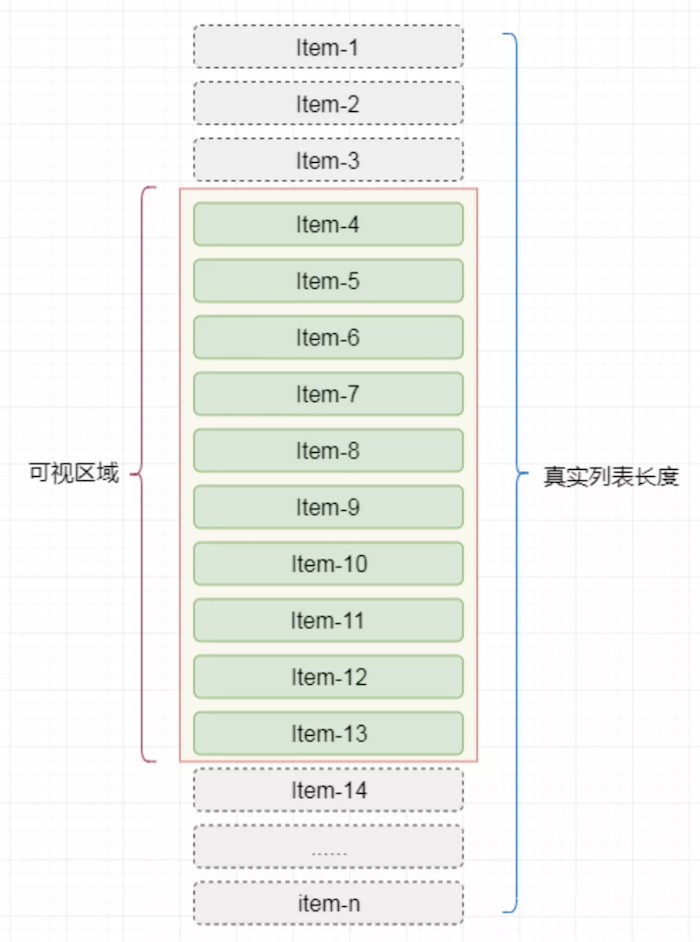

# js 面试题

## 节流和防抖有何区别？分别用于什么场景？

1. 防抖 debounce：在用户频繁触发某个行为的时候，我们只识别一次即可「开始边界：第一次点击触发 结束边界：等到最后一次触发」
2. 节流 throttle：在频繁操作的时候，我们能降低触发的频率

场景

- 防抖，结果式，即一次调用即可
- 节流，过程式，即需要持续一个过程，一次不够

### 防抖 debounce 代码实现

```js
function debounce(func, wait = 500) {
  if (typeof func !== 'function')
    throw new TypeError('func must be an function!')
  let timer = null
  return function (...p) {
    clearTimeout(timer)
    timer = null
    timer = setTimeout(() => {
      func.call(this, ...p)
    }, wait)
  }
}
```

### 节流 throttle 代码实现

```js
function throttle(fn, delay = 100) {
  let timer = null

  return function () {
    if (timer) {
      return
    }
    timer = setTimeout(() => {
      fn.apply(this, arguments)
      timer = null
    }, delay)
  }
}
```

## 箭头函数的缺点

没有 arguments

```js
const fn1 = () => {
  console.log('this', arguments) // 报错，arguments is not defined
}
fn1(100, 200)
```

无法通过 call apply bind 等改变 this

```js
const fn1 = () => {
  console.log('this', this) // window
}
fn1.call({ x: 100 })
```

简写的函数会变得难以阅读

```js
const multiply = (a, b) => (b === undefined ? (b) => a * b : a * b)
```

不能被当作构造函数执行

### 不适用箭头函数的场景

对象方法

```js
const obj = {
  name: '双越',
  getName: () => {
    return this.name
  },
}
console.log(obj.getName())
```

扩展对象原型（包括构造函数的原型）

```js
const obj = {
  name: '双越',
}
obj.__proto__.getName = () => {
  return this.name
}
console.log(obj.getName())
```

构造函数

```js
const Foo = (name, age) => {
  this.name = name
  this.age = age
}
const f = new Foo('张三', 20) // 报错 Foo is not a constructor
```

动态上下文中的回调函数

```js
const btn1 = document.getElementById('btn1')
btn1.addEventListener('click', () => {
  // console.log(this === window)
  this.innerHTML = 'clicked'
})
```

Vue 生命周期和方法

```js
{
    data() { return { name: '双越' } },
    methods: {
        getName: () => {
            // 报错 Cannot read properties of undefined (reading 'name')
            return this.name
        },
        // getName() {
        //     return this.name // 正常
        // }
    },
    mounted: () => {
        // 报错 Cannot read properties of undefined (reading 'name')
        console.log('msg', this.name)
    },
    // mounted() {
    //     console.log('msg', this.name) // 正常
    // }
}
```

【注意】class 中使用箭头函数则**没问题**

```js
class Foo {
  constructor(name, age) {
    this.name = name
    this.age = age
  }
  getName = () => {
    return this.name
  }
}
const f = new Foo('张三', 20)
console.log('getName', f.getName())
```

所以，在 React 中可以使用箭头函数

```js
export default class HelloWorld extends React.Component {
  constructor(props) {
    super(props)
    this.state = {
      name: '双越',
    }
  }
  render() {
    return <p onClick={this.printName}>hello world</p>
  }
  printName = () => {
    console.log(this.state.name)
  }
}
```

### 答案

箭头函数的缺点

- arguments 参数
- 无法改变 this
- 不能被当作构造函数执行

不适用的场景

- 对象方法
- 对象原型
- 构造函数
- 动态上下文
- Vue 生命周期和方法

## for...in 和 for...of 的区别

### key 和 value

for...in 遍历 key , for...of 遍历 value

```js
const arr = [10, 20, 30]
for (let n of arr) {
  console.log(n)
}

const str = 'abc'
for (let s of str) {
  console.log(s)
}
```

```js
function fn() {
  for (let argument of arguments) {
    console.log(argument) // for...of 可以获取 value ，而 for...in 获取 key
  }
}
fn(10, 20, 30)

const pList = document.querySelectorAll('p')
for (let p of pList) {
  console.log(p) // for...of 可以获取 value ，而 for...in 获取 key
}
```

### 遍历对象

for...in 可以遍历对象，for...of 不可以

### 遍历 Map/Set

for...of 可以遍历 Map/Set ，for...in 不可以

```js
const set1 = new Set([10, 20, 30])
for (let n of set1) {
  console.log(n)
}

let map1 = new Map([
  ['x', 10],
  ['y', 20],
  ['z', 3],
])
for (let n of map1) {
  console.log(n)
}
```

### 遍历 generator

for...of 可遍历 generator ，for...in 不可以

```js
function* foo() {
  yield 10
  yield 20
  yield 30
}
for (let o of foo()) {
  console.log(o)
}
```

### 对象的可枚举属性

for...in 遍历一个对象的可枚举属性。

使用 `Object.getOwnPropertyDescriptors(obj)` 可以获取对象的所有属性描述，看 ` enumerable: true` 来判断该属性是否可枚举。

对象，数组，字符传

### 可迭代对象

for...of 遍历一个可迭代对象。<br>
其实就是迭代器模式，通过一个 `next` 方法返回下一个元素。

该对象要实现一个 `[Symbol.iterator]` 方法，其中返回一个 `next` 函数，用于返回下一个 value（不是 key）。<br>
可以执行 `arr[Symbol.iterator]()` 看一下。

JS 中内置迭代器的类型有 `String` `Array` `arguments` `NodeList` `Map` `Set` `generator` 等。

### 答案

- for...in 遍历一个对象的可枚举属性，如对象、数组、字符串。针对属性，所以获得 key
- for...of 遍历一个可迭代对象，如数组、字符串、Map/Set 。针对一个迭代对象，所以获得 value

### 划重点

“枚举” “迭代” 都是计算机语言的一些基础术语，目前搞不懂也没关系。<br>
但请一定记住 for...of 和 for...in 的不同表现。

### 连环问：for await...of

用于遍历异步请求的可迭代对象。

```js
// 像定义一个创建 promise 的函数
function createTimeoutPromise(val) {
  return new Promise((resolve) => {
    setTimeout(() => {
      resolve(val)
    }, 1000)
  })
}
```

如果你明确知道有几个 promise 对象，那直接处理即可

```js
;(async function () {
  const p1 = createTimeoutPromise(10)
  const p2 = createTimeoutPromise(20)

  const v1 = await p1
  console.log(v1)
  const v2 = await p2
  console.log(v2)
})()
```

如果你有一个对象，里面有 N 个 promise 对象，你可以这样处理

```js
;(async function () {
  const list = [createTimeoutPromise(10), createTimeoutPromise(20)]

  // 第一，使用 Promise.all 执行
  Promise.all(list).then((res) => console.log(res))

  // 第二，使用 for await ... of 遍历执行
  for await (let p of list) {
    console.log(p)
  }

  // 注意，如果用 for...of 只能遍历出各个 promise 对象，而不能触发 await 执行
})()
```

【注意】如果你想顺序执行，只能延迟创建 promise 对象，而不能及早创建。<br>
即，你创建了 promise 对象，它就立刻开始执行逻辑。

```js
;(async function () {
  const v1 = await createTimeoutPromise(10)
  console.log(v1)
  const v2 = await createTimeoutPromise(20)
  console.log(v2)

  for (let n of [100, 200]) {
    const v = await createTimeoutPromise(n)
    console.log('v', v)
  }
})()
```

## JS 严格模式和非严格模式的区别

### 设计初衷

Javascript 设计之初，有很多不合理、不严谨、不安全之处，例如变量未定义即可使用 `n = 100`。严格模式用于规避这些问题。

而现在 ES 规范已经普及，从语法上已经规避了这些问题。

### 开启严格模式

代码（或一个函数）一开始插入一行 `'use strict'` 即可开启严格模式

```js
'use strict' // 全局开启

function fn() {
  'use strict' // 某个函数开启
}
```

一般情况下，开发环境用 ES 或者 Typescript ，打包出的 js 代码使用严格模式

### 严格模式的不同

严格模式的细则有很多，这里总结一些常用常见的

### 全局变量必须声明

```js
'use strict'
n = 10 // ReferenceError: n is not defined
```

### 禁止使用 `with`

```js
'use strict'
var obj = { x: 10 }
with (obj) {
  // Uncaught SyntaxError: Strict mode code may not include a with statement
  console.log(x)
}
```

### 创建 eval 作用域

正常模式下，JS 只有两种变量作用域：全局作用域 + 函数作用域。严格模式下，JS 增加了 eval 作用域。

**chrome 隐私模式下执行这段代码？？？**

```js
'use strict'
var x = 10
eval('var x = 20; console.log(x)')
console.log(x)
```

### 禁止 this 指向全局作用域

```js
'use strict'
function fn() {
  console.log('this', this) // undefined
}
fn()
```

### 函数参数不能重名

```js
'use strict'

// Uncaught SyntaxError: Duplicate parameter name not allowed in this context
function fn(x, x, y) {
  return
}
```

### 答案

- 全局变量必须声明
- 禁止使用 with
- 创建 eval 作用域
- 禁止 this 指向全局作用域
- 函数参数不能重名

## JS 内存泄漏

### 题目

如何检测 JS 内存泄漏？内存泄漏的场景有哪些？

### 垃圾回收

正常情况下，一个函数执行完，其中的变量都会是会 JS 垃圾回收。

```js
function fn() {
  const a = 'aaa'
  console.log(a)

  const obj = {
    x: 100,
  }
  console.log(obj)
}
fn()
```

但某些情况下，变量是销毁不了的，因为可能会被再次使用。

```js
function fn() {
  const obj = {
    x: 100,
  }
  window.obj = obj // 引用到了全局变量，obj 销毁不了
}
fn()
```

```js
function genDataFns() {
  const data = {} // 闭包，data 销毁不了
  return {
    get(key) {
      return data[key]
    },
    set(key, val) {
      data[key] = val
    },
  }
}
const { get, set } = genDataFns()
```

变量销毁不了，一定就是内存泄漏吗？—— 不一定

### 垃圾回收算法 - 引用计数

早起的垃圾回收算法，以“数据是否被引用”来判断要不要回收。

```js
// 对象被 a 引用
let a = {
  b: {
    x: 10,
  },
}

let a1 = a // 又被 a1 引用
let a = 0 // 不再被 a 引用，但仍然被 a1 引用
let a1 = null // 不再被 a1 引用

// 对象最终没有任何引用，会被回收
```

但这个算法有一个缺陷 —— 循环引用。例如

```js
function fn() {
  const obj1 = {}
  const obj2 = {}
  obj1.a = obj2
  obj2.a = obj1 // 循环引用，无法回收 obj1 和 obj2
}
fn()
```

此前有一个很著名的例子。IE6、7 使用引用计数算法进行垃圾回收，常常因为循环引用导致 DOM 对象无法进行垃圾回收。<br>
下面的例子，即便界面上删除了 div1 ，但在 JS 内存中它仍然存在，包括它的所有属性。但现代浏览器已经解决了这个问题。

```js
var div1
window.onload = function () {
    div1 = document.getElementById('div1')
    div1.aaa = div1
    div1.someBigData = { ... } // 一个体积很大的数据。
}
```

以上这个例子就是内存泄漏。即，**不希望它存在的，它却仍然存在**，这是不符合预期的。关键在于“泄漏”。

### 垃圾回收算法 - 标记清除

基于上面的问题，现代浏览器使用“标记-清除”算法。根据“是否是否可获得”来判断是否回收。

定期从根（即全局变量）开始向下查找，能找到的即保留，找不到的即回收。循环引用不再是问题。

标记清除算法解决了引用计数算法的⼀些问题， 并且实现较为简单， 在 V8 引擎中会有被⼤量的使⽤到。

在使⽤标记清除算法时,未引用对象并不会被立即回收.取⽽代之的做法是,垃圾对象将⼀直累计到内存耗尽为⽌.当内存耗尽时,程序将会被挂起,垃圾回收开始执行.当所有的未引用对象被清理完毕 时,程序才会继续执行.该算法的核心思想就是将整个垃圾回收操作分为标记和清除两个阶段完成。

第一个阶段就是遍历所有对象，标记所有的可达对象；第二个阶段就是遍历所有对象清除没有标记的对象，同时会抹掉所有已经标记的对象，便于下次的工作。

### 检测内存变化

可使用 Chrome devTools Performance 来检测内存变化

- 刷新页面，点击“GC”按钮
- 点击“Record”按钮开始记录，然后操作页面
- 操作结束，点击“GC”按钮，点击“结束”按钮，看分析结果

代码参考 `memory-change.html`

### 内存泄漏的场景

拿 Vue 来举例说明。

组件中有全局变量、函数的引用。组件销毁时要记得清空。

```js
export default {
  data() {
    return {
      nums: [10, 20, 30],
    }
  },
  mounted() {
    window.printNums = () => {
      console.log(this.nums)
    }
  },
  // beforeUnmount() {
  //     window.printNums = null
  // },
}
```

组件有全局定时器。组件销毁时要记得清除。

```js
export default {
  data() {
    return {
      // intervalId: 0,
      nums: [10, 20, 30],
    }
  },
  // methods: {
  //     printNums() {
  //         console.log(this.nums)
  //     }
  // },
  mounted() {
    setInterval(() => {
      console.log(this.nums)
    }, 200)

    // this.intervalId = setInterval(this.printNums, 200)
  },
  beforeUnmount() {
    // clearInterval(this.intervalId)
  },
}
```

组件中有全局事件的引用。组件销毁时记得解绑。

```js
export default {
  data() {
    return {
      nums: [10, 20, 30],
    }
  },
  // methods: {
  //     printNums() {
  //         console.log(this.nums)
  //     }
  // },
  mounted() {
    window.addEventListener('resize', () => {
      console.log(this.nums)
    })
    // window.addEventListener('reisze', this.printNums)
  },
  beforeUnmount() {
    // window.removeEventListener('reisze', this.printNums)
  },
}
```

组件中使用了自定义事件，销毁时要记得解绑。

```js
export default {
  data() {
    return {
      nums: [10, 20, 30],
    }
  },
  // methods: {
  //     printNums() {
  //         console.log(this.nums)
  //     }
  // },
  mounted() {
    event.on('event-key', () => {
      console.log(this.nums)
    })

    // event.on('event-key', this.printNums)
  },
  beforeUnmount() {
    // event.off('event-key', this.printNums)
  },
}
```

### 闭包是内存泄漏吗

上述代码 `genDataFns()` 就是一个很典型的闭包，闭包的变量是无法被垃圾回收的。

但闭包不是内存泄漏，因为它是符合开发者预期的，即本身就这么设计的。而内存泄漏是非预期的。

【注意】这一说法没有定论，有些面试官可能会说“不可被垃圾回收就是内存泄漏”，不可较真。

### 答案

- 可使用 Chrome devTools Performance 检测内存变化
- 内存泄漏的场景
  - 全局变量，函数
  - 全局事件
  - 全局定时器
  - 自定义事件
  - 闭包（无定论）

### 扩展

WeakMap WeakSet 弱引用，不会影响垃圾回收。

```js
// 函数执行完，obj 会被销毁，因为外面的 WeakMap 是“弱引用”，不算在内
const wMap = new WeakMap()
function fn() {
  const obj = {
    name: 'zhangsan',
  }
  // 注意，WeakMap 专门做弱引用的，因此 WeakMap 只接受对象作为键名（`null`除外），不接受其他类型的值作为键名。其他的无意义
  wMap.set(obj, 100)
}
fn()
// 代码执行完毕之后，obj 会被销毁，wMap 中也不再存在。但我们无法第一时间看到效果。因为：
// 内存的垃圾回收机制，不是实时的，而且是 JS 代码控制不了的，因此这里不一定能直接看到效果。
```

```js
// 函数执行完，obj 会被销毁，因为外面的 WeakSet 是“弱引用”，不算在内
const wSet = new WeakSet()
function fn() {
  const obj = {
    name: 'zhangsan',
  }
  wSet.add(obj) // 注意，WeakSet 就是为了做弱引用的，因此不能 add 值类型！！！无意义
}
fn()
```

## 是否了解过 requestIdleCallback ？

### 由 React Fiber 引起的关注

React 16 内部使用 Fiber ，即组件渲染过程可以暂停，先去执行高优任务，CPU 闲置时再继续渲染。<br>
其中用到的核心 API 就是 requestIdleCallback 。

### requestAnimationFrame 每次渲染都执行，高优

页面的渲染是一帧一帧进行的，至少每秒 60 次（即 16.6ms 一次）才能肉眼感觉流畅。所以，网页动画也要这个帧率才能流畅。

用 JS 来控制时间是不靠谱的，因为 JS 执行本身还需要时间，而且 JS 和 DOM 渲染线程互斥。所以 ms 级别的时间会出现误差。<br>
`requestAnimationFrame` 就解决了这个问题，浏览器每次渲染都会执行，不用自己计算时间。

### requestIdleCallback 空闲时才执行，低优

requestIdleCallback 会在网页渲染完成后，CPU 空闲时执行，不一定每一帧都执行。

requestIdleCallback 不适合执行 DOM 操作，因为修改了 DOM 之后下一帧不一定会触发修改。

### 宏任务

requestAnimationFrame 和 requestIdleCallback 都是宏任务，它们比 setTimeout 更晚触发。

### 使用场景

requestAnimationFrame 可用于网页动画。

requestIdleCallback 可用于一些低优先级的场景，以代替 setTimeout 。例如发送统计数据。<br>
但请注意 requestIdleCallback 的浏览器兼容性

### 答案

requestIdleCallback 可在网页渲染完成后，CPU 空闲时执行，用于低优先级的任务处理。

## 后端返回 10w 条数据，该如何渲染？

### 设计是否合理？

前端很少会有一次性渲染 10w 条数据的需求，而且如果直接渲染会非常卡顿。<br>
你可以反问面试官：这是什么应用场景。然后判断这个技术方案是否合理。

例如，就一个普通的新闻列表，后端一次性给出 10w 条数据是明显设计不合理的。应该分页给出。<br>
你能正常的反问、沟通、给出自己合理的建议，这本身就是加分项。

当然，面试官话语权更大，他可能说：对，不合理，但就非得这样，该怎么办？

### 虚拟列表

基本原理

- 只渲染可视区域 DOM
- 其他隐藏区域不渲染，只用一个 `<div>` 撑开高度
- 监听容器滚动，随时创建和销毁 DOM



虚拟列表实现比较复杂，特别是在结合异步 ajax 加载。明白实现原理，实际项目可用第三方 lib

- [vue-virtual-scroll-list](https://www.npmjs.com/package/vue-virtual-scroll-list)
- [react-virtualized](https://www.npmjs.com/package/react-virtualized)

### 答案

- 沟通需求和场景，给出自己合理的设计建议
- 虚拟列表

## 前端常用的设计模式？什么场景？

### 工厂模式

用一个工厂函数，创建一个实例，封装创建的过程。

```ts
class Foo { ... }

function factory(): Foo {
    // 封装创建过程，这其中可能有很多业务逻辑

    return new Foo(...arguments)
}
```

应用场景

- jQuery `$('div')` 创建一个 jQuery 实例
- React `createElement('div', {}, children)` 创建一个 vnode

### 单例模式

提供全局唯一的对象，无论获取多少次。

```js
class SingleTon {
    private constructor() {}
    public static getInstance(): SingleTon {
        return new SingleTon()
    }
    fn1() {}
    fn2() {}
}

// const s1 = new SingleTon() // Error: constructor of 'singleton' is private

const s2 = SingleTon.getInstance()
s2.fn1()
s2.fn2()

const s3 = SingleTon.getInstance()
s2 === s3 // true
```

应用场景

- Vuex Redux 的 store ，全局唯一的
- 全局唯一的 dialog modal

PS：JS 是单线程语言。如果是 Java 等多线程语言，创建单例时还需要考虑线程锁死，否则两个线程同时创建，则可能出现两份 instance 。

### 代理模式

使用者不能直接访问真实数据，而是通过一个代理层来访问。<br>
ES Proxy 本身就是代理模式，Vue3 基于它来实现响应式。

代码参考 proxy.html

### 观察者模式

即常说的绑定事件。一个主题，一个观察者，主题变化之后触发观察者执行。

```js
// 一个主题，一个观察者，主题变化之后触发观察者执行
btn.addEventListener('click', () => { ... })
```

### 发布订阅模式

即常说的自定义事件，一个 `event` 对象，可以绑定事件，可以触发事件。

```js
// 绑定
event.on('event-key', () => {
  // 事件1
})
event.on('event-key', () => {
  // 事件2
})

// 触发执行
event.emit('event-key')
```

温故知新。在讲 JS 内存泄漏时提到，Vue React 组件销毁时，要记得解绑自定义事件。

```js
function fn1() {
  /* 事件1 */
}
function fn2() {
  /* 事件2 */
}

// mounted 时绑定
event.on('event-key', fn1)
event.on('event-key', fn2)

// beforeUnmount 时解绑
event.off('event-key', fn1)
event.off('event-key', fn2)
```

### 装饰器模式

ES 和 TS 的 Decorator 语法就是装饰器模式。可以为 class 和 method 增加新的功能。<br>
以下代码可以在 [ts playground](https://www.typescriptlang.org/play) 中运行。

```js
// class 装饰器
function logDec(target) {
  target.flag = true
}

@logDec
class Log {
  // ...
}

console.log(Log.flag) // true
```

```js
// method 装饰器
// 每次 buy 都要发送统计日志，可以抽离到一个 decorator 中
function log(target, name, descriptor) {
    // console.log(descriptor.value) // buy 函数
    const oldValue = descriptor.value // 暂存 buy 函数

    // “装饰” buy 函数
    descriptor.value = function(param) {
        console.log(`Calling ${name} with`, param) // 打印日志
        return oldValue.call(this, param) // 执行原来的 buy 函数
    };

    return descriptor
}
class Seller {
    @log
    public buy(num) {
        console.log('do buy', num)
    }
}

const s = new Seller()
s.buy(100)
```

Angular nest.js 都已广泛使用装饰器。这种编程模式叫做**AOP 面向切面编程**：关注业务逻辑，抽离工具功能。

```js
import { Controller, Get, Post } from '@nestjs/common'

@Controller('cats')
export class CatsController {
  @Post()
  create(): string {
    return 'This action adds a new cat'
  }

  @Get()
  findAll(): string {
    return 'This action returns all cats'
  }
}
```

### 答案

传统的经典设计模式有 23 个，作为面试题只说出几个前端常用的就可以。

- 工厂模式
- 单例模式
- 代理模式
- 观察者模式
- 发布订阅模式
- 装饰器模式

## 连环问：观察者模式和发布订阅模式的区别？


观察者模式

- Subject 和 Observer 直接绑定，中间无媒介
- 如 `addEventListener` 绑定事件

发布订阅模式

- Publisher 和 Observer 相互不认识，中间有媒介
- 如 `eventBus` 自定义事件

## 连环问：MVC 和 MVVM 有什么区别

MVC 原理

- View 传送指令到 Controller
- Controller 完成业务逻辑后，要求 Model 改变状态
- Model 将新的数据发送到 View，用户得到反馈


MVVM 直接对标 Vue 即可

- View 即 Vue template
- Model 即 Vue data
- VM 即 Vue 其他核心功能，负责 View 和 Model 通讯


## 项目中有没有发生过沟通的冲突（和其他角色）？如何解决的

### 分析

有项目有合作，有合作就有沟通，有沟通就有冲突，这很正常。哪怕你自己单独做一个项目，你也需要和你的老板、客户沟通。

面试官通过考察这个问题，就可以从侧面得知你是否有实际工作经验。
因为即便你是一个项目的“小兵”，不是负责人，你也会参与到一些沟通和冲突中，也能说出一些所见所闻。

当然，如果你之前是项目负责人，有过很多沟通和解决冲突的经验，并在面试中充分表现出来。
相信面试官会惊喜万分（前提是技术过关），因为“技术 + 项目管理”这种复合型人才非常难得。

### 常见的冲突

- 需求变更：PM 或者老板提出了新的需求
- 时间延期：上游或者自己延期了
- 技术方案冲突：如感觉服务端给的接口格式不合理

### 正视冲突

从个人心理上，不要看到冲突就心烦，要拥抱变化，正视冲突。冲突是项目的一部分，就像 bug 一样，心烦没用。

例如，PM 过来说要修改需求，你应该回答：**“可以呀，你组织个会议讨论一下吧，拉上各位领导，因为有可能会影响工期。”**

再例如，自己开发过程中发现可能会有延期，要及早的汇报给领导：**“我的工期有风险，因为 xxx 原因，不过我会尽量保证按期完成。”**<br>
千万不要不好意思，等延期了被领导发现了，这就不好了。

### 解决冲突

合作引起的冲突，最终还是要通过沟通来解决。

一些不影响需求和工期的冲突，如技术方案问题，尽量私下沟通解决。实在解决不了再来领导开会。<br>
需求变更和时间延期一定要开会解决，会议要有各个角色决定权的领导去参与。

注意，无论是私下沟通还是开会，涉及到自己工作内容变动的，一定要有结论。
最常见的就是发邮件，一定要抄送给各位相关的负责人。这些事情要公开，有记录，不要自己偷偷的就改了。

### 如何规避冲突

- 预估工期留有余地
- 定期汇报个人工作进度，提前识别风险

## js 实现数组扁平化实现？

1. ES6 中的 flat

我们还可以直接调用 `ES6` 中的 `flat` 方法来实现数组扁平化。`flat` 方法的语法：`arr.flat ( [depth] )`
其中 `depth` 是 `flat` 的参数，`depth` 是可以传递数组的展开深度（默认不填、数值是 1），即展开一层数组。如果层数不确定，参数可以传进 `Infinity`，代表不论多少层都要展开：

```js
let arr = [1, [2, [3, 4, 5]]]
function flatten(arr) {
  return arr.flat(Infinity)
}
console.log(flatten(arr)) //  [1, 2, 3, 4，5]
```

2. 递归实现

普通的递归思路很容易理解，就是通过循环递归的方式，一项一项地去遍历，如果每一项还是一个数组，那么就继续往下遍历，利用递归程序的方法，来实现数组的每一项的连接。

```js
let arr = [1, [2, [3, 4, 5]]]
function flatten(arr) {
  let result = []

  for (let i = 0; i < arr.length; i++) {
    if (Array.isArray(arr[i])) {
      result = result.concat(flatten(arr[i]))
    } else {
      result.push(arr[i])
    }
  }
  return result
}
console.log(flatten(arr)) //  [1, 2, 3, 4，5]
```

3. 通过扩展运算符实现

```js
let arr = [1, [2, [3, 4]]]
function flatten(arr) {
  while (arr.some((item) => Array.isArray(item))) {
    arr = [].concat(...arr)
  }
  return arr
}
console.log(flatten(arr)) //  [1, 2, 3, 4，5]
```

4. reduce 函数迭代

从上面普通的递归函数中可以看出，其实就是对数组的每一项进行处理，那么其实也可以用 reduce 来实现数组的拼接，从而简化第一种方法的代码，改造后的代码如下所示

```js
let arr = [1, [2, [3, 4]]]
function flatten(arr) {
  return arr.reduce(function (prev, next) {
    return prev.concat(Array.isArray(next) ? flatten(next) : next)
  }, [])
}
console.log(flatten(arr)) //  [1, 2, 3, 4，5]
```

## 获取数据类型的方式都有哪些

1. Object.prototype.toString.call([value])

```ts
export function getType(x: any): string {
  const originType = Object.prototype.toString.call(x) // '[object String]'
  const spaceIndex = originType.indexOf(' ')
  const type = originType.slice(spaceIndex + 1, -1) // 'String'
  return type.toLowerCase() // 'string'
}
```

2. [value] instanceof [Constructor]
   - [对象] instanceof [构造函数] 检测对象是否为这个类的实例，基于这个特点可以“临时”拿来检测数据类型
   - 对原始值类型无效：`instanceof`左侧只要是原始值类型，结果就是`false`，默认不会进行`装箱`
   - 无法检测是否为`标准普通对象`：因为所有对象都是`Object`的一个实例，检测结果都是`true`
   - 因为我们可以修改原型链的指向，所以检测的结果不一定是准确的
     > 传统版本：`instanceof`检测是按照实例的原型链进行查找的，只要`构造函数.prototype` 出现在了`对象`的原型链上，那么检测结果都是`true`！
     > 新版本：在`Function.prototype`上有一个`Symbol.hasInstance`属性方法(所有函数都可以使用)，当我们基于 `[对象]` instanceof `[构造函数]`检测处理的时候，内部是这样处理的：`[构造函数][Symbol.hasInstance]([对象])`
3. [value].constructor

   - 可以检测是否为纯粹对象(标准普通对象)
   - 对原始值(除`null/undefined`,因为他们两个无法进行成员访问)也有效
     > 它也是个临时工，局限性也很多，最主要的就是不准「因为我们可以随意修改 constructor」

4. Array.isArray([value])
5. isNaN([value])

## new 一个对象内部发生了什么，手写代码表示

1. 创造当前类 Ctor 的一个实例对象「`空对象`、`__proto__`===`Ctor.prototype`」
2. 把构造函数当做普通函数执行，只不过让函数中的`this`指向创建的实例对象
3. 判断函数执行的返回值，如果返回的是对象，则以自己返回的为主；否则把创建的实例对象返回！

```js
function _new(Ctor, ...params) {
  // @1 创造当前类Ctor的一个实例对象「空对象、__proto__===Ctor.prototype」
  let obj = {}
  obj.__proto__ = Ctor.prototype
  // @2 把构造函数当做普通函数执行，只不过让函数中的this指向创建的实例对象
  let result = Ctor.call(obj, ...params)
  // @3 判断函数执行的返回值，如果返回的是对象，则以自己返回的为主；否则把创建的实例对象返回！
  if (result !== null && /^(object|function)$/.test(typeof result))
    return result
  return obj
}
```

## 手写实现一个 lazyMan

```js
class LazyMan {
    private name: string
    private tasks: Function[] = [] // 任务列表

    constructor(name: string) {
        this.name = name

        setTimeout(() => {
            this.next()
        })
    }

    private next() {
        const task = this.tasks.shift() // 取出当前 tasks 的第一个任务
        if (task) task()
    }

    eat(food: string) {
        const task = () => {
            console.info(`${this.name} eat ${food}`)
            this.next() // 立刻执行下一个任务
        }
        this.tasks.push(task)

        return this // 链式调用
    }

    sleep(seconds: number) {
        const task = () => {
            console.info(`${this.name} 开始睡觉`)
            setTimeout(() => {
                console.info(`${this.name} 已经睡完了 ${seconds}s，开始执行下一个任务`)
                this.next() // xx 秒之后再执行下一个任务
            }, seconds * 1000)
        }
        this.tasks.push(task)

        return this // 链式调用
    }
}

const me = new LazyMan('王佳欢')
me.eat('苹果').eat('香蕉').sleep(2).eat('葡萄').eat('西瓜').sleep(2).eat('橘子')

```

## instanceof 实现原理？

> 传统版本：`instanceof`检测是按照实例的原型链进行查找的，只要`构造函数.prototype` 出现在了`对象`的原型链上，那么检测结果都是`true`！
> 新版本：在`Function.prototype`上有一个`Symbol.hasInstance`属性方法(所有函数都可以使用)，当我们基于 `[对象]` instanceof `[构造函数]`检测处理的时候，内部是这样处理的：`[构造函数][Symbol.hasInstance]([对象])`

```js
var instance_of = function instance_of(obj, Ctor) {
  // 右侧必须是一个函数
  if (typeof Ctor !== 'function')
    throw new TypeError("Right-hand side of 'instanceof' is not callable")
  // 原始值检测都是false
  if (obj == null || !/^(object|function)$/.test(typeof obj)) return false
  // 构造函数必须具备prototype
  if (!Ctor.prototype)
    throw new TypeError(
      "Function has non-object prototype 'undefined' in instanceof check"
    )
  // 支持Symbol.hasInstance的使用这个方法处理
  if (typeof Symbol !== 'undefined') return Ctor[Symbol.hasInstance](obj)
  // 不支持：自己按照原型链查找
  let proto = Object.getPrototypeOf(obj)
  while (proto) {
    if (proto === Ctor.prototype) return true
    proto = Object.getPrototypeOf(proto)
  }
  return false
}
```

## 数组去重的几种方式？

1. filter()和 indexOf()实现去重

```js
let originalArray = [1, 2, 3, 4, 1, 2, 3, 4]

let uniqueArray = originalArray.filter((item, index, array) => {
  return array.indexOf(item) === index
})

// uniqueArray === [1, 2, 3, 4]
```

2. reduce()和 includes()实现去重

```js
let originalArray = [1, 2, 3, 4, 1, 2, 3, 4]

let uniqueArray = originalArray.reduce((unique, item) => {
  unique.includes(item) ? unique : [...unique, item]
}, [])

// uniqueArray === [1, 2, 3, 4]
```

3. Set 实现去重

```js
let originalArray = [1, 2, 3, 4, 1, 2, 3, 4]

let uniqueArray = (array) => [...new Set(array)]

// or

let uniqueArray = Array.from(new Set(originalArray))

// uniqueArray = [1, 2, 3, 4]
```

## map、weekmap、set、weekset 区别？

1. Map ：Map 是一种键值对的集合，其中的键和值可以是任意类型的。与对象类似，它们可以通过键来访问值。不同之处在于，Map 可以使用任意类型作为键，而对象只能使用字符串或 Symbol 类型作为键。Map 还提供了许多有用的方法，例如 size 属性来获取键值对的数量，以及 forEach()方法来遍历集合。

- Map.has()判断键名是否存在
- Map.get()从集合中获取信息，如果键名不存在，返回 undefined
- Map.set() 分别传入键名和键值，添加新的元素。
- Map.delete() 从 Map 中移除指定键名及其对应值。
- Map.clear() 清空 Map 集合
- Map.forEach()

2. Set ：Set 是一种值的集合，其中每个值都是唯一的。与数组不同，它们没有重复的元素，并且没有特定的顺序。Set 提供了许多有用的方法，例如 add()方法来添加新的值，delete()方法来删除值，has()方法来检查是否存在某个值，以及 size 属性来获取集合的大小。

- Set.add() 向集合中添加元素
- Set.has() 检测 Map 集合中是否存在某个值
- Set.delete() 移除 Map 中的某一个键名
- Set.clear() 清空 Map 集合中的全部元素
- Set.forEach()遍历 Map 集合中的元素，也可以用 for of

3. WeakMap ：WeakMap 与 Map 类似，也是一种键值对的集合。然而，它们的键必须是对象，而值可以是任何类型。与 Map 不同的是，WeakMap 的键是弱引用，也就是说，如果键对象没有被其他地方引用，则它们可以被垃圾回收。这使得 WeakMap 非常适合缓存数据，因为当对象不再需要时，它们可以自动从 WeakMap 中删除，从而释放内存。

> WeakMap 只支持 has()、delete()、set()、get()四个方法。

4. WeakSet ：WeakSet 是一种值的集合，其中每个值都是唯一的，并且没有特定的顺序。与 Set 不同的是，它们的值也是弱引用的，因此可以被垃圾回收。WeakSet 通常用于存储对象的引用，以避免内存泄漏。

- add()
- has()
- delete()
