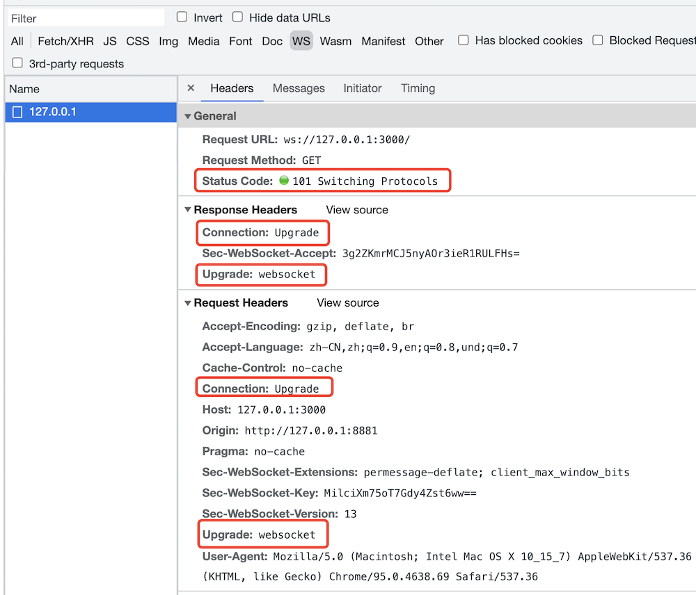

# 网络面试题

## TCP三次握手和四次挥手

### 三次握手

三次握手，即建立一次 TCP 连接时，客户端和服务端总共需要发送 3 个包。

先举一个例子。还是你要派人去张三家取一个东西，现在你要发短信（不是打电话）“建立连接”，至少需要 3 个步骤，缺一不可。
- 你：在家吗？
- 张三：在家
- 你：好，这就过去（然后你指派人上门，张三准备迎接）

过程
- 客户端发包，服务端收到。服务端确认：客户端的发送能力是正常的。
- 服务端发包，客户端收到。客户端确认：服务端的接收能力是正常的。
- 客户端发包，服务端收到。服务端确认：客户端即将给我发送数据，我要准备接收。

建立连接完成，然后就开始发送数据，通讯。

### 四次挥手

握手，是建立连接。挥手，就是告别，就是关闭连接。

还是之前的例子。取东西，不一定一次就取完，可能要来回很多次。而且，也不一定全部由你主动发起，过程中张三也可能会主动派人给你发送。<br>
即，你在 chrome 中看到的是一次 http 请求，其实背后可能需要好几次网络传输，只不过浏览器给合并起来了。

好了，取东西完毕了，你要发短信“关闭连接”，告诉张三可以关门了，需要 4 个步骤。<br>
【注意】这里你需要等着确认张三关门，才算是完全关闭连接，不能你说一声就不管了。跟日常生活不一样。

- 你：完事儿了
- 张三：好的 （此时可能还要继续给你发送，你也得继续接收。直到张三发送完）
- 张三：我发送完毕，准备关门了
- 你：好，关门吧 （然后你可以走了，张三可以关门了，连接结束）

过程
- 客户端发包，服务端接收。服务端确认：客户端已经请求结束
- 服务端发包，客户端接收。客户端确认：服务端已经收到，我等待它关闭
- 服务端发包：客户端接受。客户端确认：服务端已经发送完成，可以关闭
- 客户端发包，服务端接收。服务端确认：可以关闭了

### 图示


## HTTP 和 UDP 有何区别

### 网络协议


- HTTP 在应用层，直接被程序使用
- TCP 和 UDP 在传输层，底层

### UDP 的特点

UDP 是一种无连接的、不可靠的传输层协议。而 TCP 需要连接、断开连接，参考“三次握手、四次挥手”。

不需要连接，所以 UDP 的效率比 TCP 高。

虽然 UDP 从协议层是不稳定的，但随着现代网络硬件环境的提升，也能保证绝大部分情况下的稳定性。所以，UDP 一直处于被发展的趋势。

例如视频会议、语音通话这些允许中段、不完全保证持续连接的场景，又需要较高的传输效率，就很适合 UDP 协议。

### 答案

- HTTP 在应用层，而 UDP 和 TCP 在传输层
- HTTP 是有连接的、可靠的，UDP 是无连接的、不可靠的

## 连环问：http 1.0 1.1 2.0 区别

http 1.0 最基础的 http 协议

http 1.1
- 引入更多的缓存策略，如 `cache-control` `E-tag`
- 长链接，默认开启 `Connection: keep-alive` ，多次 http 请求减少了 TCP 连接次数
- 断点续传，状态吗 `206`
- 增加新的 method `PUT` `DELETE` 等，可以设计 Restful API

http2.0
- header 压缩，以减少体积
- 多路复用，一个 TCP 连接中可以多个 http 并行请求。拼接资源（如雪碧图、多 js 拼接一个）将变的多余
- 服务器端推送

## 什么是 https 中间人攻击，如何预防？

### https 加密原理

http 是明文传输，传输的所有内容（如登录的用户名和密码），都会被中间的代理商（无论合法还是非法）获取到。

http + TLS/SSL = https ，即加密传输信息。只有客户端和服务端可以解密为明文，中间的过程无法解密。


### 中间人攻击

中间人攻击，就是黑客劫持网络请求，伪造 CA 证书。


解决方案：使用浏览器可识别的，正规厂商的证书（如阿里云），慎用免费证书。


## webSocket 和 http 协议有何区别？有和应用场景？

### webSocket 简介

webSocket 和 http 都是应用层，支持端对端的通讯。可以由服务端发起，也可以由客户端发起。<br>

场景：消息通知，直播讨论区，聊天室，协同编辑

### webSocket 建立连接

会先发起一个 http 请求，根服务端建立连接。连接成功之后再升级为 webSocket 协议，然后再通讯。



### webSocket 和 http 区别

- 协议名称不同 `ws` 和 `http`
- http 一般只能浏览器发起请求，webSocket 可以双端发起请求
- webSocket 无跨域限制
- webSocket 通过 `send` 和 `onmessage` 进行通讯，http 通过 `req` 和 `res` 通讯

PS：`ws` 可以升级为 `wss` 协议，像 `http` 升级到 `https` 一样，增加 `SSL` 安全协议。

```js
import { createServer } from 'https'
import { readFileSync } from 'fs'
import { WebSocketServer } from 'ws'

const server = createServer({
  cert: readFileSync('/path/to/cert.pem'),
  key: readFileSync('/path/to/key.pem')
})
const wss = new WebSocketServer({ server })
```

### 扩展

PS：如果做项目开发，推荐使用 [socket.io](https://www.npmjs.com/package/socket.io)，API 更方便。

```js
io.on('connection', socket => {
  // emit an event to the socket
  socket.emit('request', /* … */)
  // emit an event to all connected sockets
  io.emit('broadcast', /* … */)
  // listen to the event
  socket.on('reply', () => { /* … */ })
})
```

## 连环问：webSocket 和长轮询（长连接）的区别

- http 长轮询 - 客户端发起 http 请求，server 不立即返回，等待有结果再返回。这期间 TCP 连接不会关闭，阻塞式。（需要处理 timeout 的情况）
- webSocket - 客户端发起请求，服务端接收，连接关闭。服务端发起请求，客户端接收，连接关闭。非阻塞。


## get和post的区别

- GET在浏览器回退时是无害的，而POST会再次提交请求。
- GET产生的URL地址可以被Bookmark，而POST不可以。
- GET请求会被浏览器主动cache，而POST不会，除非手动设置。
- GET请求只能进行url编码，而POST支持多种编码方式。
- GET请求参数会被完整保留在浏览器历史记录里，而POST中的参数不会被保留。
- GET请求在URL中传送的参数是有长度限制的，而POST么有。
- 对参数的数据类型，GET只接受ASCII字符，而POST没有限制。
- GET比POST更不安全，因为参数直接暴露在URL上，所以不能用来传递敏感信息。
- GET参数通过URL传递，POST放在Request body中。