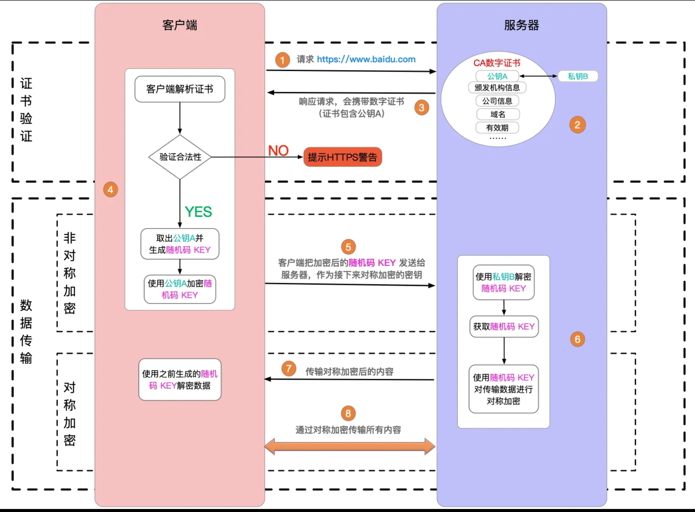
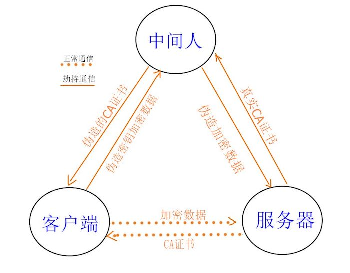
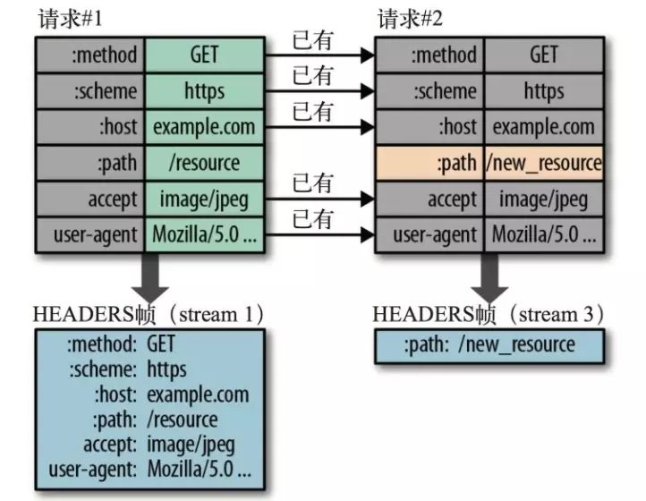

# 网络面试题

## TCP 三次握手和四次挥手

TCP 的总结如下：

① 数据分片：在发送端对用户数据进行分片，在接收端进行重组，由 TCP 确定分片的大小并控制分片和重组；

② 到达确认：接收端接收到分片数据时，根据分片数据序号向发送端发送一个确认；

③ 超时重发：发送方在发送分片时启动超时定时器，如果在定时器超时之后没有收到相应的确认，重发分片；

④ 滑动窗口：TCP 连接每一方的接收缓冲空间大小都固定，接收端只允许另一端发送接收端缓冲区所能接纳的数据，TCP 在滑动窗口的基础上提供流量控制，防止较快主机致使较慢主机的缓冲区溢出；

⑤ 失序处理：作为 IP 数据报来传输的 TCP 分片到达时可能会失序，TCP 将对收到的数据进行重新排序，将收到的数据以正确的顺序交给应用层；

⑥ 重复处理：作为 IP 数据报来传输的 TCP 分片会发生重复，TCP 的接收端必须丢弃重复的数据；

⑦ 数据校验：TCP 将保持它首部和数据的检验和，这是一个端到端的检验和，目的是检测数据在传输过程中的任何变化。如果收到分片的检验和有差错，TCP 将丢弃这个分片，并不确认收到此报文段导致对端超时并重发。

### 滑动窗口的引入

IP 层协议属于不可靠的协议，IP 层并不关系数据是否发送到了对端，在复杂的网络中，由于各种各样的原因，接收到数据包的顺序不一定和发送的顺序相同，这就是乱序问题。这种情况下，有必要为每个包定义一个序号 seq，每个包用一个校验和确保数据完整性。

然后发送方不能不管接收方的承受能力，只顾着发。举个栗子，一个高速公路如果没有收费站，那么车辆就会一拥而入，此时不凑巧，发生了追尾事故，导致公路拥塞，如果不控制公路的进入车辆，那么整个高速公路都会变成“露天停车场”。说到这里你可能就明白了，TCP 需要这样的“收费站”，而这个收费站就是“滑动窗口”。


然后，平时在高速上的时候，细心的你注意到了：除了入口有个收费站，出口也有个收费站。TCP 也是一样的，除了入口有发送方滑动窗口，出口处也设立有接收方滑动窗口。

收费站除了限制流速以外还有什么作用鸭？是不是要收费呢，毕竟这是国家修的路，不能白走是吧。

对于发送方滑动窗口（入口收费站），我们把数据包看成车辆，枚举它们的状态：

1. 还未进入入口收费站车辆。对应的是下图 Not Sent，Recipient Not Ready to Receive。这些数据属于发送端未发送，同时接收端也未准备接收的。
2. 进入收费站，但未进入高速路。对应的是图中的 Not Sent，Recipient Ready to Receive。这部分数据是发送端未发送，但已经告知接收方的，这部分其实已经在窗口中（发送端缓存）了，等待发送。
3. 在高速公路上行驶的车辆。对应的是 Send But Not Yet Acknowledged。这部分数据称为发送但没有被确认，数据被发送出去，没有收到接收端的 ACK，认为并没有完成发送，这个属于窗口内的数据。
4. 到达出口收费站的车辆。对应的是 Sent and Acknowledged。这些数据表示已经发送成功并已经被确认的数据，这些数据已经离开窗口了。


对于接收方滑动窗口（出口收费站），类似发送端，接收端的数据有 4 个分类，因为接收端并不需要等待 ACK 所以它没有类似的接收并确认了的分类，情况如下

1. 车辆还未到达出口收费站。对应 Not Received：有空位，还没有被接收的数据
2. 车辆到达出口收费站，但未完成缴费。对应 Received Not ACK: 已经接收并，但是还没有回复 ACK，这些包可能输属于 Delay ACK 的范畴了。
3. 车辆完成缴费，但不知道走哪条路。对应 Received and ACK Not Send to Process：这部分数据属于接收了数据但是还没有被上层的应用程序接收，也是被缓存在窗口内。
4. 车辆离开出口收费站。对应 Received and ACK Send to Process。离开了窗口缓存。

这样讲是不是就很明白了，下面给出滑动窗口的正式定义。


1. Left edge 和 Right edge 分别表示滑动窗口的左边界和右边界。
2. Usable Window：表示窗口的缓冲区。
3. Send Window ：发送窗口， 这部分值是有接收方在三次握手的时候进行设置的，同时在接收过程中也不断的通告可以发送的窗口大小，来进行适应。
4. Window Already Sent: 已经发送的数据，但是并没有收到 ACK。

滑动窗口所谓的“滑动”，并不是说窗口在动，而是因为数据在不断进入和离开窗口，也就是说真正“动”的是数据，下面一幅图就表示了这点：


### 滑动窗口的工作原理

首先，TCP 不是每个报文段都会返回 TCP 的，可能对多个报文返回一个 ACK。

1. 有一组数据通过 TCP 传输，TCP 先 将其分成若干段，假设有四个段 seg1,seg2,seg3,seg4，依次发送出去，此时假设接收端接收到了 seg1 seg2 seg4；
2. 此时接收端的行为是回复一个 ACK 包说明已经接收到，并将 seg4 进行缓存（保证顺序，产生一个保存 seg3 的 hole）；
3. 发送端收到 ACK 之后，就会将对应的数据包变为已确认状态，这个时候窗口向右移动；
4. 假设接收端通告的 Window Size 仍然不变，此时窗口右移，产生一些新的空位，这些是接收端允许发送的范畴；
5. 对于丢失的 seg3，如果超过一定时间，TCP 就会重新传送（重传机制），重传成功会 seg3 seg4 一块被确认，不成功，seg4 也将被丢弃。

### 三次握手

三次握手，即建立一次 TCP 连接时，客户端和服务端总共需要发送 3 个包。

先举一个例子。还是你要派人去张三家取一个东西，现在你要发短信（不是打电话）“建立连接”，至少需要 3 个步骤，缺一不可。

- 你：在家吗？
- 张三：在家
- 你：好，这就过去（然后你指派人上门，张三准备迎接）

过程

- 客户端发包，服务端收到。服务端确认：客户端的发送能力是正常的。
- 服务端发包，客户端收到。客户端确认：服务端的接收能力是正常的。
- 客户端发包，服务端收到。服务端确认：客户端即将给我发送数据，我要准备接收。

建立连接完成，然后就开始发送数据，通讯。

### 四次挥手

握手，是建立连接。挥手，就是告别，就是关闭连接。

还是之前的例子。取东西，不一定一次就取完，可能要来回很多次。而且，也不一定全部由你主动发起，过程中张三也可能会主动派人给你发送。<br>
即，你在 chrome 中看到的是一次 http 请求，其实背后可能需要好几次网络传输，只不过浏览器给合并起来了。

好了，取东西完毕了，你要发短信“关闭连接”，告诉张三可以关门了，需要 4 个步骤。<br>
【注意】这里你需要等着确认张三关门，才算是完全关闭连接，不能你说一声就不管了。跟日常生活不一样。

- 你：完事儿了
- 张三：好的 （此时可能还要继续给你发送，你也得继续接收。直到张三发送完）
- 张三：我发送完毕，准备关门了
- 你：好，关门吧 （然后你可以走了，张三可以关门了，连接结束）

过程

- 客户端发包，服务端接收。服务端确认：客户端已经请求结束
- 服务端发包，客户端接收。客户端确认：服务端已经收到，我等待它关闭
- 服务端发包：客户端接受。客户端确认：服务端已经发送完成，可以关闭
- 客户端发包，服务端接收。服务端确认：可以关闭了

### 图示


## HTTP 和 UDP 有何区别

### 网络协议


- HTTP 在应用层，直接被程序使用
- TCP 和 UDP 在传输层，底层

### UDP 的特点

UDP 是一种无连接的、不可靠的传输层协议。而 TCP 需要连接、断开连接，参考“三次握手、四次挥手”。

不需要连接，所以 UDP 的效率比 TCP 高。

虽然 UDP 从协议层是不稳定的，但随着现代网络硬件环境的提升，也能保证绝大部分情况下的稳定性。所以，UDP 一直处于被发展的趋势。

例如视频会议、语音通话这些允许中段、不完全保证持续连接的场景，又需要较高的传输效率，就很适合 UDP 协议。

### 答案

- HTTP 在应用层，而 UDP 和 TCP 在传输层
- HTTP 是有连接的、可靠的，UDP 是无连接的、不可靠的

## 连环问：http 1.0 1.1 2.0 区别

http 1.0 最基础的 http 协议

http 1.1

- 引入更多的缓存策略，如 `cache-control` `E-tag`
- 长链接，默认开启 `Connection: keep-alive` ，多次 http 请求减少了 TCP 连接次数
- 断点续传，状态吗 `206`
- 增加新的 method `PUT` `DELETE` 等，可以设计 Restful API

http2.0

- header 压缩，以减少体积
- 多路复用，一个 TCP 连接中可以多个 http 并行请求。拼接资源（如雪碧图、多 js 拼接一个）将变的多余
- 服务器端推送

## 什么是 https 中间人攻击，如何预防？

### https 加密原理

http 是明文传输，传输的所有内容（如登录的用户名和密码），都会被中间的代理商（无论合法还是非法）获取到。

http + TLS/SSL = https ，即加密传输信息。只有客户端和服务端可以解密为明文，中间的过程无法解密。



### 中间人攻击

中间人攻击，就是黑客劫持网络请求，伪造 CA 证书。



解决方案：使用浏览器可识别的，正规厂商的证书（如阿里云），慎用免费证书。


## webSocket 和 http 协议有何区别？有和应用场景？

### webSocket 简介

webSocket 和 http 都是应用层，支持端对端的通讯。可以由服务端发起，也可以由客户端发起。<br>

场景：消息通知，直播讨论区，聊天室，协同编辑

### webSocket 建立连接

会先发起一个 http 请求，根服务端建立连接。连接成功之后再升级为 webSocket 协议，然后再通讯。


### webSocket 和 http 区别

- 协议名称不同 `ws` 和 `http`
- http 一般只能浏览器发起请求，webSocket 可以双端发起请求
- webSocket 无跨域限制
- webSocket 通过 `send` 和 `onmessage` 进行通讯，http 通过 `req` 和 `res` 通讯

PS：`ws` 可以升级为 `wss` 协议，像 `http` 升级到 `https` 一样，增加 `SSL` 安全协议。

```js
import { createServer } from 'https'
import { readFileSync } from 'fs'
import { WebSocketServer } from 'ws'

const server = createServer({
  cert: readFileSync('/path/to/cert.pem'),
  key: readFileSync('/path/to/key.pem'),
})
const wss = new WebSocketServer({ server })
```

### 扩展

PS：如果做项目开发，推荐使用 [socket.io](https://www.npmjs.com/package/socket.io)，API 更方便。

```js
io.on('connection', (socket) => {
  // emit an event to the socket
  socket.emit('request' /* … */)
  // emit an event to all connected sockets
  io.emit('broadcast' /* … */)
  // listen to the event
  socket.on('reply', () => {
    /* … */
  })
})
```

## 连环问：webSocket 和长轮询（长连接）的区别

- http 长轮询 - 客户端发起 http 请求，server 不立即返回，等待有结果再返回。这期间 TCP 连接不会关闭，阻塞式。（需要处理 timeout 的情况）
- webSocket - 客户端发起请求，服务端接收，连接关闭。服务端发起请求，客户端接收，连接关闭。非阻塞。


## get 和 post 的区别

- GET 在浏览器回退时是无害的，而 POST 会再次提交请求。
- GET 产生的 URL 地址可以被 Bookmark，而 POST 不可以。
- GET 请求会被浏览器主动 cache，而 POST 不会，除非手动设置。
- GET 请求只能进行 url 编码，而 POST 支持多种编码方式。
- GET 请求参数会被完整保留在浏览器历史记录里，而 POST 中的参数不会被保留。
- GET 请求在 URL 中传送的参数是有长度限制的，而 POST 么有。
- 对参数的数据类型，GET 只接受 ASCII 字符，而 POST 没有限制。
- GET 比 POST 更不安全，因为参数直接暴露在 URL 上，所以不能用来传递敏感信息。
- GET 参数通过 URL 传递，POST 放在 Request body 中。

## HTTP 常见的状态码有哪些，适用场景？

### 一、HTTP 状态码

HTTP 状态码（HTTP Status Code）是用来表示网页服务器超文本传输协议响应状态的 3 位数字代码。它由 RFC 2616 规范定义，并得到 RFC 2518、RFC 2817、RFC 2295、RFC 2774 与 RFC 4918 等规范扩展。简单来说，HTTP 状态码是服务器告诉客户端当前请求响应的状态，通过状态码可以判断和分析服务器的运行状态。

### 二、常见状态码

HTTP 状态码分为五类，每类以不同的数字开头表示不同的响应状态：

#### 1xx - 信息类

1xx 状态码表示请求已被接受，需要继续处理。这类响应是临时响应，只包含状态行和某些可选的响应头信息，并以空行结束。常见状态码有：

- 100（继续）：客户端继续发送请求，这是临时响应，用来通知客户端部分请求已经被服务器接收，且仍未被拒绝。客户端应当继续发送请求的剩余部分，或者如果请求已经完成，忽略这个响应。服务器必须在请求完成后向客户端发送一个最终响应。
- 101（切换协议）：服务器根据客户端的请求切换协议，主要用于 WebSocket 或 HTTP/2 升级。

#### 2xx - 成功类

2xx 状态码表示请求已成功被服务器接收、理解，并接受。常见状态码有：

- 200（成功）：请求已成功，请求所希望的响应头或数据体将随此响应返回。
- 201（已创建）：请求成功并且服务器创建了新的资源。
- 204（无内容）：服务器成功处理请求，但没有返回任何内容。

#### 3xx - 重定向类

3xx 状态码表示要完成请求，需要进一步操作。通常，这些状态代码用来重定向。常见状态码有：

- 301（永久重定向）：请求的网页已永久移动到新位置。服务器返回此响应时，会自动将请求者转到新位置。
- 302（临时重定向）：服务器目前从不同位置的网页响应请求，但请求者应继续使用原有位置来进行以后的请求。
- 304（未修改）：服务器告诉客户端可以直接使用缓存的版本，无需重新请求。
- 307（临时重定向）：服务器目前从不同位置的网页响应请求，但请求者应继续使用原有位置来进行以后的请求。

#### 4xx - 客户端错误类

4xx 状态码代表了客户端看起来可能发生了错误，妨碍了服务器的处理。常见状态码有：

- 400（错误请求）：服务器不理解请求的语法。
- 401（未授权）：请求要求身份验证。对于需要登录的网页，服务器可能返回此响应。
- 403（禁止）：服务器拒绝请求。
- 404（未找到）：服务器找不到请求的网页。

#### 5xx - 服务器错误类

5xx 状态码表示服务器无法完成明显有效的请求。这类状态码代表了服务器在处理请求的过程中有错误或者异常状态发生。常见状态码有：

- 500（服务器内部错误）：服务器遇到错误，无法完成请求。
- 502（错误网关）：服务器作为网关或代理，从上游服务器收到无效响应。
- 503（服务不可用）：服务器目前无法使用（由于超载或停机维护）。

### 三、适用场景

不同的状态码适用于不同的场景，下面给出一些常见的适用场景：

- 200：表示请求成功，服务器正确处理了请求。
- 204：表示服务器正确处理了请求，但没有返回任何内容，通常用于删除操作等。
- 301：表示永久重定向，请求的资源已经被永久移动到新的位置。
- 400：表示客户端请求错误，服务器无法理解请求的语法。
- 403：表示请求被服务器拒绝，没有权限访问该资源。
- 404：表示请求的资源不存在，服务器找不到请求的网页。

> 不同的状态码对应不同的请求处理情况，客户端可以根据状态码来判断请求是否成功，并做相应处理。

## HTTP 常见的请求头有哪些? 作用？

### 一、什么是 HTTP 头字段？

HTTP 头字段（HTTP header fields）是指在超文本传输协议（HTTP）的请求和响应消息中的消息头部分。它们定义了一个 HTTP 事务中的操作参数。HTTP 头部字段可以根据需要自定义，因此可能在 Web 服务器和浏览器上发现非标准的头字段。

下面是一个 HTTP 请求的请求头示例：

```js
GET /home.html HTTP/1.1
Host: developer.mozilla.org
User-Agent: Mozilla/5.0 (Macintosh; Intel Mac OS X 10.9; rv:50.0) Gecko/20100101 Firefox/50.0
Accept: text/html,application/xhtml+xml,application/xml;q=0.9,*/*;q=0.8
Accept-Language: en-US,en;q=0.5
Accept-Encoding: gzip, deflate, br
Referer: https://developer.mozilla.org/testpage.html
Connection: keep-alive
Upgrade-Insecure-Requests: 1
If-Modified-Since: Mon, 18 Jul 2016 02:36:04 GMT
If-None-Match: "c561c68d0ba92bbeb8b0fff2a9199f722e3a621a"
Cache-Control: max-age=0
```

### 二、常见的请求头字段

以下是一些常见的 HTTP 请求头字段及其说明：

1. Accept
   用于指定能够接受的回应内容类型（Content-Types）。

2. Accept-Charset
   用于指定能够接受的字符集。

3. Accept-Encoding
   用于指定能够接受的编码方式列表，常见的有 gzip、deflate 等。

4. Accept-Language
   用于指定能够接受的回应内容的自然语言列表，例如 en-US 表示英语（美国）。

5. Authorization
   用于超文本传输协议的认证的认证信息，通常用于进行用户身份验证。

6. Cache-Control
   用来指定在请求/响应链中的所有缓存机制都必须遵守的指令，例如 no-cache 表示不缓存。

7. Cookie
   用于服务器通过 Set-Cookie 发送的一个 HTTP Cookie。

8. Content-Length
   表示请求体的长度，以八位字节数组（8 位的字节）表示。

9. Content-Type
   用于指定请求体的多媒体类型，例如 application/x-www-form-urlencoded 表示表单数据。

10. User-Agent
    表示浏览器的浏览器身份标识字符串，用于标识用户使用的浏览器信息。

11. Host
    表示服务器的域名，以及服务器所监听的传输控制协议端口号。

12. Referer
    表示请求的来源页面，即用户是从哪个页面跳转过来的。

13. Origin
    用于发起一个针对跨来源资源共享的请求，表示允许跨域请求。

### 三、使用场景

通过配合请求头和响应头，可以实现一些常见的功能：

1. 协商缓存
   通过请求头的 If-Modified-Since、If-None-Match 和响应头的 Last-Modified、ETag 实现缓存的协商，减少不必要的数据传输。

2. 会话状态管理
   通过请求头的 Cookie 字段，服务器可以在客户端维护会话状态，实现用户登录状态、购物车、个性化设置等功能。

以上是 HTTP 常见请求头及其作用的简要介绍，HTTP 头字段在 HTTP 通信中扮演着重要的角色，帮助服务器和浏览器进行信息交换和功能实现。

## 说说对 WebSocket 的理解？应用场景？

### 一、WebSocket 是什么？

WebSocket 是一种网络传输协议，位于 OSI 模型的应用层。它允许在单个 TCP 连接上进行全双工通信，实现了客户端与服务器之间的双向数据传输，从而能更好地节省服务器资源和带宽，并达到实时通信的效果。

在传统的 HTTP 协议中，客户端需要不断发送请求以获取服务器的响应数据，这种轮询的方式对服务器和网络资源产生较大的负担。而 WebSocket 的出现改变了这种情况，通过一次握手连接，客户端和服务器之间可以创建持久性的连接，随时进行双向数据交换，大大降低了通信的延迟和资源消耗。

### 二、WebSocket 的特点

1. 全双工通信
   WebSocket 支持全双工通信，允许数据在两个方向上同时传输，客户端和服务器可以实时地发送和接收数据，达到瞬时同步的效果。

2. 二进制帧结构
   WebSocket 采用二进制帧结构，与 HTTP 完全不兼容。相比起 HTTP/2，WebSocket 更侧重于实时通信，不像 HTTP/2 那样定义流和多路复用等特性，因为 WebSocket 自身已经是全双工通信，不需要这些特性。

3. 协议名和握手
   WebSocket 引入了 ws 和 wss 分别代表明文和密文的 WebSocket 协议，且默认端口使用 80 或 443，与 HTTP 的端口一致。在连接建立时，客户端需要发送协议升级请求并进行握手，服务端返回接受握手请求的响应，完成连接的建立。

4. 优点
   较少的控制开销：相对于 HTTP 每次请求都需要携带完整的头部，WebSocket 的数据包头部较小，减少了控制开销。
   更强的实时性：相对于 HTTP 请求需要等待客户端发起请求才能响应，WebSocket 实现了持久连接，实时性更好。
   保持连接状态：WebSocket 连接建立后，客户端和服务器之间可以保持连接状态，省去了每次请求都要携带身份验证的过程。
   更好的二进制支持：WebSocket 定义了二进制帧，更好地处理二进制内容。
   支持扩展：用户可以扩展 WebSocket 协议，实现自定义的子协议，增加了灵活性。
   更好的压缩效果：在适当的扩展支持下，WebSocket 可以沿用之前内容的上下文，在传递类似的数据时，可以显著提高压缩率。

### 三、应用场景

WebSocket 的实时通信特性使得它在许多场景下得到广泛应用：

- 弹幕：在直播或视频网站中，用户可以实时发送弹幕评论，通过 WebSocket 实时将弹幕内容显示在视频画面上。
- 媒体聊天：实现在线即时通信功能，例如在线聊天室、即时消息应用等。
- 协同编辑：多个用户可以同时编辑同一个文档，实现实时协作编辑。
- 基于位置的应用：例如地图应用中，实时显示用户的位置信息。
- 体育实况更新：在体育比赛进行时，实时更新比分和比赛进展。
- 股票基金报价实时更新：股票和基金价格实时更新，及时推送最新的行情信息。
  总的来说，WebSocket 在需要实时通信和即时更新数据的场景下都能发挥出很大的作用，提升用户体验，减少服务器压力，逐渐成为现代 Web 应用中不可或缺的技术之一。

### 使用

当使用 WebSocket 进行通信时，通常需要在客户端和服务器端分别实现 WebSocket 的功能。下面我将给出一个简单的示例，展示如何使用 JavaScript 在客户端建立 WebSocket 连接并发送和接收消息，以及如何在 Node 中创建一个简单的 WebSocket 服务器。

在客户端使用 WebSocket

```html
<!DOCTYPE html>
<html>
  <head>
    <title>WebSocket Client</title>
  </head>
  <body>
    <input type="text" id="messageInput" placeholder="Enter your message" />
    <button onclick="sendMessage()">Send</button>
    <div id="messageArea"></div>

    <script>
      const socket = new WebSocket('ws://your_server_address')

      socket.onopen = function () {
        showMessage('WebSocket connection established.')
      }

      socket.onmessage = function (event) {
        showMessage('Received: ' + event.data)
      }

      function sendMessage() {
        const messageInput = document.getElementById('messageInput')
        const message = messageInput.value
        socket.send(message)
        showMessage('Sent: ' + message)
        messageInput.value = ''
      }

      function showMessage(message) {
        const messageArea = document.getElementById('messageArea')
        messageArea.innerHTML += '<p>' + message + '</p>'
      }
    </script>
  </body>
</html>
```

在上面的示例中，首先我们创建了一个 WebSocket 对象，传入服务器地址 ws://your_server_address。然后，我们监听 WebSocket 的 onopen 事件，当连接建立时会显示连接已经建立。监听 onmessage 事件，当接收到消息时会在页面上显示收到的消息。通过输入框和按钮可以向服务器发送消息，点击按钮时调用 sendMessage() 函数将输入框中的消息发送给服务器，并将消息显示在页面上。

在服务器端使用 WebSocket
在 Node.js 中，你可以使用 ws 模块来创建 WebSocket 服务器。这个模块提供了 WebSocket 的实现，使你能够轻松地创建一个 WebSocket 服务器，并与客户端进行实时通信。

下面是使用 Node.js 创建 WebSocket 服务器的代码示例：

首先，确保你已经安装了 ws 模块：

```sh
npm install ws
```

然后，创建一个 Node.js 文件 websocket_server.js，包含以下代码：

```js
const WebSocket = require('ws')

const wss = new WebSocket.Server({ port: 8080 })

wss.on('connection', (ws) => {
  console.log('Client connected')

  ws.on('message', (message) => {
    console.log('Received: ' + message)
    // 在这里你可以对接收到的消息进行处理
    // 例如，将消息广播给所有连接的客户端
    wss.clients.forEach((client) => {
      if (client !== ws && client.readyState === WebSocket.OPEN) {
        client.send('Broadcast: ' + message)
      }
    })
  })

  ws.on('close', () => {
    console.log('Client disconnected')
  })
})

console.log('WebSocket server started at ws://localhost:8080')
```

在上面的代码中，我们使用 ws 模块创建了一个 WebSocket 服务器，监听在本地地址 ws://localhost:8080 上。当有客户端连接到服务器时，connection 事件会被触发，并创建一个 WebSocket 实例 ws。然后，我们监听 message 事件，当客户端发送消息时会收到该事件，并在控制台上显示接收到的消息。在这个示例中，我们将收到的消息广播给所有连接的客户端，除了发送消息的客户端本身。

运行 WebSocket 服务器：

```js
node websocket_server.js
```

现在，服务器已经在本地地址 ws://localhost:8080 上运行，客户端可以连接到该地址，并与服务器进行实时通信。

## 什么是 HTTP? HTTP 和 HTTPS 的区别?

### 一、HTTP

> HTTP (HyperText Transfer Protocol)，即超文本运输协议，是实现网络通信的一种规范

### 二、HTTPS

在上述介绍 HTTP 中，了解到 HTTP 传递信息是以明文的形式发送内容，这并不安全。而 HTTPS 出现正是为了解决 HTTP 不安全的特性

为了保证这些隐私数据能加密传输，让 HTTP 运行安全的 SSL/TLS 协议上，即 HTTPS = HTTP + SSL/TLS，通过 SSL 证书来验证服务器的身份，并为浏览器和服务器之间的通信进行加密

SSL 协议位于 TCP/IP 协议与各种应用层协议之间，浏览器和服务器在使用 SSL 建立连接时需要选择一组恰当的加密算法来实现安全通信，为数据通讯提供安全支持


流程图如下所示：


- 首先客户端通过 URL 访问服务器建立 SSL 连接
- 服务端收到客户端请求后，会将网站支持的证书信息（证书中包含公钥）传送一份给客户端
- 客户端的服务器开始协商 SSL 连接的安全等级，也就是信息加密的等级
- 客户端的浏览器根据双方同意的安全等级，建立会话密钥，然后利用网站的公钥将会话密钥加密，并传送给网站
- 服务器利用自己的私钥解密出会话密钥
- 服务器利用会话密钥加密与客户端之间的通信

### 三、区别

- HTTPS 是 HTTP 协议的安全版本，HTTP 协议的数据传输是明文的，是不安全的，HTTPS 使用了 SSL/TLS 协议进行了加密处理，相对更安全
- HTTP 和 HTTPS 使用连接方式不同，默认端口也不一样，HTTP 是 80，HTTPS 是 443
- HTTPS 由于需要设计加密以及多次握手，性能方面不如 HTTP
- HTTPS 需要 SSL，SSL 证书需要钱，功能越强大的证书费用越高

## 为什么说 HTTPS 比 HTTP 安全? HTTPS 是如何保证安全的？

### 一、安全特性

- 通信使用明文（不加密），内容可能被窃听
- 不验证通信方的身份，因此有可能遭遇伪装

而 HTTPS 的出现正是解决这些问题，HTTPS 是建立在 SSL 之上，其安全性由 SSL 来保证

在采用 SSL 后，HTTP 就拥有了 HTTPS 的加密、证书和完整性保护这些功能

> SSL(Secure Sockets Layer 安全套接字协议),及其继任者传输层安全（Transport Layer Security，TLS）是为网络通信提供安全及数据完整性的一种安全协议


### 二、如何做

SSL 的实现这些功能主要依赖于三种手段：

- 对称加密：采用协商的密钥对数据加密
- 非对称加密：实现身份认证和密钥协商
- 摘要算法：验证信息的完整性
- 数字签名：身份验证

#### 对称加密

对称加密指的是加密和解密使用的秘钥都是同一个，是对称的。只要保证了密钥的安全，那整个通信过程就可以说具有了机密性


#### 非对称加密

非对称加密，存在两个秘钥，一个叫公钥，一个叫私钥。两个秘钥是不同的，公钥可以公开给任何人使用，私钥则需要保密

公钥和私钥都可以用来加密解密，但公钥加密后只能用私钥解
密，反过来，私钥加密后也只能用公钥解密


### 混合加密

在 HTTPS 通信过程中，采用的是对称加密+非对称加密，也就是混合加密

在对称加密中讲到，如果能够保证了密钥的安全，那整个通信过程就可以说具有了机密性

而 HTTPS 采用非对称加密解决秘钥交换的问题

具体做法是发送密文的一方使用对方的公钥进行加密处理“对称的密钥”，然后对方用自己的私钥解密拿到“对称的密钥”


这样可以确保交换的密钥是安全的前提下，使用对称加密方式进行通信

举个例子：

网站秘密保管私钥，在网上任意分发公钥，你想要登录网站只要用公钥加密就行了，密文只能由私钥持有者才能解密。而黑客因为没有私钥，所以就无法破解密文

上述的方法解决了数据加密，在网络传输过程中，数据有可能被篡改，并且黑客可以伪造身份发布公钥，如果你获取到假的公钥，那么混合加密也并无多大用处，你的数据扔被黑客解决

因此，在上述加密的基础上仍需加上完整性、身份验证的特性，来实现真正的安全，实现这一功能则是摘要算法

### 摘要算法

实现完整性的手段主要是摘要算法，也就是常说的散列函数、哈希函数

可以理解成一种特殊的压缩算法，它能够把任意长度的数据“压缩”成固定长度、而且独一无二的“摘要”字符串，就好像是给这段数据生成了一个数字“指纹”

摘要算法保证了“数字摘要”和原文是完全等价的。所以，我们只要在原文后附上它的摘要，就能够保证数据的完整性

比如，你发了条消息：“转账 1000 元”，然后再加上一个 SHA-2 的摘要。网站收到后也计算一下消息的摘要，把这两份“指纹”做个对比，如果一致，就说明消息是完整可信的，没有被修改


### 数字签名

数字签名能确定消息确实是由发送方签名并发出来的，因为别人假冒不了发送方的签名

原理其实很简单，就是用私钥加密，公钥解密

签名和公钥一样完全公开，任何人都可以获取。但这个签名只有用私钥对应的公钥才能解开，拿到摘要后，再比对原文验证完整性，就可以像签署文件一样证明消息确实是你发的

和消息本身一样，因为谁都可以发布公钥，我们还缺少防止黑客伪造公钥的手段，也就是说，怎么判断这个公钥就是你的公钥

这时候就需要一个第三方，就是证书验证机构

### CA 验证机构

数字证书认证机构处于客户端与服务器双方都可信赖的第三方机构的立场

CA 对公钥的签名认证要求包括序列号、用途、颁发者、有效时间等等，把这些打成一个包再签名，完整地证明公钥关联的各种信息，形成“数字证书”

流程如下图：


- 服务器的运营人员向数字证书认证机构提出公开密钥的申请
- 数字证书认证机构在判明提出申请者的身份之后，会对已申请的公开密钥做数字签名
- 然后分配这个已签名的公开密钥，并将该公开密钥放入公钥证书后绑定在一起
- 服务器会将这份由数字证书认证机构颁发的数字证书发送给客户端，以进行非对称加密方式通信
  接到证书的客户端可使用数字证书认证机构的公开密钥，对那张证书上的数字签名进行验证，一旦验证通过，则证明：

- 认证服务器的公开密钥的是真实有效的数字证书认证机构
- 服务器的公开密钥是值得信赖的

### 三、总结

可以看到，HTTPS 与 HTTP 虽然只差一个 SSL，但是通信安全得到了大大的保障，通信的四大特性都以解决，解决方式如下：

- 机密性：混合算法
- 完整性：摘要算法
- 身份认证：数字签名
- 不可否定：数字签名
- 同时引入第三方证书机构，确保公开秘钥的安全性

## DNS 协议及完整的查询过程

### 一、DNS 协议是什么？

DNS（Domain Name System），域名系统，是互联网中的一项服务，用于将域名（例如www.example.com）解析为对应的IP地址（例如192.0.2.1）。DNS相当于一个翻译官，负责将人类可读的域名翻译成计算机可理解的IP地址，从而实现网络通信。

在计算机网络中，数据通信的核心是 IP 地址，但是 IP 地址是一串数字，不方便人们记忆和使用。因此，DNS 就像一个电话簿一样，通过域名来查找相应的 IP 地址，使得人们可以使用便于记忆的域名来访问网站，而不必记住复杂的 IP 地址。

### 二、域名结构

域名是一个具有层次结构的标识系统，由一系列以点分隔的名字组成。从右向左，域名的层级结构由低级到高级，例如：www.example.com，其中.com为顶级域名，example为二级域名，www为三级域名。

域名系统的结构如下图所示：

```js
. (根域名)
|
|-- com (顶级域名)
|   |
|   |-- example (二级域名)
|       |
|       |-- www (三级域名)
|           |
|           |-- ... (更多子域名)
|
|-- net (顶级域名)
|   |
|   |-- ...
|
|-- org (顶级域名)
|   |
|   |-- ...
|
... (更多顶级域名)
```

### 三、DNS 查询的方式

DNS 查询的方式有两种：

1. 递归查询
   递归查询是一种由客户端向 DNS 服务器发起的查询方式，客户端会一直迭代查询直至得到最终的查询结果。在递归查询中，如果目标 DNS 服务器不知道某个域名的 IP 地址，它会向其他 DNS 服务器发起请求，直到找到能够解析该域名的 DNS 服务器为止。

2. 迭代查询
   迭代查询是一种 DNS 服务器之间的查询方式，DNS 服务器之间会相互请求信息，但不会一直迭代查询直至得到最终结果。每个 DNS 服务器只会返回下一级的 DNS 服务器地址给客户端，让客户端继续查询。

### 四、域名缓存

DNS 查询过程中，为了减少查询时间和减轻 DNS 服务器负担，会在客户端和 DNS 服务器上设置缓存。查询过的域名和对应的 IP 地址会被缓存一段时间，以便下次查询时可以直接使用缓存结果，加快查询速度。

客户端和 DNS 服务器的缓存分别为：

- 浏览器缓存：浏览器在获取网站域名的实际 IP 地址后会对其进行缓存，减少网络请求的损耗。

- 操作系统缓存：操作系统的缓存其实是用户自己配置的 hosts 文件，可以手动添加一些常用域名和对应的 IP 地址，避免每次都进行 DNS 查询。

### 五、完整的 DNS 查询过程

下面是一个完整的 DNS 查询过程：

1. 首先搜索浏览器的 DNS 缓存，如果存在目标域名的缓存结果，则直接返回 IP 地址，查询结束。

2. 如果浏览器缓存中没有目标域名的结果，继续搜索操作系统的 DNS 缓存，如果存在目标域名的缓存结果，则直接返回 IP 地址，查询结束。

3. 如果操作系统缓存中没有目标域名的结果，将域名发送给本地域名服务器。

4. 本地域名服务器首先搜索自己的缓存，如果存在目标域名的缓存结果，则直接返回 IP 地址，查询结束。

5. 如果本地域名服务器的缓存中没有目标域名的结果，本地域名服务器会按照递归查询的方式，向更高级的 DNS 服务器发起请求。

6. 递归查询中，如果某个 DNS 服务器无法解析目标域名，则该 DNS 服务器会向更高级的 DNS 服务器请求解析结果，直至找到能够解析目标域名的 DNS 服务器。

7. 最终，本地域名服务器得到目标域名对应的 IP 地址，并将 IP 地址返回给操作系统，并缓存该结果。

8. 操作系统将 IP 地址返回给浏览器，并缓存该结果。

9. 浏览器得到目标域名对应的 IP 地址，开始与服务器建立连接，进行后续的网络通信。

整个 DNS 查询过程涉及多个级别的 DNS 服务器的协作和查询，直至找到目标域名对应的 IP 地址。

## 如何理解 CDN？说说实现原理？

### 一、CDN 是什么？

CDN (全称 Content Delivery Network)，即内容分发网络。

CDN 是构建在现有网络基础之上的智能虚拟网络，通过部署在各地的边缘服务器，通过中心平台的负载均衡、内容分发、调度等功能模块，使用户能够就近获取所需内容，从而降低网络拥塞，提高用户访问响应速度和命中率。CDN 的关键技术主要有内容存储和分发技术。

简单来说，CDN 就是根据用户位置分配最近的资源，让用户在上网的时候不用直接访问源站，而是访问离他“最近的”一个 CDN 节点，该节点其实是缓存了源站内容的代理服务器。

### 二、CDN 实现原理

在没有应用 CDN 时，我们使用域名访问某个站点的路径为：

> 用户提交域名 → 浏览器对域名进行解释 →DNS 解析得到目的主机的 IP 地址 → 根据 IP 地址发出请求 → 得到请求数据并回复

应用 CDN 后，DNS 解析不再返回 IP 地址，而是一个 CNAME (Canonical Name) 别名记录，指向 CDN 的全局负载均衡。

CNAME 实际上在域名解析的过程中承担了中间人（或者说代理）的角色，这是 CDN 实现的关键。

#### 负载均衡系统

由于没有返回 IP 地址，本地 DNS 会向负载均衡系统发送请求，然后进入 CDN 的全局负载均衡系统进行智能调度：

- 看用户的 IP 地址，查表得知地理位置，找相对最近的边缘节点。
- 看用户所在的运营商网络，找相同网络的边缘节点。
- 检查边缘节点的负载情况，找负载较轻的节点。
- 其他因素，如节点的“健康状况”、服务能力、带宽、响应时间等。
  综合上述因素，找到最合适的边缘节点，然后将该节点返回给用户，用户就能够就近访问 CDN 的缓存代理。

整体流程如下图所示：


#### 缓存代理

缓存系统是 CDN 的另一个关键组成部分，缓存系统会有选择地缓存那些最常用的资源。

其中有两个衡量 CDN 服务质量的指标：

- 命中率：用户访问的资源恰好在缓存系统里，可以直接返回给用户，命中次数与所有访问次数之比。
- 回源率：缓存里没有，必须用代理的方式回源站取，回源次数与所有访问次数之比。
  缓存系统也可以划分成层次，分为一级缓存节点和二级缓存节点。一级缓存配置高一些，直连源站，二级缓存配置低一些，直连用户。

回源的时候二级缓存只找一级缓存，一级缓存没有才回源站，这样可以有效地减少真正的回源。

现在的商业 CDN 命中率通常在 90%以上，相当于把源站的服务能力放大了 10 倍以上。

### 三、总结

CDN 的目的是为了改善互联网的服务质量，通俗一点说其实就是提高访问速度。

CDN 构建了全国、全球级别的专网，让用户就近访问专网里的边缘节点，降低了传输延迟，实现了网站加速。

通过 CDN 的负载均衡系统，智能调度边缘节点提供服务，相当于 CDN 服务的大脑，而缓存系统相当于 CDN 的心脏，缓存命中直接返回给用户，否则回源。

## 说说 HTTP1.0/1.1/2.0 的区别?

### 一、HTTP1.0

HTTP1.0 是 HTTP 协议的第一个版本，也是第一个在通信中指定版本号的 HTTP 协议版本。

在 HTTP1.0 中，浏览器与服务器之间只保持短暂的连接，每次请求都需要与服务器建立一个 TCP 连接。服务器在完成请求处理后立即断开 TCP 连接，不保持与客户端的长连接，也不跟踪每个客户端的状态或记录过去的请求。

简单来说，每次与服务器交互都需要新开一个连接，如下图所示：


例如，在解析 HTML 文件时，如果文件中存在资源文件（如 CSS、JS 等），就需要创建单独的连接来获取这些资源，最终导致一个 HTML 文件的访问涉及多次请求和响应，每次请求都需要创建连接、建立连接和关闭连接，这种形式明显造成了性能上的缺陷。

如果需要建立长连接，需要设置一个非标准的 Connection 字段 Connection: keep-alive

### 二、HTTP1.1

HTTP1.1 在 HTTP1.0 的基础上进行了改进和优化。

在 HTTP1.1 中，默认支持长连接（Connection: keep-alive），即在一个 TCP 连接上可以传送多个 HTTP 请求和响应，减少了建立和关闭连接的消耗和延迟。

通过建立一次连接，多次请求可以由这个连接完成，如下图所示：


这样，在加载 HTML 文件的时候，文件中的多个请求和响应可以在一个连接中传输，提高了性能。

此外，HTTP1.1 还引入了更多的请求头和响应头来完善功能，例如：

- 引入了更多的缓存控制策略，如 If-Unmodified-Since、If-Match、If-None-Match 等缓存头来控制缓存策略。
- 引入了 range 头，允许请求资源的某个部分。
- 引入了 host 头，实现在一台 WEB 服务器上可以在同一个 IP 地址和端口号上使用不同的主机名来创建多个虚拟 WEB 站点。
  同时，HTTP1.1 还新增了其他的请求方法：PUT、DELETE、OPTIONS 等。

### 三、HTTP2.0

HTTP2.0 在相比之前版本，性能上有很大的提升，主要体现在以下几个方面：

1. 多路复用

HTTP2.0 复用 TCP 连接，在一个连接上可以同时发送多个请求或回应，而且不需要按照顺序一一对应，避免了"队头堵塞"的问题。

通过复用连接，在同一个 TCP 连接里面，客户端可以同时发送多个请求，服务器也可以同时返回多个响应，这样大大减少了连接的建立和关闭次数，提高了并发性能，如下图所示：
 2. 二进制分帧

HTTP2.0 采用二进制格式传输数据，而非 HTTP1.x 的文本格式，解析起来更高效。

将请求和响应数据分割为更小的帧，并且它们采用二进制编码，这样数据传输更加紧凑高效。

HTTP2.0 中，同域名下所有通信都在单个连接上完成，该连接可以承载任意数量的双向数据流。每个数据流都以消息的形式发送，而消息又由一个或多个帧组成。多个帧之间可以乱序发送，根据帧首部的流标识可以重新组装，这也是多路复用同时发送数据的实现条件。

3. 首部压缩
   HTTP2.0 使用首部表来跟踪和存储之前发送的键值对，对于相同的数据，不再通过每次请求和响应发送。

首部表在 HTTP2.0 的连接存续期内始终存在，由客户端和服务器共同渐进地更新。这样就实现了对 HTTP1.x 中冗余头部信息的压缩，减少了数据传输量，降低了开销。

例如，下图中的两个请求，请求一发送了所有的头部字段，第二个请求则只需要发送差异数据，这样可以减少冗余数据，降低开销。



4. 服务器推送
   HTTP2.0 引入了服务器推送，允许服务器将一些客户端需要的资源预先推送到客户端。

服务器可以顺便把一些客户端需要的资源一起推送到客户端，如在响应一个页面请求时，可以随同页面的其他资源一起推送。这样免得客户端再次创建连接发送请求到服务器端获取资源，提高了性能。

服务器推送适合用于加载静态资源，如图片、CSS、JS 等，如下图所示：


### 四、总结

HTTP1.0、HTTP1.1 和 HTTP2.0 在性能和功能方面都有很大的区别。

HTTP1.0 通过短连接来实现请求和响应，HTTP1.1 引

入了长连接和更多的请求头和响应头来优化。

而 HTTP2.0 则进一步提升了性能，通过多路复用、二进制分帧、首部压缩和服务器推送等特性来优化数据传输和性能表现。

随着 HTTP2.0 的逐渐普及，网络通信将更加高效快速，为用户提供更好的上网体验。
