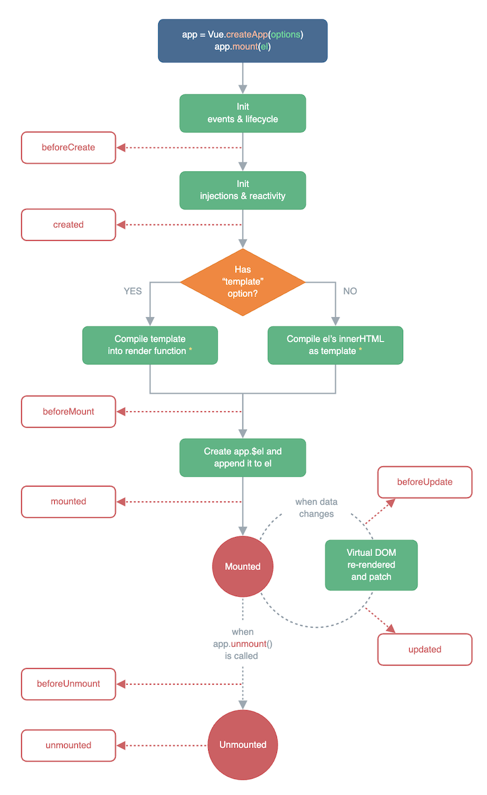

# VUE2 VUE3 面试题

## Vue computed 和 watch 区别

### 两者设计用途不同

- computed 用于产出二次处理之后的数据，如对于一个列表进行 filter 处理
- watch 用于监听数据变化（如 v-model 时，数据可能被动改变，需要监听才能拿到）

### computed 有缓存

- computed 有缓存，data 不变则缓存不失效
- methods 无缓存，实时计算

### 答案

- computed 就已有数据产出新数据，有缓存
- watch 监听已有数据

## Vue 组件通讯

### props / $emit

适用于父子组件。

- 父组件向子组件传递 props 和事件
- 子组件接收 props ，使用 `this.$emit` 调用事件

### 自定义事件

适用于兄弟组件，或者“距离”较远的组件。

常用 API

- 绑定事件 `event.on(key, fn)` 或 `event.once(key, fn)`
- 触发事件 `event.emit(key, data)`
- 解绑事件 `event.off(key, fn)`

Vue 版本的区别

- Vue 2.x 可以使用 Vue 实例作为自定义事件
- Vue 3.x 需要使用第三方的自定义事件，例如 https://www.npmjs.com/package/event-emitter

【注意】组件销毁时记得 `off` 事件，否则可能会造成内存泄漏

### $attrs

`$attrs` 存储是父组件中传递过来的，且未在 `props` 和 `emits` 中定义的属性和事件。<br>
相当于 `props` 和 `emits` 的一个补充。

继续向下级传递，可以使用 `v-bind="$attrs"`。这会在下级组件中渲染 DOM 属性，可以用 `inheritAttrs: false` 避免。

【注意】Vue3 中移除了 `$listeners` ，合并到了 `$attrs` 中。

### $parent

通过 `this.$parent` 可以获取父组件，并可以继续获取属性、调用方法等。

【注意】Vue3 中移除了 `$children` ，建议使用 `$refs`

### $refs

通过 `this.$refs.xxx` 可以获取某个子组件，前提是模板中要设置 `ref="xxx"`。

【注意】要在 `mounted` 中获取 `this.$refs` ，不能在 `created` 中获取。

### provide / inject

父子组件通讯方式非常多。如果是多层级的上下级组件通讯，可以使用 provide 和 inject 。<br>
在上级组件定一个 provide ，下级组件即可通过 inject 接收。

- 传递静态数据直接使用 `provide: { x: 10 }` 形式
- 传递组件数据需要使用 `provide() { return { x: this.xx } }` 形式，但做不到响应式
- 响应式需要借助 `computed` 来支持

### Vuex

Vuex 全局数据管理

### 答案

- 父子组件通讯
  - `props` `emits` `this.$emit`
  - `$attrs` （也可以通过 `v-bind="$attrs"` 向下级传递）
  - `$parent` `$refs`
- 多级组件上下级
  - `provide` `inject`
- 跨级、全局
  - 自定义事件
  - Vuex

## Vuex mutation action 区别

### 答案

- mutation
  - 建议原子操作，每次只修改一个数据，不要贪多
  - 必须是同步代码，方便查看 devTools 中的状态变化
- action
  - 可包含多个 mutation
  - 可以是异步操作

Vue 每个生命周期都做了什么

## Vue 生命周期



### beforeCreate

初始化一个空的 Vue 实例，`data` `methods` 等尚未被初始化，无法调用。

### created

Vue 实例初始化完成，`data` `methods` 都已初始化完成，可调用。<br>
但尚未开始渲染模板。

### beforeMount

编译模板，调用 `render` 函数生成 vdom ，但还没有开始渲染 DOM

### mounted

渲染 DOM 完成，页面更新。组件创建完成，开始进入运行阶段。

### beforeUpdate

在数据发生改变后，DOM 被更新之前被调用。这里适合在现有 DOM 将要被更新之前访问它，比如移除手动添加的事件监听器。

### updated

在数据更改导致的虚拟 DOM 重新渲染和更新完毕之后被调用。

注意，尽量不要在 `updated` 中继续修改数据，否则可能会触发死循环。

### onActivated

被 `keep-alive` 缓存的组件激活时调用。

### onDeactivated

被 `keep-alive` 缓存的组件停用时调用。

### beforeUnmount

组件进入销毁阶段。

卸载组件实例后调用，在这个阶段，实例仍然是完全正常的。<br>
移除、解绑一些全局事件、自定义事件，可以在此时操作。

### unmounted

卸载组件实例后调用。调用此钩子时，组件实例的所有指令都被解除绑定，所有事件侦听器都被移除，所有子组件实例被卸载。

---

### 连环问：如何正确的操作 DOM

`mounted` 和 `updated` 都不会保证所有子组件都挂载完成，如果想等待所有视图都渲染完成，需要使用 `$nextTick`

```js
mounted() {
  this.$nextTick(function () {
    // 仅在整个视图都被渲染之后才会运行的代码
  })
}
```

### 连环问：ajax 放在哪个生命周期合适？

一般有两个选择：`created` 和 `mounted` ，建议选择后者 `mounted` 。

执行速度

- 从理论上来说，放在 `created` 确实会快一些
- 但 ajax 是网络请求，其时间是主要的影响因素。从 `created` 到 `mounted` 是 JS 执行，速度非常快。
- 所以，两者在执行速度上不会有肉眼可见的差距

代码的阅读和理解

- 放在 `created` 却会带来一些沟通和理解成本，从代码的执行上来看，它会一边执行组件渲染，一边触发网络请求，并行
- 放在 `mounted` 就是等待 DOM 渲染完成再执行网络请求，串行，好理解

所以，综合来看，更建议选择 `mounted` 。

### 连环问：Composition API 生命周期有何不同

- `setup` 代替了 `beforeCreate` 和 `created`
- 生命周期换成了函数的形式，如 `mounted` -> `onMounted` 参考 https://v3.cn.vuejs.org/api/composition-api.html#%E7%94%9F%E5%91%BD%E5%91%A8%E6%9C%9F%E9%92%A9%E5%AD%90

```js
import { onUpdated, onMounted } from 'vue'

export default {
  setup() {
    onMounted(() => {
      console.log('mounted')
    })
    onUpdated(() => {
      console.log('updated')
    })
  },
}
```

## Vue-router 模式

### v4 的升级

Vue-router v4 升级之后，`mode: 'xxx'` 替换为 API 的形式，但功能是一样的

- `mode: 'hash'` 替换为 `createWebHashHistory()`
- `mode: 'history'` 替换为 `createWebHistory()`
- `mode: 'abstract'` 替换为 `createMemoryHistory()`

PS：个人感觉，叫 `memory` 比叫 `abstract` 更易理解，前者顾名思义，后者就过于抽象。

### hash

```js
// http://127.0.0.1:8881/hash.html?a=100&b=20#/aaa/bbb
location.protocol // 'http:'
location.hostname // '127.0.0.1'
location.host // '127.0.0.1:8881'
location.port // '8881'
location.pathname // '/hash.html'
location.search // '?a=100&b=20'
location.hash // '#/aaa/bbb'
```

hash 的特点

- 会触发页面跳转，可使用浏览器的“后退” “前进”
- 但不会刷新页面，支持 SPA 必须的特性
- hash 不会被提交到 server 端（因此刷新页面也会命中当前页面，让前端根据 hash 处理路由）

url 中的 hash ，是不会发送给 server 端的。前端 `onhashchange` 拿到自行处理。

```js
// 页面初次加载，获取 hash
document.addEventListener('DOMContentLoaded', () => {
  console.log('hash', location.hash)
})
// hash 变化，包括：
// a. JS 修改 url
// b. 手动修改 url 的 hash
// c. 浏览器前进、后退
window.onhashchange = (event) => {
  console.log('old url', event.oldURL)
  console.log('new url', event.newURL)

  console.log('hash', location.hash)
}
```

### H5 history API

常用的两个 API

- `history.pushState`
- `window.onpopstate`

页面刷新时，**服务端要做处理**，可参考[文档](https://router.vuejs.org/zh/guide/essentials/history-mode.html#%E5%90%8E%E7%AB%AF%E9%85%8D%E7%BD%AE%E4%BE%8B%E5%AD%90)。。即无论什么 url 访问 server ，都要返回该页面。

按照 url 规范，不同的 url 对应不同的资源，例如：

- `https://github.com/` server 返回首页
- `https://github.com/username/` server 返回用户页
- `https://github.com/username/project1/` server 返回项目页

但是用了 SPA 的前端路由，就改变了这一规则，假如 github 用了的话：

- `https://github.com/` server 返回首页
- `https://github.com/username/` server 返回首页，前端路由跳转到用户页
- `https://github.com/username/project1/` server 返回首页，前端路由跳转到项目页

所以，从开发者的实现角度来看，前端路由是一个违反规则的形式。
但是从不关心后端，只关心前端页面的用户，或者浏览器来看，更喜欢 `pushState` 这种方式。

代码参考 history-api.html

### 三种模式的区别

- hash - 使用 url hash 变化记录路由地址
- history - 使用 H5 history API 来改 url 记录路由地址
- abstract - 不修改 url ，路由地址在内存中，**但页面刷新会重新回到首页**。

## 你在实际工作中，做过哪些 Vue 优化？

### v-if 和 v-show

区别

- `v-if` 组件销毁/重建
- `v-show` 组件隐藏（切换 CSS `display`）

场景

- 一般情况下使用 `v-if` 即可，普通组件的销毁、渲染不会造成性能问题
- 如果组件创建时需要大量计算，或者大量渲染（如复杂的编辑器、表单、地图等），可以考虑 `v-show`

### v-for 使用 key

`key` 可以优化内部的 diff 算法。注意，遍历数组时 `key` 不要使用 `index` 。

```html
<ul>
  <!-- 而且，key 不要用 index -->
  <li v-for="(id, name) in list" :key="id">{{name}}</li>
</ul>
```

### computed 缓存

`computed` 可以缓存计算结果，`data` 不变则缓存不失效。

```js
export default {
    data() {
        return {
            msgList: [ ... ] // 消息列表
        }
    },
    computed: {
        // 未读消息的数量
        unreadCount() {
            return this.msgList.filter(m => m.read === false).length
        }
    }
}
```

### keep-alive

`<keep-alive>` 可以缓存子组件，只创建一次。通过 `activated` 和 `deactivated` 生命周期监听是否显示状态。<br>
代码参考 components/KeepAlive/index.vue

场景

- 局部频繁切换的组件，如 tabs
- 不可乱用 `<keep-alive>` ，缓存太多会占用大量内存，而且出问题不好 debug

### 异步组件

对于体积大的组件（如编辑器、表单、地图等）可以使用异步组件

- 拆包，需要时异步加载，不需要时不加载
- 减少 main 包的体积，页面首次加载更快

vue3 使用 `defineAsyncComponent` 加载异步组件，代码参考 components/AsyncComponent/index.vue

### 路由懒加载

对于一些补偿访问的路由，或者组件提交比较大的路由，可以使用路由懒加载。

```js
const routes = [
  {
    path: '/',
    name: 'Home',
    component: Home,
  },
  {
    path: '/about',
    name: 'About',
    // 路由懒加载
    component: () =>
      import(/* webpackChunkName: "about" */ '../views/About.vue'),
  },
]
```

### SSR

SSR 让网页访问速度更快，对 SEO 友好。

但 SSR 使用和调试成本高，不可乱用。例如，一个低代码项目（在线制作 H5 网页），toB 部分不可用 SSR ， toC 部分适合用 SSR 。

### 答案

- v-if 和 v-show
- v-for 使用 key
- computed 缓存
- keep-alive
- 异步组件
- 路由懒加载
- SSR

## 连环问：Vue 遇到过哪些坑？？？

全局事件、自定义事件要在组件销毁时解除绑定

- 内存泄漏风险
- 全局事件（如 `window.resize`）不解除，则会继续监听，而且组件再次创建时会重复绑定

Vue2.x 中，无法监听 data 属性的新增和删除，以及数组的部分修改 —— Vue3 不会有这个问题

- 新增 data 属性，需要用 `Vue.set`
- 删除 data 属性，需要用 `Vue.delete`
- 修改数组某一元素，不能 `arr[index] = value` ，要使用 `arr.splice` API 方式

路由切换时，页面会 scroll 到顶部。例如，在一个新闻列表页下滑到一定位置，点击进入详情页，在返回列表页，此时会 scroll 到顶部，并重新渲染列表页。所有的 SPA 都会有这个问题，并不仅仅是 Vue 。

- 在列表页缓存数据和 `scrollTop`
- 返回列表页时（用 Vue-router [导航守卫](https://router.vuejs.org/zh/guide/advanced/navigation-guards.html)，判断 `from`），使用缓存数据渲染页面，然后 `scrollTo(scrollTop)`

## Vue 错误监听

### window.onerror

可以监听当前页面所有的 JS 报错，jQuery 时代经常用。<br>
注意，全局只绑定一次即可。不要放在多次渲染的组件中，这样容易绑定多次。

```js
window.onerror = function (msg, source, line, column, error) {
  console.log('window.onerror---------', msg, source, line, column, error)
}
// 注意，如果用 window.addEventListener('error', event => {}) 参数不一样！！！
```

### errorCaptured 生命周期

会监听所有**下级组件**的错误。可以返回 `false` 阻止向上传播，因为可能会有多个上级节点都监听错误。

```js
errorCaptured(error, instance, info) {
    console.log('errorCaptured--------', error, instance, info)
}
```

### errorHandler

全局的错误监听，所有组件的报错都会汇总到这里来。PS：如果 `errorCaptured` 返回 `false` 则**不会**到这里。

```js
const app = createApp(App)
app.config.errorHandler = (error, instance, info) => {
  console.log('errorHandler--------', error, instance, info)
}
```

请注意，`errorHandler` 会阻止错误走向 `window.onerror`。

PS：还有 `warnHandler`

### 异步错误

组件内的异步错误 `errorHandler` 监听不到，还是需要 `window.onerror`

```js
mounted() {
    setTimeout(() => {
        throw new Error('setTimeout 报错')
    }, 1000)
},
```

### 答案

方式

- `errorCaptured` 监听下级组件的错误，可返回 `false` 阻止向上传播
- `errorHandler` 监听 Vue 全局错误
- `window.onerror` 监听其他的 JS 错误，如异步

建议：结合使用

- 一些重要的、复杂的、有运行风险的组件，可使用 `errorCaptured` 重点监听
- 然后用 `errorHandler` `window.onerror` 候补全局监听，避免意外情况

### 扩展

Promise 监听报错要使用 `window.onunhandledrejection`

## 谈一下你对 mvvm 原理的理解

1. 传统的 MVC 指的是,用户操作会请求服务端路由，路由会调用对应的控制器来处理,控制器会获取数
   据。将结果返回给前端,页面重新渲染
2. MVVM :传统的前端会将数据手动渲染到页面上, MVVM 模式不需要用户收到操作 dom 元素,将数据绑
   定到 viewModel 层上，会自动将数据渲染到页面中，视图变化会通知 viewModel 层 更新数据。
   ViewModel 就是我们 MVVM 模式中的桥梁.

## 请说一下 vue2 响应式数据的原理？

1. 核心点: Object.defineProperty
2. 默认 Vue 在初始化数据时，会给 data 中的属性使用 Object.defineProperty 重新定义所有属性,当页面取到对应属性时。会进行依赖收集（收集当前组件的 watcher） 如果属性发生变化会通知相关依赖进行更新操作。

```js
Object.defineProperty(obj, key, {
  enumerable: true,
  configurable: true,
  get: function reactiveGetter() {
    const value = getter ? getter.call(obj) : val
    if (Dep.target) {
      dep.depend() // ** 收集依赖     ** /
      if (childOb) {
        childOb.dep.depend()
        if (Array.isArray(value)) {
          dependArray(value)
        }
      }
    }
    return value
  },
  set: function reactiveSetter(newVal) {
    const value = getter ? getter.call(obj) : val
    if (newVal === value || (newVal !== newVal && value !== value)) {
      return
    }
    if (process.env.NODE_ENV !== 'production' && customSetter) {
      customSetter()
    }
    val = newVal
    childOb = !shallow && observe(newVal)
    dep.notify() /**通知相关依赖进行更新**/
  },
})
```

## vue2 中是如何检测数组变化?

1. 使用函数劫持的方式，重写了数组的方法
2. Vue 将 data 中的数组，进行了原型链重写。指向了自己定义的数组原型方法，这样当调用数组 api 时，可以通知依赖更新.如果数组中包含着引用类型。会对数组中的引用类型再次进行监控。


```js
const arrayProto = Array.prototype
export const arrayMethods = Object.create(arrayProto)
const methodsToPatch = [
  'push',
  'pop',
  'shift',
  'unshift',
  'splice',
  'sort',
  'reverse',
]
methodsToPatch.forEach(function (method) {
  // 重写原型方法
  const original = arrayProto[method] // 调用原数组的方法
  def(arrayMethods, method, function mutator(...args) {
    const result = original.apply(this, args)
    const ob = this.__ob__
    let inserted
    switch (method) {
      case 'push':
      case 'unshift':
        inserted = args
        break
      case 'splice':
        inserted = args.slice(2)
        break
    }
    if (inserted) ob.observeArray(inserted) // notify change
    ob.dep.notify() // 当调用数组方法后，手动通知视图更新
    return result
  })
})
this.observeArray(value) // 进行深度监控
```

## 为什么 vue2 采用异步渲染?

因为如果不采用异步更新，那么每次更新数据都会对当前组件进行重新渲染.所以为了性能考虑。 Vue 会在本轮数据更新后，再去异步更新视图


```js
update () {
   /* istanbul ignore else */
   if (this.lazy) {
     this.dirty = true
   } else if (this.sync) {
     this.run()
   } else {
     queueWatcher(this); // 当数据发生变化时会将watcher放到一个队列中批量更新
 }
}
export function queueWatcher (watcher: Watcher) {
 const id = watcher.id // 会对相同的watcher进行过滤
 if (has[id] == null) {
   has[id] = true
   if (!flushing) {
     queue.push(watcher)
   } else {
     let i = queue.length - 1
     while (i > index && queue[i].id > watcher.id) {
       i--
    }
     queue.splice(i + 1, 0, watcher)
 }
   // queue the flush
   if (!waiting) {
     waiting = true
     if (process.env.NODE_ENV !== 'production' && !config.async) {
       flushSchedulerQueue()
       return
    }
     nextTick(flushSchedulerQueue) // 调用nextTick方法     批量的进行更新
 }
}
}
```

## nextTick 实现原理?

nextTick 方法主要是使用了宏任务和微任务,定义了一个异步方法.多次调用 nextTick 会将方法存入队列中，通过这个异步方法清空当前队列。所以这个 nextTick 方法就是异步方法


```js
let timerFunc  // 会定义一个异步方法
if (typeof Promise !== 'undefined' && isNative(Promise)) {  // promise
 const p = Promise.resolve()
 timerFunc = () => {
   p.then(flushCallbacks)
   if (isIOS) setTimeout(noop)
}
 isUsingMicroTask = true
} else if (!isIE && typeof MutationObserver !== 'undefined' && ( //
MutationObserver
 isNative(MutationObserver) ||
 MutationObserver.toString() === '[object MutationObserverConstructor]'
)) {
 let counter = 1
 const observer = new MutationObserver(flushCallbacks)
 const textNode = document.createTextNode(String(counter))
 observer.observe(textNode, {
   characterData: true
})
 timerFunc = () => {
   counter = (counter + 1) % 2
   textNode.data = String(counter)
}
 isUsingMicroTask = true
} else if (typeof setImmediate !== 'undefined' ) { // setImmediate
 timerFunc = () => {
   setImmediate(flushCallbacks)
}
} else {
 timerFunc = () => {   // setTimeout
   setTimeout(flushCallbacks, 0)
}
}
// nextTick实现
export function nextTick (cb?: Function, ctx?: Object) {
 let _resolve
 callbacks.push(() => {
   if (cb) {
     try {
       cb.call(ctx)
     } catch (e) {
       handleError(e, ctx, 'nextTick')
    }
   } else if (_resolve) {
     _resolve(ctx)
 }
})
 if (!pending) {
   pending = true
   timerFunc()
}
}
```

## vue2 中的 Computed 的特点？

默认 computed 也是一个 watcher 是具备缓存的，只要当依赖的属性发生变化时才会更新视图

```js
function initComputed(vm: Component, computed: Object) {
  const watchers = (vm._computedWatchers = Object.create(null))
  const isSSR = isServerRendering()
  for (const key in computed) {
    const userDef = computed[key]
    const getter = typeof userDef === 'function' ? userDef : userDef.get
    if (!isSSR) {
      // create internal watcher for the computed property.
      watchers[key] = new Watcher(
        vm,
        getter || noop,
        noop,
        computedWatcherOptions
      )
    } // component-defined computed properties are already defined on the // component prototype. We only need to define computed properties defined // at instantiation here.
    if (!(key in vm)) {
      defineComputed(vm, key, userDef)
    } else if (process.env.NODE_ENV !== 'production') {
      if (key in vm.$data) {
        warn(`The computed property "${key}" is already defined in data.`, vm)
      } else if (vm.$options.props && key in vm.$options.props) {
        warn(`The computed property "${key}" is already defined as a prop.`, vm)
      }
    }
  }
}
function createComputedGetter(key) {
  return function computedGetter() {
    const watcher = this._computedWatchers && this._computedWatchers[key]
    if (watcher) {
      if (watcher.dirty) {
        // 如果依赖的值没发生变化,就不会重新求值
        watcher.evaluate()
      }
      if (Dep.target) {
        watcher.depend()
      }
      return watcher.value
    }
  }
}
```

## 何时需要使用 beforeDestroy

可能在当前页面中使用了 $on 方法，那需要在组件销毁前解绑。
清除自己定义的定时器
解除事件的绑定 scroll mousemove ....

## vue 中模板编译原理

将 template 转化成 render 函数

```js
function baseCompile(template: string, options: CompilerOptions) {
  const ast = parse(template.trim(), options) // 1.将模板转化成ast语法树
  if (options.optimize !== false) {
    // 2.优化树
    optimize(ast, options)
  }
  const code = generate(ast, options) // 3.生成树
  return {
    ast,
    render: code.render,
    staticRenderFns: code.staticRenderFns,
  }
}
```

```js
const ncname = `[a-zA-Z_][\\-\\.0-9_a-zA-Z]*`
const qnameCapture = `((?:${ncname}\\:)?${ncname})`
const startTagOpen = new RegExp(`^<${qnameCapture}`) // 标签开头的正则     捕获的内容是标签名
const endTag = new RegExp(`^<\\/${qnameCapture}[^>]*>`) // 匹配标签结尾的         </div>
const attribute =
  /^\s*([^\s"'<>\/=]+)(?:\s*(=)\s*(?:"([^"]*)"+|'([^']*)'+|([^\s"'=<>`]+)))?/ // 匹配属性的
const startTagClose = /^\s*(\/?)>/ // 匹配标签结束的         >
let root
let currentParent
let stack = []
function createASTElement(tagName, attrs) {
  return {
    tag: tagName,
    type: 1,
    children: [],
    attrs,
    parent: null,
  }
}
function start(tagName, attrs) {
  let element = createASTElement(tagName, attrs)
  if (!root) {
    root = element
  }
  currentParent = element
  stack.push(element)
}
function chars(text) {
  currentParent.children.push({
    type: 3,
    text,
  })
}
function end(tagName) {
  const element = stack[stack.length - 1]
  stack.length--
  currentParent = stack[stack.length - 1]
  if (currentParent) {
    element.parent = currentParent
    currentParent.children.push(element)
  }
}
function parseHTML(html) {
  while (html) {
    let textEnd = html.indexOf('<')
    if (textEnd == 0) {
      const startTagMatch = parseStartTag()
      if (startTagMatch) {
        start(startTagMatch.tagName, startTagMatch.attrs)
        continue
      }
      const endTagMatch = html.match(endTag)
      if (endTagMatch) {
        advance(endTagMatch[0].length)
        end(endTagMatch[1])
      }
    }
    let text
    if (textEnd >= 0) {
      text = html.substring(0, textEnd)
    }
    if (text) {
      advance(text.length)
      chars(text)
    }
  }
  function advance(n) {
    html = html.substring(n)
  }
  function parseStartTag() {
    const start = html.match(startTagOpen)
    if (start) {
      const match = {
        tagName: start[1],
        attrs: [],
      }
      advance(start[0].length)
      let attr, end
      while (
        !(end = html.match(startTagClose)) &&
        (attr = html.match(attribute))
      ) {
        advance(attr[0].length)
        match.attrs.push({ name: attr[1], value: attr[3] })
      }
      if (end) {
        advance(end[0].length)
        return match
      }
    }
  }
}
// 生成语法树
parseHTML(`<div id="container"><p>hello<span>zf</span></p></div>`)
function gen(node) {
  if (node.type == 1) {
    return generate(node)
  } else {
    return `_v(${JSON.stringify(node.text)})`
  }
}
function genChildren(el) {
  const children = el.children
  if (el.children) {
    return `[${children.map((c) => gen(c)).join(',')}]`
  } else {
    return false
  }
}
function genProps(attrs) {
  let str = ''
  for (let i = 0; i < attrs.length; i++) {
    let attr = attrs[i]
    str += `${attr.name}:${attr.value},`
  }
  return `{attrs:{${str.slice(0, -1)}}}`
}
function generate(el) {
  let children = genChildren(el)
  let code = `_c('${el.tag}'${el.attrs.length ? `,${genProps(el.attrs)}` : ''}${
    children ? `,${children}` : ''
  })`
  return code
}
// 根据语法树生成新的代码
let code = generate(root)
let render = `with(this){return ${code}}`
// 包装成函数
let renderFn = new Function(render)
console.log(renderFn.toString())
```

## Vue 中 v-if 和 V-show 的区别?

1. v-if 如果条件不成立不会渲染当前指令所在节点的 dom 元素
2. v-show 只是切换当前 dom 的显示或者隐藏

```js
const VueTemplateCompiler = require('vue-template-compiler')
let r1 = VueTemplateCompiler.compile(`<div v-if="true"><span v-for="i in 
3">hello</span></div>`)
/**
with(this) {
   return (true) ? _c('div', _l((3), function (i) { 
       return _c('span', [_v("hello")])
   }), 0) : _e() 
}
*/
```

```js
const VueTemplateCompiler = require('vue-template-compiler');
let r2 = VueTemplateCompiler.compile(`<div v-show="true"></div>`);
/**
with(this) {
   return _c('div', {
       directives: [{
           name: "show",
           rawName: "v-show",
           value: (true),
           expression: "true"
       }]
   })
}
*/
// v-show 操作的是样式         定义在platforms/web/runtime/directives/show.js
bind (el: any, { value }: VNodeDirective, vnode: VNodeWithData) {
   vnode = locateNode(vnode)
   const transition = vnode.data && vnode.data.transition
   const originalDisplay = el.__vOriginalDisplay =
     el.style.display === 'none' ? '' : el.style.display
   if (value && transition) {
     vnode.data.show = true
     enter(vnode, () => {
       el.style.display = originalDisplay
     })
   } else {
     el.style.display = value ? originalDisplay : 'none'
 }
}
```

## 为什么 V-for 和 v-if 不能连用

```js
const VueTemplateCompiler = require('vue-template-compiler')
let r1 = VueTemplateCompiler.compile(`<div v-if="false" v-for="i in 
3">hello</div>`)
/**
with(this) {
   return _l((3), function (i) {
       return (false) ? _c('div', [_v("hello")]) : _e() 
   })
} 
*/
console.log(r1.render)
```

v-for 会比 v-if 的优先级高一些,如果连用的话会把 v-if 给每个元素都添加一下,会造成性能问题

## 用 vnode 来描述一个 DOM 结构?

虚拟节点就是用一个对象来描述真实的 dom 元素

```js
function $createElement(tag, data, ...children) {
  let key = data.key
  delete data.key
  children = children.map((child) => {
    if (typeof child === 'object') {
      return child
    } else {
      return vnode(undefined, undefined, undefined, undefined, child)
    }
  })
  return vnode(tag, props, key, children)
}
export function vnode(tag, data, key, children, text) {
  return {
    tag, // 表示的是当前的标签名
    data, // 表示的是当前标签上的属性
    key, // 唯一表示用户可能传递
    children,
    text,
  }
}
```

## vue2 diff 算法的时间复杂度

两个树的完全的 diff 算法是一个时间复杂度为 o(n3),Vue 进行了优化:0(n3) 复杂的问题转换成 O(n)复杂的问题(只比较同级不考虑跨级问题)在前端当中 ，你很少会跨越层级地移动 Dom 元素。所以 Virtual Dom 只会对同一个层级的元素进行对比。

## 简述 Vue2 中 diff 算法原理

1. 先同级比较，在比较子节点
2. 先判断一方有儿子一方没儿子的情况
3. 比较都有儿子的情况
4. 递归比较子节点


## V-for 中为什么要用 key?

1. vue 中列表循环需加:key=“唯一标识” 唯一标识尽量是 item 里面 id 等，因为 vue 组件高度复用增加 Key 可以标识组件的唯一性，为了更好地区别各个组件 key 的作用主要是为了高效的更新虚拟 DOM。

2. key 主要用来做 dom diff 算法用的，diff 算法是同级比较，比较当前标签上的 key 还有它当前的标签名，如果 key 和标签名都一样时只是做了一个移动的操作，不会重新创建元素和删除元素。

3. 没有 key 的时候默认使用的是“就地复用”策略。如果数据项的顺序被改变，Vue 不是移动 Dom 元素来匹配数据项的改变，而是简单复用原来位置的每个元素。如果删除第一个元素，在进行比较时发现标签一样值不一样时，就会复用之前的位置，将新值直接放到该位置，以此类推，最后多出一个就会把最后一个删除掉。

4. 尽量不要使用索引值 index 作 key 值，一定要用唯一标识的值，如 id 等。因为若用数组索引 index 为 key，当向数组中指定位置插入一个新元素后，因为这时候会重新更新 index 索引，对应着后面的虚拟 DOM 的 key 值全部更新了，这个时候还是会做不必要的更新，就像没有加 key 一样，因此 index 虽然能够解决 key 不冲突的问题，但是并不能解决复用的情况。如果是静态数据，用索引号 index 做 key 值是没有问题的。

5. 标签名一样，key 一样这时候就会就地复用，如果标签名不一样，key 一样不会复用。

## 描述 vue2 组件渲染和更新过程

渲染组件时，会通过 vue.extend 方法构建子组件的构造函数，并进行实例化。最终手动调用$mount()进行挂载。更新组件时会进行 patchvnode 流程核心就是 diff 算法


## vue2 组件中的 data 为什么是一个函数?

同一个组件被复用多次，会创建多个实例。这些实例用的是同一个构造函数，如果 data 是一个对象的话。那么所有组件都共享了同一个对象。为了保证组件的数据独立性要求每个组件必须通过 data 函数返回一个对象作为组件的状态。

> 一个组件被使用多次，用的都是同一个构造函数。为了保证组件的不同的实例 data 不冲突，要求 data 必须是一个函数，这样组件间不会相互影响

## vue2 中事件绑定的原理

vue 的事件绑定分为两种一种是原生的事件绑定，还有一种是组件的事件绑定

1. 原生 dom 事件的绑定,采用的是 addEventListener 实现
2. 组件绑定事件采用的是 $on 方法

事件的编译原理

```js
let compiler = require('vue-template-compiler');
let r1 = compiler.compile('<div @click="fn()"></div>');
let r2 = compiler.compile('<my-component @click.native="fn" @click="fn1"></my-
component>');
console.log(r1); // {on:{click}}
console.log(r2); // {nativeOnOn:{click},on:{click}}  
```


## v-model 的实现原理及如何自定义

v-mode1 可以看成是 value+input 方法 的语法糖

```html
<el-checkbox :value="" @input=""></el-checkbox>
<el-checkbox v-model="check"></el-checkbox>
```

可以自己重新定义 v-model 的含义

```js
Vue.component('el-checkbox', {
  template: `<input type="checkbox" :checked="check" 
@change="$emit('change',$event.target.checked)">`,
  model: {
    prop: 'check', // 更改默认的value的名字
    event: 'change', // 更改默认的方法名
  },
  props: {
    check: Boolean,
  },
})
```

## .sync 修饰符的原理

```html
// 正常父传子：
<com1 :a="num" :b="num2"></com1>

// 加上sync之后父传子：
<com1 :a.sync="num" .b.sync="num2"></com1>

// 它等价于
<com1
  :a="num"
  @update:a="val=>num=val"
  :b="num2"
  @update:b="val=>num2=val"
></com1>

//
相当于多了一个事件监听，事件名是update:a，回调函数中，会把接收到的值赋值给属性绑定的数据项中。
```

## .sync 与 v-model 区别

相同点：都是语法糖，都可以实现父子组件中的数据的双向通信。
区别点：

- 格式不同。 v-model=“num”, :num.sync=“num”
- v-model： @input + value
- :num.sync: @update:num
- v-model 只能用一次；.sync 可以有多个。

## Vue 中 v-html 会导致哪些问题?

1. 可能会导致 xss 攻击
2. v-html 会替换掉标签内部的子元素

## vue 父子组件生命周期调用顺序

1. 加载渲染过程
   父 beforeCreate->父 created->父 beforeMount->子 beforeCreate->子 created->子 beforeMount->子 mounted->父 mounted

2. 子组件更新过程
   父 beforeUpdate->子 beforeUpdate->子 updated->父 updated

3. 父组件更新过程
   父 beforeUpdate->父 updated

4. 销毁过程
   父 beforeDestroy->子 beforeDestroy->子 destroyed->父 destroyed

## 为什么要使用异步组件 ?

如果组件功能多打包出的结果会变大，我可以采用异步的方式来加载组件。主要依赖 import() 这
个语法，可以实现文件的分割加载。

```js
components: {
  AddCustomerSchedule: (resolve) => import('../components/AddCustomer')
}
```

```js
export function  (
 Ctor: Class<Component> | Function | Object | void,
 data: ?VNodeData,
 context: Component,
 children: ?Array<VNode>,
 tag?: string
): VNode | Array<VNode> | void {
 // async component
 let asyncFactory
 if (isUndef(Ctor.cid)) {
   asyncFactory = Ctor
   Ctor = resolveAsyncComponent(asyncFactory, baseCtor) // 默认调用此函数时返回undefiend
   // 第二次渲染时Ctor不为undefined
   if (Ctor === undefined) {
     return createAsyncPlaceholder( // 渲染占位符     空虚拟节点
       asyncFactory,
       data,
       context,
       children,
       tag
    )
 }
}
}
function resolveAsyncComponent (
 factory: Function,
 baseCtor: Class<Component>
): Class<Component> | void {
 if (isDef(factory.resolved)) { // 3.在次渲染时可以拿到获取的最新组件
   return factory.resolved
}
 const resolve = once((res: Object | Class<Component>) => {
     factory.resolved = ensureCtor(res, baseCtor)
     if (!sync) {
       forceRender(true) //2. 强制更新视图重新渲染
     } else {
       owners.length = 0
    }
})
 const reject = once(reason => {
     if (isDef(factory.errorComp)) {
         factory.error = true
         forceRender(true)
    }
})
 const res = factory(resolve, reject)// 1.将resolve方法和reject方法传入，用户调用resolve方法后
 sync = false
 return factory.resolved
}
```

## 什么是插槽?

插槽（Slot）是 Vue 提出来的一个概念，正如名字一样，插槽用于决定将所携带的内容，插入到指定的某个位置，从而使模板分块，具有模块化的特质和更大的重用性。
插槽显不显示、怎样显示是由父组件来控制的，而插槽在哪里显示就由子组件来进行控制。

1. 单个插槽 slot 的基本使用

当子组件模板只有一个没有属性的插槽时， 父组件传入的整个内容片段将插入到插槽所在的 DOM 位置， 并替换掉插槽标签本身
子组件

```html
<template>
  <div>
    <a :href="url">
      <slot> 默认显示，父组件没有内容时候显示 </slot>
    </a>
  </div>
</template>

<script>
  export default {
    // 子组件
    name: 'childSlot1',
    props: ['url'],
  }
</script>
```

父组件

```html
<template>
  <div>
    <child-slot1 :url="url">
      <span>我是父组件传递进来的内容</span>
    </child-slot1>
  </div>
</template>

<script>
  import childSlot1 from './childSlot1'
  export default {
    // 父组件
    name: 'Index',
    data() {
      return {
        url: 'https://www.baidu.com',
      }
    },
    components: {
      childSlot1,
    },
  }
</script>
```

父组件中可以在子组件里面填入内容(也可以不填)，如上面 span 标签的内容！如果不填默认为子组件 slot 的内容

2. 具名插槽

solt 元素可以用一个特殊的特性 name 来进一步配置如何分发内容。 多个插槽可以有不同的名字。 这样可以将父组件模板中 slot 位置， 和子组件 slot 元素产生关联，便于插槽内容对应传递

子组件：定义 slot 标签，然后用 name 去定义不同的名字。

```html
<template>
  <div>
    <a :href="url">
      <div>
        <slot name="header"> 头部导航 </slot>
      </div>
      <div>
        <slot name="footer"> 尾部导航 </slot>
      </div>
    </a>
  </div>
</template>

<script>
  export default {
    // 子组件
    name: 'childSlot1',
    props: ['url'],
  }
</script>
```

父组件：在子组件里面填写 template，然后写上 v-slot,然后用名字区分来源于不同的插槽。

```html
<template>
  <div>
    <child-slot1 :url="url">
      <template v-slot:header>
        <span>父组件改变头部导航</span>
      </template>
      <template v-slot:footer>
        <span>父组件改变尾部导航</span>
      </template>
    </child-slot1>
  </div>
</template>

<script>
  import childSlot1 from './childSlot1'
  export default {
    // 父组件
    name: 'Index',
    data() {
      return {
        url: 'http://www.imooc.com',
      }
    },
    components: {
      childSlot1,
    },
  }
</script>
```

3. 作用域插槽

作用域插槽 使用场景： 由外部（父组件）指定子组件 template 中循环列表的结构，父组件可以获取子组件定义好的数据。
子组件

```html
<template>
  <div>
    <a :href="url">
      <slot :slotData="website"> {{website.subTitle}} </slot>
    </a>
  </div>
</template>

<script>
  export default {
    // 子组件
    name: 'childSlot1',
    props: ['url'],
    data() {
      return {
        website: {
          url: 'https://www.imooc.com',
          title: '慕课网',
          subTitle: '程序员的最爱学习网站',
        },
      }
    },
  }
</script>
```

父组件：

```html
<template>
  <div>
    <child-slot1 :url="url">
      <!-- slotProps的名字可以随便取 -->
      <template v-slot="slotProps"> {{slotProps.slotData.title}} </template>
    </child-slot1>
  </div>
</template>

<script>
  import childSlot1 from './childSlot1'
  export default {
    // 父组件
    name: 'Index',
    data() {
      return {
        url: 'http://www.baidu.com',
      }
    },
    components: {
      childSlot1,
    },
  }
</script>
```

## 谈谈你对 keep-alive 的了解？

keep-alive 可以实现组件的缓存，当组件切换时不会对当前组件进行卸载,常用的 2 个属性 include/exclude,2 个生命周期 activated,deactivated LRU 算法

## Vue 中常见性能优化

1. 不要将所有的数据都放在 data 中，data 中的数据都会增加 getter 和 setter，会收集对应的 watcher
2. vue 在 v-for 时给每项元素绑定事件需要用事件代理
3. SPA 页面采用 keep-alive 缓存组件
4. 拆分组件提高复用性、增加代码的可维护性,减少不必要的渲染
5. v-if 当值为 false 时内部指令不会执行,具有阻断功能，很多情况下使用 v-if 替代 v-show
6. key 保证唯一性(默认 vue 会采用就地复用策略)
7. object.freeze 冻结数据
8. 合理使用路由懒加载、异步组件
9. 尽量采用 runtime 运行时版本
10. 数据持久化的问题( 防抖、节流 )

## hash 路由和 history 路由区别

1. hash 路由在地址栏 URL 上有#，用 window.location.hash 读取。而 history 路由没有会好看一点

2. 我们进行回车刷新操作，hash 路由会加载到地址栏对应的页面，而 history 路由一般就 404 报错了（刷新是网络请求，没有后端准备时会报错）。

3. hash 路由支持低版本的浏览器，而 history 路由是 HTML5 新增的 API。

4. hash 的特点在于它虽然出现在了 URL 中，但是不包括在 http 请求中，所以对于后端是没有一点影响的，所以改变 hash 不会重新加载页面，所以这也是单页面应用的必备。

5. history 运用了浏览器的历史记录栈，之前有 back,forward,go 方法，之后在 HTML5 中新增了 pushState（）和 replaceState（）方法，它们提供了对历史记录进行修改的功能，不过在进行修改时，虽然改变了当前的 URL，但是浏览器不会马上向后端发送请求。

6. history 的这种模式需要后台配置支持。比如：当我们进行项目的主页的时候，一切正常，可以访问，但是当我们刷新页面或者直接访问路径的时候就会返回 404，那是因为在 history 模式下，只是动态的通过 js 操作 window.history 来改变浏览器地址栏里的路径，并没有发起 http 请求，但是当我直接在浏览器里输入这个地址的时候，就一定要对服务器发起 http 请求，但是这个目标在服务器上又不存在，所以会返回 404

## Vue-Router 中导航守卫有哪些 ?

1. 全局守卫

- 全局前置守卫：router.beforeEach（回调函数）：一般用来做鉴权（尽早完成登陆验证）

- 全局后置守卫：router.afterEach (回调函数)导航已经完成，设置网页标题等小任务

- 全局解析守卫：router.beforeResolve（回调函数） 在所有的组件内守卫和异步路由组件被解析之后

2. 路由的守卫

beforeEnter，这个守卫是配置在路由里边的

3. 组件内的守卫

- beforeRouteEnter

- beforeRouteUpdate 复用的组件执行的守卫，可以获取最新的数据

- beforeRouteLeave 拦截导航，防止误操作

4. 守卫的执行顺序

<1>导航被触发。

<2>在失活的组件里调用 beforeRouteLeave 守卫。

<3>调用全局的 beforeEach 守卫。

<4>在重用的组件里调用 beforeRouteUpdate 守卫 。

<5>在路由配置里调用 beforeEnter。

<6>解析异步路由组件。

<7>在被激活的组件里调用 beforeRouteEnter。

<8>调用全局的 beforeResolve 守卫 (2.5+)。

<9>导航被确认。

<10>调用全局的 afterEach 钩子。

<11>触发 DOM 更新。

<12>调用 beforeRouteEnter 守卫中传给 next 的回调函数，创建好的组件实例会作为回调函数的参数传入。
