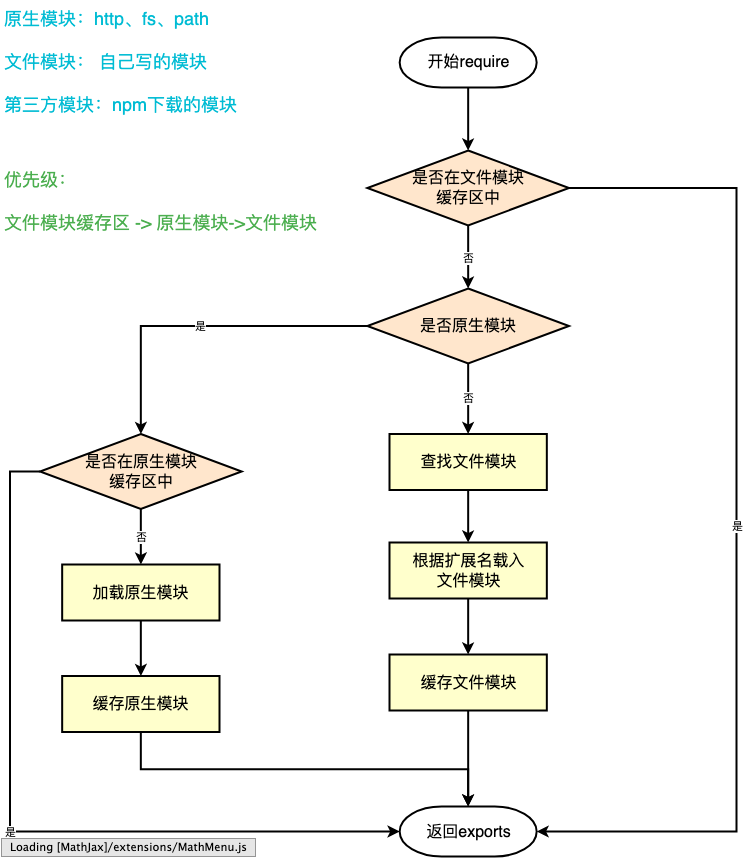
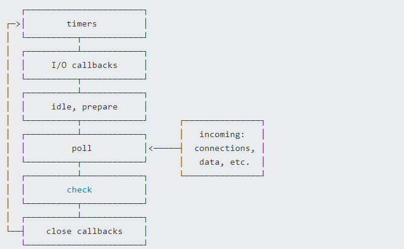
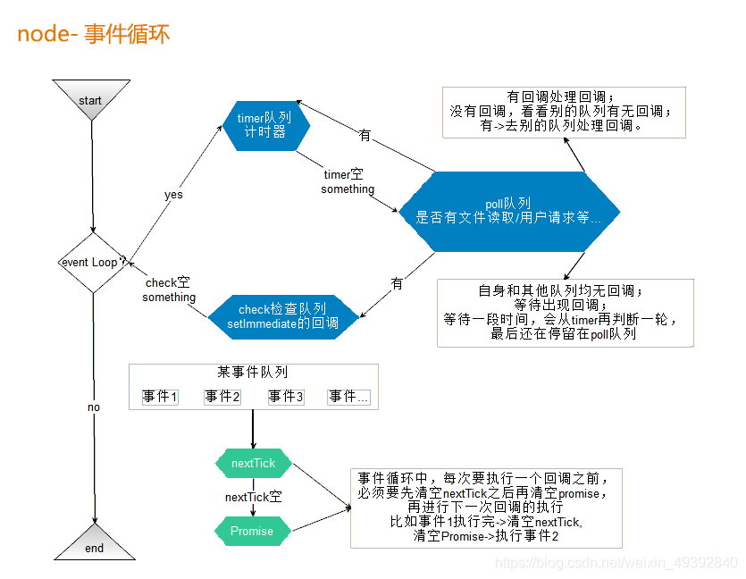

# nodejs 面试题

## nodejs 如何开启一个进程，进程之间如何通讯

### 进程 process 和线程 thread

进程，是操作系统进行资源调度和分配的基本单位，每个进程都拥有自己独立的内存区域（参考“堆栈模型”）。
一个进程无法直接访问另一个进程的内存数据，除非通过合法的进程通讯。

执行一个 nodejs 文件，即开启了一个进程，可以通过 `process.pid` 查看进程 id 。

线程，是操作系统进行运算调度的最小单位，线程是附属于进程的。一个进程可以包含多个线程（至少一个），多线程之间可共用进程的内存数据。<br>
如操作系统是一个工厂，进程就是一个车间，线程就是一个一个的工人。

JS 是单线程的，即执行 JS 时启动一个进程（如 JS 引擎，nodejs 等），然后其中再开启一个线程来执行。<br>
虽然单线程，JS 是基于事件驱动的，它不会阻塞执行，适合高并发的场景。

### 为何需要多进程

现代服务器都是多核 CPU ，适合同时处理多进程。即，一个进程无法充分利用 CPU 性能，进程数要等于 CPU 核数。

服务器一般内存比较大，但操作系统对于一个进程的内存分配是有上限的（2G），所以多进程才能充分利用服务器内存。

### nodejs 开启多进程

`child_process.fork` 可开启子进程执行单独的计算（源码参考 process-fork.js）

- `fork('xxx.js')` 开启一个子进程
- 使用 `send` 发送信息，使用 `on` 接收信息

`cluster.fork` 可针对当前代码，开启多个进程来执行（源码参考 cluster.js）

### 答案

- 可使用 `child_process.fork` 和 `cluster.fork` 开启子进程
- 使用 `send` `on` 传递消息

### 扩展：使用 PM2

nodejs 服务开启多进程、进程守护，可使用 [pm2](https://www.npmjs.com/package/pm2) ，不需要自己写。代码参考 koa2-code

- 全局安装 pm2 `yarn global add pm2`
- 增加 pm2 配置文件
- 修改 package.json scripts

## Node 文件查找的优先级与 Require 方法的文件查找策略

在 Node.js 中，模块化是一个重要的特性，它允许我们将代码组织成独立的、可重用的模块。模块之间的导入和导出通过 exports、module.exports 和 require 来实现。让我们来深入了解 Node 文件查找的优先级和 require 方法的文件查找策略。

### 模块查找规则

在理解模块查找优先级之前，我们先来了解 Node.js 是如何查找模块的。当使用 require 方法导入一个模块时，Node.js 将按照以下顺序查找模块：

1. 核心模块（Built-in Modules）：首先，Node.js 会尝试查找是否为内置模块，这些模块是 Node.js 自带的，无需安装即可使用，例如 http、fs 和 path 等。

2. 文件模块（File Modules）：如果模块不是核心模块，Node.js 将尝试查找文件模块。文件模块可以是相对路径的文件模块（以./或../开头）、绝对路径的文件模块（以/开头）或者目录作为模块（以./dirname 形式）。

3. 目录作为模块：如果使用了目录作为模块名，并且目录中包含一个 package.json 文件，则 Node.js 会查找该文件中指定的 main 入口文件。如果 package.json 不存在或者未指定 main，则 Node.js 会尝试加载目录下的 index.js 或 index.node 文件作为入口。

4. 非原生模块：如果以上查找都没有找到模块，Node.js 会将模块名解析为绝对路径，并按照一定的路径顺序在文件系统中查找 node_modules 目录。Node.js 会从当前模块的目录开始查找，然后逐级向上查找父目录的 node_modules，直到根目录。如果找到了 node_modules 目录，则进入其中查找对应模块。

### 模块查找优先级

模块查找的优先级如下图所示：



> 在进行模块查找时，Node.js 会将已经加载的模块缓存起来，以避免重复加载相同的模块，这也是优化加载速度的一种策略。

### 示例代码

为了更好地理解模块查找的过程，让我们通过一些示例代码来演示：

示例 1：导入核心模块

```js
const http = require('http')
// Node.js会直接从核心模块中加载http模块，无需进一步查找
```

示例 2：导入文件模块

假设我们有一个文件模块 myModule.js，它的内容如下：

```js
// myModule.js
exports.message = 'Hello, I am a file module.'
```

现在我们在另一个文件中导入这个模块：

```js
// app.js
const myModule = require('./myModule')
console.log(myModule.message)
```

在这个示例中，Node.js 会从当前文件所在目录查找 myModule.js 文件并加载它。

示例 3：导入目录作为模块

假设我们有一个目录 myPackage，它的结构如下：

```js
myPackage
  ├── package.json
  └── index.js
```

package.json 的内容如下：

```js
{
  "name": "my-package",
  "main": "index.js"
}
```

index.js 的内容如下：

```js
// index.js
exports.greet = 'Hello, I am a package module.'
```

现在我们在另一个文件中导入这个目录作为模块：

```js
// app.js
const myPackage = require('./myPackage')
console.log(myPackage.greet)
```

在这个示例中，Node.js 会先查找 myPackage 目录下的 package.json，然后根据其中指定的 main 入口文件 index.js 来加载模块。

示例 4：导入非原生模块

假设我们在项目中安装了一个第三方模块 lodash，现在我们在文件中导入它：

```js
const _ = require('lodash')
// Node.js会按照查找规则，从当前目录开始向上级目录查找node_modules，直到找到lodash模块
```

## 说说对 Node 中的 process 的理解？有哪些常用方法？

### 简介

process 对象是 Node.js 中的全局变量，它提供了有关当前 Node.js 进程的信息并允许对其进行控制。通过 process 对象，我们可以获取进程的环境变量、命令行参数，控制进程的行为以及与其他进程进行通信。

### 常用属性

1. process.env

> process.env 是一个包含用户环境信息的对象。它可以用于获取环境变量的值，例如获取不同环境下的配置信息。比如我们经常使用 process.env.NODE_ENV 来区分开发环境和生产环境。

2. process.argv

> process.argv 是一个包含命令行参数的数组。当通过命令行执行 Node 脚本时，process.argv 会获取命令行传入的参数。数组的第一个元素是 Node 的路径，第二个元素是脚本文件的路径，后续元素是真正的命令行参数。我们可以通过解析 process.argv 来获取传入的命令行参数。

```js
// 示例：获取命令行传入的参数
const args = process.argv.slice(2)
console.log(args)
```

3. process.cwd()

> process.cwd()方法返回当前 Node 进程执行的目录。在不同的操作中执行 Node 脚本时，其工作目录可能会不同。通过 process.cwd()可以获取当前脚本执行的目录，便于处理文件路径。

```js
// 示例：获取当前进程工作目录
console.log(process.cwd())
```

4. process.pid

> process.pid 属性返回当前进程的 ID（PID）。PID 是操作系统中用于标识进程的唯一值。

```js
// 示例：获取当前进程ID
console.log(process.pid)
```

5. process.platform

> process.platform 属性返回当前进程运行的操作系统平台，如'win32'、'linux'等。

```js
// 示例：获取当前操作系统平台
console.log(process.platform)
```

6. process.uptime()

> process.uptime()方法返回当前进程已运行的时间，单位为秒。例如，可以使用 pm2 来守护进程并获取其运行时间。

### 常用方法

1. process.nextTick()

process.nextTick()方法将回调函数放在当前执行栈的底部，以便在下一个事件循环中执行。这个方法的优先级比 setTimeout()和 setImmediate()更高。它通常用于确保回调函数在当前操作完成后尽快执行，例如在 I/O 操作之后处理数据。

```js
// 示例：使用process.nextTick()确保回调函数尽快执行
function foo() {
  console.log('foo')
}

process.nextTick(foo)
console.log('bar')
```

输出结果为：bar、foo。

2. process.on(event, callback)

process.on()方法用于监听 Node 进程上的不同事件。常见的事件包括 uncaughtException（捕获未捕获的异常）和 exit（进程退出）等。我们可以通过监听这些事件来处理异常情况或在进程退出时执行一些清理操作。

```js
// 示例：捕获未捕获的异常并处理
process.on('uncaughtException', (err) => {
  console.error('Caught exception:', err)
})
```

## Node 性能如何进行监控以及优化？

### 什么是 Node 性能监控？

Node 作为一门服务端语言，性能方面尤为重要。在监控 Node 性能时，需要关注以下指标：

- CPU 占用率：CPU 负载和使用率，反映系统 CPU 繁忙程度。
- 内存占用率：监控 Node 进程的内存使用情况，避免内存泄漏和过度消耗。
- 磁盘 I/O：监控硬盘的读写操作，避免 I/O 瓶颈影响性能。
- 网络：监控网络流量，确保网络连接稳定。

### 如何监控 Node 性能？

1. 使用 Node.js 内置工具

Node.js 内置了一些工具和模块，可以用于监控和分析 Node 应用的性能。其中最常用的工具是 util、perf_hooks 和 v8 模块。

- util: 提供了一些实用函数，包括 util.promisify 用于将回调函数转换为 Promise 形式，方便异步编程。
- perf_hooks: 是一个性能度量和监控的工具，提供了 performance 和 performanceObserver 等 API，可以用于测量 Node 应用的性能指标。
- v8: 提供了许多 V8 引擎的信息和统计数据，可以通过 v8.getHeapStatistics()来获取堆内存使用情况。

```js
// 使用util.promisify将回调函数转换为Promise形式
const util = require('util')
const fs = require('fs')
const readFileAsync = util.promisify(fs.readFile)

// 使用perf_hooks测量函数执行时间
const { performance } = require('perf_hooks')

async function readLargeFile() {
  const start = performance.now()
  const data = await readFileAsync(__dirname + '/large-file.txt')
  const end = performance.now()
  console.log(`读取文件耗时: ${end - start} 毫秒`)
  return data
}

readLargeFile()
```

### 使用开源监控工具

除了 Node.js 内置的工具，还有许多优秀的开源监控工具可供选择。这些工具可以帮助我们更全面地监控 Node 应用的性能和状态。

- PM2：是一个成熟的 Node.js 进程管理器，提供了丰富的监控和管理功能，包括 CPU 和内存监控、进程状态查看、错误日志记录等。
- New Relic：是一款功能强大的应用性能监控工具，支持多种语言和平台，提供实时性能数据和报告，帮助定位性能问题。
- AppDynamics：是一种全栈的应用性能管理解决方案，可监控分布式应用、云基础架构和网络性能。

### 自定义监控指标

除了使用现有的监控工具，有时候我们需要根据应用的具体需求自定义监控指标。这可以通过日志记录、指标上报等方式实现。

```js
// 使用日志记录自定义监控指标
const fs = require('fs')
const http = require('http')

function logMetrics(metric) {
  fs.appendFile(
    'metrics.log',
    `${new Date().toISOString()} - ${metric}\n`,
    (err) => {
      if (err) {
        console.error('写入日志失败', err)
      }
    }
  )
}

// 读取大文件并返回
http
  .createServer((req, res) => {
    const start = process.hrtime.bigint()
    const buffer = fs.readFileSync(__dirname + '/large-file.txt')
    const end = process.hrtime.bigint()
    const duration = Number(end - start) / 1e6 // 转换为毫秒
    logMetrics(`读取文件耗时: ${duration} 毫秒`)
    res.end(buffer)
  })
  .listen(3000)
```

### 如何优化 Node 性能？

1. 使用异步操作
   Node.js 的异步非阻塞特性是其高性能的重要原因之一。在编写 Node 应用时，应尽可能使用异步操作，避免阻塞事件循环

```js
// 使用异步操作优化性能
const http = require('http')
const fs = require('fs')

http
  .createServer((req, res) => {
    fs.readFile(__dirname + '/large-file.txt', (err, data) => {
      if (err) {
        console.error('读取文件失败', err)
        res.statusCode = 500
        res.end('读取文件失败')
      } else {
        res.end(data)
      }
    })
  })
  .listen(3000)
```

2. 内存管理优化

Node.js 中的内存管理是关键性能优化的一部分。合理使用内存可以减少垃圾回收的频率，提高性能。

- 使用对象池：通过重复使用对象，避免频繁的对象创建和销毁，减少内存开销。
- 控制内存使用：限制单个请求或任务的内存使用，防止出现内存泄漏和堆栈溢出。

```js
// 使用对象池优化内存管理
const fs = require('fs')
const http = require('http')

const bufferPool = []

function createBuffer() {
  return fs.readFileSync(__dirname + '/large-file.txt')
}

http
  .createServer((req, res) => {
    let buffer = bufferPool.pop()
    if (!buffer) {
      buffer = createBuffer()
    }
    res.end(buffer)
    bufferPool.push(buffer)
  })
  .listen(3000)
```

3. 使用缓存
   缓存是提高 Node 应用性能的有效方式之一。可以使用内存缓存（如 Redis、Memcached）或本地缓存（如 Node 缓存模块）来存储经常使用的数据，减少重复计算和查询。

```js
// 使用内存缓存优化性能
const http = require('http')
const fs = require('fs')
const NodeCache = require('node-cache')

const cache = new NodeCache()

http
  .createServer((req, res) => {
    const key = 'large-file-data'
    let data = cache.get(key)
    if (!data) {
      data = fs.readFileSync(__dirname + '/large-file.txt')
      cache.set(key, data)
    }
    res.end(data)
  })
  .listen(3000)
```

## 如果让你来设计一个分页功能，你会怎么设计？前后端如何交互？

### 什么是分页功能

在我们进行数据查询时，如果数据量很大，例如几万条数据，将其全部显示在一页上显然不友好。这时候我们需要采用分页显示的形式，每次只显示一部分数据，如每页显示 10 条数据。

实现分页功能，实际上就是从结果集中截取出第 M~N 条记录进行显示。

### 如何实现分页功能

- 后端实现
  后端需要返回一些必要的分页信息给前端，例如总的数据量、总页数、当前页数、当前页的数据。

首先，前端向后端发送目标的页码 page 以及每页显示的数据数量 pageSize。后端根据这些参数确定每页显示数据的起始位置 start，公式为：

```js
const start = (page - 1) * pageSize
```

然后，利用数据库的 limit 和 OFFSET 关键字进行分页查询：

```sql
const sql = `SELECT * FROM record LIMIT ${pageSize} OFFSET ${start};`;
```

其中，LIMIT 表示每页显示的数据条数，OFFSET 表示数据的偏移量。

另外，还需要查询数据库得到总的数据量，用于计算总页数：

```sql
SELECT COUNT(*) FROM record;
```

最后，后端将获取的总数据量、总页数、当前页数、当前页的数据发送给前端。

- 前端实现
  前端需要发送请求给后端，传递目标页码 page 和每页显示数据的数量 pageSize。默认情况下，每次取 10 条数据。

### 代码实现

```js
const express = require('express')
const mysql = require('mysql')
const app = express()

const pool = mysql.createPool({
  host: 'localhost',
  user: 'your_mysql_username',
  password: 'your_mysql_password',
  database: 'your_database_name',
})

app.get('/api', (req, res) => {
  const page = parseInt(req.query.page) || 1
  const pageSize = parseInt(req.query.pageSize) || 10
  const start = (page - 1) * pageSize

  const sql = `SELECT * FROM record LIMIT ${pageSize} OFFSET ${start};`

  pool.getConnection((err, connection) => {
    if (err) {
      console.error('Error getting database connection: ', err)
      return res.status(500).json({ error: 'Internal server error' })
    }

    connection.query(sql, (err, results) => {
      connection.release()

      if (err) {
        console.error('Error executing SQL query: ', err)
        return res.status(500).json({ error: 'Internal server error' })
      }

      // 获取总数据量
      const countSql = 'SELECT COUNT(*) as total FROM record;'
      connection.query(countSql, (err, countResults) => {
        if (err) {
          console.error('Error executing count SQL query: ', err)
          return res.status(500).json({ error: 'Internal server error' })
        }

        const totalCount = countResults[0].total
        const totalPages = Math.ceil(totalCount / pageSize)

        return res.status(200).json({
          totalCount,
          totalPages,
          currentPage: page,
          data: results,
        })
      })
    })
  })
})

const PORT = 3000
app.listen(PORT, () => {
  console.log(`Server started on port ${PORT}`)
})
```

在上面的代码中，我们使用了 express 库和 mysql 库来实现服务器和数据库的交互。首先，获取前端传递的目标页码 page 和每页显示数据数量 pageSize，然后根据这些参数构造 SQL 语句进行分页查询。同时，还查询数据库得到总数据量，用于计算总页数。最后，将总数据量、总页数、当前页数、当前页的数据发送给前端。

## 说说你对 Node.js 的理解？优缺点？应用场景？

### Node.js 的概述

Node.js 是一个开源且跨平台的 JavaScript 运行时环境，它在浏览器外运行 V8 JavaScript 引擎（Google Chrome 的内核），利用事件驱动、非阻塞和异步输入输出模型等技术来提高性能，使得 JavaScript 可以用于服务器端开发。Node.js 采用非阻塞型 I/O 机制，在处理 I/O 操作时不会阻塞进程，而是通过事件通知的方式处理操作结果。这种机制使得 Node.js 在处理高并发场景时表现优秀。

1. 非阻塞异步

Node.js 采用了非阻塞型 I/O 机制，在执行 I/O 操作时不会造成阻塞，当操作完成后通过回调函数以事件的形式通知执行结果。这样可以提高程序的执行效率，使得在执行高并发任务时表现出色。

2. 事件驱动

Node.js 使用事件驱动的编程模型。当有新的请求进来时，请求会被压入一个事件队列中，然后通过事件循环来检测队列中的事件状态变化，一旦有状态变化，就会执行对应的回调函数来处理事件。这使得 Node.js 能够高效处理 I/O 密集型应用。

### Node.js 的优缺点

优点

- 处理高并发场景性能更佳：Node.js 适用于处理大量并发请求的场景，由于其非阻塞 I/O 和事件驱动模型，能够高效地处理并发请求。
- 适合 I/O 密集型应用：Node.js 擅长处理 I/O 密集型应用，其执行效率仍然较高，即使在运行极限时，CPU 占用率仍然较低。
- 轻量快速：Node.js 采用 V8 引擎作为底层，使得其执行速度快，且具有较小的内存占用。
  缺点
- 不适合 CPU 密集型应用：由于 Node.js 是单线程的，如果应用程序中有大量计算密集型任务，会导致阻塞，影响整个应用的性能。
- 单线程：Node.js 采用单线程事件循环，虽然能够高效处理 I/O 密集型应用，但是无法充分利用多核 CPU，不能充分发挥多核处理器的优势。
- 可靠性低：由于 Node.js 是单线程的，一旦某个环节崩溃，整个系统都会崩溃，可靠性较低。

### Node.js 的应用场景

Node.js 的应用场景主要分为以下几个类别：

1. Web 应用程序：对于高并发的网络应用程序，如用户表单收集系统、后台管理系统、实时交互系统、考试系统等，Node.js 表现优越。
2. 多人联网游戏：基于 Web、Canvas 等技术的多人联网游戏能够充分利用 Node.js 的高并发特性。
3. 实时聊天和直播：基于 Web 的多人实时聊天客户端、聊天室、图文直播等应用。
4. 单页面应用程序：对于单页面应用程序，Node.js 能够处理前端与后端的数据交互，提供高效的 API 服务。
5. 数据库操作和 API 服务：Node.js 可以用于操作数据库，并为前端和移动端提供基于 JSON 的 API 服务。

虽然 Node.js 在上述场景中表现优秀，但在选择使用 Node.js 时，需要根据具体的业务需求和技术要求来判断其适用性。

## 说说对中间件概念的理解，如何封装 node 中间件？

### 中间件概念

中间件（Middleware）是介于应用系统和系统软件之间的一类软件，它使用系统软件所提供的基础服务（功能），衔接网络上应用系统的各个部分或不同的应用，能够达到资源共享、功能共享的目的。

在 Node.js 中，中间件主要是指封装 HTTP 请求细节处理的方法。例如在 Express、Koa 等 Web 框架中，中间件的本质为一个回调函数，参数包含请求对象、响应对象和执行下一个中间件的函数。在这些中间件函数中，我们可以执行业务逻辑代码，修改请求和响应对象，返回响应数据等操作。

### 封装中间件

Token 校验中间件

```js
// token校验中间件
module.exports = (options) => async (ctx, next) {
  try {
    // 获取token
    const token = ctx.header.authorization;
    if (token) {
      try {
          // 使用verify函数验证token，并获取用户相关信息
          await verify(token);
      } catch (err) {
        console.log(err);
      }
    }
    // 进入下一个中间件
    await next();
  } catch (err) {
    console.log(err);
  }
}
```

日志中间件

```js
const fs = require('fs')

// 日志中间件
module.exports = (options) => async (ctx, next) => {
  const startTime = Date.now()
  const requestTime = new Date()
  await next()
  const ms = Date.now() - startTime
  let logEntry = `${ctx.request.ip} -- ${requestTime} -- ${ctx.method} -- ${ctx.url} -- ${ms}ms`
  // 输出日志到文件
  fs.appendFileSync('./log.txt', logEntry + '\n')
}
```

Koa-bodyparser 中间件简单实现

```js
// 自定义koa-bodyparser中间件
const querystring = require('querystring')

module.exports = function bodyParser() {
  return async (ctx, next) => {
    await new Promise((resolve, reject) => {
      // 存储数据的数组
      let dataArr = []

      // 接收数据
      ctx.req.on('data', (data) => dataArr.push(data))

      // 整合数据并使用 Promise 成功
      ctx.req.on('end', () => {
        // 获取请求数据的类型 json 或表单
        let contentType = ctx.get('Content-Type')

        // 获取数据 Buffer 格式
        let data = Buffer.concat(dataArr).toString()

        if (contentType === 'application/x-www-form-urlencoded') {
          // 如果是表单提交，则将查询字符串转换成对象赋值给 ctx.request.body
          ctx.request.body = querystring.parse(data)
        } else if (contentType === 'applaction/json') {
          // 如果是json，则将字符串格式的对象转换成对象赋值给 ctx.request.body
          ctx.request.body = JSON.parse(data)
        }

        // 执行成功的回调
        resolve()
      })
    })

    // 继续向下执行
    await next()
  }
}
```

Koa-static 中间件简单实现

```js
const fs = require('fs')
const path = require('path')
const mime = require('mime')
const { promisify } = require('util')

// 将 stat 和 access 转换成 Promise
const stat = promisify(fs.stat)
const access = promisify(fs.access)

module.exports = function (dir) {
  return async (ctx, next) => {
    // 将访问的路由处理成绝对路径，这里要使用 join 因为有可能是 /
    let realPath = path.join(dir, ctx.path)

    try {
      // 获取 stat 对象
      let statObj = await stat(realPath)

      // 如果是文件，则设置文件类型并直接响应内容，否则当作文件夹寻找 index.html
      if (statObj.isFile()) {
        ctx.set('Content-Type', `${mime.getType()};charset=utf8`)
        ctx.body = fs.createReadStream(realPath)
      } else {
        let filename = path.join(realPath, 'index.html')

        // 如果不存在该文件则执行 catch 中的 next 交给其他中间件处理
        await access(filename)

        // 存在设置文件类型并响应内容
        ctx.set('Content-Type', 'text/html;charset=utf8')
        ctx.body = fs.createReadStream(filename)
      }
    } catch (e) {
      await next()
    }
  }
}
```

## 如何实现 jwt 鉴权机制？说说你的思路

### JWT 简介

JSON Web Token（JWT）是一种用于在用户和服务器之间传递安全可靠信息的字符串书写规范。它由三部分组成：头部（Header）、载荷（Payload）、签名（Signature），并以.进行拼接。JWT 在前后端分离的开发中常用于身份验证。

1. 头部（Header）

头部指定使用的加密算法，一般使用 HMAC SHA256。头部信息经过 Base64 编码，例如：

```js
{ "alg": "HS256", "typ": "JWT" }
```

编码后为：

```js
eyJhbGciOiJIUzI1NiIsInR5cCI6IkpXVCJ9
```

2. 载荷（Payload）

载荷用于存放实际的内容，例如用户的 ID 和名称，还可以设置过期时间等信息。载荷信息也经过 Base64 编码，例如：

```json
{
  "sub": "1234567890",
  "name": "John Doe",
  "iat": 1516239022
}
```

编码后为：

```js
eyJzdWIiOiIxMjM0NTY3ODkwIiwibmFtZSI6IkpvaG4gRG9lIiwiaWF0IjoxNTE2MjM5MDIyfQ
```

3. 签名（Signature）

签名是对头部和载荷进行签名，使用秘钥对数据进行加密。签名可以确保数据在传输过程中没有被篡改。

### 实现 JWT 鉴权机制

1. 生成 Token
   使用第三方库 jsonwebtoken 来生成 JWT Token。在用户登录成功后，颁发 Token 作为后续接口访问的凭证。

```js
const crypto = require('crypto')
const jwt = require('jsonwebtoken')

// 用户列表（应该使用数据库存储，这里仅作演示）
let userList = []

class UserController {
  static async login(ctx) {
    const data = ctx.request.body
    if (!data.name || !data.password) {
      return (ctx.body = {
        code: '000002',
        message: '参数不合法',
      })
    }
    const result = userList.find(
      (item) =>
        item.name === data.name &&
        item.password ===
          crypto.createHash('md5').update(data.password).digest('hex')
    )
    if (result) {
      const token = jwt.sign(
        {
          name: result.name,
        },
        'test_token', // 密钥
        { expiresIn: 60 * 60 } // 过期时间：60 * 60秒
      )
      return (ctx.body = {
        code: '0',
        message: '登录成功',
        data: {
          token,
        },
      })
    } else {
      return (ctx.body = {
        code: '000002',
        message: '用户名或密码错误',
      })
    }
  }
}
```

前端接收到 Token 后，通常会使用 localStorage 进行缓存，并将 Token 放在 HTTP 请求头的 Authorization 字段中。注意在 Authorization 字段中加上 Bearer 前缀，后面跟一个空格。

```js
axios.interceptors.request.use((config) => {
  const token = localStorage.getItem('token')
  config.headers.common['Authorization'] = 'Bearer ' + token // 注意这里的Authorization
  return config
})
```

2. 校验 Token
   使用 koa-jwt 中间件进行 Token 验证，配置白名单（接口白名单不需要校验）。

```js
const koajwt = require('koa-jwt')

app.use(
  koajwt({
    secret: 'test_token', // 密钥，与签发时保持一致
  }).unless({
    path: [/\/api\/register/, /\/api\/login/], // 接口白名单
  })
)
```

通过中间件校验后，可以在后续路由中获取用户信息。

```js
router.get('/api/userInfo', async (ctx, next) => {
  const authorization = ctx.header.authorization
  const token = authorization.replace('Bearer ', '')
  const result = jwt.verify(token, 'test_token')
  ctx.body = result
})
```

优点：

- JSON 具有通用性，可跨语言使用。
- JWT 结构简单，字节占用小，便于传输。
- 服务器无需保存会话信息，容易进行水平扩展。
- 一处生成，多处使用，可解决分布式系统中的单点登录问题。
- 可防护 CSRF 攻击。

缺点：

- 载荷部分仅进行简单编码，只能存储逻辑必需的非敏感信息。
- 需要保护好加密密钥，一旦泄露后果严重。
- 为避免 Token 被劫持，建议使用 HTTPS 协议保护通信安全。

## Node.js 中有哪些全局对象？

### 什么是全局对象

在浏览器 JavaScript 中，通常 window 是全局对象，而在 Node.js 中，全局对象是 global。

在 Node.js 里，不能在最外层定义一个变量，因为所有的用户代码都是当前模块的，只在当前模块里可用，但可以通过 exports 对象将变量传递给模块外部。

在 Node.js 中，用 var 声明的变量并不属于全局的变量，它们只在当前模块生效。真正的全局变量是挂载在 global 对象上的属性。

像上述的 global 全局对象则在全局作用域中，任何全局变量、函数、对象都是该对象的一个属性值。

### 哪些是全局对象

我们可以将全局对象分为两类：

- 真正的全局对象
- 模块级别的全局变量

真正的全局对象
下面给出一些常见的真正的全局对象：

- Class: Buffer
- process
- console
- clearInterval、setInterval
- clearTimeout、setTimeout
- global

### 模块级别的全局变量

1. `__dirname`

获取当前文件所在的路径，不包括后续的文件名。

```js
console.log(__dirname)
// 输出: /Users/mjr
```

2. `__filename`

获取当前文件的路径和文件名，包括后续的文件名。

```js
console.log(__filename)
// 输出: /Users/mjr/example.js
```

3. exports

exports 对象用于指定一个模块所导出的内容，即可以通过 require() 访问的内容。

```js
exports.name = 'John Doe'
exports.age = 30
exports.sayHello = function () {
  console.log('Hello')
}
```

4. module

module 是对当前模块的引用。通过 module.exports 用于指定一个模块所导出的内容，即可以通过 require() 访问的内容。

5. require

require() 函数用于引入模块、 JSON、或本地文件。可以使用相对路径引入本地模块或 JSON 文件，路径会根据 `__dirname` 定义的目录名或当前工作目录进行处理。

```js
const myModule = require('./myModule')
```

## 说说对 Node 中的 fs 模块的理解? 有哪些常用方法

### 什么是 fs 模块？

在 Node.js 中，fs（filesystem）模块提供了本地文件的读写能力，它基本上是对 POSIX 文件操作命令的简单包装。通过 fs 模块，我们可以对文件进行读取、写入、追加写入、拷贝等操作。

要使用 fs 模块，我们首先需要导入该模块，如下：

```js
const fs = require('fs')
```

该模块对所有文件系统操作提供了异步（不具有 sync 后缀）和同步（具有 sync 后缀）两种操作方式，供开发者根据需求进行选择。

### 文件相关知识

在使用 fs 模块前，有几个文件相关的概念需要了解：

1. 权限位 mode

权限位用于对文件的所有者、文件所属组和其他用户进行权限分配。其中，类型又分成读、写和执行，具备权限位 4、2、1，不具备权限为 0。

如在 Linux 系统中，我们可以通过 ls -l 命令查看文件的权限位：

```js
drwxr-xr-x 1 PandaShen 197121 0 Jun 28 14:41 core
-rw-r--r-- 1 PandaShen 197121 293 Jun 23 17:44 index.md
```

在开头的十位中，d 表示文件夹，-表示文件，后九位表示当前用户、用户所属组和其他用户的权限位，按每三位划分，分别代表读（r）、写（w）和执行（x），-表示没有当前位对应的权限。

2. 标识位 flag

标识位代表对文件的操作方式，如可读、可写、即可读又可写等等，常用的标识位如下：

- r 读取文件，如果文件不存在则抛出异常。
- r+ 读取并写入文件，如果文件不存在则抛出异常。
- rs 读取并写入文件，指示操作系统绕开本地文件系统缓存。
- w 写入文件，文件不存在会被创建，存在则清空后写入。
- wx 写入文件，排它方式打开。
- w+ 读取并写入文件，文件不存在则创建文件，存在则清空后写入。
- wx+ 和 w+类似，排他方式打开。
- a 追加写入，文件不存在则创建文件。
- ax 与 a 类似，排他方式打开。
- a+ 读取并追加写入，不存在则创建。
- ax+ 与 a+类似，排他方式打开。

3. 文件描述为 fd

操作系统为每个打开的文件分配一个名为文件描述符的数值标识，文件操作使用这些文件描述符来识别和追踪每个特定的文件。在 Node.js 中，每操作一个文件，文件描述符是递增的，文件描述符一般从 3 开始，因为前面有 0、1、2 三个比较特殊的描述符，分别代表 process.stdin（标准输入）、process.stdout（标准输出）和 process.stderr（错误输出）。

### 常用方法

文件读取

1. fs.readFileSync

同步读取文件内容，返回文件内容的 Buffer 或指定编码的字符串。

```js
const fs = require('fs')

// 同步读取文件，返回 Buffer
const buf = fs.readFileSync('file.txt')

// 同步读取文件，返回指定编码的字符串
const data = fs.readFileSync('file.txt', 'utf8')
```

2. fs.readFile

异步读取文件内容，通过回调函数获取结果。

```js
const fs = require('fs')

fs.readFile('file.txt', 'utf8', (err, data) => {
  if (!err) {
    console.log(data) // 打印文件内容
  }
})
```

文件写入

1. fs.writeFileSync

同步写入文件内容。

```js
const fs = require('fs')

fs.writeFileSync('file.txt', 'Hello, world!')
```

2. fs.writeFile

异步写入文件内容，通过回调函数处理写入结果。

```js
const fs = require('fs')

fs.writeFile('file.txt', 'Hello, world!', (err) => {
  if (!err) {
    console.log('写入成功')
  }
})
```

文件追加写入

1. fs.appendFileSync

同步追加写入文件内容。

```js
const fs = require('fs')

fs.appendFileSync('file.txt', 'Hello, world!')
```

2. fs.appendFile
   异步追加写入文件内容，通过回调函数处理写入结果。

```js
const fs = require('fs')

fs.appendFile('file.txt', 'Hello, world!', (err) => {
  if (!err) {
    console.log('追加写入成功')
  }
})
```

文件拷贝

1. fs.copyFileSync

同步拷贝文件。

```js
const fs = require('fs')

fs.copyFileSync('file.txt', 'file-copy.txt')
```

2. fs.copyFile

异步拷贝文件，通过回调函数处理拷贝结果。

```js
const fs = require('fs')

fs.copyFile('file.txt', 'file-copy.txt', (err) => {
  if (!err) {
    console.log('拷贝成功')
  }
})
```

创建目录

1. fs.mkdirSync

同步创建目录。

```js
const fs = require('fs')

fs.mkdirSync('new-folder')
```

2. fs.mkdir

异步创建目录，通过回调函数处理创建结果。

```js
const fs = require('fs')

fs.mkdir('new-folder', (err) => {
  if (!err) {
    console.log('目录创建成功')
  }
})
```

## 如何实现文件上传？说说你的思路

### 什么是文件上传？

文件上传在日常开发中应用很广泛，比如在发微博、发微信朋友圈等操作中都会用到图片上传功能。由于浏览器的安全限制，浏览器不能直接操作文件系统，因此需要通过浏览器暴露出来的统一接口来访问文件，然后将文件内容读取到指定的内存中，并执行提交请求操作，将内存中的文件内容上传到服务端，服务端再解析前端传来的数据信息，最终将文件保存到服务器的文件系统中。

文件上传需要设置请求头为 content-type: multipart/form-data，其中 multipart 表示互联网上的混合资源，即资源由多种元素组成，而 form-data 表示可以使用 HTML Forms 和 POST 方法上传文件。

文件上传的请求结构如下：

```js
POST /upload HTTP/1.1
Host: example.com
Content-Type: multipart/form-data; boundary=--------------------------1234567890

--------------------------1234567890
Content-Disposition: form-data; name="file"; filename="example.jpg"
Content-Type: image/jpeg

... binary data of the image ...
--------------------------1234567890--
```

其中，boundary 表示分隔符，用于分隔不同的表单项。每个表单项必须包含 Content-Disposition 头，其他头信息如 Content-Type 为可选项。

### 如何实现文件上传？

文件上传可以分为两个步骤：

- 文件的上传
- 文件的解析

1. 文件上传
   在前端，我们可以通过 HTML 的<input type="file">元素来实现文件上传的表单：

```html
<form
  action="http://localhost:8080/api/upload"
  method="post"
  enctype="multipart/form-data"
>
  <input type="file" name="file" id="file" value="" multiple="multiple" />
  <input type="submit" value="提交" />
</form>
```

在后端，我们可以使用 Koa 框架中的 koa-body 中间件来解析上传的文件数据：

```shell
npm install koa-body
```

```js
const Koa = require('koa')
const koaBody = require('koa-body')
const app = new Koa()

app.use(
  koaBody({
    multipart: true,
    formidable: {
      maxFileSize: 200 * 1024 * 1024, // 设置上传文件大小最大限制，默认2M
    },
  })
)

app.use(async (ctx) => {
  // 获取上传的文件
  const file = ctx.request.files.file
  // 创建可读流
  const reader = fs.createReadStream(file.path)
  let filePath = path.join(__dirname, 'public/upload/') + `/${file.name}`
  // 创建可写流
  const upStream = fs.createWriteStream(filePath)
  // 可读流通过管道写入可写流
  reader.pipe(upStream)
  ctx.body = '上传成功！'
})

app.listen(8080, () => {
  console.log('Server started on http://localhost:8080')
})
```

2. 文件解析
   在服务器端，我们需要将上传的文件进行解析，保存到指定的目录中。在上述代码中，我们通过使用 fs 模块来处理文件的保存操作。

除了使用 koa-body，我们还可以使用 koa-multer 中间件来实现文件上传：

```shell
npm install koa-multer
```

```js
const Koa = require('koa')
const Router = require('koa-router')
const multer = require('koa-multer')
const path = require('path')

const app = new Koa()
const router = new Router()

const storage = multer.diskStorage({
  destination: (req, file, cb) => {
    cb(null, './upload/')
  },
  filename: (req, file, cb) => {
    cb(null, Date.now() + path.extname(file.originalname))
  },
})

const upload = multer({
  storage,
})

router.post('/upload', upload.single('file'), (ctx, next) => {
  console.log(ctx.req.file) // 获取上传文件
})

app.use(router.routes())

app.listen(8080, () => {
  console.log('Server started on http://localhost:8080')
})
```

以上代码中，我们使用 multer 中间件来实现文件上传，storage 选项用于设置文件的保存路径和文件名，upload.single('file')表示只上传单个文件。

## 说说对 Nodejs 中的事件循环机制理解?



### 什么是事件循环？



在 Node.js 中，事件循环是基于 libuv 实现的。libuv 是一个多平台的专注于异步 IO 的库，负责处理底层的事件循环和 IO 操作，使得 Node.js 能够实现非阻塞的 IO。

事件循环主要是为了处理异步操作。在 Node.js 中，几乎所有的 IO 操作都是异步的，包括文件读写、网络请求等。为了能够在异步操作完成后及时执行相应的回调函数，Node.js 引入了事件循环机制。

### 事件循环的流程

Node.js 的事件循环是基于事件触发器的概念。事件触发器可以添加监听器，当特定事件发生时，触发相应的回调函数。事件循环不断地检查事件触发器是否有待处理的事件，如果有，则执行相应的回调函数。

事件循环的流程可以简化为以下几个步骤：

1. 执行当前的同步代码。
2. 检查是否有待处理的微任务（即 process.nextTick 和 Promise 的 then 回调），如果有，则依次执行微任务。
3. 检查是否有待处理的宏任务（即定时器、IO 事件和 setImmediate 回调），如果有，则执行宏任务队列中最早的一个任务。
4. 重复上述步骤，直到所有的任务队列为空。

### 事件循环的阶段

Node.js 的事件循环分为 6 个阶段，每个阶段都有对应的任务队列。事件循环每次遍历一个阶段，都会依次执行该阶段的任务队列中的任务。下面是 Node.js 事件循环的 6 个阶段：

1. timers 阶段：执行定时器回调。
2. I/O 事件回调阶段：执行 I/O 相关的回调，例如网络请求、文件读写等。
3. idle, prepare 阶段：内部使用，不常用。
4. poll 阶段：检索新的 I/O 事件并执行相关回调。
5. check 阶段：执行 setImmediate 回调。
6. close 阶段：执行关闭事件的回调。

### 题目分析

```js
async function async1() {
  console.log('async1 start')
  await async2()
  console.log('async1 end')
}

async function async2() {
  console.log('async2')
}

console.log('script start')

setTimeout(function () {
  console.log('setTimeout0')
}, 0)

setTimeout(function () {
  console.log('setTimeout2')
}, 300)

setImmediate(() => console.log('setImmediate'))

process.nextTick(() => console.log('nextTick1'))

async1()

process.nextTick(() => console.log('nextTick2'))

new Promise(function (resolve) {
  console.log('promise1')
  resolve()
  console.log('promise2')
}).then(function () {
  console.log('promise3')
})

console.log('script end')
```

分析过程如下：

执行同步代码，输出 script start。
遇到第一个 setTimeout，将其回调函数放入 timer 阶段。
遇到第二个 setTimeout，设置了 300ms 后放入 timer 阶段。
遇到 setImmediate，放入 check 阶段。
遇到第一个 process.nextTick，放入微任务队列。
执行 async1()，输出 async1 start，然后执行 async2()，输出 async2，async2 后面的代码进入微任务队列，等待下一轮事件循环。
遇到第二个 process.nextTick，放入微任务队列。
遇到 new Promise，输出 promise1，然后执行立即执行函数，输出 promise2，接着 then 的回调进入微任务队列。
执行 console.log('script end')，输出 script end。
执行微任务队列中的回调，依次输出 nextTick1、nextTick2、async1 end、promise3。
执行 timer 阶段，输出 setTimeout0。
执行 check 阶段，输出 setImmediate。
300ms 后，timer 阶段有任务，输出 setTimeout2。

```js
script start
async1 start
async2
promise1
promise2
script end
nextTick1
nextTick2
async1 end
promise3
setTimeout0
setImmediate
setTimeout2
```

## 说说对 Node 中的 Stream 的理解？应用场景？

### 什么是流？

在 Node.js 中，流(Stream)是一种数据传输的手段，用于端到端的信息交换，数据是按照顺序逐块读取和处理的。相比于传统的一次性将整个文件读入内存的方式，流是逐块处理数据，不将全部数据保存在内存中。

流可以分为四种种类：

可读流（Readable Stream）：用于读取数据的流，例如 fs.createReadStream()可以从文件读取内容。

可写流（Writable Stream）：用于写入数据的流，例如 fs.createWriteStream()可以将数据写入文件。

双工流（Duplex Stream）：可读又可写的流，例如 net.Socket。

转换流（Transform Stream）：可以在数据写入和读取时修改或转换数据的流，例如文件压缩操作中的压缩和解压缩过程。

这些流都是单向的，流的操作通常通过 pipe（管道）来连接。source 流通过 pipe 将数据流向 dest 流，实现数据传输。

### 应用场景

流(Stream)在 Node.js 中应用广泛，特别适用于处理 I/O 操作。以下是一些常见的应用场景：

1. HTTP 请求和响应

在 Node.js 的 HTTP 服务器模块中，request 是可读流，response 是可写流。可以通过流的方式来处理 HTTP 请求和响应，特别适用于大文件的传输。

```js
const http = require('http')
const fs = require('fs')

const server = http.createServer((req, res) => {
  const readStream = fs.createReadStream('largeFile.txt')
  readStream.pipe(res)
})

server.listen(3000)
```

2. 文件操作

在处理文件读写时，流可以将数据分段处理，适用于大文件的读写操作，避免一次性将整个文件读入内存。

```js
const fs = require('fs')

const readStream = fs.createReadStream('source.txt')
const writeStream = fs.createWriteStream('destination.txt')

readStream.pipe(writeStream)
```

3. 数据转换

转换流（Transform Stream）是一种特殊的流，可以在数据写入和读取时对数据进行修改或转换。常见的应用包括数据压缩、加密解密等操作。

```js
const { Transform } = require('stream')

const myTransform = new Transform({
  transform(chunk, encoding, callback) {
    // 对数据进行转换处理
    const transformedData = doSomething(chunk)
    // 将转换后的数据传给下一个流程
    callback(null, transformedData)
  },
})
```

4. 打包工具构建过程

一些前端打包构建工具（如 Gulp）通常会频繁地进行文件操作，使用流可以提高效率和降低内存占用。

以上只是流的一些应用场景，实际上流在 Node.js 中几乎无处不在，通过流的处理，可以更好地控制和处理数据，提高性能和效率。

## 说说 Node 中的 EventEmitter? 如何实现一个 EventEmitter?

### 什么是 EventEmitter？

在 Node.js 中，EventEmitter 是事件驱动的基础，几乎所有模块都继承自它。它实现了观察者模式，其中被观察者维护一组观察者，并在更新时通知观察者。

EventEmitter 允许对象绑定和触发事件监听器，实现异步操作。在 Node.js 中，许多对象都会分发事件，例如 fs.readStream 对象会在文件被打开时触发一个事件。

### 使用 EventEmitter

Node.js 的 events 模块提供了一个 EventEmitter 类，可以通过继承它创建自定义事件对象。

基本使用方法如下：

```js
const EventEmitter = require('events')

class MyEmitter extends EventEmitter {}

const myEmitter = new MyEmitter()

function callback() {
  console.log('触发了event事件！')
}

myEmitter.on('event', callback)
myEmitter.emit('event')
myEmitter.removeListener('event', callback)
```

EventEmitter 的常用方法有：

- on(eventName, listener): 添加类型为 eventName 的事件监听器。
- once(eventName, listener): 添加类型为 eventName 的事件监听器，但只能执行一次，执行后将被删除。
- prependListener(eventName, listener): 添加类型为 eventName 的事件监听器到事件数组头部。
- emit(eventName, ...args): 触发类型为 eventName 的事件监听器。
- removeListener(eventName, listener): 移除类型为 eventName 的事件监听器。

### 实现自定义 EventEmitter

我们可以简单实现一个 EventEmitter 类，了解其基本原理。在实现过程中，需要维护一个包含所有事件的对象 events。

```js
class EventEmitter {
  constructor() {
    this.events = {}
  }

  on(type, handler) {
    if (!this.events[type]) {
      this.events[type] = []
    }
    this.events[type].push(handler)
  }

  emit(type, ...args) {
    if (!this.events[type]) {
      return
    }
    this.events[type].forEach((handler) => {
      handler.apply(this, args)
    })
  }

  removeListener(type, handler) {
    if (!this.events[type]) {
      return
    }
    this.events[type] = this.events[type].filter((item) => item !== handler)
  }
}
```

### 测试自定义 EventEmitter

```js
const bus = new EventEmitter()

bus.on('event', () => {
  console.log('Event 1')
})

function event2() {
  console.log('Event 2')
}

bus.on('event', event2)

bus.emit('event')
// Output:
// Event 1
// Event 2

bus.removeListener('event', event2)
bus.emit('event')
// Output:
// Event 1
```

## 说说对 Node 中的 Buffer 的理解？应用场景？

### 什么是 Buffer？

在 Node.js 应用中，我们常常需要处理网络协议、操作数据库、处理图片或接收上传文件等任务。在这些任务中，需要处理大量的二进制数据，而 Node.js 提供了一个专门用于处理二进制数据的类——Buffer。

Buffer 是一种在内存中分配的用于存储二进制数据的缓冲区，它类似于整数数组，但专门用于存储字节。Buffer 的大小在创建时确定，并且不能更改。它是 Node.js 中处理二进制数据的核心工具之一。

### 使用 Buffer

Node.js 提供了多种创建 Buffer 的方式，常用的有 Buffer.from()和 Buffer.alloc()。

```js
const b1 = Buffer.from('hello')
const b2 = Buffer.from('hello', 'utf8')
const b3 = Buffer.from([104, 101, 108, 108, 111])
const b4 = Buffer.from(b3)

console.log(b1, b2, b3, b4) // <Buffer 68 65 6c 6c 6f> <Buffer 68 65 6c 6c 6f> <Buffer 68 65 6c 6c 6f> <Buffer 68 65 6c 6c 6f>
```

```js
const bAlloc1 = Buffer.alloc(10) // 创建一个大小为 10 个字节的缓冲区，会清空之前分配的内存
const bAlloc2 = Buffer.alloc(10, 1) // 创建一个长度为 10 的Buffer，其中全部填充了值为 `1` 的字节
console.log(bAlloc1) // <Buffer 00 00 00 00 00 00 00 00 00 00>
console.log(bAlloc2) // <Buffer 01 01 01 01 01 01 01 01 01 01>
```

## 应用场景

Buffer 在 Node.js 中有广泛的应用场景，特别是与流的概念相关的操作。

I/O 操作

通过流的形式，可以将一个文件的内容读取到另外一个文件。

```js
const fs = require('fs')

const inputStream = fs.createReadStream('input.txt') // 创建可读流
const outputStream = fs.createWriteStream('output.txt') // 创建可写流

inputStream.pipe(outputStream) // 管道读写
```

### 加解密

在一些加解密算法中，我们会使用 Buffer，例如 crypto.createCipheriv 的第二个参数 key 可以为 string 或 Buffer 类型。

zlib.js 是 Node.js 的核心库之一，它利用了 Buffer 的功能来操作二进制数据流，提供了压缩或解压功能。

Buffer 的强大功能使得它在处理二进制数据时非常高效和灵活，适用于许多不同的应用场景。
