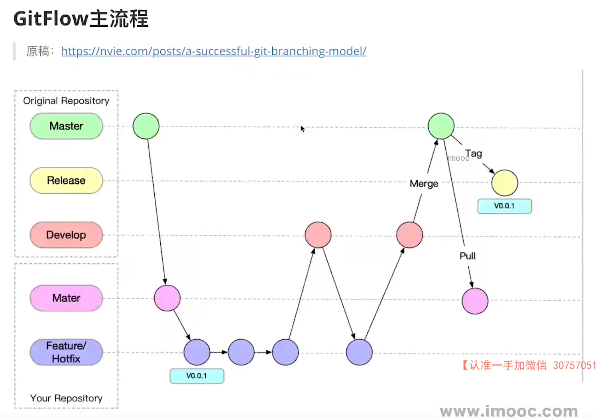

# 实战经验

## 自我介绍

面试官好，我叫xxx，目前有五年的前端开发经验，在上家公司担任前端组长一职，主要负责前端工程化、自动化方向、组件库搭建、项目评审排期人员分配解决组内技术性问题，也会参与业务开发，擅长vue、vue3、微前端、微信小程序，最主要的技术栈就是vue3
主要负责的项目有脚手架devops流程、前端监控、组件库、数据可视化、b端、c端等项目

面试官你好，我叫xxx，目前有五年的前端工作经验，在上家公司担任前端组长一职，主要负责前端工程化、自动化方向，包括脚手架、监控平台sdk、高德地图组件库、微前端集成这些都有涉猎

还有B端和C端以及数据可视化项目的整体的研发工作，包括项目评审、排期、人员安排把控项目进度质量，主导项目技术选型和框架搭建，并且会从0到1去参与研发工作，解决组内问题，通过长期的跨部门沟通协作形成了良好的沟通协作能力

那么我们主要用到的技术栈就是 B端产品老项目vue2 新项目vue3 自动化工具采用nodejs c端主要是公众号和小程序主要采用uniapp

最后本人非常期待加入贵司，谢谢

想了解咱们团队前端开发方面的主要项目和技术栈是什么
想了解下咱们现在的前端团队的人员配置
有机会参与到开源项目或者说一些咱们内部的前端基建的项目吗，或者是会举办一些技术分享会吗
想问下面试结果会有人通知我吗
如果通过的话接下来还会有几轮面试那

## HR 谈薪

### 在其他公司面试以及和hr沟通的过程中，基本上是可以达到我预期的水平，我本身的期望薪资是26k，目前已经降到25k的情况下我还是希望保险和公积金按照全额来缴纳，我们公司还处于初创阶段不确定性还是很大的，尤其是在绩效和福利方面，所以这一部分我们先不考虑啦，但是我对于咱们公司目前的产品方向和技术方面是很感兴趣的，而且对于我个人的职业发展以及能力提升方面是比较有帮助的，所以其他条件差不多的话，我还倾向于去咱们公司的

- 如果底薪能到达25k，并且可以全额缴纳保险公基金的话，那其他家我就不去考虑啦，下周就可以参加入职，希望您可以在帮我争取下
- 如果保险也可以全额缴纳的话，那其他家我就不去考虑啦，下周就可以参加入职，希望您可以在帮我争取下
- 如果保险和公积金也可以全额缴纳的话，那其他家我就不去考虑啦，下周就可以参加入职，希望您可以在帮我争取下

因为目前公司处于初创阶段，前端这块肯定是要一点点建设的，我有丰富的前端基建的经验，能够很好的帮助公司完成前端的建设，我觉得我对于薪资这块的要求

1. 首先其他公司的产品和技术方向也都是符合我的预期和发展的
2. 其次其他公司的成立时间都比较长，各方面建设可能都比较完善，对于我个人来说比较稳定有保障
3. 最后薪资和保险公积金这块也是基本可以达到我的预期的

但是我对于咱们公司目前的产品方向和技术方面是很感兴趣的，而且对于我个人的职业发展以及能力提升方面是比较有帮助的，所以其他条件差不多的话，我还倾向于去咱们公司的

最后都没到达的情况下，我再考虑一下，明天10点前给您答复

## 简述一下你的脚手架开发流程

1. 基于lerna和pnpm搭建脚手架项目，pnpm主要用于管理依赖安装和多package间的依赖关系，learn主要用于发布各个npm包以及多个包的版本管理，lerna已经支持pnpm，设置`"npmClient": "pnpm" and "useWorkspaces": true in lerna.json`
2. 在package.json中增加bin命令，也就是脚手架的执行入口文件，在入口文件中增加`#! /usr/bin/env node`,代表用node去自动执行这个文件
> 在用npm -g 全局安装脚手架时，是把脚手架的包下载node的lib中的node-modules中，在node的bin目录下配置脚手架命令的软连接，链接到node modules中的路径
3. 采用import-local来判断优先加载本地脚手架资源否则加载全局的安装的脚手架
4. 使用commander完成脚手架命令注册，根据参数targetPath参数判断是否加载本地命令，不传则根据命令动态加载对应命令的npm包
5. 设计通用的npm package类用于缓存下载包以及各种方法，比如对比线上最新版本更新依赖
6. 通过commander注册命令action动作动态执行命令传入exec函数
7. exec函数根据命令去加载不同的代码去执行，执行采用node多进程spawn来执行，避免阻塞住进程，通过stdio: 'inherit',来进行命令行交互，spawn是用来开启多进程，传入 node -e 命令来执行文件，win32采用cmd来执行命令

8. 单人git flow流程

- 本地初始化git仓库 `git init`
- 关联远程仓库 `git remote add origin 远程仓库链接地址`
- 推送代码至master `git push -u origin master`
- 基于master分支创建开发分支 `git checkout -b dev/0.0.1`
- 在开发分支修改代码，把新建的分支push到远端：`git push origin dev/0.0.1`
- 将本地分支与远端分支关联：`git branch --set-upstream-to=origin/dev/0.0.1`
- 继续修改代码，并提交到远程分支，并且想要部署
- 部署成功之后，合并dev到master，并基于master创建tag并删除开发分支
    - 在master分支运行`git merge dev`
    - `git push origin master`
    - `git tag release/0.0.1`
    - `git push origin release/0.0.1`  或者 `git push --tags`
    - `git branch -d dev/0.0.1` 删除本地开发分支
    - `git push origin --delete dev/0.0.1` 删除远程开发分支并且删除追踪分支

10. 多人git flow流程

> 就是在开发过程需要提交代码之前要先 拉取dev代码保证dev代码是最新提交的，在想要发布时需要先拉取dev代码在同步master代码，因为要保证发布前的代码要和master把持同步

## 单人开发流程

## 多人协作流程

## 简述一下前端监控项目

1. 采集sdk->上报sdk->大数据清洗->后端编写接口->数据可视化开发

难点：怎么处理高并发上任务？怎么处理点击事件跳转了网站怎么发送上报任务

requestIdleCallback、异步任务队列、 navigator.sendBeacon()