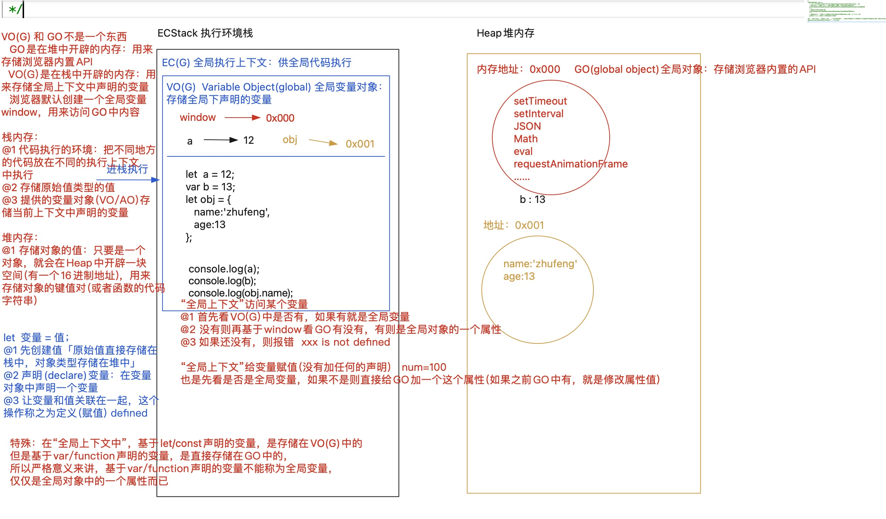
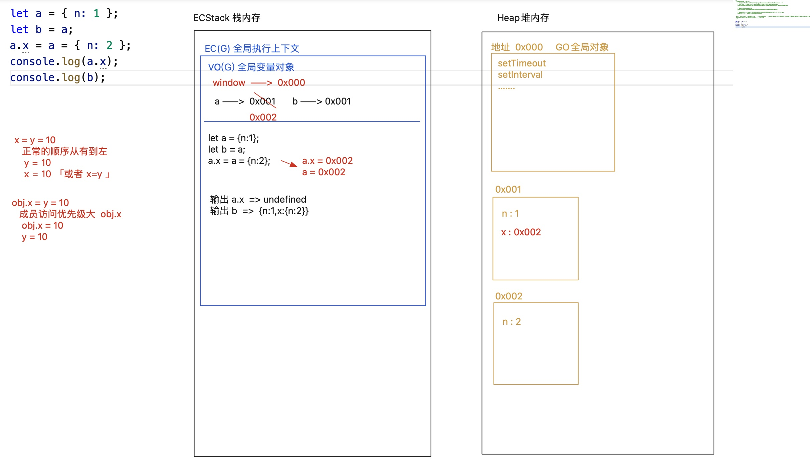
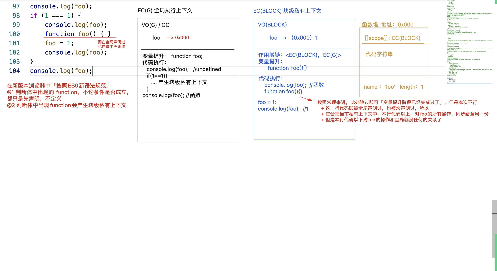

# JS 底层堆栈内存处理机制

## 代码运行环境

1. 浏览器`「内核：webkit(blink)、gecko、presto、trident、Chromium...」`
2. IOS/安卓原型 App 中，基于 `webview` 运行页面和 `JS「内核：webkit」`

   > 支持 `window`、没有 `global`、支持 `ES6Module` 模块规范、不支持 `CommonJS` 模块规范

3. Node`「内核：webkit」`

   > 特点：支持 `global`、不支持 `window`、支持 `CommonJS`、不支持 `ES6Module`

4. webpack`「基于 Node 环境编译打包 JS，最后把编译后的结果运行在浏览器中」`
   > 特点：浏览器和 `Node` 环境支持的他都支持

> 不论什么环境下执行代码，总要开辟出相关的内存(执行内存/内存条)，用来存储值`「Heap 堆内存」`以及运行代码`「Satck 栈内存 -> E（Execution）C（Context）Stack 执行环境栈」`

## 堆(Heap)栈(Stack)内存

> 都是在计算机内存中开辟的空间

1. 栈内存 `Stack：ECStack（Execution [ˌeksɪˈkjuːʃn] Context Stack）`
   - 存储原始值类型值
   - 代码执行的环境
2. 堆内存 `Heap`
   - 存储对象类型值

## 执行上下文

`EC（Execution [ˌeksɪˈkjuːʃn] Context ）`执行上下文：区分代码执行的环境

1. 常见上下文分类
   - 全局上下文 EC(G)
   - 函数私有上下文 EC(FN)
   - 块级私有上下文 EC(BLOCK)
2. 产生私有上下文 -> 进栈执行 -> 出栈释放(可能释放)
3. 变量对象：当前上下文中，用来存储声明的变量的地方
   - `VO（Varibale Object）`：`VO(G)` 或者 `VO(BLOCK)`
   - `AO（Active Object）`：`AO(?)`

## 全局对象

`GO（Global Object）`全局对象

1.  `window` 指向 `GO` 对象
2.  全局上下文中，基于`var/function`声明的变量是直接存储到`GO`对象上的；而基于`let/const`声明的变量才是存放在`VO(G)`中的；

## 定义变量赋值操作步骤

1. 第一步：创建值
   - 原始值类型：直接存储在栈内存中，按值操作
   - 对象类型值：按照堆内存地址来操作
     - 对象：开辟一个堆内存空间(16 进制地址)、依次存储对象的键值对、把空间地址赋值给变量
     - 函数：内存空间中存储三部分信息
       - 作用域 [[scope]]：当前所处上下文
       - 函数体中的代码字符串
       - 当做普通对象存储的静态属性和方法「name & length」
   - 第二步：声明变量 declare
   - 第三步：变量和值关联在一起（赋值） defined



### 练习题

```js
var a = { n: 1 }
var b = a
a.x = a = { n: 2 }
console.log(a.x)
console.log(b)
```



```js
let x = [12, 23]
function fn(y) {
  y[0] = 100
  y = [100]
  y[1] = 200
  console.log(y)
}
fn(x)
console.log(x)
```


## 变量提升机制

在“当前上下文”中，代码执行之前，浏览器首先会把所有带`var/function`关键字的进行提前声明或者定义：带`var`的只是提前声明 & 带`function`的，此阶段声明+定义{赋值}都完成了

1. `let/const/import/class` 声明的变量不存在变量提升
2. 重复声明的问题
3. 推荐使用函数表达式，确保函数执行只能放在“创建函数”的下面，保证逻辑严谨性
4. 条件判断：在当前上下文中，变量提升阶段，不论条件是否成立，都要进行变量提升
   - var：还是只声明
   - function：判断体中的函数，在变量提升阶段，只声明不赋值「函数是个渣男」

```js
/*
 EC(G)全局执行上下文
   VO(G)/GO
     a -> 12
   变量提升：var a;
   代码执行
*/
1. 其实最开始浏览器从服务器端获取的JS都是文本(字符串)，只不过声明了其格式是「Content-Type: application/javascript;」，浏览器首先按照这个格式去解析代码 -> “词法解析”阶段「目标是生成“AST词法解析树”」
2. 基于let/const等声明的变量：在词法解析阶段，其实就已经明确了，未来在此上下文中，必然会存在这些变量；代码执行中，如果出现在具体声明的代码之前使用这些变量，浏览器会抛出错误！！

console.log(a) //undefined
var a = 12
console.log(b) //Uncaught ReferenceError: Cannot access 'b' before initialization
let b = 12
```

```js
/*
 EC(G)
   VO(G)/GO
     fn -> 0x001 [[scope]]:EC(G)
        -> 0x002 [[scope]]:EC(G)
        -> 12
   变量提升:
     function fn(){ console.log(1); }
     var fn;  //上下文中已经存在fn变量了，不会重复声明
     function fn(){ console.log(2); }
   代码执行:
 */

console.log(fn) //function->2
function fn() {
  console.log(1)
} //跳过「变量提升阶段已经处理过了」
console.log(fn) //function->2
var fn = 12 //跳过var fn操作，但是赋值的操作在变量提升阶段没搞过，需要执行
console.log(fn) //12
function fn() {
  console.log(2)
} //跳过
console.log(fn) //12
```

```js
/*
 EC(G)
   VO(G)/GO
     a
   变量提升：不论条件是否成立，都要进行变量提升（对于var来讲新老版本浏览器没有任何影响，但是对于判断体中出现的function来讲，新老版本表现不一致：老版本 函数还是声明+定义  新版本 函数只会声明，不在定义）
     var a;
 */

console.log(a) //undefined
if (!('a' in window)) {
  //'a' in window  TRUE
  var a = 13
}
console.log(a) //undefined
```

## 块级私有上下文

除`函数和对象`的大括号外`「例如：判断体/循环体/代码块…」`，如果在大括号中出现了 `let/const/function/class` 等关键词声明变量，则当前大括号会产生一个`块级私有上下文`；它的上级上下文是所处的环境；`var` 不产生，也不受块级上下文的影响；

1. 函数是个渣男
2. 循环中的块级上下文



## let\const\var 的区别

1. `let`不存在变量提升,不允许在定义之前使用

```js
console.log(a) //undefined
var a = 12
console.log(b) //Uncaught ReferenceError: Cannot access 'b' before initialization
let b = 13
```

2. `let`不允许重复声明「不论当前上下文中，基于何种方式声明过这个变量，都不允许基于`let`再次声明」
   > `Uncaught SyntaxError: Identifier 'a' has already been declared `在词法解析阶段，发现有基于 `let`重复声明，词法解析就报错了，所以 `JS` 代码都不会执行

```js
console.log('OK')
var a = 12
let a = 13
```

3. 在全局上下文中，基于`var/function`声明的变量，是给`window(GO)`设置的全局属性；基于`let/const`声明的变量是放在`VO(G)`中的，和`GO`没有任何的关系；

4. `let`会产生块级上下文

```js
{
  var a = 12
  let b = 13
  console.log(a, b) //12 13
}
console.log(a) //12
console.log(b) //Uncaught ReferenceError: b is not defined  b是块级上下文中私有的
```

5. `let`的暂时性死区问题

```js
// console.log(typeof a); //"undefined" 基于typeof检测一个未被声明的变量，结果不会抱错，而是"undefined"
console.log(typeof a) //Uncaught ReferenceError: Cannot access 'a' before initialization
let a = 100
```

6. 基于`const` 声明的变量，首先必须赋值初始值，而且一但和某个值关联，后期不允许更改其指针指向（也就是不能重新赋值为其他的值)

```js
const a; //Uncaught SyntaxError: Missing initializer in const declaration
```
