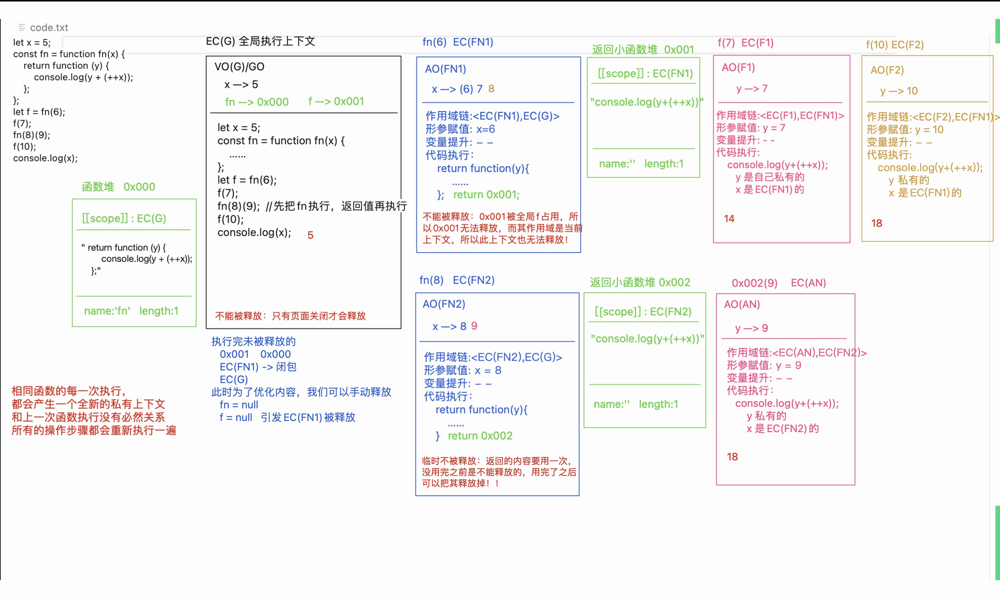
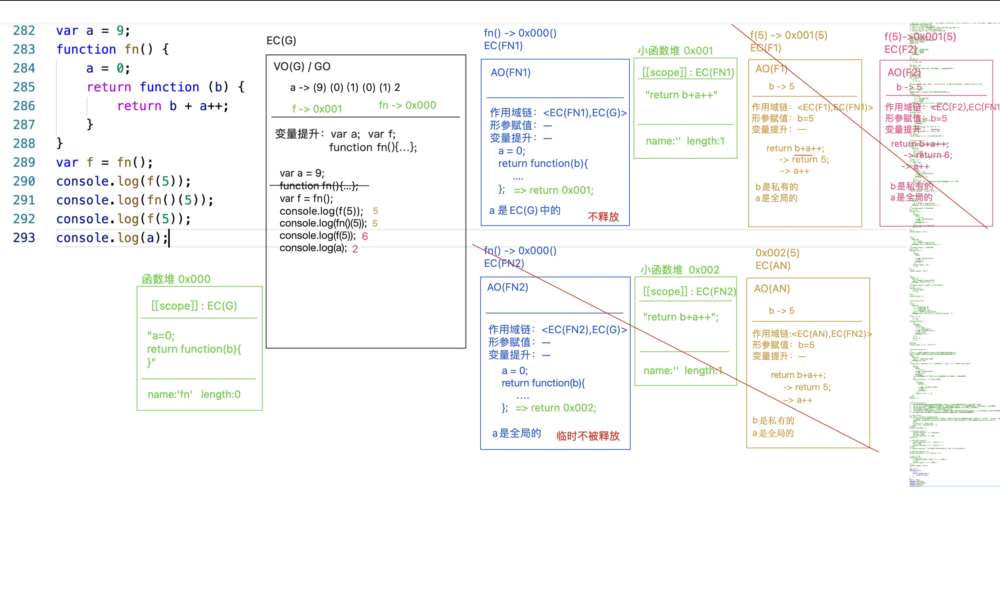
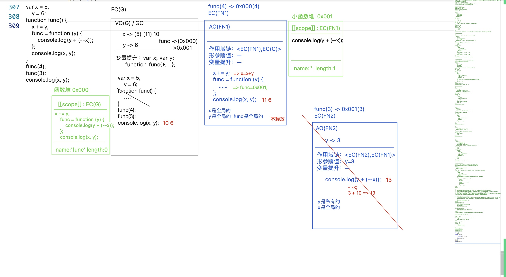
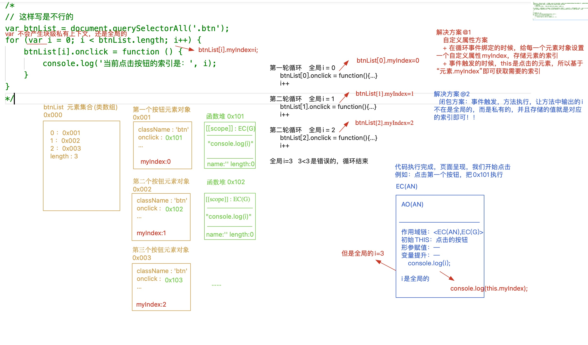

# 闭包作用域和浏览器垃圾回收机制

## 浏览器垃圾回收机制「GC」

1. 标记清除
2. 引用计数

> 全局上下文：打开页面，执行全局代码就会形成；只有当页面关闭的时候才会释放；
> 私有上下文：一般函数(代码块)中的代码执行完，浏览器会自动把私有上下文出栈释放；但是如果，当前上下文中，某个和它关联的内容（一般指的是一个堆内存）被当前上下文以外的事物占用了，那么这个私有上下文不能出栈释放；这样私有上下文中的`“私有变量/值”`也被保存起来了! `闭包的机制:保护、保存`

```js
let x = 5;
function fn(x) {
    return function(y) {
        console.log(y + (++x));
    }
}
let f = fn(6);
f(7);
fn(8)(9);
f(10);
console.log(x);
```



```js
let a=0,
    b=0;
function A(a){
    A=function(b){
        alert(a+b++);
    };
    alert(a++);
}
A(1);
A(2);
```






## 循环中的闭包处理方案

页面中有五个按钮，点击每个按钮输出对应的索引，请问下面方式是否可以实现？如果不可以，请问该如何解决？

1. 解决方案一：闭包解决方案，利用闭包的“保存”机制
2. 解决方案二：自定义属性
3. 解决方案三：终极方案-事件委托

```js
var btnList = document.querySelectorAll('.btn');
for (var i = 0; i < btnList.length; i++) {
    btnList[i].onclick = function () {
        console.log(`当前点击按钮的索引：${i}`);
    };
}
```

