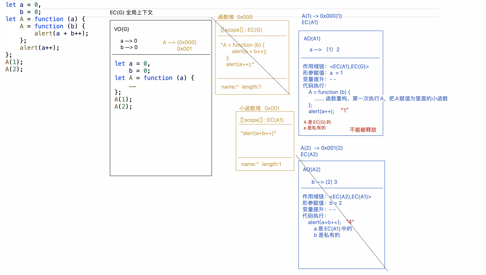

# 闭包作用域和浏览器垃圾回收机制

## 浏览器垃圾回收机制「GC」

1. 标记清除
2. 引用计数

> 全局上下文：打开页面，执行全局代码就会形成；只有当页面关闭的时候才会释放；
> 私有上下文：一般函数(代码块)中的代码执行完，浏览器会自动把私有上下文出栈释放；但是如果，当前上下文中，某个和它关联的内容（一般指的是一个堆内存）被当前上下文以外的事物占用了，那么这个私有上下文不能出栈释放；这样私有上下文中的`“私有变量/值”`也被保存起来了! `闭包的机制:保护、保存`

```js
let x = 5
function fn(x) {
  return function (y) {
    console.log(y + ++x)
  }
}
let f = fn(6)
f(7)
fn(8)(9)
f(10)
console.log(x)
```


```js
let a = 0,
  b = 0
function A(a) {
  A = function (b) {
    alert(a + b++)
  }
  alert(a++)
}
A(1)
A(2)
```




## 循环中的闭包处理方案

页面中有五个按钮，点击每个按钮输出对应的索引，请问下面方式是否可以实现？如果不可以，请问该如何解决？

1. 解决方案一：闭包解决方案，利用闭包的“保存”机制
2. 解决方案二：自定义属性
3. 解决方案三：终极方案-事件委托

```js
var btnList = document.querySelectorAll('.btn')
for (var i = 0; i < btnList.length; i++) {
  btnList[i].onclick = function () {
    console.log(`当前点击按钮的索引：${i}`)
  }
}
```


## 柯理化函数编程思想

> 预先存储(预处理)，利用闭包的“保存机制”，我们把一些值事先存储起来，供其下级上下文中后期使用

- 如果一个函数有多个参数，我们可以根据参数的个数转化成`n`个函数，柯里化我们一般都认为参数是一个一个的传递的
- 偏函数：根据参数的个数分解成函数，每次调用函数的参数个数可以不是一个
- 如果我们想暂存参数，可以考虑使用柯里化
- 柯里化算是一个闭包函数因为需要把参数暂存起来
- 柯里化可以把一个函数变的更具体

实现一个判断数据类型的函数

```javascript
// typeof > Array.isArray > Object.prototype.toString.call > instanceof > constructor

function isType(type, val) {
  return Object.prototype.toString.call(val) === `[object ${type}]`
}

let isString = isType('String', '123')
let isNumber = isType('Number', 123)
let isBoolean = isType('Boolean', true)

console.log(isString)
console.log(isNumber)
console.log(isBoolean)
```

那么每次调用`isType`函数都需要传入两个参数非常麻烦，那么就可以进行函数柯里化让函数变得更具体，如下：

```javascript
function isType(type) {
  return function (val) {
    return Object.prototype.toString.call(val) === `[object ${type}]`
  }
}

let isString = isType('String')
let isNumber = isType('Number')
let isBoolean = isType('Boolean')

console.log(isString('123'))
console.log(isNumber(1))
console.log(isBoolean(true))
```

实现通用的函数柯里化

```javascript
function curring(fn) {
  let fnLength = fn.length
  let params = [] // 这里用来记录参数的个数, 记录每次调用传入的总个数
  const calc = function (...args) {
    // 每次调用的个数
    params.push(...args)
    if (params.length >= fnLength) {
      return fn(...params)
    } else {
      return calc
    }
  }
  return calc
}

function sum(a, b, c, d) {
  return a + b + c + d
}

// 将sum函数用curring进行柯里化
let fn = curring(sum)
let fn1 = fn(1)
let fn2 = fn1(2, 3)
let result = fn2(4)
console.log(result)

// 将isType函数用curring进行柯里化
function isType(type, val) {
  return Object.prototype.toString.call(val) === `[object ${type}]`
}
let isString = curring(isType)('String')
let isNumber = curring(isType)('Number')
let isBoolean = curring(isType)('Boolean')

console.log(isString(123))
console.log(isNumber(456))
console.log(isBoolean(123))
```

```js
const fn = (...params) => {
  return (...args) => {
    params = params.concat(args)
    return params.reduce((result, item) => result + item)
  }
}
let res = fn(1, 2)(3)
console.log(res) //=>6  1+2+3
```

```js
// 基于console.log或者alert输出一个函数，会默认先把函数转化为字符串「Symbol.toPrimitive -> valueOf -> toString」，然后再输出「只不过浏览器为了让开发者知道这是个函数字符串，所以在输出的字符串前面，加了一个“f”」
const curring = function curring() {
  let params = []
  const add = (...args) => {
    params = params.concat(args)
    return add
  }
  add[Symbol.toPrimitive] = () => params.reduce((result, item) => result + item)
  return add
}
let add = curring()
let res = add(1)(2)(3)
console.log(res) //->6

add = curring()
res = add(1, 2, 3)(4)
console.log(res) //->10

add = curring()
res = add(1)(2)(3)(4)(5)
console.log(res) //->15
```

```js
/* 
    在函数式编程当中有一个很重要的概念就是函数组合， 实际上就是把处理数据的函数像管道一样连接起来， 然后让数据穿过管道得到最终的结果。 例如：
    const add1 = (x) => x + 1;
    const mul3 = (x) => x * 3;
    const div2 = (x) => x / 2;
    div2(mul3(add1(add1(0)))); //=>3
​
    而这样的写法可读性明显太差了，我们可以构建一个compose函数，它接受任意多个函数作为参数（这些函数都只接受一个参数），然后compose返回的也是一个函数，达到以下的效果：
    const operate = compose(div2, mul3, add1, add1)
    operate(0) //=>相当于div2(mul3(add1(add1(0)))) 
    operate(2) //=>相当于div2(mul3(add1(add1(2))))
​
    简而言之：compose可以把类似于f(g(h(x)))这种写法简化成compose(f, g, h)(x)，请你完成 compose函数的编写 
*/
const add1 = (x) => x + 1
const mul3 = (x) => x * 3
const div2 = (x) => x / 2

const compose = function compose(...funcs) {
  let len = funcs.length
  if (len === 0) return (x) => x
  if (len === 1) return funcs[0]
  return function operate(x) {
    return funcs.reduceRight((result, func) => {
      return func(result)
    }, x)
  }
}
const operate = compose(div2, mul3, add1, add1)
console.log(operate(0))

// 课后思考：redux中的compose函数编写思想
/* 
function compose(...funcs) {
    if (funcs.length === 0) {
        return (arg) => arg
    }
    if (funcs.length === 1) {
        return funcs[0]
    }
    return funcs.reduce((a, b) => (...args) => a(b(...args)))
} 
*/
```

## 函数式编程 VS 命令式编程

1. 函数式编程
   > 把具体执行的步骤封装到一个函数中，后期需要处理的时候，只需要把函数执行即可；我们不再关注执行的步骤，只关注最后处理的结果；

- 低耦合高内聚
- 快捷化开发、方便维护
- 不能灵活掌控程序处理的步骤，无法在某一步骤做些特殊处理...

2. 命令式编程
   > 更关注处理的步骤，需要我们自己去实现每一步的操作

- 灵活，想咋处理咋处理
- 代码冗余度高、开发效率慢...

### foreach 实现

> forEach 就是函数式编程：函数内部实现了对数组迭代的封装，每一次迭代都把回调函数执行，并且把当前迭代这一项及其索引传递过来！！

```js
let arr = [10, 20, 30, 40]
Array.prototype.forEach = function forEach(callback) {
  let self = this
  for (let i = 0; i < self.length; i++) {
    callback(self[i], i)
  }
}
```

> 自己写循环就是命令式编程

```js
for (let i = 0; i < arr.length; i++) {
  console.log(arr[i], i)
}
```

### for 循环和 forEach 的区别

1. `for`循环代表的是命令是编程、`forEach`代表的是函数式编程；
2. `forEach`其实就是把数组迭代的操作步骤封装好，这样应用起来会更加方便；我之前研究过`forEach`等数组常见方法的源码，`forEach`内部是依次迭代数组每一项，每一次迭代把传递的回调函数执行，把迭代的内容及索引传递给回调函数....直到整个数组都迭代完毕才结束，不支持中间以任何形式跳过或者结束迭代操作！！而`for`循环是命令式编程，所有的操作步骤自己可以管控，想啥时候结束就结束，想咋循环就咋循环；
3. 我在项目开发的时候，一般应用的都是`forEach`，这样可以提高我的开发效率，减少代码的冗余！！但是遇到一些需要灵活迭代的需求，则自己基于`for`循环操作！！

## reduce

```js
// 迭代方法：forEach map reduce reduceRight find filter some every ...
// reduce数组的迭代方法，它支持结果的累积，因为在下一轮迭代可以拿到上一轮迭代的返回结果
let arr = [1, 2, 3, 4]
let total = arr.reduce((result, item, index) => {
  // 数组从第二项开始迭代
  // 第一轮: result数组第一项1  item数组第二项2  index是第二项索引1
  // 第二轮: result存储的是上一轮返回的结果3  item=3  index=2
  // 第三轮: result=6  item=4  index=3
  return result + item
})
let total = arr.reduce((result, item) => {
  // 传递的第二项是给result设置的初始值  item从数组第一项开始迭代
  return result + item
}, 0)
console.log(total)
```

## 惰性思想

```js
function getCss(element, attr) {
  // 第一次执行，根据兼容情况，重构getCss函数
  if (window.getComputedStyle) {
    getCss = function (element, attr) {
      return window.getComputedStyle(element)[attr]
    }
  } else {
    getCss = function (element, attr) {
      return element.currentStyle[attr]
    }
  }
  // 第一次把重构的函数执行一次，获取对应的结果
  return getCss(element, attr)
}
console.log(getCss(document.body, 'width'))
console.log(getCss(document.body, 'margin'))
console.log(getCss(document.body, 'padding'))
```

## 函数的防抖和节流

1. 防抖 `debounce`：在用户频繁触发某个行为的时候，我们只识别一次即可「开始边界：第一次点击触发 结束边界：等到最后一次触发」
2. 节流 `throttle`：在频繁操作的时候，我们能降低触发的频率

防抖的一种简单办法「具体的需求：频繁点击，只有当上一个请求成功，才能发送下一个请求」

```js
let isRun = false
submit.onclick = function () {
  if (isRun) return
  isRun = true
  queryData((result) => {
    console.log(result)
    isRun = false
  })
}
```

```js
// 清除指定的定时器，并且让timer=null
const clearTimer = function clearTimer(timer) {
  if (timer) {
    clearTimeout(timer)
  }
  return null
}

/*
 * debounce:函数防抖
 *  @params
 *    func:自己最终要执行的任务
 *    wait:多久操作一次算是频繁触发「默认值:500ms」
 *    immediate:控制触发的边界 「默认值:false结束边界  true开始边界」
 *  @return
 *    operate处理函数，处理函数会在频繁触发的时候，频繁执行；函数内部，控制我们想要操作的func只执行一次；
 */
const debounce = function debounce(func, wait, immediate) {
  if (typeof func !== 'function')
    throw new TypeError('func must be an function!')
  if (typeof wait === 'boolean') immediate = wait
  if (typeof wait !== 'number') wait = 500
  if (typeof immediate !== 'boolean') immediate = false
  let timer = null
  return function operate(...params) {
    let now = !timer && immediate,
      result
    timer = clearTimer(timer)
    timer = setTimeout(() => {
      timer = clearTimer(timer)
      // 结束边界触发
      if (!immediate) func.call(this, ...params)
    }, wait)
    // 开始边界触发
    if (now) result = func.call(this, ...params)
    return result
  }
}
```

```js
/*
 * throttle:函数节流
 *  @params
 *    func:自己最终要执行的任务
 *    wait:触发的频率「默认值:500ms」
 *  @return
 *    operate处理函数
 */
const throttle = function throttle(func, wait) {
  if (typeof func !== 'function')
    throw new TypeError('func must be an function!')
  if (typeof wait !== 'number') wait = 500
  let timer = null,
    previous = 0
  return function operate(...params) {
    let now = +new Date(),
      remaining = wait - (now - previous),
      result
    if (remaining <= 0) {
      // 两次间隔时间超过500ms了,让方法立即执行
      timer = clearTimer(timer)
      result = func.call(this, ...params)
      previous = +new Date()
    } else if (!timer) {
      // 没设置过定时器等待，则我们设置一个去等待即可
      timer = setTimeout(() => {
        timer = clearTimer(timer)
        func.call(this, ...params)
        previous = +new Date()
      }, remaining)
    }
    return result
  }
}
```
