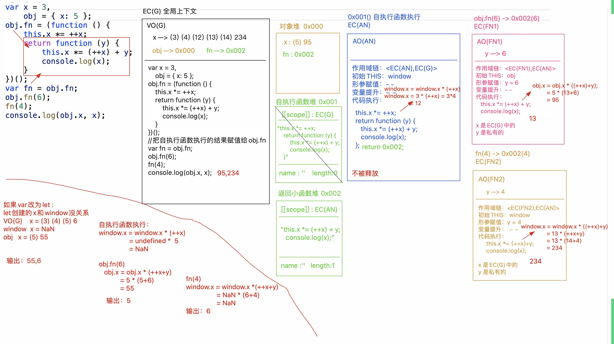

# this 的几种基本情况

1. 事件绑定
2. 函数执行（包括自执行函数 & 回调函数）
3. new 构造函数
4. 箭头函数
5. call/apply/bind

## this 指向判断

> THIS 是执行主体：通俗来讲，是谁把它执行的，而不是在哪执行的，也不是在哪定义的，所以 THIS 是谁和在哪执行以及在哪定义都没有直接的关系；

1. 全局上下文中的`this->window`
2. 块级上下文中没有自己的 this，在此上下文中遇到的`this`，都是其所处环境(上级上下文)中的`this`
3. `ES6`中的箭头函数和块级上下文类似，也是没有自己的`this`，遇到的`this`也是其上级上下文中的
4. 给`DOM元`素进行事件绑定`(不论是DOM0还是DOM2)`，当事件行为触发，绑定的方法执行，方法中的`THIS`是当前`DOM`元素本身!!
5. 当方法执行，我们看函数前面是否有“点”
   - 有：“点”之前是谁`THIS`就是谁
   - 没有：`THIS`就是`window`(非严格模式)或者`undefined`(严格模式 `use strict`)
   - 匿名函数(自执行函数或者回调函数等)中的`THIS`一般都是`window/undefined`，除非做过特殊的处理！！

```js
var x = 3,
  obj = { x: 5 }
obj.fn = (function () {
  this.x *= ++x
  return function (y) {
    this.x *= ++x + y
    console.log(x)
  }
})()
var fn = obj.fn
obj.fn(6)
fn(4)
console.log(obj.x, x)
```




## CALL 实现原理

> 思路：给`context`设置一个属性「例如：`xxx` 新增的属性不要和原始`context`中的属性冲突(设置`symbol`唯一值属性)」，让属性值等于要执行的函数(即:`this「fn」`)；后面就可以基于 `context.xxx()` 执行，这样既把函数执行了，也让函数中的`this`改为`context`了...

```js
Function.prototype.call = function call(context, ...params) {
  if (context == null) context = window
  if (!/^(object|function)$/.test(typeof context)) context = Object(context)
  let self = this,
    key = Symbol('KEY'),
    result
  context[key] = self
  result = context[key](...params)
  // delete context[key]; //新增的属性用完后记得移除
  Reflect.deleteProperty(context, key) //ES6中，可以基于Reflect.deleteProperty移除对象的属性
  return result
}
```

call 使用方法

```js
const fn = function fn(x, y) {
  console.log(this, x, y)
}
let obj = {
  name: 'obj',
}
obj.fn(10, 20) //Uncaught TypeError: obj.fn is not a function
fn.call(obj, 10, 20) //this->obj x->10 y->20
fn.apply(obj, [10, 20]) //this->obj x->10 y->20
fn.call(10, 20) //this->new Number(10) x->20 y->undefined  「this存储的值：null/undefined/对象」
fn.call() //this->window/undefined(严格模式)
fn.call(null) //this->window/null(严格模式)
```

## bind 实现原理

```js
const submit = document.querySelector('#submit')
const obj = { name: 'obj' }
const fn = function fn(x, y, ev) {
  console.log(this, x, y, ev)
}
// submit.onclick = fn; //点击按钮 this->submit  x->PointerEvent
// 需求：点击按钮，fn方法执行，我们想让其中的this变为obj，ev事件对象也存在，再传递10/20
// submit.onclick = fn.call(obj, 10, 20); //这样处理是错误的，因为call是把函数立即执行，还没点击呢，fn就执行了...
/* submit.onclick = function (ev) {
    // 先给事件行为绑定匿名函数，当点击的时候，先执行匿名函数「获取到ev事件对象了」；在匿名函数执行的时候(this->submit)，我们再让真正要处理的fn函数执行，此时就可以基于call去改变this了!!
    fn.call(obj, 10, 20, ev);
}; */
submit.onclick = fn.bind(obj, 10, 20) //这样处理就可以了
```

```js
Function.prototype.bind = function bind(context, ...params) {
  // this->fn  context->obj  params->[10,20]
  let self = this
  return function proxy(...args) {
    // args->[ev] this->submit
    params = params.concat(args)
    return self.call(context, ...params)
  }
}
```

## call&bind&apply 区别

call VS apply

1. 都是把函数立即执行，改变函数中的`this`指向的「第一个参数是谁，就把`this`改为谁」
2. 唯一区别：`apply`要求把传递给函数的实参，以数组的形式管理起来「最终效果和`call`一样，也是把数组中每一项，一个个的传给函数」
3. 真实项目中建议大家使用`call`，因为其性能好一些「做过测试：三个及以上参数，`call`的性能明显比`apply`好一些」

call VS bind

1. `call`是把函数立即执行，而`bind`只是预处理函数中的`this`和`参数`，函数此时并没有执行
