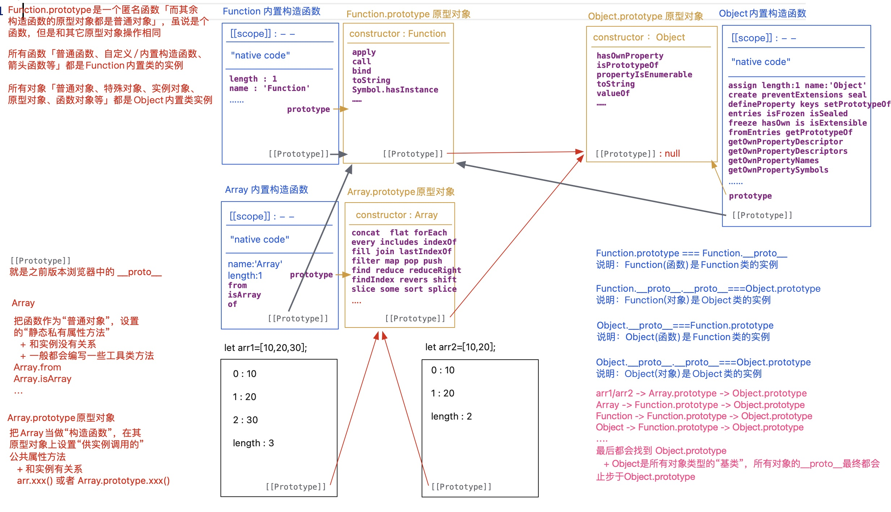

# 面向对象

## 面向对象基础

- `OOP`思想：对象、类、实例
- `JS`语言本身就是基于类和实例构建和组成的
- `JS`中有很多的内置类
  1.  每一种数据类型值都有自己所属的内置类(专业叫法：构造函数)
      - 大类：`Object`
      - 小类：`Number`、`String`、`Boolean`、`Symbol`、`BigInt`、`Function`、`Array`、`RegExp`、`Date`、`Set`、`Map`....
  2.  每一 HTML 标签(或者每一个节点)，都有自己所属的内置类
      > body -> HTMLBodyElement -> HTMLElement -> Element -> Node -> EventTarget -> Object
- 创建一个函数，执行的时候，把其`new`执行，则当前函数被称为`自定义构造函数(类)`；执行的返回结果一般是当前类的一个`实例`；
  `new`多次会创造多个不同的实例对象`「实例对象的独立性」`；基于`this.xxx=xxx`是给实例对象设置`私有属性方法`；
- 普通函数执行 VS 构造函数执行

```js
function Fn(x, y) {
  let sum = 10
  this.total = x + y
  this.say = function () {
    console.log(`我计算的和是:${this.total}`)
  }
}
let res = Fn(10, 20) // 普通函数执行  Fn执行的返回值赋值给res
let f1 = new Fn(10, 20) //构造函数执行  把Fn当做一个类，f1是创造出来的一个实例
let f2 = new Fn()
console.log(f1.sum)
console.log(f1.total)
console.log(f1.say === f2.say)
```


## 原型 和 原型链

> 大部分`函数数据类型`的值都具备`prototype（原型/显式原型）`属性，属性值本身是一个对象「浏览器会默认为其开辟一个堆内存，用来存储实例可调用的公共的属性和方法」，在浏览器默认开辟的这个堆内存中「原型对象」有一个默认的属性`constructor（构造函数/构造器）`，属性值是当前`函数/类本身`！！

1. 函数数据类型
   - 普通函数（实名或者匿名函数）
   - 箭头函数
   - 构造函数/类「内置类/自定义类」
   - 生成器函数 Generator
2. 不具备`prototype`的函数
   - 箭头函数
   - 基于`ES6`给对象某个成员赋值函数值的快捷操作

> 每一个`对象数据类型`的值都具备一个属性`__proto__（原型链/隐式原型）`，属性值指向`自己所属类的原型prototype`

- `Object.create(null)`创建出的对象是没有原型的

对象数据类型值

1. 普通对象
2. 特殊对象：数组、正则、日期、Math、Error…
3. 函数对象
4. 实例对象
5. 构造函数.prototype



```js
function Fn() {
  this.x = 100
  this.y = 200
  this.getX = function () {
    console.log(this.x)
  }
}
Fn.prototype.getX = function () {
  console.log(this.x)
}
Fn.prototype.getY = function () {
  console.log(this.y)
}
let f1 = new Fn()
let f2 = new Fn()
console.log(f1.getX === f2.getX)
console.log(f1.getY === f2.getY)
console.log(f1.__proto__.getY === Fn.prototype.getY)
console.log(f1.__proto__.getX === f2.getX)
console.log(f1.getX === Fn.prototype.getX)
console.log(f1.constructor)
console.log(Fn.prototype.__proto__.constructor)
f1.getX()
f1.__proto__.getX()
f2.getY()
Fn.prototype.getY()
```


### Object.prototype.hasOwnProperty

> 用来检测是否为私有属性

- 语法：`[对象]`.hasOwnProperty(`[属性]`)
- 检测`[属性]`是否为`[对象]`的私有属性，是返回`TRUE`，不是则返回`FALSE`；只看私有中有没有(和公有是否存在没关系)；

### in 操作符

- 语法：`[属性]` in `[对象]`
- 检测`[属性]`是否率属于这个`[对象]`，不论公有还是私有，只要能访问到这个属性，则结果就是`TRUE`

实现`Object.prototype.hasPubProperty`，用户来检测当前属性是否为对象的公有属性（无关私有中是否存在）

```js
Object.prototype.hasPubProperty = function hasPubProperty(attr) {
  // this->obj要处理的对象  attr->'toString'要检测的属性
  // 思路：跳过私有属性的查找，直接在公有属性中查找，看看是否存在
  // Object.getPrototypeOf([实例对象])：获取当前实例对象的原型对象(或者获取“实例对象.__proto__”)
  let proto = Object.getPrototypeOf(this)
  while (proto) {
    if (proto.hasOwnProperty(attr)) return true
    proto = Object.getPrototypeOf(proto)
  }
  return false
  // 思路：是对象的属性，而且还不是私有的属性，这样只能是公有属性了
  // 问题：如果attr即是私有的属性，也是公有的属性，基于这种方案检测结果是false
  // return attr in this && !this.hasOwnProperty(attr)
}
```

## Class 语法

1. 基于`Class`语法，设置的原型上的公共方法（或者静态私有方法）都是不可枚举的属性；但是基于 `xxx=xxx` 这种写法，设置的属性是可枚举的；
2. 基于`Class`语法创造的构造函数，是不能当做普通函数执行的 `Uncaught TypeError: Class constructor Modal cannot be invoked without`

```js
class Modal {
  // 构造函数体：两种写法都是给实例设置私有的属性方法
  constructor(x, y) {
    this.x = x
    this.y = y
    // this.sum = function () { };
  }
  z = 10
  sum = () => {}

  // 在原型对象上设置供实例调用的“公共方法”「基于Class语法，无法向原型上直接设置公有属性」
  getX() {
    console.log(this.x)
  }
  getY() {
    console.log(this.y)
  }

  // 把其作为普通对象，设置静态私有属性方法
  static n = 200
  static setNumber(n) {
    this.n += n
  }
}
// 向原型扩展公共属性
Modal.prototype.name = 'zhufeng'

let m = new Modal(10, 20)
console.log(m)
```

```js
function Modal(x, y) {
  // 构造函数体 this->实例
  // 这里是给实例设置的私有属性方法
  this.x = x
  this.y = y
}
//把Modal作为构造函数，在其原型对象上设置供实例调用的公共属性方法
Modal.prototype.z = 10
Modal.prototype.getX = function () {
  console.log(this.x)
}
Modal.prototype.getY = function () {
  console.log(this.y)
}
//把Modal作为普通对象，设置的静态私有属性方法
Modal.n = 200
Modal.setNumber = function (n) {
  this.n = n
}
let m = new Model(10, 20)
```

## 函数的三种角色

```js
functionFoo(){
    getName = function () {
       console.log(1);
    };
    return this;
}
Foo.getName = function () {
    console.log(2);
};
Foo.prototype.getName = function () {
    console.log(3);
};
var getName = function () {
    console.log(4);
};
function getName() {
    console.log(5);
}
Foo.getName();
getName();
Foo().getName();
getName();
new Foo.getName();
new Foo().getName();
new new Foo().getName();
```


## 重写内置 new

> 面试题：假如没有`new`关键词，需要我们自己编写`_new`方法，实现出和`new`相同的效果

```js
function Dog(name) {
  this.name = name
}
Dog.prototype.bark = function () {
  console.log('wangwang')
}
Dog.prototype.sayName = function () {
  console.log('my name is ' + this.name)
}
var sanmao = _new(Dog, '三毛', 25)
sanmao.bark() //=>"wangwang"
sanmao.sayName() //=>"my name is 三毛"
console.log(sanmao instanceof Dog) //=>true  instanceof是用来检测某个对象是否是当前构造函数的实例对象
```

`_new` 函数实现

1. 创造当前类 Ctor 的一个实例对象「`空对象`、`__proto__`===`Ctor.prototype`」
2. 把构造函数当做普通函数执行，只不过让函数中的`this`指向创建的实例对象
3. 判断函数执行的返回值，如果返回的是对象，则以自己返回的为主；否则把创建的实例对象返回！

```js
function _new(Ctor, ...params) {
  // @1 创造当前类Ctor的一个实例对象「空对象、__proto__===Ctor.prototype」
  let obj = {}
  obj.__proto__ = Ctor.prototype
  // @2 把构造函数当做普通函数执行，只不过让函数中的this指向创建的实例对象
  let result = Ctor.call(obj, ...params)
  // @3 判断函数执行的返回值，如果返回的是对象，则以自己返回的为主；否则把创建的实例对象返回！
  if (result !== null && /^(object|function)$/.test(typeof result))
    return result
  return obj
}
```

```js
function _new(Ctor, ...params) {
  let obj = {},
    result
  Object.setPrototypeOf(obj, Ctor.prototype) //给某个对象设置原型指向(也就是让obj.__proto__===Ctor.prototype)，只兼容IE11及以上 *!/
  // Object.create(proto)：创建一个空对象，并且把proto作为空对象的原型指向（空对象.__proto__===proto）；proto必须是对象或者null；如果是null则是创造一个没有原型指向的对象； 不兼容IE6~8
  let obj = Object.create(Ctor.prototype),
    result
  result = Ctor.call(obj, ...params)
  if (result !== null && /^(object|function)$/.test(typeof result))
    return result
  return obj
}
```

```js
function _new(Ctor, ...params) {
  let obj,
    result,
    proto = Ctor.prototype
  if (!proto || Ctor === Symbol || Ctor === BigInt)
    throw new TypeError('Ctor is not a constructor')
  obj = Object.create(proto)
  result = Ctor.call(obj, ...params)
  if (result !== null && /^(object|function)$/.test(typeof result))
    return result
  return obj
}
```

最终优化版本

```js
function _new(Ctor) {
  if (typeof Ctor !== 'function')
    throw new TypeError('Ctor is not a constructor')
  if (!Ctor.prototype || Ctor === Symbol || Ctor === BigInt)
    throw new TypeError('Ctor is not a constructor')
  var obj, result, params
  params = [].slice.call(arguments, 1)
  obj = Object.create(Ctor.prototype)
  result = Ctor.apply(obj, params)
  if (result !== null && /^(object|function)$/.test(typeof result))
    return result
  return obj
}
```
