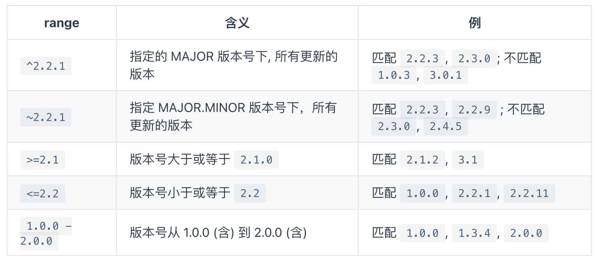

# Node

## Node 基本概念

`Node.js`是一个基于`Chrome V8`引擎的`JavaScript`运行环境`(runtime)`，`Node`不是一门语言是让`js`运行在后端的运行时,并且不包括`javascript`全集，因为在服务端中不包含`DOM`和`BOM`，`Node`也提供了一些新的模块例如`http`、`fs`模块等。`Node.js`使用了事件驱动、非阻塞式`I/O`的模型，使其轻量又高效并且`Node.js`的包管理器 `npm`，是全球最大的开源库生态系统。

- `node`中没有锁的概念
- `node`的应用场景 处理 `I/O` (文件读写)密集型，不适合处理`cpu`密集型 (压缩加密 和计算相关的)
- `node`中处理多个异步操作同一个文件件的场景 `（靠队列实现）`

## Node 解决了哪些问题

`Node`在处理高并发，`I/O`密集场景有明显的性能优势

- 高并发，是指在同一时间并发访问服务器
- `I/O`密集指的是文件操作、网络操作、数据库，相对的有`CPU`密集，`CPU`密集指的是逻辑处理运算、压缩、解压、加密、解密
- 可以解析`js`语法用于服务端渲染 vue，react
- 可以做中间层 （跨域）
- 前端会用`node`来实现很多工具
- 也可以做后端 `mongo mysql`

## JS 单线程

`javascript`在最初设计时设计成了单线程，为什么不是多线程呢？如果多个线程同时操作`DOM`那岂不会很混乱？这里所谓的单线程指的是主线程是单线程的，所以在`Node`中主线程依旧是单线程的。

- 单线程特点是节约了内存，并且不需要在切换执行上下文
- 而且单线程不需要管锁的问题

## 同步异步和阻塞非阻塞

- 同步就是在执行某段代码时，代码没有得到返回之前，其他代码无法执行，当得到了返回值后可以继续执行其他代码
- 异步就是在执行某段代码时，代码不会立即得到返回结果，可以继续执行其他代码，返回值通过回调来获取


## Node 中全局对象

服务端全局变量原则是是`global`，但是`node`在执行的时候为了实现模块化，会在执行代码时，外部包装一个函数，这个函数在执行的时候，会改变`this`指向

- `Buffer`
- `process`
  - `process.platform` 识别系统
  - `process.cwd()` 获取执行命令时的路径，`webpack`(查找配置文件，在当前执行命令的路径下查找)
  - `process.env.NODE_ENV` 在执行命令的时候（添加的变量），可以去读取环境变量中的属性，`windows`下 可以使用`set`命令来设置，`mac`下使用`export`命令来设置，`cross-env`可以实现系统兼容，环境变量都是临时的，窗口关掉就消失了
  - `process.argv` 执行命令时所带的参数 1.代表的是可执行`node.exe` 2.执行的是哪个文件
- `setInterval,setTimeout,setImmediate`
- `console`
- `queueMicrotask`

## Node 中的模块

下面五个可以直接用，但是不能用`global`来调用，因为他们是函数的参数

- `__dirname` 文件所在的目录 是一个绝对路径
- `__filename` 代表文件的所在位置 是一个绝对路径
- `exports`
- `module`
- `require()`

## commonjs 规范

1. 每个 js 文件都是一个模块
2. 模块的导出 module.exports
3. 模块的导入 require

### node 中的模块的分类

1. 核心模块/内置模块 fs http path 不需要安装 引入的时候不需要增加相对路径、绝对路径
2. 第三方模块需要安装
3. 自定义模块需要通过绝对路径或者相对路径进行引入

### 模块华实现

```js
const fs = require('fs')
const path = require('path')
const vm = require('vm')

function Module(id) {
  this.id = id
  this.exports = {}
}
Module.wrapper = [
  `(function(exports,require,module,__filename,__dirname){`,
  `})`,
]
Module._extensions = {
  '.js'(module) {
    let content = fs.readFileSync(module.id, 'utf8')
    content = Module.wrapper[0] + content + Module.wrapper[1]
    let fn = vm.runInThisContext(content)
    let exports = module.exports
    let dirname = path.dirname(module.id)
    fn.call(exports, exports, req, module, module.id, dirname)
  },
  '.json'(module) {
    let content = fs.readFileSync(module.id, 'utf8')
    module.exports = JSON.parse(content)
  },
}
Module._resolveFilename = function (filename) {
  let absPath = path.resolve(__dirname, filename)
  let isExists = fs.existsSync(absPath)
  if (isExists) {
    return absPath
  } else {
    let keys = Object.keys(Module._extensions)
    for (let i = 0; i < keys.length; i++) {
      let newPath = absPath + keys[i]
      let flag = fs.existsSync(newPath)
      if (flag) {
        return newPath
      }
    }
    throw new Error('module not exists')
  }
}
Module.prototype.load = function () {
  let extName = path.extname(this.id)
  Module._extensions[extName](this)
}
Module._cache = {}

function req(filename) {
  filename = Module._resolveFilename(filename)
  let cacheModule = Module._cache[filename]
  if (cacheModule) {
    return cacheModule.exports
  }
  let module = new Module(filename)
  Module._cache[filename] = module
  module.load()
  return module.exports
}
```

## Events 模块

node 中自己实现的发布订阅模块,订阅是将方法对应成一种一对多的关系，on 方法用来订阅事件

```js
function EventEmitter() {
  this._events = Object.create(null)
}
EventEmitter.prototype.on = function (eventName, callback) {
  if (!this._events) this._events = Object.create(null)

  // 如果用户绑定的不是newListener 让newListener的回调函数执行
  if (eventName !== 'newListener') {
    if (this._events['newListener']) {
      this._events['newListener'].forEach((fn) => fn(eventName))
    }
  }
  if (this._events[eventName]) {
    this._events[eventName].push(callback)
  } else {
    this._events[eventName] = [callback] // {newListener:[fn1]}
  }
}
```

off 方法可以移除对应的事件监听

```js
// 移除绑定的事件
EventEmitter.prototype.off = function (eventName, callback) {
  if (this._events[eventName]) {
    this._events[eventName] = this._events[eventName].filter((fn) => {
      return fn != callback && fn.l !== callback
    })
  }
}
```

emit 用来执行订阅的事件

```js
EventEmitter.prototype.emit = function (eventName, ...args) {
  if (this._events[eventName]) {
    this._events[eventName].forEach((fn) => {
      fn.call(this, ...args)
    })
  }
}
```

once 绑定事件当执行后自动删除订阅的事件

```js
EventEmitter.prototype.once = function (eventName, callback) {
  let one = (...args) => {
    callback.call(this, ...args)
    // 删除掉这个函数
    this.off(eventName, one) // 执行完后在删除掉
  }
  one.l = callback // one.l = fn;
  // 先绑定一个once函数，等待emit触发完后执行one函数 ，执行原有的逻辑，执行后删除once函数
  this.on(eventName, one)
}
```

## NPM 中常用命令

> 全称 node package manager 是世界上最大规模的包管理系统,官网是这样介绍的 Build amazing things...

### npm init

默认大家肯定比较熟悉了，直接 npm init -y 了事，这回我们再来仔细看看

```json
{
  "name": "my-pack",
  "version": "1.0.0",
  "main": "index.js",
  "scripts": {},
  "license": "ISC"
}
```

这里先声明的 npm 版本是 6.7.0,因为我的 node 版本是 v11.14.0

咱们来一个个说说这里比较重要的字段:name、version、main、scripts、license

- name 是当前包的名字，也就是最终发布的 npm 官网上包的名字。不能和已有的包重名哦
- version 就是当前包的版本号，主要我们要探究如果优雅的管理版本号
- main 就是当前包的入口文件，也就是使用 require 默认引入的文件
- scripts 可以配置一些执行脚本
- license 协议许可

### npm install

1. 全局安装

```sh
npm install http-server -g
```

全局安装的意思很简单,就是安装的模块会被安装到全局下，可以在命令行中直接使用安装的包,其实只是在/user/local/bin 目录下作了个链接连接到 /usr/local/lib/node_modules/http-server/bin/http-server 这个文件，当我们执行 http-server 这个命令时，会调用链接的这个文件。

mac 因为有权限问题，这里我们加 sudo 来执行命令

我们可以自己来尝试写一个包 ,创建 bin 目录，新增 www 文件,名字叫什么无所谓~

```js
#! /usr/bin/env node
console.log('珠峰架构') // #! 这句表示采用node来执行此文件，同理 shell可以表示 sh
```

更新 package.json 文件

```json
"bin": {
	"my-pack":"./bin/www" // 这里要注意名字和你建立的文件夹相同
},
```

好啦，写好啦！这里我们先不说发包的事，先用一个常用的命令，他可以实现链接的功能

```sh
npm link
```

这样我们在命令行中直接输入 my-pack 就可以 打印出珠峰架构

2. 本地安装

```sh
npm install webpack --save-dev
```

本地安装很好理解啦~ 就是所谓的在项目中使用，而非在命令行中使用！这里我们看到生成了一个 package-lock.json 文件，而且将安装的模块放到了 node_modules 下,而且 json 中也新增了些内容

```json
"devDependencies": {
    "webpack": "^4.39.3"
}
```

这里我们先来简单介绍下基本的使用

--save-dev 代表当前依赖只在开发时被应用,如果默认不写相当于 --save 为项目依赖开发上线都需要

也可以指定版本号来安装包

```sh
npm i jquery@2.2.0 # install可以简写成i
```

默认执行 npm i 会安装项目中所需要的依赖,如果只想安装生产环境依赖可以增加--production 参数

### package-lock 文件

自 npm 5 之后所有的依赖包都采用扁平化管理的方式
package-lock.json 的作用是锁定依赖安装结构,保证在任意机器上执行 npm install 都会得到完全相同的 node_modules 结果,因为 package-lock.json 存储所有安装的信息

```json
"name": "my-pack",
"version": "1.0.0",
"lockfileVersion": 1,
"requires": true,
"dependencies": {
"@webassemblyjs/ast": {
    "version": "1.8.5", // 当前依赖的版本
    "resolved": "https://registry.npm.taobao.org/@webassemblyjs/ast/download/@webassemblyjs/ast-1.8.5.tgz", // 从哪个渠道安装的
    "integrity": "sha1-UbHF/mV2o0lTv0slPfnw1JDZ41k=", // 内容hash
    "dev": true,
    "requires": {
    "@webassemblyjs/helper-module-context": "1.8.5",
    "@webassemblyjs/helper-wasm-bytecode": "1.8.5",
    "@webassemblyjs/wast-parser": "1.8.5"
    }
},
....
```

如果手动更新了 package.json 文件,执行安装命令会下载对应的新版本,并且会自动更新 lock 文件~

### 依赖方式

1. dependencies 项目依赖

可以使用 npm install -S 或 npm install --save 保存到依赖中，当发布到 npm 上时 dependencies 下的模块会作为依赖，一起被下载!

2. devDependencies 开发依赖

可以使用 npm install -D 或 npm install --save-dev 保存到依赖中。 当发布到 npm 上时 devDependencies 下面的模块就不会自动下载了,如果只是单纯的开发项目 dependencies,devDependencies 只有提示的作用!

3. peerDependencies 同版本依赖

同等依赖,如果你安装我，那么你最好也安装我对应的依赖，如果未安装会报出警告 `bash "peerDependencies": { "jquery": "2.2.0" }`

> npm WARN youxuan@1.0.0 requires a peer of jquery@2.2.0 but none is installed. You must install peer dependencies yourself.

4. bundledDependencies 捆绑依赖

```sh
"bundleDependencies": [
    "jquery"
 ],
```

5. optionalDependencies 可选依赖
   使用 npm pack 打包 tgz 时会将捆绑依赖一同打包
   如果发现无法安装或无法找到，不会影响 npm 的安装

## npm 版本管理

npm 采用了 semver 规范作为依赖版本管理方案。semver 约定一个包的版本号必须包含 3 个数字

`MAJOR.MINOR.PATCH` 意思是 `主版本号.小版本号.修订版本号`

MAJOR 对应大的版本号迭代，做了不兼容旧版的修改时要更新 MAJOR 版本号
MINOR 对应小版本迭代，发生兼容旧版 API 的修改或功能更新时，更新 MINOR 版本号
PATCH 对应修订版本号，一般针对修复 BUG 的版本号

当我们每次发布包的时候都需要升级版本号

```sh
npm version major  # 大版本号加 1，其余版本号归 0
npm version minor  # 小版本号加 1，修订号归 0
npm version patch  # 修订号加 1
```

如果使用 git 管理项目会自动 git tag 标注版本号

来看看版本号的标识含义:



预发版：
alpha(α)：预览版，或者叫内部测试版；一般不向外部发布，会有很多 bug；一般只有测试人员使用。

beta(β)：测试版，或者叫公开测试版；这个阶段的版本会一直加入新的功能；在 alpha 版之后推出。

rc(release candidate)：最终测试版本；可能成为最终产品的候选版本，如果未出现问题则可发布成为正式版本。

`2.1.0-beta.1这样声明的版本用户不会立马使用，可以用来做测试使用`

### scripts 配置

在 package.json 中可以定义自己的脚本通过 npm run 来执行

```json
"scripts": {
   "hello": "echo hello",
   "build": "webpack"
}
```

我们可以使用 npm run hello 执行脚本,也可以使用 npm run build 执行 node_modules/.bin 目录下的 webpack 文件

- npm run 命令执行时，会把 ./node_modules/.bin/ 目录添加到执行环境的 PATH 变量中，因此如果某个命令行包未全局安装，而只安装在了当前项目的 node_modules 中，通过 npm run 一样可以调用该命令。

- 执行 npm 脚本时要传入参数，需要在命令后加 -- 标明, 如 npm run hello -- --port 3000 可以将 --port 参数传给 hello 命令

- npm 提供了 pre 和 post 两种钩子机制，可以定义某个脚本前后的执行脚本,没有定义默认会忽略

```json
"scripts": {
   "prehello":"echo prehello",
   "hello": "echo hello",
   "posthello":"echo posthello"
}
```

可以通过打印全局 env 和 在项目下执行 npm run env 来对比 PATH 属性，不难发现在执行 npm run 的时候确实会将 ./node_modules/.bin/ 目录添加到 PATH 中

## 协议


## npx 用法

1. 执行脚本

```sh
npx webpack
```

是不是省略了配置 scripts 脚本啦！

2. 避免安装全局模块

全局安装的模块会带来很多问题，例如：多个用户全局安装的模块版本不同

```sh
npx create-react-app react-project
```

我们可以直接使用 npx 来执行模块，它会先进行安装，安装执行后会将下载过的模块删除~，这样可以一直使用最新版本啦~

## 包的发布

包的发布比较简单，首先我们需要先切换到官方源,这里推荐个好用的工具 nrm

```sh
npm install nrm -g
nrm use npm # 切换到官方源
```

之后更新名字哈，这里也可以发布 作用域包 选定版本后,忽略文件夹可以使用 .npmignore,一切就绪后，发布！！！

```
npm publish
```
