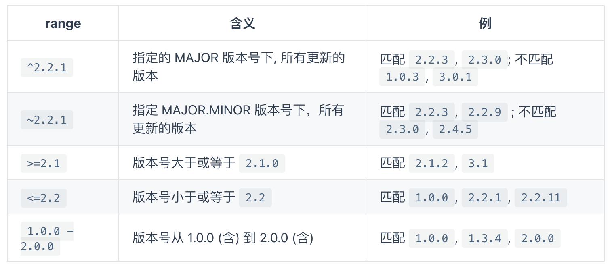

# npm

## NPM 中常用命令

> 全称 node package manager 是世界上最大规模的包管理系统,官网是这样介绍的 Build amazing things...

### npm init

默认大家肯定比较熟悉了，直接 npm init -y 了事，这回我们再来仔细看看

```json
{
  "name": "my-pack",
  "version": "1.0.0",
  "main": "index.js",
  "scripts": {},
  "license": "ISC"
}
```

这里先声明的 npm 版本是 6.7.0,因为我的 node 版本是 v11.14.0

咱们来一个个说说这里比较重要的字段:name、version、main、scripts、license

- name 是当前包的名字，也就是最终发布的 npm 官网上包的名字。不能和已有的包重名哦
- version 就是当前包的版本号，主要我们要探究如果优雅的管理版本号
- main 就是当前包的入口文件，也就是使用 require 默认引入的文件
- scripts 可以配置一些执行脚本
- license 协议许可

### npm install

1. 全局安装

```sh
npm install http-server -g
```

全局安装的意思很简单,就是安装的模块会被安装到全局下，可以在命令行中直接使用安装的包,其实只是在/user/local/bin 目录下作了个链接连接到 /usr/local/lib/node_modules/http-server/bin/http-server 这个文件，当我们执行 http-server 这个命令时，会调用链接的这个文件。

mac 因为有权限问题，这里我们加 sudo 来执行命令

我们可以自己来尝试写一个包 ,创建 bin 目录，新增 www 文件,名字叫什么无所谓~

```js
#! /usr/bin/env node
console.log('珠峰架构') // #! 这句表示采用node来执行此文件，同理 shell可以表示 sh
```

更新 package.json 文件

```json
"bin": {
	"my-pack":"./bin/www" // 这里要注意名字和你建立的文件夹相同
},
```

好啦，写好啦！这里我们先不说发包的事，先用一个常用的命令，他可以实现链接的功能

```sh
npm link
```

这样我们在命令行中直接输入 my-pack 就可以 打印出珠峰架构

2. 本地安装

```sh
npm install webpack --save-dev
```

本地安装很好理解啦~ 就是所谓的在项目中使用，而非在命令行中使用！这里我们看到生成了一个 package-lock.json 文件，而且将安装的模块放到了 node_modules 下,而且 json 中也新增了些内容

```json
"devDependencies": {
    "webpack": "^4.39.3"
}
```

这里我们先来简单介绍下基本的使用

--save-dev 代表当前依赖只在开发时被应用,如果默认不写相当于 --save 为项目依赖开发上线都需要

也可以指定版本号来安装包

```sh
npm i jquery@2.2.0 # install可以简写成i
```

默认执行 npm i 会安装项目中所需要的依赖,如果只想安装生产环境依赖可以增加--production 参数

### package-lock 文件

自 npm 5 之后所有的依赖包都采用扁平化管理的方式
package-lock.json 的作用是锁定依赖安装结构,保证在任意机器上执行 npm install 都会得到完全相同的 node_modules 结果,因为 package-lock.json 存储所有安装的信息

```json
"name": "my-pack",
"version": "1.0.0",
"lockfileVersion": 1,
"requires": true,
"dependencies": {
"@webassemblyjs/ast": {
    "version": "1.8.5", // 当前依赖的版本
    "resolved": "https://registry.npm.taobao.org/@webassemblyjs/ast/download/@webassemblyjs/ast-1.8.5.tgz", // 从哪个渠道安装的
    "integrity": "sha1-UbHF/mV2o0lTv0slPfnw1JDZ41k=", // 内容hash
    "dev": true,
    "requires": {
    "@webassemblyjs/helper-module-context": "1.8.5",
    "@webassemblyjs/helper-wasm-bytecode": "1.8.5",
    "@webassemblyjs/wast-parser": "1.8.5"
    }
},
....
```

如果手动更新了 package.json 文件,执行安装命令会下载对应的新版本,并且会自动更新 lock 文件~

### 依赖方式

1. dependencies 项目依赖

可以使用 npm install -S 或 npm install --save 保存到依赖中，当发布到 npm 上时 dependencies 下的模块会作为依赖，一起被下载!

2. devDependencies 开发依赖

可以使用 npm install -D 或 npm install --save-dev 保存到依赖中。 当发布到 npm 上时 devDependencies 下面的模块就不会自动下载了,如果只是单纯的开发项目 dependencies,devDependencies 只有提示的作用!

3. peerDependencies 同版本依赖

同等依赖,如果你安装我，那么你最好也安装我对应的依赖，如果未安装会报出警告 `bash "peerDependencies": { "jquery": "2.2.0" }`

> npm WARN youxuan@1.0.0 requires a peer of jquery@2.2.0 but none is installed. You must install peer dependencies yourself.

4. bundledDependencies 捆绑依赖

```sh
"bundleDependencies": [
    "jquery"
 ],
```

5. optionalDependencies 可选依赖
   使用 npm pack 打包 tgz 时会将捆绑依赖一同打包
   如果发现无法安装或无法找到，不会影响 npm 的安装

## npm 版本管理

npm 采用了 semver 规范作为依赖版本管理方案。semver 约定一个包的版本号必须包含 3 个数字

`MAJOR.MINOR.PATCH` 意思是 `主版本号.小版本号.修订版本号`

MAJOR 对应大的版本号迭代，做了不兼容旧版的修改时要更新 MAJOR 版本号
MINOR 对应小版本迭代，发生兼容旧版 API 的修改或功能更新时，更新 MINOR 版本号
PATCH 对应修订版本号，一般针对修复 BUG 的版本号

当我们每次发布包的时候都需要升级版本号

```sh
npm version major  # 大版本号加 1，其余版本号归 0
npm version minor  # 小版本号加 1，修订号归 0
npm version patch  # 修订号加 1
```

如果使用 git 管理项目会自动 git tag 标注版本号

来看看版本号的标识含义:



预发版：
alpha(α)：预览版，或者叫内部测试版；一般不向外部发布，会有很多 bug；一般只有测试人员使用。

beta(β)：测试版，或者叫公开测试版；这个阶段的版本会一直加入新的功能；在 alpha 版之后推出。

rc(release candidate)：最终测试版本；可能成为最终产品的候选版本，如果未出现问题则可发布成为正式版本。

`2.1.0-beta.1这样声明的版本用户不会立马使用，可以用来做测试使用`

### scripts 配置

在 package.json 中可以定义自己的脚本通过 npm run 来执行

```json
"scripts": {
   "hello": "echo hello",
   "build": "webpack"
}
```

我们可以使用 npm run hello 执行脚本,也可以使用 npm run build 执行 node_modules/.bin 目录下的 webpack 文件

- npm run 命令执行时，会把 ./node_modules/.bin/ 目录添加到执行环境的 PATH 变量中，因此如果某个命令行包未全局安装，而只安装在了当前项目的 node_modules 中，通过 npm run 一样可以调用该命令。

- 执行 npm 脚本时要传入参数，需要在命令后加 -- 标明, 如 npm run hello -- --port 3000 可以将 --port 参数传给 hello 命令

- npm 提供了 pre 和 post 两种钩子机制，可以定义某个脚本前后的执行脚本,没有定义默认会忽略

```json
"scripts": {
   "prehello":"echo prehello",
   "hello": "echo hello",
   "posthello":"echo posthello"
}
```

可以通过打印全局 env 和 在项目下执行 npm run env 来对比 PATH 属性，不难发现在执行 npm run 的时候确实会将 ./node_modules/.bin/ 目录添加到 PATH 中

## 协议


## npx 用法

1. 执行脚本

```sh
npx webpack
```

是不是省略了配置 scripts 脚本啦！

2. 避免安装全局模块

全局安装的模块会带来很多问题，例如：多个用户全局安装的模块版本不同

```sh
npx create-react-app react-project
```

我们可以直接使用 npx 来执行模块，它会先进行安装，安装执行后会将下载过的模块删除~，这样可以一直使用最新版本啦~

## 包的发布

包的发布比较简单，首先我们需要先切换到官方源,这里推荐个好用的工具 nrm

```sh
npm install nrm -g
nrm use npm # 切换到官方源
```

之后更新名字哈，这里也可以发布 作用域包 选定版本后,忽略文件夹可以使用 .npmignore,一切就绪后，发布！！！

```
npm publish
```
