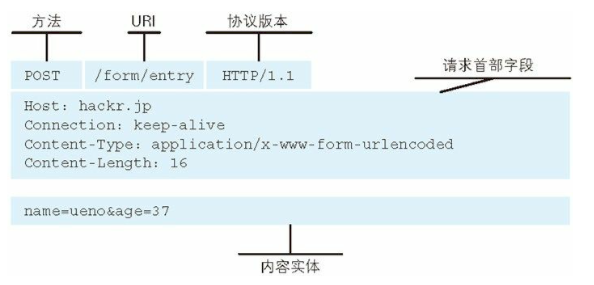

# HTTP 核心概念

## 什么是 HTTP?应用层

通常的网络是在 TCP/IP 协议族的基础上来运作的，HTTP 是一个子集。

## TCP/IP 协议族 (HTTP 应用层协议 在传输层的基础上增加了一些自己的内容)

协议简单来说就是通信的规则，例如：通信时谁先发起请求，怎样结束，如何进行通信。把互联网相关的协议统称起来称为 TCP/IP

## 协议分层(OSI 协议分层)

> (物，数)，网，传，(会，表，应)

- 应用层 HTTP,FTP,DNS (与其他计算机进行通讯的一个应用服务，向用户提供应用服务时的通信活动)

- 传输层 TCP（可靠） UDP 数据传输 (HTTP -> TCP DNS->UDP)

- 网络层 IP 选择传输路线 (通过 ip 地址和 mac 地址)(使用 ARP 协议凭借 mac 地址进行通信)

- 链路层 网络连接的硬件部分


## HTTP 特点

- http 是不保存状态的协议，使用 cookie 来管理状态 (登录 先给你 cookie 我可以看一下你有没有 cookie)
- 为了防止每次请求都会造成无谓的 tcp 链接建立和断开，所以采用保持链接的方式 keep-alive
- 以前发送请求后需要等待并收到响应，才能发下一个，现在都是管线化的方式 (js css 可以并发请求 6 2) cdn

## HTTP 缺点

1. 通信采用明文
2. 不验证通信方的身份
3. 无法验证内容的完整性 (内容可能被篡改)
   > 通过 SSL（安全套阶层）建立安全通信线路 HTTPS (超文本传输安全协议)

## HTTP 方法 (get post 简单请求) Resful 风格

- GET:获取资源 /user？

- POST:传输实体主体 请求体中

- PUT：来传输文件

- HEAD: 获取报文首

- DELETE: 删除文件

- OPTIONS:询问支持的方法 跨域 如果默认发送的是 get/post 不会发送 options 的 ""复杂请求""

- get /post (a:1) headers:{a:1} put / delete 复杂的请求

## HTTP 状态码 (发请求 命令行 curl 命令) 服务端

- curl 命令行工具 postman

- 1xx 信息性状态码 websocket upgrade

- 2xx 成功状态码 200 204(没有响应体) 206(范围请求 暂停继续下载) 获取网页的部分请求

- 3xx 重定向状态码 301 302 303 post -> get 304(删除报文主体 在次发送请求) 307 (不会从 POST 转为 GET)

- 4xx 客户端错误状态码 400 401 403 404 405 方法不允许

- 5xx 服务端错误状态码 500 503

## http 客户端和服务端通信

Http 报文，http 交互的信息称之为 http 报文


通用首部字段：请求和响应报文都有的首部

实体首部字段：描述实体部分的字段




## 报文应用

- Content-Encoding : gzip 压缩 form-data: 多部分对象集合 上传文件

- range: 范围请求 206 accept-language：内容协商 前端控制 后端控制

- host：单主机多域名 304 http 缓存

- referer:访问来源 防盗链 proxy:代理、网关和隧道

- user-agent:用户内核 安全相关的头: X-Frame-Options、X-XSS-Protection (安全 csrf xss https 加密)

## 实现静态服务

mime 模块处理请求文件类型

```js
npm install mime -g
```

```js
let server = http.createServer((req, res) => {
  let { pathname } = url.parse(req.url)
  // 根据请求路径查找文件
  let absFilePath = path.join(__dirname, pathname)
  fs.stat(absFilePath, (err, stat) => {
    if (err) {
      return res.end(`Not Found`)
    }
    if (stat.isDirectory()) {
      // 尝试查找index.html
      absFilePath = path.join(absFilePath, 'index.html')
      fs.access(absFilePath, (err) => {
        if (err) {
          res.end(`Not Found`)
        } else {
          let type = mime.getType(absFilePath)
          res.setHeader('Content-Type', type + ';charset=utf-8')
          fs.createReadStream(absFilePath).pipe(res)
        }
      })
    } else {
      let type = mime.getType(absFilePath)
      res.setHeader('Content-Type', type + ';charset=utf-8')
      fs.createReadStream(absFilePath).pipe(res)
    }
  })
})
server.listen(3000)
```

## 通过类改写静态服务

通过 async 和 await 改写主体流程

```js
let http = require('http')
let fs = require('fs').promises
let { createReadStream } = require('fs')
let url = require('url')
let path = require('path')
let mime = require('mime')
class Server {
  async handleServer(req, res) {
    let { pathname } = url.parse(req.url)
    let absFilePath = path.join(__dirname, pathname)
    try {
      let statObj = await fs.stat(absFilePath)
      if (statObj.isDirectory()) {
        absFilePath = path.join(absFilePath, 'index.html')
      }
      this.sendFile(req, res, absFilePath, statObj)
    } catch (err) {
      console.log(err)
      this.sendError(req, res)
    }
  }
  sendFile(req, res, absFilePath, statObj) {
    let type = mime.getType(absFilePath)
    res.setHeader('Content-Type', type + ';charset=utf-8')
    createReadStream(absFilePath).pipe(res)
  }
  sendError(req, res) {
    res.statusCode = 404
    res.end(`Not Found`)
  }
  start() {
    let server = http.createServer(this.handleServer.bind(this))
    server.listen(...arguments)
  }
}
let server = new Server()
server.start(3000)
```

## ajax 跨域问题

cors 解决跨域问题

```js
'Access-Control-Allow-Origin', 'http://a.zf.cn:5000' // 允许某个域访问
'Access-Control-Allow-Credentials', 'true' // 允许携带cookie
'Access-Control-Allow-Headers', 'a' // 允许携带的header
'Access-Control-Max-Age', '3600' // 设置options的请求发送时长
```

```js
let xhr = new XMLHttpRequest()
xhr.open('GET', 'http://localhost:5000/user', true)
xhr.setRequestHeader('a', '1') // 设置请求头

xhr.onload = function () {
  console.log(xhr.responseText)
}
xhr.withCredentials = true // 设置强制携带cookie
xhr.send()
```

跨域配置

```js
res.setHeader('Access-Control-Allow-Origin', 'http://a.zf.cn:5000')
res.setHeader('Access-Control-Allow-Credentials', 'true')
res.setHeader('Access-Control-Max-Age', 3600)
res.setHeader('Access-Control-Allow-Headers', 'a')
if (req.method === 'OPTIONS') {
  // options请求直接结束即可
  return res.end()
}
```

## http 缓存问题

1. 强制缓存 (Cache-Control && Expires)

Cache-Control:

- private 客户端可以缓存
- public 客户端和代理服务器都可以缓存
- max-age=60 缓存内容将在 60 秒后失效
- no-cache 需要使用对比缓存验证数据,强制向源服务器再次验证 (没有强制缓存)
- no-store 所有内容都不会缓存，强制缓存和对比缓存都不会触发 (不缓存)


2. 对比缓存

- Last-Modified & If-Modified-Since

​- ETag & If-None-Match


## 压缩与解压缩处理(accept-encoding)

使用 GZIP / DEFLATE 实现解压

```js
var zlib = require('zlib')
var fs = require('fs')
var http = require('http')
http
  .createServer(function (request, response) {
    var raw = fs.createReadStream('.' + request.url)
    var acceptEncoding = request.headers['accept-encoding']
    if (!acceptEncoding) {
      acceptEncoding = ''
    }
    if (acceptEncoding.match(/\bdeflate\b/)) {
      response.setHeader('Content-Encoding', 'deflate')
      raw.pipe(zlib.createDeflate()).pipe(response)
    } else if (acceptEncoding.match(/\bgzip\b/)) {
      response.setHeader('Content-Encoding', 'gzip')
      raw.pipe(zlib.createGzip()).pipe(response)
    } else {
      raw.pipe(response)
    }
  })
  .listen(9090)
```

## 多语言 (accept-language)

```js
let http = require('http')
let pack = {
  en: {
    title: 'hello',
  },
  cn: {
    title: '欢迎',
  },
}

function request(req, res) {
  let acceptLangulage = req.headers['accept-language']
  let lan = 'en'
  if (acceptLangulage) {
    lan = acceptLangulage
      .split(',')
      .map((item) => {
        let values = item.split(';')
        return {
          name: values[0].split('-')[0],
          q: isNaN(values[1]) ? 1 : parseInt(values[1]),
        }
      })
      .sort((lan1, lan2) => lan1.q - lan2.q)
      .shift().name
  }
  res.end(pack[lan] ? pack[lan].title : pack['en'].title)
}
let server = http.createServer()
server.on('request', request)
server.listen(8080)
```

## cookie+session 实现登录权限

```sh
yarn add koa koa-router koa-views koa-bodyparser koa-session
```

```js
let Koa = require('koa')
let Router = require('koa-router')
let bodyparser = require('koa-bodyparser')
let views = require('koa-views')
let session = require('koa-session')
let router = new Router()
let app = new Koa()
app.use(bodyparser())
app.use(session({}, app))
app.keys = ['zf']
app.use(
  views(__dirname + '/views', {
    map: {
      html: 'ejs',
    },
  })
)
router.get('/', async (ctx) => {
  // 默认访问首页
  await ctx.render('home.html')
})
router.post('/list', async (ctx) => {
  let { username, password } = ctx.request.body
  if (username === password) {
    // 用户名和密码相等就认为用户登录过了
    ctx.session.user = { username }
    ctx.redirect('/list')
  } else {
    ctx.redirect('/')
  }
})
router.get('/list', async (ctx) => {
  // 登陆后才能访问 获取列表页面
  let { username } = ctx.session.user || {}
  if (username) {
    let r = await ctx.render('list.html', { username })
    console.log(r)
  } else {
    ctx.redirect('/')
  }
})
app.use(router.routes())
app.listen(4000)
```

## 什么是 jwt？

> JSON Web Token（JWT）是目前最流行的跨域身份验证解决方案

解决问题：session 不支持分布式架构，无法支持横向扩展，只能通过数据库来保存会话数据实现共享。如果持久层失败会出现认证失败。

优点：服务器不保存任何会话数据，即服务器变为无状态，使其更容易扩展。

JWT 包含了使用.分隔的三部分

- Header 头部

```js
{ "alg": "HS256", "typ": "JWT"}
// algorithm => HMAC SHA256
// type => JWT
```

- Payload 负载、载荷

```js
JWT 规定了7个官方字段
iss (issuer)：签发人
exp (expiration time)：过期时间
sub (subject)：主题
aud (audience)：受众
nbf (Not Before)：生效时间
iat (Issued At)：签发时间
jti (JWT ID)：编号
```

- Signature 签名
  对前两部分的签名，防止数据篡改

```js
HMACSHA256(base64UrlEncode(header) + '.' + base64UrlEncode(payload), secret)
```

JWT 作为一个令牌（token），有些场合可能会放到 URL（比如 api.example.com/?token=xxx）。Base64 有三个字符+、/和=，在 URL 里面有特殊含义，所以要被替换掉：=被省略、+替换成-，/替换成\_ 。这就是 Base64URL 算法。

### 使用方式

HTTP 请求的头信息 Authorization 字段里面

```js
Authorization: Bearer <token>
```

通过 url 传输

```js
http://www.xxx.com/pwa?token=xxxxx
```

如果是 post 请求也可以放在请求体中

### 实际应用

```js
let Koa = require('koa')
let Router = require('koa-router')
let bodyparser = require('koa-bodyparser')
let jwt = require('jwt-simple')
let router = new Router()
let app = new Koa()
app.use(bodyparser())
let secret = 'zfpx'
// 验证是否登陆
router.post('/login', async (ctx) => {
  let { username, password } = ctx.request.body
  if (username === 'admin' && password === 'admin') {
    let token = jwt.encode(username, secret)
    ctx.body = {
      code: 200,
      username,
      token,
    }
  }
})
// 验证是否有权限
router.get('/validate', async (ctx) => {
  let Authorization = ctx.get('authorization')
  let [, token] = Authorization.split(' ')
  if (token) {
    try {
      let r = jwt.decode(token, secret)
      ctx.body = {
        code: 200,
        username: r,
        token,
      }
    } catch (e) {
      ctx.body = {
        code: 401,
        data: '没有登陆',
      }
    }
  } else {
    ctx.body = {
      code: 401,
      data: '没有登陆',
    }
  }
})
app.use(router.routes())
app.listen(4000)
```

### 原理实现

```js
let myJwt = {
  sign(content, secret) {
    let r = crypto.createHmac('sha256', secret).update(content).digest('base64')
    return this.base64urlEscape(r)
  },
  base64urlEscape(str) {
    return str.replace(/\+/g, '-').replace(/\//g, '_').replace(/=/g, '')
  },
  toBase64(content) {
    return this.base64urlEscape(
      Buffer.from(JSON.stringify(content)).toString('base64')
    )
  },
  encode(username, secret) {
    let header = this.toBase64({ typ: 'JWT', alg: 'HS256' })
    let content = this.toBase64(username)
    let sign = this.sign([header, content].join('.'), secret)
    return [header, content, sign].join('.')
  },
  base64urlUnescape(str) {
    str += new Array(5 - (str.length % 4)).join('=')
    return str.replace(/\-/g, '+').replace(/_/g, '/')
  },
  decode(token, secret) {
    let [header, content, sign] = token.split('.')
    let newSign = this.sign([header, content].join('.'), secret)
    if (sign === newSign) {
      return Buffer.from(this.base64urlUnescape(content), 'base64').toString()
    } else {
      throw new Error('被篡改')
    }
  },
}
```
