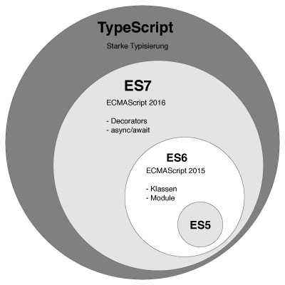

# 初识 TypeScript

## 什么是 TypeScript

- `TypeScript`是由微软开发的一款开源的编程语言
- `TypeScript`是`Javascript`的超集，遵循最新的`ES5/ES6`规范。`TypeScript`扩展了`Javascript`语法
- `TypeScript`更像后端`Java`、`C#`这样的面向对象语言可以让 JS 开发大型企业应用
- 越来越多的项目是基于`TS`的，比如`VSCode、Angular6、Vue3、React16/17`
- `TS`提供的类型系统可以帮助我们在写代码的时候提供更丰富的语法提示
- 在创建前的编译阶段经过类型系统的检查，就可以避免很多线上的错误

> `TypeScript`不会取代`JS`, 尤雨溪： 我认为将类型添加到`JS`本身是一个漫长的过程 。让委员会设计一个类型系统是（根据`TC39`的经历来判断）不切实际的



## 安装编译 TypeScript

命令行运行如下命令，全局安装 `TypeScript`：

```javascript
npm install -g typescript
```

安装完成后，在控制台运行如下命令，检查安装是否成功

```javascript
tsc - V
```

生成配置文件

```javascript
tsc --init # 生成tsconfig.json
```

```json
{
  "compilerOptions": {
    /* Basic Options */
    "target": "es5" /* Specify ECMAScript target version: 'ES3' (default), 'ES5', 'ES2015', 'ES2016', 'ES2017','ES2018' or 'ESNEXT'. 指定ECMAScript的目标版本*/,
    "module": "commonjs" /* Specify module code generation: 'none', 'commonjs', 'amd', 'system', 'umd', 'es2015', or 'ESNext'. 指定模块代码的生成方式*/
    // "lib": [],                             /* Specify library files to be included in the compilation. 指定编译的时候用来包含的编译文件*/
    // "allowJs": true,                       /* Allow javascript files to be compiled. 允许编译JS文件*/
    // "checkJs": true,                       /* Report errors in .js files. 在JS中包括错误*/
    // "jsx": "preserve",                     /* Specify JSX code generation: 'preserve', 'react-native', or 'react'. 指定JSX代码的生成方式 是保留还是react-native或者react*/
    // "declaration": true,                   /* Generates corresponding '.d.ts' file.生成相应的类型声明文件 */
    // "declarationMap": true,                /* Generates a sourcemap for each corresponding '.d.ts' file. 为每个类型声明文件生成相应的sourcemap*/
    // "sourceMap": true,                     /* Generates corresponding '.map' file. 生成对应的map文件 */
    // "outFile": "./",                       /* Concatenate and emit output to single file. 合并并且把编译后的内容输出 到一个文件里*/
    // "outDir": "./",                        /* Redirect output structure to the directory.按原始结构输出到目标目录 */
    // "rootDir": "./",                       /* Specify the root directory of input files. Use to control the output directory structure with --outDir. 指定输入文件的根目录，用--outDir来控制输出的目录结构*/
    // "composite": true,                     /* Enable project compilation 启用项目编译*/
    // "removeComments": true,                /* Do not emit comments to output. 移除注释*/
    // "noEmit": true,                        /* Do not emit outputs. 不要输出*/
    // "importHelpers": true,                 /* Import emit helpers from 'tslib'. */
    // "downlevelIteration": true,            /* Provide full support for iterables in 'for-of', spread, and destructuring when targeting 'ES5' or 'ES3'. 当目标是ES5或ES3的时候提供对for-of、扩展运算符和解构赋值中对于迭代器的完整支持*/
    // "isolatedModules": true,               /* Transpile each file as a separate module (similar to 'ts.transpileModule').r把每一个文件转译成一个单独的模块 */

    /* Strict Type-Checking Options */
    //"strict": true,                           /* Enable all strict type-checking options. 启用完全的严格类型检查 */
    // "noImplicitAny": true,                 /* Raise error on expressions and declarations with an implied 'any' type. 不能使用隐式的any类型*/
    // "strictNullChecks": true,              /* Enable strict null checks. 启用严格的NULL检查*/
    // "strictFunctionTypes": true,           /* Enable strict checking of function types. 启用严格的函数类型检查*/
    // "strictBindCallApply": true,           /* Enable strict 'bind', 'call', and 'apply' methods on functions.启用函数上严格的bind call 和apply方法 */
    // "strictPropertyInitialization": true,  /* Enable strict checking of property initialization in classes. 启用类上初始化属性检查*/
    // "noImplicitThis": true,                /* Raise error on 'this' expressions with an implied 'any' type.在默认的any中调用 this表达式报错 */
    // "alwaysStrict": true,                  /* Parse in strict mode and emit "use strict" for each source file. 在严格模式下解析并且向每个源文件中发射use strict*/

    /* Additional Checks */
    // "noUnusedLocals": true,                /* Report errors on unused locals. 有未使用到的本地变量时报错 */
    // "noUnusedParameters": true,            /* Report errors on unused parameters. 有未使用到的参数时报错*/
    // "noImplicitReturns": true,             /* Report error when not all code paths in function return a value. 当不是所有的代码路径都有返回值的时候报错*/
    // "noFallthroughCasesInSwitch": true,    /* Report errors for fallthrough cases in switch statement. 在switch表达式中没有替代的case会报错 */

    /* Module Resolution Options */
    // "moduleResolution": "node",            /* Specify module resolution strategy: 'node' (Node.js) or 'classic' (TypeScript pre-1.6). 指定模块的解析策略 node classic*/
    // "baseUrl": "./",                       /* Base directory to resolve non-absolute module names. 在解析非绝对路径模块名的时候的基准路径*/
    // "paths": {},                           /* A series of entries which re-map imports to lookup locations relative to the 'baseUrl'. 一些路径的集合*/
    // "rootDirs": [],                        /* List of root folders whose combined content represents the structure of the project at runtime. 根目录的列表，在运行时用来合并内容*/
    // "typeRoots": [],                       /* List of folders to include type definitions from. 用来包含类型声明的文件夹列表*/
    // "types": [],                           /* Type declaration files to be included in compilation.在编译的时候被包含的类型声明 */
    // "allowSyntheticDefaultImports": true,  /* Allow default imports from modules with no default export. This does not affect code emit, just typechecking.当没有默认导出的时候允许默认导入，这个在代码执行的时候没有作用，只是在类型检查的时候生效 */
    //"esModuleInterop": true                   /* Enables emit interoperability between CommonJS and ES Modules via creation of namespace objects for all imports. Implies 'allowSyntheticDefaultImports'.*/
    // "preserveSymlinks": true,              /* Do not resolve the real path of symlinks.不要symlinks解析的真正路径 */

    /* Source Map Options */
    // "sourceRoot": "",                      /* Specify the location where debugger should locate TypeScript files instead of source locations. 指定ts文件位置*/
    // "mapRoot": "",                         /* Specify the location where debugger should locate map files instead of generated locations. 指定 map文件存放的位置 */
    // "inlineSourceMap": true,               /* Emit a single file with source maps instead of having a separate file. 源文件和sourcemap 文件在同一文件中，而不是把map文件放在一个单独的文件里*/
    // "inlineSources": true,                 /* Emit the source alongside the sourcemaps within a single file; requires '--inlineSourceMap' or '--sourceMap' to be set. 源文件和sourcemap 文件在同一文件中*/

    /* Experimental Options */
    // "experimentalDecorators": true,        /* Enables experimental support for ES7 decorators. 启动装饰器*/
    // "emitDecoratorMetadata": true,         /* Enables experimental support for emitting type metadata for decorators. */
  }
}
```

执行编译

```javascript
tsc # 可以将ts文件编译成js文件
tsc --watch # 监控ts文件变化实时编译js文件
```

`vscode`运行

```javascript
Terminal->Run Task-> tsc:build 编译
Terminal->Run Task-> tsc:watch 编译并监听
```

`npm scripts`运行

```javascript
"scripts": {
  "dev": "tsc:watch"
}
```
