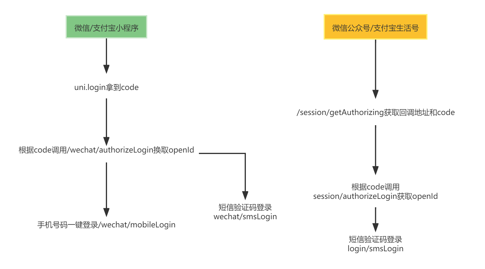

# uni-app 开发流程规范与注意事项

## 什么是 uni-app

`uni-app` 是一个使用 `Vue.js` 开发所有前端应用的框架，开发者编写一套代码，可发布到 `iOS`、`Android`、`Web（响应式）`、以及各种小程序（微信/支付宝/百度/头条/飞书/QQ/快手/钉钉/淘宝）、快应用等多个平台。

## 文件命名规范

- 统一采用短横线`-`拼接方式`（kebab-case）`

## 开发注意事项

1. 为兼容多端运行，建议使用`flex`布局进行开发
2. 支付宝小程序组件内 `image` 标签不可使用相对路径
3. 采用`npm`安装依赖、不要使用`cnpm`淘宝镜像
4. 支付宝小程序需要开启`component2`，否则使用`uview`组件会报错
5. 不要再`span`标签上加点击事件，否则在支付宝小程序上会失效

## 打包配置 vue.config.js

```javascript
const path = require('path')
const CopyWebpackPlugin = require('copy-webpack-plugin')
module.exports = {
  chainWebpack: (config) => {
    // 发行或运行时启用了压缩时会生效
    // config.optimization.minimizer("terser").tap((args) => {
    //   const compress = args[0].terserOptions.compress;
    //   // 非 App 平台移除 console 代码(包含所有 console 方法，如 log,debug,info...)
    //   compress.drop_console = true;
    //   compress.pure_funcs = [
    //     "__f__", // App 平台 vue 移除日志代码
    //     // 'console.debug' // 可移除指定的 console 方法
    //   ];
    //   return args;
    // });
  },
  configureWebpack: {
    plugins: [
      new CopyWebpackPlugin([
        {
          from: path.join(__dirname, '/scan-code'),
          to: path.join(__dirname, '/unpackage/dist/build/h5'),
        },
      ]),
    ],
    devServer: {
      // 调试时允许内网穿透，让外网的人访问到本地调试的H5页面
      disableHostCheck: true,
      proxy: {
        '/uniapp/2.0': {
          target: 'https://uniapp-pre.acs.aipark.com',
          // target: "https://uniapp.acs.aipark.com",
          changeOrigin: true,
          pathRewrite: {
            '^/uniapp/2.0': '/uniapp/2.0',
          },
        },
      },
    },
  },
}
```

## 全局变量

- 全局变量采用统一采用`vuex`形式
- 变量统一采用`vuex_`开头定义
- 需要永久存储，且下次 APP 启动需要取出的,要把`state`变量放到`saveStateKeys`数组中,并在`state`对象中采用`lifeData`赋值

```javascript
let lifeData = {}

try {
  // 尝试获取本地是否存在lifeData变量，第一次启动APP时是不存在的
  lifeData = uni.getStorageSync('lifeData')
} catch (e) {}

// 需要永久存储，且下次APP启动需要取出的，在state中的变量名
let saveStateKeys = ['vuex_user', 'vuex_token']

const store = new Vuex.Store({
  state: {
    // 如果上面从本地获取的lifeData对象下有对应的属性，就赋值给state中对应的变量
    vuex_user: lifeData.vuex_user ? lifeData.vuex_user : {},
    vuex_token: lifeData.vuex_token ? lifeData.vuex_token : '',
    // 如果vuex_version无需保存到本地永久存储，无需lifeData.vuex_version方式
    vuex_version: '1.0.1',
  },
})
```

## api 统一管理

所有`api`请求都要放到根目录`api`文件下对应的`module`模块中,

以首页模块为例

```javascript
// 在模块中定义
export default function (vm) {
  let getInfo = (params = {}) => vm.$u.post('/a/a/', params)
  return {
    namespace: 'indexApi',
    method: {
      getInfo,
    },
  }
}
// 在页面中使用
this.$u.indexApi.getInfo()
this.$u.infoApi.getInfo()
this.$u.myApi.getInfo()
this.$u.orderApi.getInfo()
this.$u.parkingApi.getInfo()
// 分五个大模块就行，不在往下细分
// indexApi 为首页模块请求
// infoApi 为咨询模块请求
// myApi 为我的模块请求
// orderApi 为订单模块请求
// parkingApi 为停车模块请求
```

## 无网络连接处理

需要在每个页面底部引入`<u-no-network></u-no-network>`组件，会自动处理无网络情况

## 路由跳转

统一采用 `uview` 提供的跳转 `api`
[路由跳转 api](https://www.uviewui.com/js/route.html)

## 主动跳转登录页面

需要向`vuex`全局变量添加一些信息，用于登录之后返回上一页，如下

```js
let data = {}
data.curRoute = '' // 当前页面路由
data.curParam = {
  type: 1,
} // 当前页面参数
this.$u.vuex('vuex_login_back_info', data)
```

## HTTP 拦截器

```javascript
const install = (Vue, vm) => {
  Vue.prototype.$u.http.setConfig({
    baseUrl: vm.vuex_base_url,
    originalData: true,
    showLoading: false,
  })
  // 请求拦截，配置Token等参数
  Vue.prototype.$u.http.interceptor.request = (config) => {
    // console.log(config, "config");
    // console.log(vm, "vm");
    if (config.method == 'POST') {
      config.header['Content-Type'] = 'application/x-www-form-urlencoded'
    }
    config.header['Session-Id'] = vm.vuex_token
    config.header['source'] = vm.vuex_source
    return config
  }
  // 响应拦截，判断状态码是否通过
  Vue.prototype.$u.http.interceptor.response = (response) => {
    let res = response.data
    if (response.statusCode == 200) {
      if (res.state == 0) {
        // 如果把originalData设置为了true，这里return回什么，this.$u.post的then回调中就会得到什么
        return res
      } else if (res.state == 2 || res.state == 3) {
        let routes = getCurrentPages() // 获取当前打开过的页面路由数组
        let curRoute = routes[routes.length - 1].route //获取当前页面路由
        let curParam = routes[routes.length - 1].options //获取路由参数
        // 拼接参数
        let param = ''
        for (let key in curParam) {
          param += '&' + key + '=' + curParam[key]
        }
        let data = {}
        data.curRoute = curRoute
        data.curParam = curParam
        vm.$u.vuex('vuex_token', '')
        if (
          data.curRoute != 'pages/tabbar/index/index' &&
          data.curRoute != 'pages/tabbar/my/my'
        ) {
          uni.showModal({
            title: '您还未登录',
            content: '订单随时查，缴费更便捷',
            confirmText: '去登录',
            success: (res) => {
              if (res.confirm) {
                console.log(data, '当前路由信息')
                vm.$u.vuex('vuex_login_back_info', {
                  curRoute: data.curRoute,
                  curParam: data.curParam,
                  type:
                    data.curRoute == 'pages/tabbar/order/order' ||
                    data.curRoute == 'pages/tabbar/parking/parking'
                      ? 'switchTab'
                      : 'redirectTo',
                })
                console.log(uni.getStorageSync('lifeData'), 'lifeData')
                vm.$u.route({
                  url: '/pages/login/login',
                })
              } else if (res.cancel) {
                console.log('用户点击取消')
              }
            },
          })
        }
        return false
      } else if (res.state == 1) {
        uni.showToast({
          title: res.desc,
          icon: 'none',
          duration: 4000,
        })
        return false
      } else {
        return res
      }
    } else {
      if (res.state == 500) {
        uni.showModal({
          title: '服务器内部错误500',
          showCancel: false,
        })
        return false
      }
      uni.showModal({
        title: res.desc || `${res.path} ${res.error} ${res.status}`,
        showCancel: false,
      })
      return false
    }
  }
}

export default {
  install,
}
```

## 授权登录流程



## 扫码跳转流程
