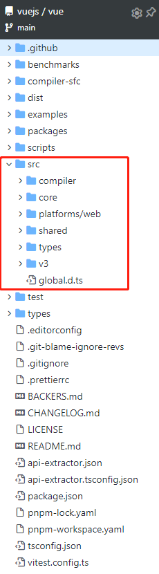
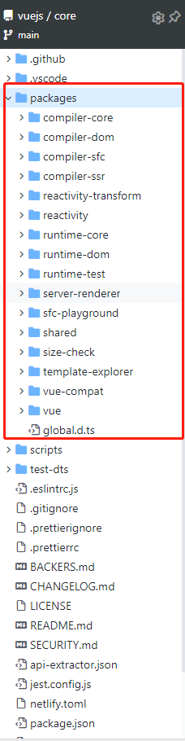
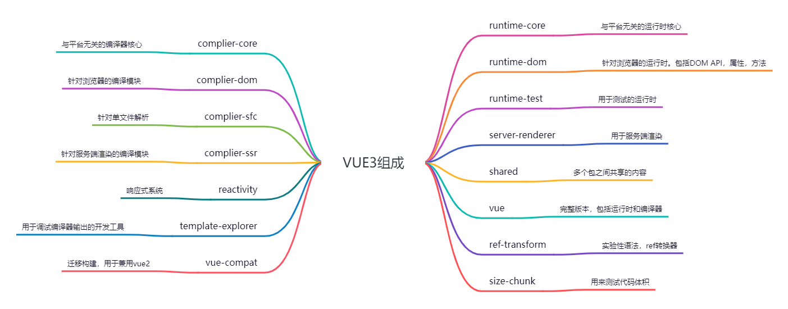

# Vue3 环境搭建

## Monorepo 管理项目

> Monorepo 是管理项目代码的一个方法，指在一个项目仓库（repo）中管理多个模块/包（package）

Vue2 的代码放到了 src 目录中，根据功能进行了目录的拆分，Vue3 的源码则采用 monorepo 的方式进行管理，将模块拆分到 package 目录中，作为一个个包来管理，这样职责划分更加明确




- 一个仓库可以维护多个包、不用到处找仓库
- 方便版本管理和依赖管理，模块之间的引用调用更加方便

## Vue3 项目结构



## Vue3 采用 typescript

复杂的框架项目开发，使用类型语言更有利于代码的维护，在编码期间就可以帮我们做类型检查，避免错误，所以 TS 已经是主流框架的标配

> vue2 早起采用 Flow 来进行类型校验（Vue2 中对 TS 的支持并不友好），Vue3 源码采用 TS 来进行重写。同时 Vue2.7 也采用 TS 重构。TS 能对代码提供良好的类型校验，同时也支持复杂的类型推导

## 全局安装 pnpm

> Vue3 中使用`pnpm` `workspace`来实现 `monorepo`（pnpm 是快速、节省磁盘空间的包管理器。主要采用符号链接的方式管理模块）

```javascript
npm install pnpm -g // 全局安装pnpm

pnpm init -y // 初始化配置文件
```

## 创建.npmrc 文件

```javascript
shamefully-hoist = true
```

> 这里您可以尝试一下 Vue3，pnpm install vue@next 此时默认情况下 vue3 中依赖的模块不会被提升到 node_modules 下，添加羞耻的提升可以将 vue3 所依赖的模块提升到 node_modules 中

- 比如，用`npm`安装`bootstrap`依赖会自动安装`JQ` ,那么我们可以直接 用 `import`直接引入`JQ`
- 但是用 pnpm 安装`bootstrap`会把`bootstrap`其他依赖放到`.pnpm`文件下面，这样用`import`直接引入`JQ`是不行的，那么要解决这个问题就要用`shamefully-hoist = true`这个命令，一般在开发源码时才会使用（羞耻的提升）
- 没有安装就不应该可以引入，所有 npm 这种方式是不合理的

## 配置 workspace

新建 pnpm-workspace.yaml

```yaml
packages:
  - 'packages/*'
```

> 将 packages 下所有的目录都作为包进行管理。这样我们的 Monorepo 就搭建好了。确实比 lerna + yarn workspace 更快捷

## 初始化 TS

```javascript
pnpm tsc --init
```

先添加一些 tsconfig 常用配置，后续需要其他的在添加

```json
{
  "compilerOptions": {
    "outDir": "dist", // 输出的目录
    "sourceMap": true, // 采用sourceMap
    "target": "es2016", // 目标语法
    "module": "esnext", // 模块格式
    "moduleResolution": "node", // 模块解析方式
    "strict": false, // 严格方式
    "resolveJsonModule": true, // 解析json模块
    "esModuleInterop": true, // 允许通过es6语法引入commonjs模块
    "jsx": "preserve", // jsx不转义
    "lib": ["esnext", "dom"] // 支持的类库
  }
}
```

## 创建模块

> 在 packages 目录下新建两个 package，用于手写响应式原理

- reactivity 响应式模块
- shared 共享模块

所有的包入口均为 `src/index.ts` 这样可以实现统一打包，并在包信息中增添打包格式`formats`属性，用于最终打包的格式

- reactivity/package.json

```json
{
  "name": "@vue/reactivity",
  "version": "1.0.0",
  "main": "index.js",
  "module": "dist/reactivity.esm-bundler.js",
  "unpkg": "dist/reactivity.global.js",
  "buildOptions": {
    "name": "VueReactivity",
    "formats": ["esm-bundler", "cjs", "global"]
  }
}
```

- shared/package.json

```json
{
  "name": "@vue/shared",
  "version": "1.0.0",
  "main": "index.js",
  "module": "dist/shared.esm-bundler.js",
  "buildOptions": {
    "formats": ["esm-bundler", "cjs"]
  }
}
```

> formats 为自定义的打包格式，有 esm-bundler 在构建工具中使用的格式、esm-browser 在浏览器中使用的格式、cjs 在 node 中使用的格式、global 立即执行函数的格式

```js
pnpm install @vue/shared@workspace --filter @vue/reactivity
```

## 开发环境 esbuild 打包

创建开发时执行脚本， 参数为要打包的模块

### 解析用户参数

```json
"scripts": {
    "dev": "node scripts/dev.js reactivity -f global"
}
```

```js
const { build } = require('esbuild')
const { resolve } = require('path')
const args = require('minimist')(process.argv.slice(2))

const target = args._[0] || 'reactivity'
const format = args.f || 'global'

const pkg = require(resolve(__dirname, `../packages/${target}/package.json`))

const outputFormat = format.startsWith('global') // 输出的格式
  ? 'iife'
  : format === 'cjs'
  ? 'cjs'
  : 'esm'

const outfile = resolve(
  // 输出的文件
  __dirname,
  `../packages/${target}/dist/${target}.${format}.js`
)

build({
  entryPoints: [resolve(__dirname, `../packages/${target}/src/index.ts`)],
  outfile,
  bundle: true,
  sourcemap: true,
  format: outputFormat,
  globalName: pkg.buildOptions?.name,
  platform: format === 'cjs' ? 'node' : 'browser',
  watch: {
    // 监控文件变化
    onRebuild(error) {
      if (!error) console.log(`rebuilt~~~~`)
    },
  },
}).then(() => {
  console.log('watching~~~')
})
```
