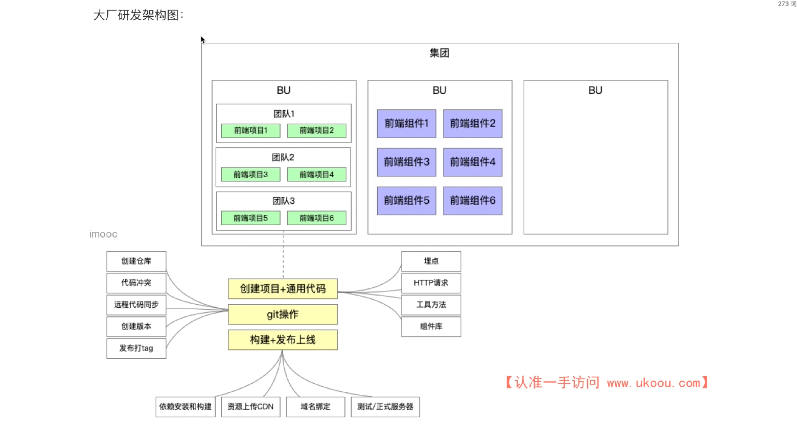

# 前端架构课需求分析

## 为什么需要优化研发流程?

1. 项目量级增加：几千行代码->几万行代码
2. 项目数量扩大：几个项目->几千个项目
3. 项目复杂度高：Web 项目->H5/PC/小程序/后端/脚手架
4. 团队人数增长：几个人->几百人
5. 传统的项目研发流程已经无法满足业务需求
6. 前端研发流程进化的内核：效率、质量、性能

## 大厂研发流程总览

## 项目创建流程思考

1. 如何让上千名前端开发创建项目体验趋于一致？
2. 如何高效沉淀项目中的最佳实践，并能够快速复用？
3. 如何在创建项目后尽可能少改动源码，最快速度投入开发？

### 项目创建流程介绍

## 前端监控体系介绍

1. 前端监控的三个阶段？
   - 初阶：使用第三方平台，百度、友盟、阿里云 ARMS 等
   - 中阶：自研前端监控库，缺乏完整的监控体系
   - 高阶：自研前端监控平台，具备完整的监控体系
2. 前端监控的数据有什么用?
   - 流量数据监控，如：PV、UV、点击率、页面停留时长等
   - 自定义事件监控，如：曝光事件、滑动事件、请求事件等
   - 交易指标监控，如：成交额、转化率等
   - 其他综合分析，如：用户画像分析、流量漏斗、销量预测等

## 项目测试体系介绍

1. 前端项目如何做测试？

- 测试同学：功能测试，性能测试，测试用例
- 前端同学：单元测试，常用于组件库、API 等（Jest、Mocha）

2. 上线项目如何做测试？

- 测试同学回归
- 利用前端监控，进行监控项目稳定性和性能，并上报前端日志
  - 稳定性：如`jserror`、`白屏检测`等
  - 性能：如`秒开率`、`首屏渲染时长`、`接口请求时长`等
  - 前端日志：如`console.log`、`API请求记录`等

## 前端发布体系介绍

1. 发布体系：利用脚手架统一管理发布阶段
2. 利用脚手架做发布的优势

   - 规范：利用统一发布规范，如 `commit` 记录、分支名称、代码规范等
   - 效率：避免大量重复操作，浪费开发时间
   - 安全：构建和发布全部在云端操作，避免个人发布时带来的安全隐患

3. 脚手架发布的流程？

   - `GitFlow` 自动化代码提交
   - 远程代码自动检查
   - 云端完成构建与发布操作

## 慕课乐高整体架构设计图

## 大厂前端研发架构图

