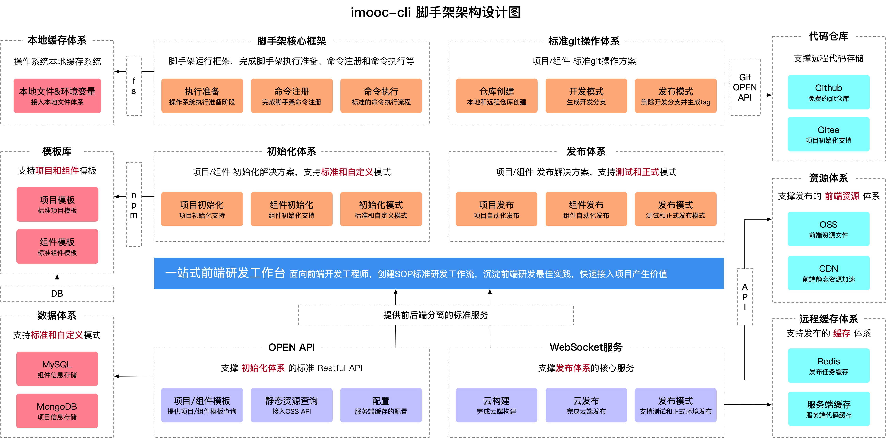
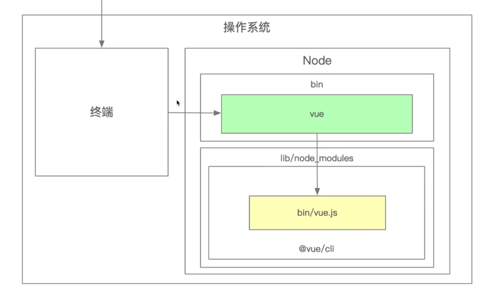
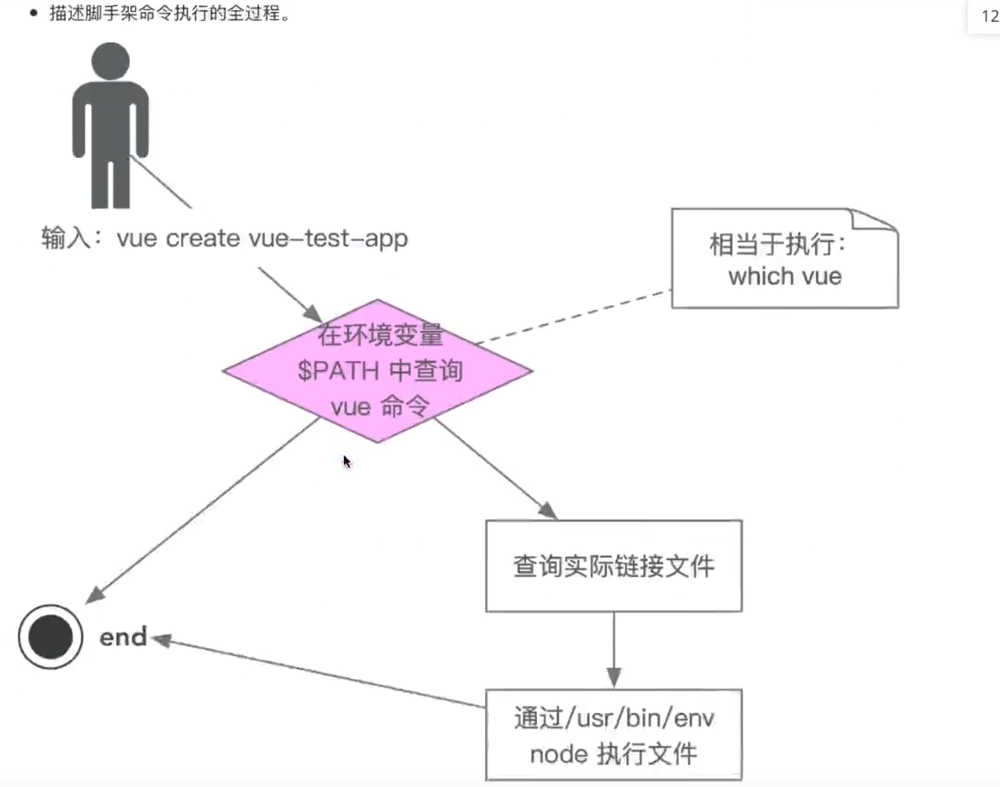

# 脚手架

## 前端研发脚手架架构设计



## 脚手架核心价值

1. 自动化: 项目重复代码拷贝/git 操作/发布上线操作
2. 标准化: 项目创建/git flow/发布流程/回滚流程
3. 数据化: 研发过程系统化、数据化，使得研发过程可量化

## 和自动化构建工具区别

> 问题: `jenkins、travis`等自动化构建工具已经比较成熟了，为什么还需要自研脚手架?

1. 不满足需求: `jenkins、travis`通常在`git hooks`中触发，需要在服务端执行，无法覆盖研发人员本地的功能如: 创建项目自动化、本地`git`操作自动化等
2. 定制复杂: `jenkins、travis`定制过程需要开发插件，其过程较为复杂，需要使用`java`语言，对前端同学不够友好

## 什么是脚手架

脚手架本质是一个操作系统的客户端，它通过命令行执行，比如

```sh
vue create vue-test-app
```

上面这条命令由 3 个部分组成:

1. 主命令: `vue`
2. command:`create`
3. command 的 param: `vue-test-app`

它表示创建一个`vue` 项目，项目的名称为 `vue-test-app`，以上是最一个较为简单的脚手架命令，但实际场景往往更加复杂，比如:

当前目录已经有文件了，我们需要覆盖当前目录下的文件，强制进行安装 `vue` 项目，此时我们就可以输入

```sh
vue create vue-test-app --force
```

这里的 `--force` 叫做 `option`可以理解为配置，还有一种场景：

通过 `vue create` 创建项目时，会自动执行 `npm install` 帮用户安装依赖，如果我们希望使用淘宝源来安装
可以输入命令:

```sh
vue create vue-test-app --force -r https://registry.npm.taobao.org
```

这里的 `-r` 也叫做 `option`，它与 `--force` 不同的是它使用 `-`，并且使用简写，这里的 `-r` 也可以替换成 `--registry`，有的同学可能要问，为什么老师知道这个命令，其实我们输入下面的命令就可以看到 vue create 支持的所有 options:

```sh
vue create --help
```

`-r` `https://registry.npm,taobao.org` 后面的 `https://registry.npm.taobao.org` 成为 `option`的
`param`，其实 `--force` 可以理解为: `--force true`，简写为: `--force` 或 `-f`

## 脚手架的执行原理如下



1. 在终端输入`vue create vue-test-app`
2. 终端解析出 `vue` 命令
3. 终端在环境变量中找到 `vue` 命令
4. 终端根据 `vue` 命令链接到实际文件 `vue.js`
5. 终端利用 `node` 执行 `vue.js`
6. `vue.js` 解析 `command / options`
7. `vue.js` 执行 `command`
8. 执行完毕，退出执行

### 从应用的角度看如何开发一个脚手架

以`vue-cli`为例

1. 开发 `npm` 项目，该项目中应包含一个 `bin/vue.js` 文件，并将这个项目发布到` npm`
2. 将 `npm` 项目安装到 `node` 的 `lib/node_modules`
3. 在 `node` 的 `bin` 目录下配置 `vue` 软链接指 `lib/node modules/@vue/cli/bin/vue.js`

这样我们在执行 `vue` 命令的时候就可以找到 `vue.js` 进行执行

1. 为什么全局安装 `@vue/cli` 后会添加的命令为 `vue`?
   > 在`@vue/cli`项目中的`package.json`的`bin`代码下指定的名字就叫`vue`

```sh
npm install -g @vue/cli
```

2. 全局安装`@vue/cli` 时发生了什么?
   npm 会把@vue/cli 包下载到 node 的 lib 下的 node_modules 中，再根据`package.json`的`bin`代码配置对应的软连接
3. 为什么 `vue` 指向一个 `js `文件，我们却可以直接通过 `vue` 命令直接去执行它?
   在 node 环境变量中找 vue 命令是否被注册，那么在 vuejs 文件中最上方要加上`!/usr/bin/env node`,意思就是可以自动使用`node`去执行这个文件



## 脚手架开发流程

1. 创建 `npm` 项目
2. 创建脚手架入口文件，最上方添加

```sh
#!/usr/bin/env node
```

3. 添加 `bin` 属性配置 `package.json`，
4. 编写脚手架代码
5. 将脚手架发布到 `npm`

### 难点解析

- 分包: 将复杂的系统拆分成若千个模块
- 命令注册

```sh
vue create
vue add
vue invoke
```

- 参数解析

```sh
vue command [options] <params>
```

- options 全称:`--version`、 `--help`
- options 简写: `-v`、`-h`
- 带 params 的 options: `--path /users/sam/Desktop/vue-test`
- 帮助文档
- 命令行交互
- 日志打印
- 命令行文字变色
- 网络通信: HTTP/WebSocket
- 文件处理等

## 脚手架本地 link 标准

- 链接本地脚手架

```bash
cd your-cli-dir
npm link
```

- 链接本地库文件

```sh
cd your-lib-dir
npm link
cd your-cli-dir
npm link your-lib
```

- 取消链接本地库文件

```sh
cd your-lib-dir
npm unlink
cd your-cli-dir
npm unlink your-lib
```

### 什么是 npm link

`npm link your-lib`: 将当前项目中 `node modules` 下指定的库文件链接到 `node` 全局 `node modules` 下的库文件
`npm link`: 将当前项目链接到 `node` 全局`node modules` 中作为一个库文件，并解析 `bin` 配置创建可执行文件

### 什么是 npm unlink

`npm unlink`:将当前项目从 `node` 全局 `node modules` 中移除
`npm unlink your-lib`: 将当前项目中的库文件依赖移除

### 原生脚手架开发痛点分析

1. 痛点一: 重复操作

- 多 Package 本地 link
- 多 Package 依赖安装
- 多 Package 单元测试
- 多 Package 代码提交
- 多 Package 代码发布

2. 痛点二: 版本一致性

- 发布时版本一致性
- 发布后相互依赖版本升级


