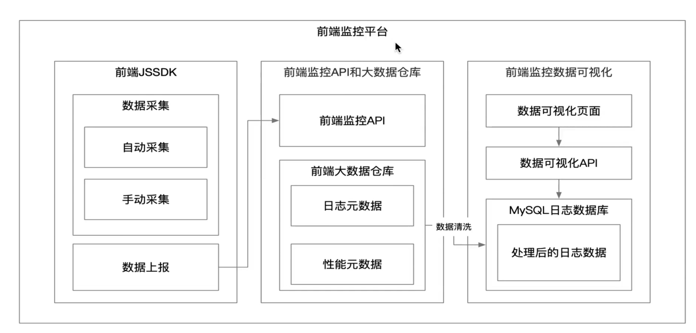
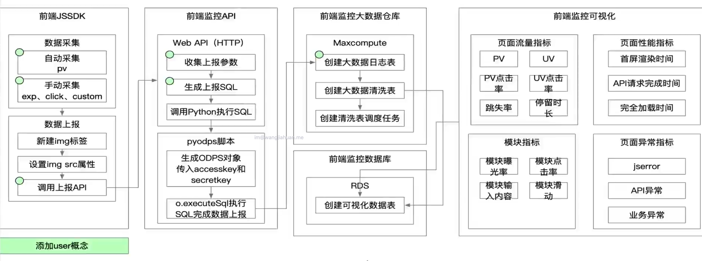
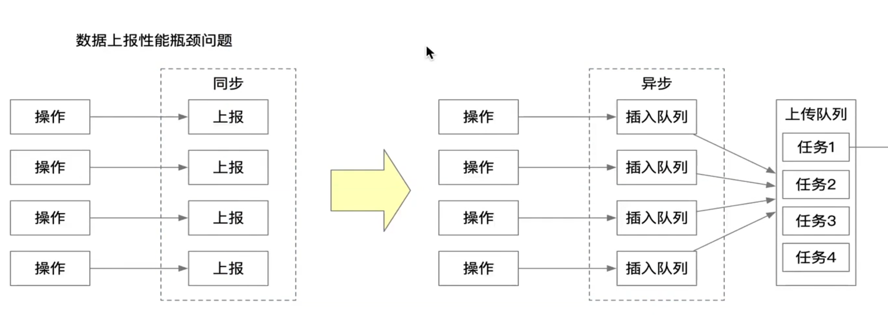
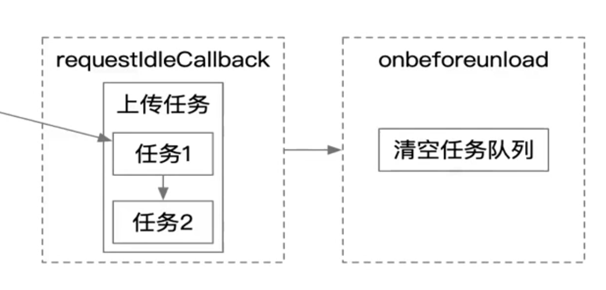
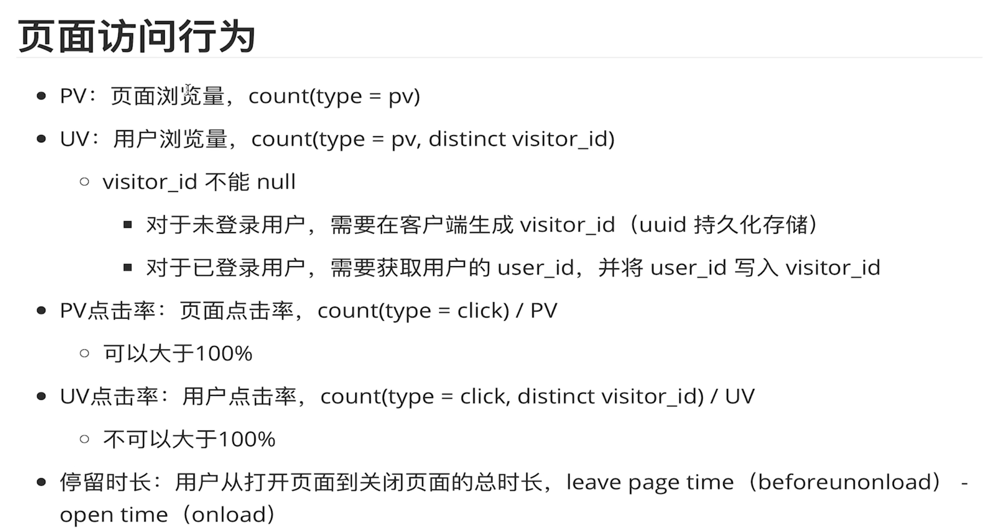
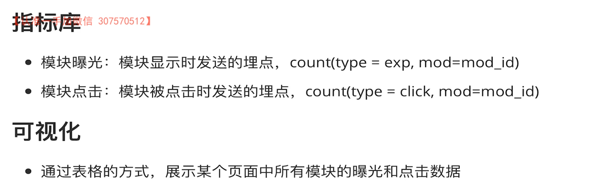
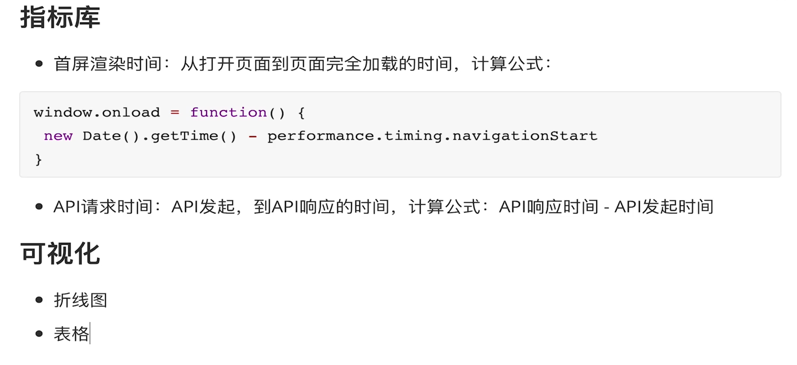
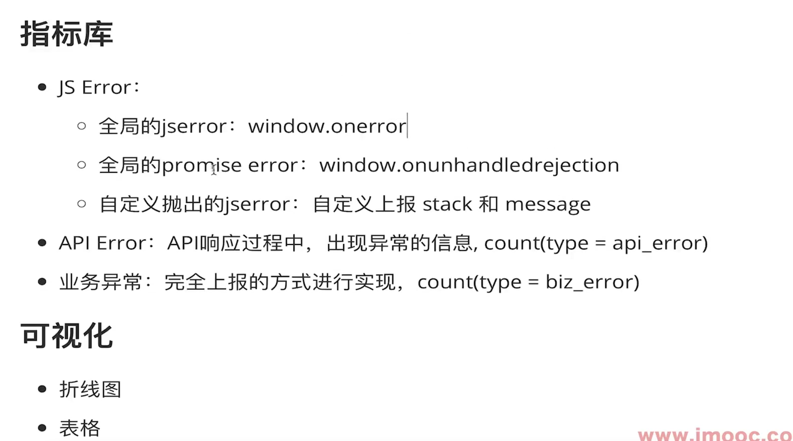

# 前端监控体系搭建

## 前端监控应用场景

1. 为什么需要前端监控?
   > pv：页面访问量，即 PageView，用户每次对网站的访问均被记录，用户对同一页面的多次访问，访问量累计，具体是指网站的是页面浏览量或者点击量。
   > uv：即 UniqueVisitor，独立访客数，指访问某个站点或点击某个网页的不同 IP 地址的人数，访问网站的一台电脑客户端为一个访客。
   - 页面的访问行为，PV、UV、IP、PV 点击率、UV 点击率、停留时长
   - 用户的操作行为，模块曝光、模块点击
   - 页面的性能，首屏渲染时间、API 请求时间
   - 异常的监控，JS Error、API 异常、业务异常
2. 常见应用场景？
   - 流量分析
   - 行为分析
   - 性能监控
   - 错误监控
3. 常见的前端监控平台有哪些?
   - 百度统计
   - 阿里云 arms
   - 友盟
4. 为什么要选择自建前端监控平台?
   - 如果你的需求主要是流量分析，建议直接使用百度统计或阿里云 ARMS
   - 如果你的需求不仅仅需要做流量分析，还要做行为分析，那么可以考虑自建
     - 自建成本较高（人力成本） ，优势是数据掌握自己手里
     - 现成成本也有一定成本 (向平台付费) ，数据是获取不到
   - 希望数据能够储备在自己的数据库里，希望扩展更多的分析维度和能力时，需要自建

## 前端监控平台分层

1. 前端监控 jssdk
   - 采集
   - 上报
     - 默认上报：页面 pv，性能
     - 手动上报：页面操作行为
2. 前端监控 API 和大数据仓库

- 接收上报的数据
- 数据仓库: MaxCompute
  - 数据存贮
  - 数据查询

3. 前端监控数据可视化
   - 日志大数据清洗
   - 大数据回流 RDS(非结构化数据=>结构化数据)

## 监控平台架构图

## 浏览器的 5 种 Observer

1. MutationObserver

   > MutationObserver: 监听 DOM 树的变化 (属性、子节点的增删改)

2. IntersectionObserver

   > IntersectionObserver: 监听一个元素和可视区域相交部分的比例，然后在可视比例达到某个闯值的时候触发回调

3. PerformanceObserver

   > PerformanceObserver: 用于监测性能度量事件，在浏览器的性能时间轴记录下一个新的 Performance entries 的时候将会被通知

4. ResizeObserver

   > ResizeObserver: 接口可以监听到 DOM 的变化 (节点的出现和隐藏，节点大小的变化)

5. ReportingObserver
   > ReportingObserver: 监听过时的 api、浏览器的一些干预行为的报告

## 监控平台优化架构图

## 数据上报性能瓶颈

## 流量指标

## 模块的访问行为

## 页面的性能

## 页面的异常监控

## sdk 改动点

1. 页面相关
   - 在 `imooc monitor` 表中添加 `user_id` 和 `visitor_id` 两个字段
   - 在`SDK` 中添加获取 `user id` 和 `visitor id` 的逻辑，并判断当 `visitor id `不存在时，自动生成
   - 在 `SDK` 中针对页面 `click` 事件进行监听，当触发 `click` 事件时自动进行上报
   - 在 `SDK` 中添加自动获取用户停留时长的逻辑
2. 模块相关
   - 在`imooc monitor` 表中添加 `mod id` 字段，用于标识模块曝光和点击信息
   - 在 `SDK` 中添加上报日志时，获取 `mod id` 的逻辑
3. 性能相关
   - 在 `SDK` 中添加性能采集日志，并自动完成上报
   - 在 `SDK` 中添加上报 `API` 请求时间的 `API`
4. 异常相关
   - 在 `SDK` 中添加全局异常监控日志上报
   - 在 `SDK` 中添加全局`promise`异常监控日志上报
   - 在 `SDK` 中添加自定义上报 `API`
   - 在 `SDK` 中添加 `API` 异常上报 `API`
   - 在 `SDK` 中添加业务异常上报 `API`

