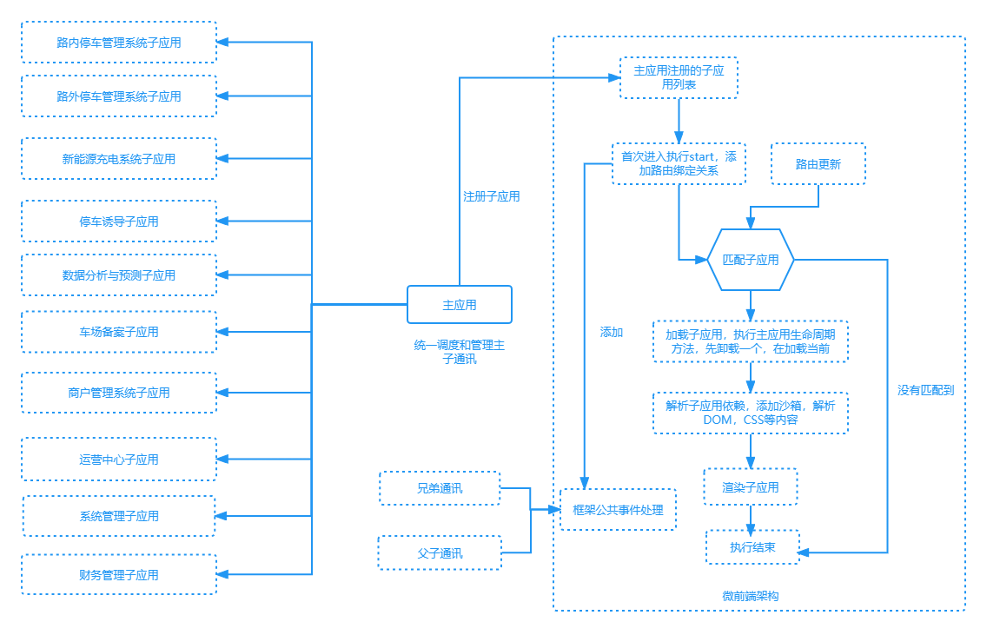

# 微前端

## 什么是微前端?


1. 微前端就是将不同的功能按照不同的维度拆分成多个子应用。通过主应用来加载这些子应用。
2. 微前端的核心在于`拆`, 拆完后在`合`!

## 为什么使用微前端

1. 技术栈无关
   > 主框架不限制接入应用的技术栈，微应用具备完全自主权
2. 独立开发、独立部署
   > 微应用仓库独立，前后端可独立开发，部署完成后主框架自动完成同步更新
3. 增量升级
   > 在面对各种复杂场景时，我们通常很难对一个已经存在的系统做全量的技术栈升级或重构，而微前端是一种非常好的实施渐进式重构的手段和策略
4. 独立运行时
   > 每个微应用之间状态隔离，运行时状态不共享

## 如何实现微前端

我们可以将一个应用划分成若干个子应用，将子应用打包成一个个的`lib`。当路径切换时加载不同的子应用。这样每个子应用都是独立的，技术栈也不用做限制了！从而解决了前端协同开发问题

1. 采用何种方案进行应用拆分？
2. 采用何种方式进行应用通信？
3. 应用之间如何进行隔离？

## 实现微前端技术方案

1. iframe

- 微前端的最简单方案，通过 `iframe` 加载子应用。
- 通信可以通过 `postMessage` 进行通信。
- 完美的沙箱机制自带应用隔离。

iframe 缺点

- `url` 不同步。浏览器刷新 `iframe url` 状态丢失、后退前进按钮无法使用。
- `UI` 不同步，`DOM` 结构不共享。想象一下屏幕右下角 `1/4` 的 `iframe` 里来一个带遮罩层的弹框，同时我们要求这个弹框要浏览器居中显示，还要浏览器 `resize` 时自动居中..
- 全局上下文完全隔离，内存变量不共享。`iframe` 内外系统的通信、数据同步等需求，主应用的 `cookie` 要透传到根域名都不同的子应用中实现免登效果。
- 慢。每次子应用进入都是一次浏览器上下文重建、资源重新加载的过程。

2. single-spa

- `single-spa` 通过路由劫持实现应用的加载（采用`SystemJS`），提供应用间公共组件加载及
  公共业务逻辑处理。子应用需要暴露固定的钩子 `bootstrap`、`mount`、 `unmount`）接入协
  议。
- 基于 props 主子应用间通信
- 无沙箱机制，需要实现自己实现`JS`沙箱以及`CSS`沙箱

> 缺点：学习成本、无沙箱机制、需要对原有的应用进行改造、子应用间相同资源重复加载问题。

3. Module federation

- 通过模块联邦将组件进行打包导出使用
- 共享模块的方式进行通信
- 无`CSS`沙箱和`JS`沙箱

> 缺点：需要集成`webpack5`

4. qiankun

- 基于 `single-spa` 封装，提供了更加开箱即用的 `API`。
- 技术栈无关，任意技术栈的应用均可 使用/接入，不论是 `React/Vue/Angular/JQuery` 还是其他等框架。
- `HTML Entry` 接入方式，让你接入微应用像使用 `iframe` 一样简单。
- 样式隔离，确保微应用之间样式互相不干扰。
- `JS` 沙箱，确保微应用之间 `全局变量/事件` 不冲突。
- 资源预加载，在浏览器空闲时间预加载未打开的微应用资源，加速微应用打开速度



## 主应用集成qiankun


1. 主应用安装qiankun

```js
yarn add qiankun # 或者 npm i qiankun -S
```
2. 注册微应用并启动

```js
function _registerMicroApps() {
  registerMicroApps(
    [
      {
        name: 'MicroAcb', // app name registered
        // entry: isDevMode() ? '//localhost:8080' : 'http://acb-pre.sjs.aipark.com',
        entry: isDevMode() ? '//localhost:8080/microacb/' : 'http://36.112.39.90/microacb/',

        container: '#microAcb',
        activeRule: '/microacb',
        props: {
          actions: qiankunActions,
        },
      },
    ],
    {
      beforeLoad: () => {
        console.log('beforeLoad');
        openFullLoading();
        if (!localStorage.getItem('isRefresh')) {
          localStorage.setItem('isRefresh', '1');
          setTimeout(() => {
            location.reload();
          }, 8000);
        }
      },
      afterMount: () => {
        closeFullLoading();
      },
    },
  );
  runAfterFirstMounted(() => {
    // console.log('pololokolo');
  });
}

_registerMicroApps()
```

qiankunActions.ts

```js
import { initGlobalState, MicroAppStateActions } from 'qiankun';
import { useUserStoreWithOut } from '/@/store/modules/user';
import { useMessage } from '/@/hooks/web/useMessage';
const { createMessage } = useMessage();
const userStore = useUserStoreWithOut();
const state: any = {
  acbLoginInfo: null,
  isToLogin: false,
};
// 初始化 state
const actions: MicroAppStateActions = initGlobalState(state);

actions.onGlobalStateChange((state, prev) => {
  // state: 变更后的状态; prev 变更前的状态

  if (state.isToLogin) {
    // createMessage.error('登录失效');
    userStore.logout(true);
    actions.setGlobalState({
      isToLogin: false,
    });
  }
  // console.log(state, prev, ':::::::::::');
});
// actions.setGlobalState(state);
// actions.offGlobalStateChange();
export { actions };

```

## 子应用

```js
let instance = null;
function render(props = {}) {
  const { container } = props;
  instance = new Vue({
    router: router,
    store,
    render: (h) => h(App),
  }).$mount(container ? container.querySelector("#app") : "#app");
}
// 独立运行时
if (!window.__POWERED_BY_QIANKUN__) {
  render();
}
// eslint-disable-next-line import/prefer-default-export
export async function bootstrap() {
  console.log("vue app bootstraped");
}
export async function mount(props) {
  console.log("[vue] props from main framework", props);
  // 925138e023022d4d3cdb1debd12b7bb2
  console.log(window.__POWERED_BY_QIANKUN__, "window.__POWERED_BY_QIANKUN__");
  
  props.onGlobalStateChange((state, prev) => {
    // state: 变更后的状态; prev 变更前的状态
    sessionStorage.token = state.acbUserInfo?.sessionId || "";
    sessionStorage.userName = state.acbUserInfo?.userName || "";
    sessionStorage.userId = state.acbUserInfo?.userId || "";
    sessionStorage.admin = state.acbUserInfo?.admin || "";
    window.qiankunProps = props;
  }, true);
  render(props);
}
export async function unmount(props) {
  console.log('unmount')
  instance.$destroy();
  instance.$el.innerHTML = "";
  instance = null;
}
export async function update(props) {
  console.log("update props", props);
}
```

## nginx 配置允许跨域

```shell
# acb需要配置跨域访问
add_header Access-Control-Allow-Origin *;
add_header Access-Control-Allow-Methods 'GET, POST, OPTIONS';
add_header Access-Control-Allow-Headers 'DNT,X-Mx-ReqToken,Keep-Alive,User-Agent,X-Requested-With,If-Modified-Since,Cache-Control,Content-Type,Authorization';
```